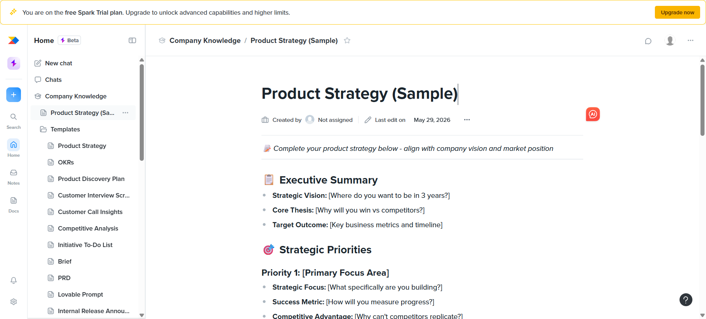
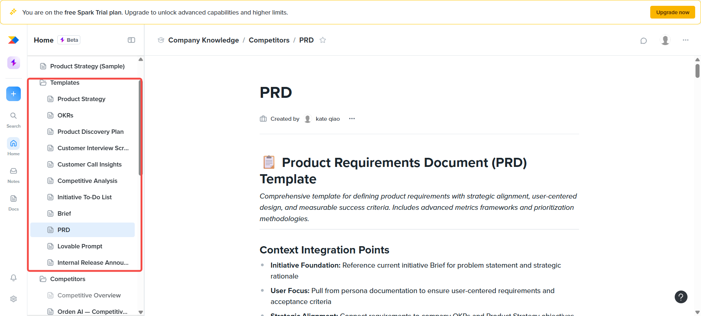
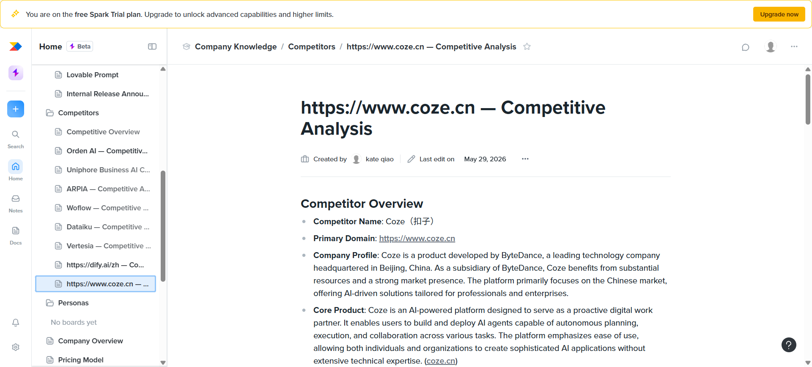

# ProductBoard

> 专注产品路线图和反馈管理的工具，帮助产品团队做正确的优先级决策。

---

## 适用场景

- 需要系统化收集和管理用户反馈
- 产品路线图需要可视化呈现
- 基于数据做优先级排序

---

## 优劣势

| 优势 | 劣势 |
|------|------|
| 反馈收集和分类能力强 | 研发任务管理需要配合 Jira/Linear |
| Roadmap 可视化效果优秀 | 无中文版，国内访问问题 |
| 支持多种优先级模型(RICE/ICE) | 单价较高 |
| 与 Jira/Linear/GitHub 集成 | 对中国生态集成弱 |
| 支持门户嵌入收集反馈 | 团队需要额外学习成本 |

## 简单使用

简单讲就是一个针对产品经理设计的Agent平台，提供了一个界面让PM可以输入产品相关的信息，系统会根据这些信息生成一个产品路线图和优先级列表。

- Saas平台（纯 SaaS，非开源）
- 高级功能需要付费

---

## 类似产品对比

### 功能重叠度高的直接竞品

| 产品 | 定位 | 付费模式 | 起价 |
|------|------|----------|------|
| **Aha!** | 全功能产品管理套件（战略+路线图+想法管理） | SaaS | $59/用户/月 |
| **airfocus** | 模块化产品管理，灵活定制优先级模型 | SaaS | $59/编辑者/月 |
| **ProdPad** | 轻量灵活，注重 outcome 驱动路线图 | SaaS | $24/编辑者/月 |
| **Craft.io** | 与研发紧密同步（Jira/Linear 双向同步） | SaaS | $39/编辑者/月 |
| **Roadmunk** | 路线图可视化与分享能力最强 | SaaS | $19/用户/月 |

### 反馈收集侧重点

| 产品 | 说明 | 起价 |
|------|------|------|
| **UserVoice** | 纯反馈管理平台 | $899/月起 |
| **Canny** | 轻量反馈门户 | $42/月起 |
| **LoopJar** | AI 自动聚类反馈 | 有免费版 |

### 本目录已覆盖的工具

| 产品 | 侧重方向 |
|------|----------|
| **Linear** | 研发任务管理，偏开发侧 |
| **Jira** | 全能型项目管理，配合 Jira Product Discovery 做需求管理 |
| **飞书项目** | 国内生态，适合飞书深度用户 |

### 选型建议

| 场景 | 推荐工具 |
|------|----------|
| 反馈驱动优先级决策 | ProductBoard / airfocus |
| 企业级战略对齐与 OKR | Aha! |
| 轻量路线图展示 | Roadmunk / ProdPad |
| 与工程研发紧密同步 | Craft.io |
| 国内团队、飞书生态 | 飞书项目 |
| 纯研发任务管理 | Linear / Jira |

---

## 功能模块详解

ProductBoard 近期推出了 AI 平台 **Spark**，上述模块均来自 Spark 的知识库配置，每个部分的作用如下：

### 1. 定义产品策略和目标
设定产品愿景、OKR、业务目标。Spark AI 会基于此判断功能建议是否与战略对齐，确保所有决策有据可依。

### 2. 产品模板
预置的 PM 文档模板库，包括 PRD、产品简报、用户访谈脚本、发布公告等。团队可自定义模板，Spark 生成文档时自动套用。

### 3. 竞品分析
AI 自动抓取公开信息生成竞品档案（定位、定价、功能对比），持续跟踪竞品动态，识别差异化机会和市场空白。

### 4. 公司概况
记录公司基本信息、目标客户画像、产品定位。Spark 首次登录时从公开网络自动填充，也可手动补充。

### 5. 定价模式
产品的定价策略和套餐结构文档。Spark 会将其纳入上下文，在生成 PRD、竞品对比等文档时参考。

### 6. 产品层级
ProductBoard 的数据层级结构：**目标(Goals) →  Objectives →  Initiatives →  Features**。确保每个功能点都能向上追溯到业务目标。*（注：ProductBoard 主线产品的层级，非 Spark 独有）*

### 7. Skills
Spark AI 的技能/提示词库，包含 150+ 预置的 PM 工作流模板，如：生成验收条件、年度战略规划、竞品地图、功能头脑风暴等。PM 可直接调用来加速日常工作。

### 8. Scheduler
发布计划/排期模块。用于规划功能发布的版本时间线，协调跨团队的上线节奏，确保发布有序进行。*（属于 ProductBoard 主线产品的路线图排期功能）*

---

### 公司知识库

1. 定义产品策略和目标，明确产品愿景和核心指标。

2. 产品模板

3. 竞品分析

4. 公司概况

5. 定价模式

6. 产品层级

### skills

### scheduler