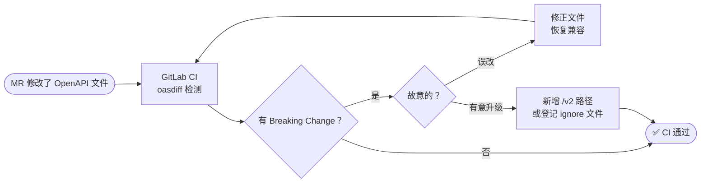
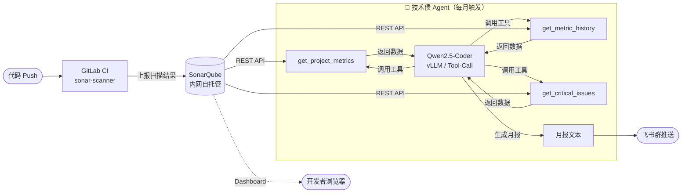

# AI 提效计划 - 技术架构治理

> 利用已有的 GitHub Copilot、飞书妙记，结合技术债自动扫描体系，解决架构治理中最耗人工的三个环节：文档起草、技术债量化、API 变更防护。**核心投入放在技术债扫描**，其余能力即插即用。

---

## 一、效率基线（现状）

| 环节 | 当前耗时（估算）| 主要痛点 |
|------|--------------|---------|
| ADR / 技术文档起草 | 3-6 小时/篇 | 背景描述、方案对比耗时，质量参差不齐 |
| 技术选型调研 | 1-3 人天/次 | 需查大量文档，多维度对比没有统一框架 |
| 技术债识别 | 被动发现，无主动检测 | 只有出了问题才知道债的存在，无优先级 |
| API 变更兼容检查 | 人工 Code Review | 漏检率高，破坏性变更上线后才发现 |
| 评审会议纪要 | 2-3 小时/次 | 技术讨论复杂，难以准确记录决策 |

---

## 二、AI 工具全景

| 工具 | 适用场景 | 使用状态 | 成本 |
|------|---------|---------|------|
| **GitHub Copilot Chat** | ADR/文档起草、技术选型分析 | ✅ 已订阅，直接用 | 已有 |
| **飞书妙记** | 架构评审会议自动转录 + 纪要 | ✅ 已开通，直接用 | 含在飞书套餐 |
| **SonarQube Community** | 代码复杂度、技术债静态量化 | ❌ 待接入 GitLab | 开源免费 |
| **开源代码模型（GPU 部署）** | 技术债 AI 建议、重构方案生成 | ❌ 待评估 | GPU 电费 |
| **云端 API（DeepSeek / Claude）** | 同上，无需本地维护 | ❌ 待评估 | 按量计费 |
| **oasdiff + LLM** | API 破坏性变更检测 | ❌ 待接入 | 开源免费 |

---

## 三、高价值机会点详细方案

### 机会1：ADR 与技术文档 — GitHub Copilot Chat 直接上

**现状**：架构师手写 ADR，背景描述和方案对比部分最耗时。  
**方案**：直接用 GitHub Copilot Chat（已订阅）起草，无需额外工具。

**使用方式**：
- 在 VS Code 中打开 ADR 模板文件，对 Copilot Chat 描述决策背景和候选方案，让它生成草稿
- 产出文档粘贴到飞书文档，架构师人工审核后归档到本仓库
- 技术选型对比表同样适用（输入候选方案 + 约束条件，Copilot 生成对比草稿）

**估算收益**：ADR 起草时间从 3-6 小时缩短至 1-2 小时，**立即可用，零成本**。

---

### 机会2：评审会议纪要 — 飞书妙记直接用

**现状**：人工记录技术讨论，容易遗漏决策要点。  
**方案**：飞书妙记已开通，架构评审会议中开启录音转写，会后导出要点到飞书文档。

**使用流程**：会议开始 → 飞书妙记录制 → 结束后 AI 生成摘要 → 人工确认决策项 → 存档  
**估算收益**：纪要整理从 2-3 小时缩短至 20 分钟，**立即可用，零成本**。

---

### 机会3：API 破坏性变更自动检测

**现状**：接口字段删除/类型修改靠人工 Code Review，漏检后联调或上线才发现。  
**方案**：oasdiff 接入 GitLab CI，每次 MR 自动对比当前分支与 main 分支的 OpenAPI 文件，有破坏性变更则 MR 失败，强迫显式决策。

**完整流程**：



**CI Job 配置**：

```yaml
api-compat-check:
  stage: test
  image: tufin/oasdiff:latest
  before_script:
    - git fetch origin main
    - git show origin/main:api/openapi.yaml > api/openapi-base.yaml
  script:
    - oasdiff breaking api/openapi-base.yaml api/openapi.yaml
        --warn-ignore .oasdiff-ignore --format text
  allow_failure: true   # 初期观察 2 周，稳定后改 false
  only:
    changes:
      - api/**/*.yaml
```

**有意修改 API 时**：新增版本路径（`/v2`）旧版并存，或在 `.oasdiff-ignore` 登记原因和日期，CI 跳过该条规则 → 详见 [工具分析/oasdiff.md](./工具分析/oasdiff.md)

**前置条件**：OpenAPI 规范文件纳入 Git 版本管理  
**实施周期**：1-2 天  
**估算收益**：API 破坏性变更上线事件接近归零

---

### 机会4：技术债 AI Agent 分析与月报（重点）

**现状**：技术债靠开发人员主观感知，无量化、无优先级、无趋势。  
**目标**：SonarQube 内网自托管 + GitLab CI 自动扫描，由内网 LLM Agent 自主决策调用 SonarQube API、分析结果、生成月报推送飞书。全程数据不出公司内网。



**整体步骤**：

| 步骤 | 内容 | 参考文档 |
|------|------|---------|
| 1 | 部署 SonarQube（K8s Helm，对接现有 PostgreSQL） | [工具分析/SonarQube.md](./工具分析/SonarQube.md) |
| 2 | 各仓库接入 GitLab CI sonar-scanner job | [工具分析/SonarQube.md](./工具分析/SonarQube.md) |
| 3 | 实现 Agent 三个工具函数 + Runner 部署（K8s CronJob） | [工具分析/TechDebtAgent.md](./工具分析/TechDebtAgent.md) |
| 4 | 飞书群接收月报，对 Top3 技术债服务启动专项消减 | — |

---

## 四、实施路径

| 阶段 | 时间 | 核心任务 | 验收标准 |
|------|------|---------|---------|
| **Phase 0 - 立即可用** | 本周 | ① GitHub Copilot Chat 推广给架构师用于 ADR 起草 ② 飞书妙记接入评审会议 | 下次 ADR 和会议纪要用 AI 辅助完成 |
| **Phase 1 - GitLab 接入** | 第 2-3 周 | ① SonarQube 部署 ② 接入 3 个核心仓库 ③ oasdiff 接入 CI | 所有 MR 有代码质量报告和 API 变更检测 |
| **Phase 2 - AI Agent** | 第 4-6 周 | ① Qwen2.5-Coder 部署到 dev 集群 RTX4090（vLLM）② Agent Runner 开发 ③ 飞书推送自动化 | 每月自动产出技术债趋势报告，全程内网 |

---

## 五、成本与收益

| 项目 | 月度成本 | 节省人力（估算）|
|------|---------|--------------|
| GitHub Copilot Chat（ADR + 选型）| 已有，¥0 | ~2 人天/月 |
| 飞书妙记（会议纪要）| 已有，¥0 | ~1 人天/月 |
| SonarQube 自托管 | 约 0.3 人天运维 | 技术债主动发现，长期节省大量修复成本 |
| Qwen2.5-Coder（内网 vLLM）| GPU 电费（低峰运行）| ~1 人天/月（报告整理）|
| **合计** | **~¥0 额外订阅** | **约 4-5 人天/月** |

---

## 六、风险与回退

| 风险 | 影响 | 应对措施 |
|------|------|---------|
| SonarQube 规则过严，大量告警 | 开发忽略报告，产生告警疲劳 | 接入初期只告警不 Block；Quality Gate 只检查新增代码 |
| GPU 资源不足影响推理服务 | 影响其他 AI 服务 | 技术债分析为低优先级任务，在业务低峰（凌晨）执行 |
| API 检测误报阻塞 MR | 开发体验下降 | oasdiff 初期配置为 Warning 模式，2 周验证后再改为 Block |
