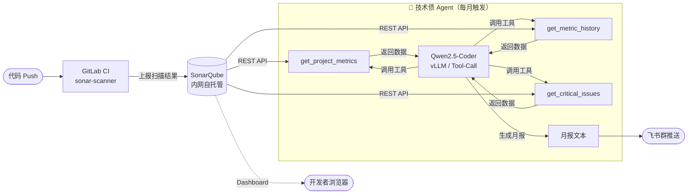

# 技术架构治理 体系建设总览

> 架构治理解决的核心问题：**技术决策有没有记录、选型有没有依据、架构债有没有人管、服务间契约有没有约定**。本文是架构治理领域的现状分析与建设规划，是对下属所有规范文档和 AI 提效计划的总纲。

---

## 一、现状与痛点

### 1.1 四个核心领域评估

| 领域 | 当前状态 | 主要痛点 | 影响 |
|------|---------|---------|------|
| **架构评审** | 🔴 无正式机制 | 架构决策靠个人口头对齐，无 ADR 记录 | 新成员不了解历史决策，重复踩坑 |
| **技术选型** | 🟡 有讨论无规范 | 无标准对比矩阵，选型结论不落文档 | 不同团队重复评估相同技术，选型依据丢失 |
| **架构债管理** | 🔴 无管理 | 技术债靠主观感知，无量化、无优先级、无趋势 | 维护成本持续上升，重构时机难判断 |
| **API 契约** | 🟡 部分服务有文档 | 无版本兼容规范，破坏性变更靠人工发现 | 联调返工频繁，接口变更上线后才暴露 |

### 1.2 典型问题场景

**场景一：架构决策无记录**
某服务当初为什么选 Kafka 而不是 RocketMQ？选型会议上讨论过但没有文字记录。新人加入或半年后回顾，没有人能说清楚约束条件和排除理由，同类讨论再来一次。

**场景二：技术债隐形积累**
java-backend 某模块圈复杂度长期偏高，靠熟悉代码的老员工消化。没有客观数字，没有趋势，也没有"这个月比上个月更难维护了"的量化感知，直到新需求进不去才意识到已经是 P0 技术债。

**场景三：API 破坏性变更上线**
后端删除了一个旧字段，认为前端已不再使用，在 Code Review 中没被发现。上线后 app 端某功能报错，紧急热修复一次。

---

## 二、优化方向与方案

### 2.1 架构评审：建立 ADR 制度

引入 **ADR（Architecture Decision Record）** 作为技术决策的标准记录格式。每一个影响系统设计的重要决策都留一份文档：背景、候选方案、最终选择、影响。

**流程**：

```
架构师起草 ADR（GitHub Copilot Chat 辅助）
  → 异步评审（飞书文档评论）
  → 重大变更召开架构评审会（飞书妙记自动转录纪要）
  → 归档到本仓库 01-架构评审/
```

**ADR 模板核心字段**：

| 字段 | 说明 |
|------|------|
| 背景 | 为什么要做这个决策，当时的约束条件 |
| 候选方案 | 评估了哪些选项，各自的优缺点 |
| 决策 | 最终选择及理由 |
| 影响 | 对现有系统的影响，需要同步的团队 |
| 状态 | 草稿 / 已接受 / 已废弃 |

### 2.2 技术选型：标准化对比矩阵

新技术引入必须填写选型评估表，覆盖六个维度：

| 维度 | 权重 | 评分标准 |
|------|------|---------|
| 社区活跃度 | 20% | Stars、Commit 频率、维护者背景 |
| 技术成熟度 | 25% | 版本状态、生产案例、企业背书 |
| 团队熟悉度 | 15% | 已有经验、学习成本估算 |
| 生态集成 | 20% | 与现有技术栈兼容性 |
| License | 10% | 商业友好度（Apache / MIT / GPL 等）|
| 性能与安全 | 10% | 基准测试数据、CVE 历史 |

结论归档到 `02-技术选型/`，进入"核心区"的技术需经架构评审，"候选区"团队可自由探索。

### 2.3 架构债管理：量化 + AI 分析

**量化工具：SonarQube**（内网自托管，K8s Helm 部署）

- 每次代码 Push 自动扫描，积累历史趋势
- 指标：bugs 数、技术债时长（分钟）、圈复杂度、测试覆盖率

**债务分级处理策略**：

| 等级 | 定义 | 处理策略 |
|------|------|---------|
| P0 严重 | 阻碍业务迭代，影响稳定性 | 立即排期修复 |
| P1 重要 | 显著降低开发效率 | 下个迭代消减 |
| P2 一般 | 代码可读性、设计问题 | 持续改善，每迭代预留 20% 容量 |
| P3 轻微 | 风格不一致等 | 按需处理 |

**AI 月报机制**（详见 [AI提效计划.md](./AI提效计划.md) 机会4）：

每月由 Agent 自动分析 SonarQube 数据，生成 Top 3 技术债服务优先级报告推送飞书群，强迫团队定期感知趋势。全程内网，数据不出公司。

### 2.4 API 契约管理：自动化 Breaking Change 检测

**规范层**：所有服务间 API 必须定义 OpenAPI 3.0 规范，纳入 Git 版本管理。

**自动化层：oasdiff 接入 GitLab CI**

每次 MR 自动对比当前分支与 main 分支的 OpenAPI 文件，检测破坏性变更：

```
MR 修改 OpenAPI → oasdiff 对比 → 有 Breaking Change → MR 失败
                                → 无 Breaking Change → 通过
```

故意升级接口时，新增 `/v2` 路径并存，或在 `.oasdiff-ignore` 登记原因后 CI 可通过（详见 [工具分析/oasdiff.md](./工具分析/oasdiff.md)）。

**版本兼容原则**：
- MAJOR 变更必须提前一个版本标注 deprecated
- 向后兼容过渡期至少保留 2 个 Minor 版本
- 新增字段不能破坏已有消费者

---

## 三、AI 提效集成

在四个治理领域中，AI 工具系统性介入，减少人工重复劳动：

| 领域 | AI 介入点 | 工具 | 状态 |
|------|----------|------|------|
| 架构评审 | ADR 起草、选型对比表生成 | GitHub Copilot Chat | ✅ 已订阅，即用 |
| 架构评审 | 评审会议自动转录 + 纪要 | 飞书妙记 | ✅ 已开通，即用 |
| API 契约 | Breaking Change 自动检测 | oasdiff + GitLab CI | ❌ 待接入 |
| 架构债管理 | 技术债扫描量化 | SonarQube | ❌ 待部署 |
| 架构债管理 | 月报 AI 分析 + 飞书推送 | Qwen2.5-Coder Agent | ❌ 待开发 |

**完整 AI 技术债 Agent 工作流**：



> 详细实施方案见 [AI提效计划.md](./AI提效计划.md)，Agent 实现细节见 [工具分析/TechDebtAgent.md](./工具分析/TechDebtAgent.md)。

---

## 四、建设路径

| 阶段 | 时间 | 核心任务 | 验收标准 |
|------|------|---------|---------|
| **Phase 0 - 即用** | 本周 | ① GitHub Copilot Chat 推广至架构师 ② 飞书妙记接入评审会议 | 下次 ADR 和会议纪要由 AI 辅助完成 |
| **Phase 1 - 规范落地** | 第 2-4 周 | ① ADR 模板发布 ② 架构委员会成立 ③ SonarQube 部署 ④ oasdiff 接入核心仓库 | 所有 MR 有 API 变更检测；SonarQube Dashboard 可查 |
| **Phase 2 - AI 增强** | 第 5-8 周 | ① 技术债 Agent 开发 ② Qwen2.5-Coder 部署到 dev 集群 ③ 飞书月报自动化 | 每月自动产出技术债报告并推飞书 |
| **Phase 3 - 体系成熟** | 第 2-3 月 | ① 补录历史重要 ADR ② 技术债消减专项启动 ③ ADR 覆盖率纳入 KPI | 四个领域均有数据可查，架构治理常态化 |

---

## 五、关键指标

| 指标 | 定义 | 目标值 | 当前值 |
|------|------|--------|--------|
| ADR 覆盖率 | 有记录的重要架构决策 / 总决策数 | > 80% | ~0% |
| 技术债 P0 数量 | 严重阻碍迭代的架构债条目 | 0 | 未采集 |
| API Breaking Change 漏检率 | 未被 CI 捕获的破坏性变更 / 总变更 | < 5% | 无检测 |
| 技术选型文档化率 | 有对比文档的新技术引入 / 总引入 | > 90% | ~20% |
| 技术债月均消减量 | 每月消减的技术债时长（分钟）| 正增长 | 无基线 |

---

## 六、上下游联动

| 领域 | 联动关系 |
|------|---------|
| [01-产品需求管理](../01-产品需求管理/体系建设总览.md) | 大型需求技术可行性评估在架构评审中完成 |
| [03-CICD建设](../03-CICD建设/体系建设总览.md) | oasdiff + SonarQube 均接入 GitLab CI 流水线 |
| [06-产品质量保障](../06-产品质量保障/体系建设总览.md) | SonarQube 技术债数据与测试覆盖率共享 |
| [12-版本发布管理](../12-版本发布管理/体系建设总览.md) | API 版本与发布版本协同，兼容性说明进 changelog |

---

## 七、相关文档

| 文档 | 说明 |
|------|------|
| [AI提效计划.md](./AI提效计划.md) | ADR 辅助起草、oasdiff 自动检测、技术债 Agent 完整方案 |
| [工具分析/SonarQube.md](./工具分析/SonarQube.md) | 部署步骤、GitLab CI 接入、REST API、Dashboard 指南 |
| [工具分析/oasdiff.md](./工具分析/oasdiff.md) | Breaking Change 检测原理、CI 配置、故意变更处理流程 |
| [工具分析/TechDebtAgent.md](./工具分析/TechDebtAgent.md) | Agent 工作流、工具函数实现、K8s CronJob 部署 |
| [工具分析/CodeClimate.md](./工具分析/CodeClimate.md) | 与 SonarQube 的对比分析 |
| [01-架构评审/](./01-架构评审/) | ADR 格式规范、评审流程 |
| [02-技术选型/](./02-技术选型/) | 选型矩阵、评分模板 |
| [03-架构债管理/](./03-架构债管理/) | 债务分级、消减计划模板 |
| [04-API契约管理/](./04-API契约管理/) | OpenAPI 规范、版本兼容策略 |
| [FAQ.md](./FAQ.md) | 常见问题解答 |
