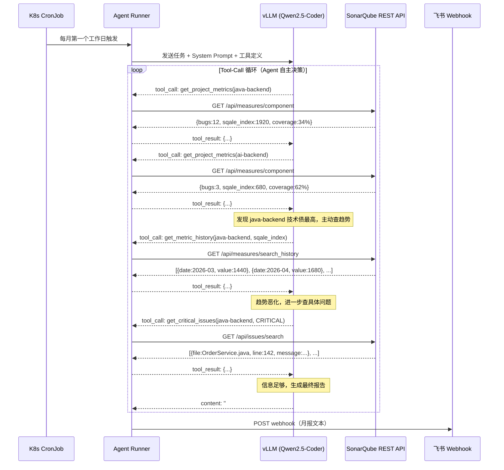

# 技术债 AI Agent 实现指南

> 本文档是 [AI提效计划 - 机会4](../AI提效计划.md) 的实施细节。Agent 以 K8s CronJob 运行，每月第一个工作日自动分析 SonarQube 数据，生成技术债月报推送飞书群。

---

## Agent 是什么

Agent 是一个具备工具调用能力的 LLM 任务执行单元。与固定脚本（每次调相同 API）的区别：

- **固定脚本**：代码写死调哪些 API，数据拼 prompt，调一次 LLM，输出结果
- **Agent**：LLM 自主决定调哪些工具、调几次，根据中间结果判断是否需要追加查询，直到信息足够再生成最终报告

本场景中，若某服务技术债本月突然增加 50%，Agent 会主动多调历史趋势接口确认原因，而不是无视这个异常直接生成报告。

---

## Agent 工作流



---

## 三个工具定义

工具函数封装 SonarQube REST API，注册到 vLLM Tool-Call 接口的 `tools` 参数。

**Python 工具实现**：

```python
import requests

SONAR_URL = "http://sonarqube-sonarqube.devtools.svc.cluster.local:9000"
SONAR_TOKEN = os.environ["SONAR_TOKEN"]  # GitLab CI/CD Variable 注入


def get_project_metrics(project_key: str) -> dict:
    """获取指定项目本月代码质量指标汇总"""
    resp = requests.get(
        f"{SONAR_URL}/api/measures/component",
        params={
            "component": project_key,
            "metricKeys": "bugs,code_smells,sqale_index,coverage,complexity,duplicated_lines_density"
        },
        auth=(SONAR_TOKEN, ""),
        timeout=10
    )
    resp.raise_for_status()
    measures = resp.json()["component"]["measures"]
    return {m["metric"]: m["value"] for m in measures}


def get_metric_history(project_key: str, metric: str) -> list:
    """获取指定项目某指标过去 3 个月历史趋势"""
    resp = requests.get(
        f"{SONAR_URL}/api/measures/search_history",
        params={"component": project_key, "metrics": metric, "ps": 3},
        auth=(SONAR_TOKEN, ""),
        timeout=10
    )
    resp.raise_for_status()
    return resp.json()["measures"][0]["history"]  # [{date, value}, ...]


def get_critical_issues(project_key: str, severity: str = "CRITICAL") -> list:
    """获取指定项目当前严重问题列表（文件路径、行号、描述）"""
    resp = requests.get(
        f"{SONAR_URL}/api/issues/search",
        params={
            "componentKeys": project_key,
            "severities": severity,
            "statuses": "OPEN",
            "ps": 10
        },
        auth=(SONAR_TOKEN, ""),
        timeout=10
    )
    resp.raise_for_status()
    issues = resp.json()["issues"]
    return [
        {"file": i["component"].split(":")[-1], "line": i.get("line"), "message": i["message"]}
        for i in issues
    ]
```

**注册到 vLLM 的 tools schema**：

```python
TOOLS_SCHEMA = [
    {
        "type": "function",
        "function": {
            "name": "get_project_metrics",
            "description": "获取指定项目本月代码质量指标，包括 bugs、技术债时长(分钟)、覆盖率、代码异味数",
            "parameters": {
                "type": "object",
                "properties": {
                    "project_key": {"type": "string", "description": "SonarQube 项目 key，如 java-backend"}
                },
                "required": ["project_key"]
            }
        }
    },
    {
        "type": "function",
        "function": {
            "name": "get_metric_history",
            "description": "获取指定项目某指标过去 3 个月的历史趋势，用于判断改善或恶化",
            "parameters": {
                "type": "object",
                "properties": {
                    "project_key": {"type": "string"},
                    "metric": {"type": "string", "description": "指标名，如 sqale_index、bugs、coverage"}
                },
                "required": ["project_key", "metric"]
            }
        }
    },
    {
        "type": "function",
        "function": {
            "name": "get_critical_issues",
            "description": "获取指定项目当前 CRITICAL 或 BLOCKER 级别的具体问题列表",
            "parameters": {
                "type": "object",
                "properties": {
                    "project_key": {"type": "string"},
                    "severity": {"type": "string", "enum": ["CRITICAL", "BLOCKER"]}
                },
                "required": ["project_key", "severity"]
            }
        }
    }
]
```

---

## System Prompt

```
你是一个技术债分析专家，可调用工具查询 SonarQube 数据。
待分析服务：java-backend、ai-backend、scheduler（可根据实际项目列表调整）。

任务：分析本月各服务技术债状况，生成中文月报。
要求：
1. 对每个服务调用 get_project_metrics 获取基础指标
2. 对技术债最高的 Top 3 服务，调用 get_metric_history 确认趋势
3. 对趋势持续恶化的服务，调用 get_critical_issues 了解具体问题
4. 最终输出包含：
   - Top 3 技术债服务排名及原因
   - 每个服务一条具体重构建议
   - 趋势恶化服务的预警说明
   - 末尾附 Markdown 格式汇总表格
```

---

## Agent Runner 主循环

```python
import json
import os
import requests as req

VLLM_URL = "http://vllm-service.ai-infra.svc.cluster.local:8000/v1/chat/completions"
MODEL = os.environ.get("AGENT_MODEL", "Qwen2.5-Coder-32B-Instruct")
FEISHU_WEBHOOK = os.environ["FEISHU_WEBHOOK_URL"]

TOOL_FUNCTIONS = {
    "get_project_metrics": get_project_metrics,
    "get_metric_history": get_metric_history,
    "get_critical_issues": get_critical_issues,
}


def run_agent():
    messages = [
        {"role": "system", "content": SYSTEM_PROMPT},
        {"role": "user", "content": "请生成本月技术债月报。"}
    ]

    for _ in range(10):  # 最多循环 10 次，防止无限调用
        resp = req.post(VLLM_URL, json={
            "model": MODEL,
            "messages": messages,
            "tools": TOOLS_SCHEMA,
            "tool_choice": "auto"
        }, timeout=120)
        resp.raise_for_status()
        choice = resp.json()["choices"][0]["message"]
        messages.append(choice)

        # 没有工具调用 → 最终答案
        if not choice.get("tool_calls"):
            return choice["content"]

        # 执行工具调用，结果追加到 messages
        for call in choice["tool_calls"]:
            fn_name = call["function"]["name"]
            fn_args = json.loads(call["function"]["arguments"])
            result = TOOL_FUNCTIONS[fn_name](**fn_args)
            messages.append({
                "role": "tool",
                "tool_call_id": call["id"],
                "content": json.dumps(result, ensure_ascii=False)
            })

    raise RuntimeError("Agent 超过最大循环次数，未能生成报告")


def send_feishu(report: str):
    req.post(FEISHU_WEBHOOK, json={
        "msg_type": "text",
        "content": {"text": f"📊 技术债月报\n\n{report}"}
    }, timeout=10)


if __name__ == "__main__":
    report = run_agent()
    send_feishu(report)
```

---

## K8s CronJob 部署

```yaml
# k8s/tech-debt-agent-cronjob.yaml
apiVersion: batch/v1
kind: CronJob
metadata:
  name: tech-debt-agent
  namespace: devtools
spec:
  schedule: "0 9 1 * *"   # 每月1日 09:00，按需调整为第一个工作日
  jobTemplate:
    spec:
      template:
        spec:
          restartPolicy: OnFailure
          containers:
            - name: agent
              image: harbor.internal/devtools/tech-debt-agent:latest
              env:
                - name: SONAR_TOKEN
                  valueFrom:
                    secretKeyRef:
                      name: sonarqube-token
                      key: token
                - name: FEISHU_WEBHOOK_URL
                  valueFrom:
                    secretKeyRef:
                      name: feishu-webhook
                      key: url
                - name: AGENT_MODEL
                  value: "Qwen2.5-Coder-32B-Instruct"
          resources:
            requests:
              cpu: "200m"
              memory: "256Mi"
```

---

## LLM 选型

| 模型 | VRAM | Tool-Call | 备注 |
|------|------|-----------|------|
| Qwen2.5-Coder-32B-Instruct | ~20GB（量化）| ✅ | 首推，分析质量高 |
| Qwen2.5-Coder-7B-Instruct | ~6GB | ✅ | dev RTX4090 资源紧张时备选 |

> Agent 全程使用内网 vLLM，SonarQube 指标数据不出公司网络。

---

## 飞书消息效果示例

```
📊 技术债月报（2026年5月）

**Top 3 技术债服务**

1. **java-backend**（32h）- 环比上月增加 8h ⚠️ 持续恶化
   → 建议：OrderService.java 圈复杂度 28，优先拆分为独立子服务
   
2. **ai-backend**（11h）- 环比下降 3h ✅ 改善中
   → 建议：继续推进当前重构，重点关注 ModelRouter 类

3. **scheduler**（5h）- 持平
   → 建议：低优先级，维持现状

| 服务 | 技术债 | Bugs | 覆盖率 | 趋势 |
|------|--------|------|--------|------|
| java-backend | 32h | 12 | 34% | ↑ |
| ai-backend | 11h | 3 | 62% | ↓ |
| scheduler | 5h | 1 | 71% | → |

Dashboard: http://<节点IP>:30900
```

---

## 相关文档

| 文档 | 说明 |
|------|------|
| [SonarQube.md](./SonarQube.md) | 部署、GitLab CI 接入、REST API 参考 |
| [AI提效计划.md](../AI提效计划.md) | 整体方案和实施路径 |
