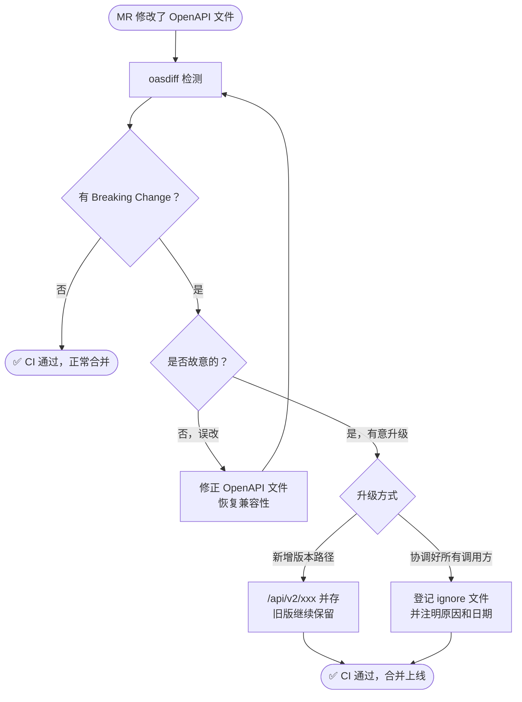

# oasdiff

> Go 编写的 OpenAPI 规范差异检测工具，专门用于识别两个版本 API 规范之间的**破坏性变更（Breaking Changes）**。

- **官方仓库**：https://github.com/Tufin/oasdiff
- **License**：Apache 2.0
- **运行方式**：单二进制 CLI / Docker 镜像，无需部署服务

---

## 是什么

oasdiff 对比两份 OpenAPI 3.x YAML/JSON 文件，按照 [语义化 API 兼容性规则](https://github.com/Tufin/oasdiff/blob/main/BREAKING-CHANGES.md) 判断哪些变更会破坏已有客户端：

| 变更类型 | 示例 | 是否 Breaking |
|---------|------|-------------|
| 删除接口路径 | `DELETE /api/v1/orders` | ✅ Breaking |
| 删除请求字段 | 移除 required 字段 `userId` | ✅ Breaking |
| 修改字段类型 | `string` → `integer` | ✅ Breaking |
| 新增可选字段 | 新增 optional response 字段 | ❌ 非 Breaking |
| 新增接口 | 新增 `POST /api/v1/exports` | ❌ 非 Breaking |
| 修改响应状态码 | `200` 改为 `201` | ✅ Breaking |

---

## 与 SmartVision 现状的契合

- 现状：API 字段删除 / 类型修改靠人工 Code Review，漏检后联调或上线才发现
- 现有 GitLab CI 流水线可直接集成，零额外基础设施
- OpenAPI 规范文件纳入 Git 即可使用，与语言无关（Java / Python 均适用）

---

## GitLab CI 接入

### 前置条件

OpenAPI 规范文件需纳入 Git 版本管理，推荐目录结构：

```
api/
  openapi.yaml        # 当前分支版本（MR 修改后）
  openapi-base.yaml   # 基线版本（main 分支最新）
```

`openapi-base.yaml` 可在 CI 中自动从 main 分支拉取：

```yaml
before_script:
  - git show origin/main:api/openapi.yaml > api/openapi-base.yaml
```

### CI Job 配置

```yaml
# .gitlab-ci.yml
api-compat-check:
  stage: test
  image: tufin/oasdiff:latest
  before_script:
    - git fetch origin main
    - git show origin/main:api/openapi.yaml > api/openapi-base.yaml
  script:
    - oasdiff breaking api/openapi-base.yaml api/openapi.yaml --format text
  allow_failure: false   # 有 Breaking Change 则 MR 失败
  only:
    changes:
      - api/**/*.yaml
      - api/**/*.json
```

> **建议初期将 `allow_failure: true`**，先观察误报情况，2 周后确认规则稳定再改为 `false`。

### 输出示例

MR 中触发检测时，Job 日志输出：

```
1 breaking changes: 1 error, 0 warning
error	[response-status-removed] DELETE /api/v1/tasks/{id}
        in response: removed status code '204'
```

---

## 本地使用

```bash
# Docker 方式（无需安装 Go）
docker run --rm -v $(pwd):/app tufin/oasdiff \
  breaking /app/api/openapi-base.yaml /app/api/openapi.yaml

# 只看 diff（非 breaking 变更也显示）
docker run --rm -v $(pwd):/app tufin/oasdiff \
  diff /app/api/openapi-base.yaml /app/api/openapi.yaml --format text
```

---

## 常用命令

| 命令 | 说明 |
|------|------|
| `oasdiff breaking base.yaml new.yaml` | 只输出 Breaking Changes |
| `oasdiff diff base.yaml new.yaml` | 输出所有差异（含非 Breaking）|
| `oasdiff breaking ... --format json` | JSON 格式输出，便于后续处理 |
| `oasdiff breaking ... --fail-on ERR` | 仅 error 级别失败（忽略 warning）|

---

## 与其他工具对比

| 工具 | 语言 | 维护状态 | Breaking Change 检测 | 备注 |
|------|------|---------|---------------------|------|
| **oasdiff** | Go | ✅ 活跃 | ✅ 详细分级 | 推荐，规则完整 |
| openapi-diff | Java | ⚠️ 维护缓慢 | 部分支持 | 需要 JVM 运行 |
| Spectral | JS | ✅ 活跃 | ❌ 不检测 Breaking | 偏向 lint/规范校验 |

---

## 故意修改 API 时怎么处理

oasdiff 不是禁止你改 API，而是强迫每一次破坏性变更都**显式决策**，不能悄悄滑进 main 分支。



**方式一：新增版本路径（推荐）**

新旧接口并存，给调用方迁移窗口期（通常 1-2 个迭代）：

```
/api/v1/orders   # 旧版继续保留，不动
/api/v2/orders   # 新版，新结构/新字段
```

**方式二：登记 ignore 文件（已协调所有调用方时用）**

在仓库根目录创建 `.oasdiff-ignore`，把这次故意的 Breaking Change 登记在案，CI 自动跳过该条规则：

```
# 格式：规则名  路径
# 2026-05-29 已通知 app-frontend / scheduler，统一在下周迭代切换
response-status-removed  DELETE /api/v1/tasks/{id}
```

CI Job 加上 `--warn-ignore .oasdiff-ignore` 参数即可：

```yaml
script:
  - oasdiff breaking api/openapi-base.yaml api/openapi.yaml \
      --warn-ignore .oasdiff-ignore --format text
```

---

## 推荐决策

**直接接入**，理由：
- 零运维成本（CI Job 用 Docker 镜像，无需部署服务）
- 一次配置，所有包含 OpenAPI 文件的仓库均可复用
- 误报率低，规则明确可查阅

**前置工作**：各服务的 OpenAPI 规范文件需先纳入 Git，若当前仍是代码注解自动生成但未提交规范文件，需先补齐这一步。

---

## 相关文档

| 文档 | 说明 |
|------|------|
| [AI提效计划.md](../AI提效计划.md) | 机会3：API 破坏性变更自动检测方案 |
| [SonarQube.md](./SonarQube.md) | 代码质量静态分析 |
