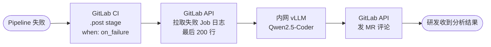
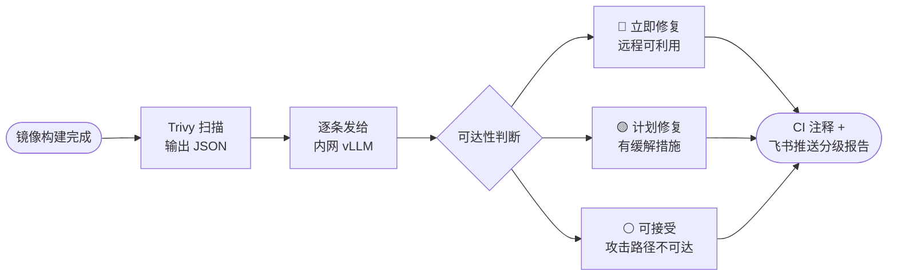
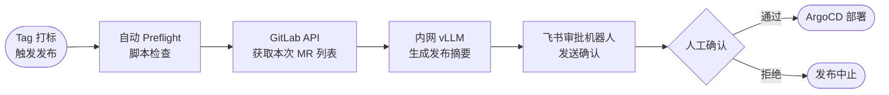
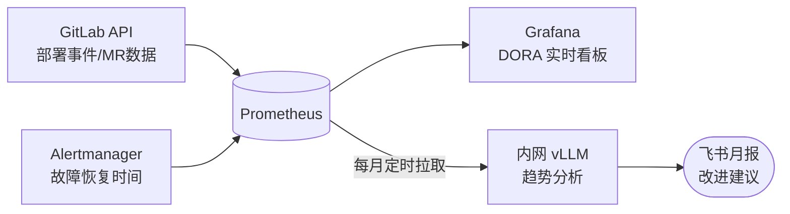

# AI 提效计划 - CI/CD 建设

> 将 AI 嵌入流水线的关键节点：Code Review、CI 失败分析、发布前检查和效能度量，目标：MR 合并周期缩短 30%，CI 失败排查时间减少 70%，发布前人工检查项降至 0。

---

## 一、效率基线（现状）

| 环节 | 当前耗时（估算）| 参与人 | 主要痛点 |
|------|--------------|--------|---------|
| CI 失败排查 | 15-45 分钟/次 | 研发工程师 | 手动翻日志，定位根因慢 |
| Code Review | 30-120 分钟/MR | 研发 + 架构 | 重复性检查（规范/安全）占用大量精力 |
| 发布前 Checklist | 30-60 分钟/次 | 研发 + 运维 | 人工核对多项检查，容易漏项 |
| DORA 指标收集 | 月度手动统计 | DevOps | 无自动采集，数据不准确 |
| CVE 告警处理 | 1-4 小时/个 | 研发 | Trivy 误报多，需人工逐个判断 |

---

## 二、AI 工具全景

| 工具/能力 | 适用场景 | 使用状态 | 接入难度 | 月费用参考 |
|----------|---------|---------|---------|----------|
| **GitLab AI（Duo）** | Code Review、MR 摘要、CI 失败解释 | ❌ 未启用 | 低（GitLab 自带）| $19/人/月 or 自托管 |
| **GitHub Copilot** | Code Review 辅助 | 🟡 部分 | 低 | $10/人/月 |
| **Claude API** | CI 日志分析、CVE 定级、发布说明生成 | 🟡 个人使用 | 中 | ~¥300-500 |
| **oasdiff / openapi-diff** | API 破坏性变更检测 | ❌ 未使用 | 中 | 开源免费 |
| **Trivy + LLM** | CVE 扫描 + 智能定级去误报 | 🟡 Trivy 已部分部署 | 中 | Claude API 成本 |
| **DORA Metrics 插件** | 自动化 DORA 指标采集 | ❌ 未使用 | 中 | 部分开源 |

---

## 三、高价值机会点详细方案

### 机会1：CI 失败自动根因分析

**当前状态**：CI Pipeline 失败后，研发需要手动打开 Job 日志，逐行排查，平均 15-45 分钟/次。  
**目标状态**：CI 失败后 1 分钟内，MR 评论区自动出现根因分析和修复建议。

**整体流程**：

**方案要点**：
- 利用 GitLab CI `.post` stage + `when: on_failure`，pipeline 失败时自动触发分析 job，无需额外部署 Webhook 服务
- 分析 job 调用 GitLab API 获取失败 Job 的最后 200 行日志，发给内网 vLLM
- Prompt 要求输出：根因（一句话）/ 失败类型（编译/测试/环境/超时）/ 修复建议（≤3步）
- 结果以 MR 评论发出，标注"AI 生成，仅供参考"；CI 日志含内部信息，全程走内网 vLLM

**前置条件**：`GITLAB_API_TOKEN` 配置为 CI/CD Variable；内网 vLLM 服务运行中  
**实施周期**：1-2 天  
**估算收益**：CI 排查时间从 15-45 分钟缩短到 5-10 分钟  
**落地细节**：→ [工具分析/CIFailureAnalysis.md](./工具分析/CIFailureAnalysis.md)

---

### 机会2：AI Code Review 辅助

**当前状态**：Code Review 承担规范检查、安全检查、逻辑分析三类工作，前两类重复性高，占用 Reviewer 大量精力。  
**目标状态**：AI 在人工 Review 前完成规范 + 安全自动检查，人工专注业务逻辑和架构合理性。

**整体流程**：

**方案要点**：
- 每次 MR 创建/更新时触发 CI job，获取 MR diff（截取前 300 行）发给 vLLM
- AI 自动检查项（在人工 Review 开始前完成）：
  - ✅ 硬编码 Secret / Token
  - ✅ SQL 字符串拼接注入风险
  - ✅ 未关闭的文件/连接/流
  - ✅ 新增功能缺少对应测试
  - ✅ 自动生成 MR 摘要（帮助 Reviewer 快速理解变更内容）
- 每次最多输出 5 条评论，防止噪音疲劳；`allow_failure: true` 不阻塞合并
- 人工 Reviewer 专注：业务逻辑正确性 / 架构合理性 / 性能考量
- 工具选型：优先自建（内网 vLLM，代码不出内网）；GitLab Duo 作为备选（需联网）

**前置条件**：团队代码规范文档已整理（作为 AI 检查依据）  
**实施周期**：1-2 周  
**估算收益**：MR Review 时间减少 30-40%，安全漏洞在 MR 阶段发现率提升  
**落地细节**：→ [工具分析/AICodeReview.md](./工具分析/AICodeReview.md)

---

### 机会3：CVE 漏洞智能定级（减少误报）

**当前状态**：Trivy 每次扫描输出大量 CVE，多数标注 CRITICAL 但实际不可利用，研发花大量时间处理误报。  
**目标状态**：LLM 对每个 CVE 做上下文可达性分析，真正需处理的比例降至 20% 以内。

**整体流程**：

**方案要点**：
- Trivy 输出 JSON，脚本逐条提取 HIGH/CRITICAL CVE，逐条发给 vLLM 分析
- 每条 CVE 的 Prompt 携带：CVE描述、CVSS分、攻击向量，以及**当前部署环境描述**（K8s网络策略、对外暴露端口、WAF状态）
- LLM 判断三个问题：① 攻击路径是否可达 ② 依赖路径是否实际被调用 ③ 现有缓解措施是否足够
- 输出分三级：🔴 立即修复（远程可利用）/ 🟡 计划修复（有缓解措施）/ ⚪ 可接受风险（攻击路径不可达）
- **安全原则**：AI 只做降级（过滤误报），不做升级；安全工程师有权手动提升任何 CVE 级别
- 部署环境描述维护在单独配置文件中，随环境变化更新

**前置条件**：Trivy 已接入 CI；整理当前部署环境网络描述文档  
**实施周期**：1 周  
**估算收益**：误报率从 ~70% 降至 ~20%，安全处理人力节省 60%  
**落地细节**：→ [工具分析/CVETriaging.md](./工具分析/CVETriaging.md)

---

### 机会4：发布 Checklist 自动化

**当前状态**：每次发布前人工核对 20+ 项检查（数据库迁移/配置同步/灰度比例/回滚方案），耗时 30-60 分钟，容易漏项。  
**目标状态**：流水线自动完成可机械核查的项，LLM 生成发布摘要，人工只做最终确认。

**整体流程**：

**方案要点**：
- 打 Tag 触发发布时，先运行 Preflight 脚本自动核查：
  - ✅ DB 迁移脚本已在 pre 环境成功执行
  - ✅ 本次发布包含的 MR 列表（与上次 Tag 对比）
  - ✅ ConfigMap/Secret 变更已同步到目标环境
  - ✅ 回滚方案已记录（关联 GitLab Issue）
- 自动检查通过后，获取本次 MR 标题列表发给 vLLM，生成发布摘要：功能分类 / 破坏性变更识别 / 影响评估 / 建议发布窗口
- 飞书卡片消息发送审批群，人工确认后手动触发 ArgoCD 部署 job
- 任意自动检查项失败则发布中止，人工介入处理后重新触发

**前置条件**：发布 Checklist 已文档化；GitLab Tag 规范已执行；飞书 Bot Webhook 已配置  
**实施周期**：2 周  
**估算收益**：发布前人工时间从 30-60 分钟缩短到 10 分钟  
**落地细节**：→ [工具分析/ReleaseChecklist.md](./工具分析/ReleaseChecklist.md)

---

### 机会5：DORA 指标自动采集与分析

**当前状态**：部署频率、变更失败率等 DORA 指标靠月度手动统计，数据滞后且不准确。  
**目标状态**：DORA 四项指标实时采集入 Prometheus，LLM 每月自动分析趋势并推送飞书。

**整体流程**：

**四项指标采集来源**：

| 指标 | 数据来源 |
|------|--------|
| 部署频率 | GitLab deployment events → Prometheus |
| 变更前置时间 | MR 创建时间 → 生产部署时间，GitLab API |
| 变更失败率 | 发布后 1h 内触发回滚，GitLab + Alertmanager |
| 服务恢复时间 | P0/P1 告警触发到关闭时间差，Alertmanager |

**前置条件**：Prometheus + Grafana 已部署；CI/CD 流水线规范执行  
**实施周期**：3-4 周  
**估算收益**：效能度量从无到有，为 DevOps 改进提供数据支撑  
**落地细节**：→ [工具分析/DORAMetrics.md](./工具分析/DORAMetrics.md)

---

## 四、实施路径

### Phase 0（第 1 周）：高频痛点立即缓解

| 任务 | 具体行动 | 验收标准 | Owner |
|------|---------|---------|-------|
| CI 失败分析脚本 | Python 脚本：GitLab API 获取日志 + Claude API 分析 | 测试 5 次真实 CI 失败，分析结果准确率 > 80% | DevOps |
| CVE 误报分析试跑 | 将最近一次 Trivy 报告输入 Claude，验证定级效果 | 人工复核：AI 定级准确率 > 85% | 运维/安全 |

### Phase 1（第 2-3 周）：Review 和安全自动化

| 任务 | 具体行动 | 验收标准 | Owner | 前置条件 |
|------|---------|---------|-------|---------|
| CI 失败分析 CI 化 | MR Pipeline 失败自动触发分析并评论 | 所有失败 MR 5 分钟内收到分析评论 | DevOps | GitLab Webhook 配置 |
| AI Code Review 接入 | GitLab Duo 启用或自建脚本 | 每个 MR 在人工 Review 前有 AI 评审意见 | DevOps | 代码规范文档 |
| CVE 定级自动化 | Trivy CI 步骤后增加 LLM 定级，输出分级报告 | HIGH/CRITICAL CVE 中真正需处理的误报率 < 30% | 运维 | Trivy 已在 CI |

### Phase 2（第 4-6 周）：发布和度量自动化

| 任务 | 具体行动 | 验收标准 | Owner | 前置条件 |
|------|---------|---------|-------|---------|
| 发布 Checklist 自动化 | CI 发布阶段增加自动检查 + AI 摘要生成 | 发布前人工时间 < 10 分钟 | DevOps + 运维 | Checklist 已文档化 |
| DORA 指标采集 | GitLab API + Prometheus 接入，Grafana 看板 | DORA 四项指标可实时查看 | DevOps | Prometheus + Grafana 就绪 |
| AI 月度效能报告 | DORA 数据 + Claude API 生成月度分析 | 每月第一周自动推送效能报告到飞书 | DevOps | DORA 数据采集 ≥ 1 个月 |

---

## 五、成本与收益

| 项目 | 月度成本 | 节省人力（估算）| ROI |
|------|---------|--------------|-----|
| 内网 vLLM（CI分析+CVE+发布摘要+DORA月报）| GPU 电费（低峰运行）| 约 10-15 人天/月 | 极高 |
| GitLab Duo（可选，Code Review）| $19/人/月 × 开发人数 | MR Review 效率提升 30% | 中高 |
| **合计** | **~¥0 额外订阅** | **约 12-18 人天/月** | **极高** |

---

## 六、风险与回退

| 风险 | 影响 | 应对措施 |
|------|------|---------|
| CI 分析结果不准确，误导开发 | 开发按错误建议修改，浪费时间 | 分析结果标注置信度；低于 70% 时提示"建议人工排查" |
| CVE 漏报（AI 将高危定为低危）| 安全漏洞未被修复 | AI 仅做降级（降低误报），不做升级；人工有权提升等级 |
| AI Code Review 过多噪音评论 | Reviewer 疲劳，忽略所有评论 | 初期限制 AI 评论数量（最多 5 条/MR）；评论可折叠 |
| GitLab API 日志获取失败 | CI 分析功能中断 | 降级为不分析，不影响 CI 本身；告警通知运维 |
