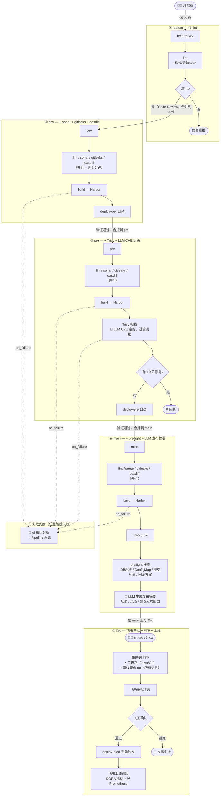

# CI/CD 建设 体系建设总览

> 整套体系完全依托内网 **GitLab** 构建——GitLab 是代码仓库、CI/CD 引擎、发布审批入口，所有工具通过 GitLab CI 或 GitLab API 集成，不依赖任何外部 SaaS 服务。

---

## 一、现状问题

| 环节 | 当前状态 | 核心痛点 |
|------|---------|---------|
| 代码提交 | 🔴 无检查 | Secret 可直接提交进 Git |
| CI 流水线 | 🟡 各服务自维护 | 质量门禁标准不一，安全扫描有的形同虚设 |
| 镜像构建 | 🟡 无规范 | `latest` 滥用，镜像来源不可追溯 |
| 安全扫描 | 🟡 部分接入 | Trivy ~70% 误报率，工程师疲于处理 |
| 部署 | 🔴 手动操作 | 无 GitOps，集群状态与 Git 不一致，回滚靠经验 |
| 发布治理 | 🔴 无流程 | 发布前核查靠人脑，DORA 指标未采集 |

---

## 二、完整 CICD 流程

一次代码变更从 feature 开发到生产上线，每升一个分支增加一层质量门禁：



---

## 三、各阶段说明

### 阶段一：feature 分支 — 仅 lint

**触发**：`$CI_COMMIT_BRANCH =~ /^feature\//`  
**目的**：最快速的反馈，格式错误在本地就发现，不污染共享分支  
**耗时**：约 30 秒

只跑 lint（ruff / eslint / golangci-lint），不做构建，不做安全扫描。通过后走人工 Code Review，批准合并到 `dev`。

---

### 阶段二：dev 分支 — + sonar + gitleaks + oasdiff

**触发**：`$CI_COMMIT_BRANCH == "dev"`（合并后自动）  
**耗时**：约 3-5 分钟

| 步骤 | 工具 | 说明 |
|------|------|------|
| lint | ruff / eslint / golangci-lint | 格式/语法，阻断 |
| 源码质量 | SonarQube | bugs/技术债/覆盖率（初期 allow_failure，建基线后收紧）|
| Secret 检测 | gitleaks | 硬编码密钥/Token，阻断 |
| API 变更 | oasdiff | 破坏性变更，仅 yaml/json 变更时触发，阻断 |
| build | Docker | 镜像打 commit SHA tag → **Harbor\_DEV** |
| deploy-dev | kubectl / argocd / docker / binary | 自动部署 dev 环境 |

> **镜像命名**：`harbor-dev.internal/platform/{service-name}:dev_{short_sha}`  
> 示例：`harbor-dev.internal/platform/order-service:dev_a1b2c3d4`

---

### 阶段三：pre 分支 — + Trivy + LLM CVE 定级

**触发**：`$CI_COMMIT_BRANCH == "pre"`（合并后自动）  
**耗时**：约 8-10 分钟

| 步骤 | 工具 | 说明 |
|------|------|------|
| lint | ruff / eslint / golangci-lint | 格式/语法，阻断 |
| 源码质量 | SonarQube | bugs/技术债/覆盖率，阻断 |
| Secret 检测 | gitleaks | 硬编码密钥/Token，阻断 |
| API 变更 | oasdiff | 破坏性变更，仅 yaml/json 变更时触发，阻断 |
| build | Docker | 镜像打 commit SHA tag → **Harbor\_PRE** |
| Trivy 扫描 | Trivy | 扫新构建镜像的 HIGH/CRITICAL 漏洞，输出 JSON 报告 |
| LLM CVE 定级 | 内网 vLLM | 见下方说明 |
| deploy-pre | kubectl / argocd / docker / binary | 无🔴则自动部署 pre 环境 |

**LLM CVE 定级说明**：

Trivy 会把镜像里所有依赖库的已知 CVE 全部报出来，但其中约 70% 是"伪告警"——漏洞确实存在于某个库，但你的代码根本没调用那个有漏洞的函数，实际上不可被利用。工程师面对几十条告警不知道哪条真正危险，最终全部忽略。

LLM CVE 定级的做法：把 Trivy JSON 报告 + 服务的依赖列表 + 部署上下文（是否对外暴露、数据敏感度）一起发给内网 vLLM，让它逐条判断：

| 等级 | 含义 | CI 行为 |
|------|------|---------|
| 🔴 立即修复 | 漏洞函数确实被调用，且服务对外暴露 | 阻断部署 |
| 🟡 计划修复 | 有一定风险但不紧急 | 允许部署，工单跟踪 |
| ⚪ 可忽略 | 库里有漏洞但代码完全未触达 | 过滤掉 |

过滤后有效告警从 ~70% 误报降至 ~20%，工程师只处理真正需要修复的。

> **镜像命名**：`harbor-pre.internal/platform/{service-name}:pre_{short_sha}`  
> 示例：`harbor-pre.internal/platform/order-service:pre_a1b2c3d4`

---

### 阶段四：main 分支 — + preflight + LLM 发布摘要

**触发**：`$CI_COMMIT_BRANCH == "main"`（合并后自动）  
**耗时**：约 10-15 分钟  
**注意**：main 阶段**不部署生产**，只做最终验证和发布材料准备

| 步骤 | 工具 | 说明 |
|------|------|------|
| lint | ruff / eslint / golangci-lint | 格式/语法，阻断 |
| 源码质量 | SonarQube | bugs/技术债/覆盖率，阻断 |
| Secret 检测 | gitleaks | 硬编码密钥/Token，阻断 |
| API 变更 | oasdiff | 破坏性变更，仅 yaml/json 变更时触发，阻断 |
| build | Docker | 镜像打 commit SHA tag → **Harbor\_PROD** |
| Trivy 扫描 | Trivy | 扫新构建镜像，🔴 则阻断后续步骤 |
| preflight 核查 | GitLab API + 脚本 | 自动核查 4 项：DB 迁移已执行 / ConfigMap 已同步 / 本次提交列表完整 / 回滚方案已记录 |
| LLM 发布摘要 | 内网 vLLM | 读取本次提交列表，自动生成：功能分类 / 破坏性变更说明 / 影响范围评估 / 建议发布窗口 |

全部通过后，开发者在 main 上打 Tag 触发生产发布。

> **镜像命名**：`harbor.internal/platform/{service-name}:main_{short_sha}`  
> 示例：`harbor.internal/platform/order-service:a1b2c3d4`

---

### 阶段五：Tag — 飞书审批 + FTP 推送 + 生产部署

**触发**：`$CI_COMMIT_TAG =~ /^v\d+\.\d+\.\d+/`  
**目的**：Tag 是生产版本的不可变锚点，Tag CI 负责交付和上线

```
git tag v2.x.x（在 main 上）
    ↓
Harbor_PROD 重新打 tag（从 main 构建时的 main_SHA tag 引用）：
  ･ harbor.internal/platform/order-service:release_v2.x.x
  ･ harbor.internal/platform/order-service:latest
    ↓
推送到 FTP：
  ･ 二进制（Java / Go）
  ･ 离线镜像 tar（docker save harbor.internal/platform/order-service:v2.x.x）
    ↓
飞书审批卡片（附 LLM 摘要内容）→ 人工确认
    ↓
手动触发 deploy-prod
    ↓
飞书上线通知 + DORA 指标上报 Prometheus
```

> **Tag 阶段镜像命名**：在 Harbor\_PROD 上同时打两个 tag：  
> ･ `harbor.internal/platform/order-service:release_v2.1.0` —— 不可变的版本锤，用于 FTP 离线包和回滚  
> ･ `harbor.internal/platform/order-service:latest` —— 指向最新上线版本，便于拉取

**FTP 制品说明**：

目录结构：`/releases/{service_name}/{semver}/`

```
/releases/
└── {service_name}/          ← 与 GitLab 项目名一致（小写 kebab-case）
    └── {semver}/            ← 与 git tag 一致（v{major}.{minor}.{patch}）
        ├── image.tar.gz     ← 离线 Docker 镜像，所有语言均有
        ├── app.jar          ← Java Fat JAR（仅 LANG_TYPE=java）
        └── {service_name}   ← Go 可执行文件（仅 LANG_TYPE=go）
```

示例（`order-service` v2.1.0）：

```
/releases/order-service/v2.1.0/
├── image.tar.gz    # docker save harbor.internal/platform/order-service:release_v2.1.0 | gzip
├── app.jar         # （Java 服务才有）
```

| 文件 | 用途 |
|------|------|
| `image.tar.gz` | 客户离线环境通过 `docker load` 导入，无需访问 Harbor |
| `app.jar` | 无 Docker 环境的 Java 私有化交付 |
| `{service_name}` | 无 Docker 环境的 Go 私有化交付 |

> 同一版本目录一旦推送，禁止覆盖（FTP 侧设置只写权限）。

---

### 阶段六：失败兜底

任意分支 CI 失败时，`.post` stage 自动触发：
- 调 GitLab API 获取失败 Job 日志（最后 200 行）
- 发给内网 vLLM 分析根因
- 以 Pipeline 评论发出，标注"AI 生成，仅供参考"
- 减少开发者手动翻日志时间（15-45 分钟 → 5-10 分钟）

---

## 四、工具链

| 工具 | 用途 | 托管 | 状态 |
|------|------|------|------|
| GitLab | 代码仓库 + CI/CD 引擎 | 内网自托管 | ✅ 已有 |
| Harbor | Docker 镜像仓库 | 内网自托管 | ✅ 已有 |
| FTP | Java/Go 二进制制品存储 | 内网 | ✅ 已有 |
| SonarQube | 源码质量扫描（CI 每次触发）| K8s devtools（NodePort 30900）| ✅ 已有 |
| Trivy | 镜像漏洞扫描（CI + 定期）| GitLab CI job | 🟡 部分接入 |
| gitleaks | Secret 检测 | GitLab CI job | 🔴 待接入 |
| oasdiff | API 破坏性变更检测 | GitLab CI job | 🔴 待接入 |
| Cosign | 镜像签名 | GitLab CI job | 🔴 待接入 |
| ArgoCD | GitOps CD 引擎 | K8s devtools | 🔴 待接入 |
| Prometheus + Grafana | DORA 指标存储与看板 | monitoring namespace | ✅ 已有 |
| 内网 vLLM | CVE 定级 / CI 失败分析 / 发布摘要 | ai-infra namespace | ✅ 已有 |
| 飞书 Bot | 部署通知 / 发布审批 | SaaS | ✅ 已有 |

---

## 五、建设路径

### Phase 0（第 1-2 月）：消除混乱，统一基础

| 任务 | 行动 | 验收标准 |
|------|------|---------|
| 统一 CI 模板 | 发布 `platform/cicd-templates`，各服务改用 `include` | 所有服务 Pipeline 结构一致 |
| 镜像规范 | 分支构建强制 commit SHA tag；Tag 发布同时打 semver + latest | Harbor 镜像 100% 可追溯；latest 始终指向最新上线版本 |
| gitleaks 接入 | CI job + pre-commit hook | 新增 Secret 入库率 = 0 |
| Trivy 全量 | 所有服务改为 `allow_failure: false` | HIGH/CRITICAL 漏洞阻断 CI |
| SonarQube 接入 | `allow_failure: true` 模式接入，收集基线数据 | 所有服务有 SonarQube 扫描记录 |

### Phase 1（第 3-4 月）：安全自动化

| 任务 | 行动 | 验收标准 |
|------|------|---------|
| CVE LLM 定级 | Trivy JSON → vLLM 可达性分析 | 误报率从 70% 降至 20% |
| CI 失败根因分析 | `.post` stage on_failure | CI 失败后 1 分钟内有分析评论 |
| oasdiff 接入 | 有 OpenAPI 的服务接入 feature 分支检测 | API 破坏性变更在 feature 阶段发现 |
| SonarQube 收紧 | Quality Gate 从 allow_failure 改为阻断 | 新增 bugs/Critical 问题阻断合并 |
| Trivy 定期 CronJob | 每周扫存量镜像 | 新 CVE 72h 内通知到对应服务负责人 |

### Phase 2（第 5-8 月）：GitOps + 发布治理

| 任务 | 行动 | 验收标准 |
|------|------|---------|
| ArgoCD 接管 pre | pre 环境全面迁 GitOps | pre 零手动 kubectl |
| Preflight 自动化 | 4 项核查 + LLM 摘要 + 飞书审批 | 发布前人工时间 < 10 分钟 |
| DORA 看板 | GitLab API + Pushgateway → Grafana | 四项指标实时可查 |
| ArgoCD 接管 prod | prod 全面 GitOps + Cosign 验签 | prod 零手动 kubectl |

---

## 六、关键指标

| 指标 | 当前值 | Phase 2 目标 | 采集方式 |
|------|--------|-------------|---------|
| 部署频率 | ~2-3 次/月 | ≥ 4 次/月 | GitLab deployment events → Prometheus |
| 变更前置时间 | 未采集 | < 2 天 | feature 首次 push → prod 部署，GitLab API |
| 变更失败率 | 未采集 | < 15% | 发布后 1h 内回滚比例 |
| MTTR | 未采集 | < 1 小时 | Alertmanager 告警时间差 |
| CVE 真实处理率 | ~30% | > 80% | Trivy + LLM 定级后 🔴 比例 |

---

## 七、上下游联动

| 领域 | 联动点 |
|------|-------|
| [02-架构治理](../02-架构治理/体系建设总览.md) | oasdiff 在 CI 检测 API 破坏性变更；SonarQube 数据供 TechDebtAgent 月报分析 |
| [11-安全治理](../11-安全治理/体系建设总览.md) | gitleaks / Trivy / Cosign 是安全治理的 CI 层落地 |
| [12-版本发布管理](../12-版本发布管理/体系建设总览.md) | Release Notes 由 LLM 从 MR 列表自动生成；Tag 规范与发布流程对齐 |
| [07-可观测性](../07-可观测性/体系建设总览.md) | DORA 指标经 Pushgateway 进 Prometheus；部署事件触发 Grafana annotation |
| [10-SRE 稳定性工程](../10-SRE%20稳定性工程/体系建设总览.md) | 变更失败率 / MTTR 是 SLO 的输入；Preflight 是变更管理前置门禁 |
| [13-私有化交付](../13-私有化交付/体系建设总览.md) | Java/Go 二进制制品经 FTP 分发；Ansible 负责客户环境部署 |

---

## 八、GitLab CI/CD Variables 配置指南

> 模板中所有敏感配置均不写入代码，统一在 **GitLab → 项目/Group → Settings → CI/CD → Variables** 中维护。  
> 通用变量（Harbor URL、FTP 地址、飞书 Webhook）可配置在 **Group 级别**，各项目继承；凭证类变量建议配置在 **项目级别**，并勾选 **Protected**（仅 protected 分支/Tag 可读）+ **Masked**（日志中自动脱敏）。

---

### 8.1 Harbor 镜像仓库（三套环境独立）

三个环境使用三个独立 Harbor 实例，凭证分别配置。

| Variable | 类型 | 说明 | 示例值 |
|----------|------|------|--------|
| `HARBOR_USER_DEV` | Variable | dev Harbor 登录用户名 | `ci-bot` |
| `HARBOR_PASS_DEV` | Variable | dev Harbor 登录密码 | `••••••` |
| `HARBOR_USER_PRE` | Variable | pre Harbor 登录用户名 | `ci-bot` |
| `HARBOR_PASS_PRE` | Variable | pre Harbor 登录密码 | `••••••` |
| `HARBOR_USER_PROD` | Variable | prod Harbor 登录用户名 | `ci-bot` |
| `HARBOR_PASS_PROD` | Variable | prod Harbor 登录密码 | `••••••` |

Harbor URL（非敏感，可直接写在模板变量区）：

```yaml
HARBOR_URL_DEV:  "harbor-dev.internal"
HARBOR_URL_PRE:  "harbor-pre.internal"
HARBOR_URL_PROD: "harbor.internal"
```

---

### 8.2 K8s 集群认证（三套 kubeconfig）

三个集群使用三份独立 kubeconfig，类型必须选 **File**（GitLab 会将内容写入临时文件，变量值即文件路径）。

| Variable | 类型 | 说明 |
|----------|------|------|
| `KUBECONFIG_DEV` | **File** | dev 集群 kubeconfig |
| `KUBECONFIG_PRE` | **File** | pre 集群 kubeconfig |
| `KUBECONFIG_PROD` | **File** | prod 集群 kubeconfig（建议仅 Protected 分支/Tag 可读）|

**获取方式**：

```bash
# 在对应集群的 master 节点或有 kubectl 权限的机器上执行
kubectl config view --raw > kubeconfig-dev.yaml
```

**配置步骤**：

1. Settings → CI/CD → Variables → Add variable
2. Type 选 **File**
3. Key 填 `KUBECONFIG_DEV`
4. Value 粘贴 `kubeconfig-dev.yaml` 全部内容
5. 勾选 **Protected** + **Masked**

CI 中使用方式（模板已内置）：

```bash
export KUBECONFIG="$KUBECONFIG_DEV"
kubectl set image ...
```

---

### 8.3 SSH 私钥（docker/binary 部署模式）

仅 `DEPLOY_TYPE` 为 `docker` 或 `binary` 时使用。

| Variable | 类型 | 说明 |
|----------|------|------|
| `SSH_PRIVATE_KEY` | **File** | PEM 格式私钥，对应目标机器 `~/.ssh/authorized_keys` 中已添加的公钥 |

**配置步骤**：

```bash
# 生成专用部署密钥对（不复用个人密钥）
ssh-keygen -t ed25519 -C "gitlab-ci-deploy" -f ~/.ssh/ci_deploy -N ""

# 公钥添加到目标机器
ssh-copy-id -i ~/.ssh/ci_deploy.pub deploy@your-host

# 私钥内容粘贴到 GitLab Variable（类型 File）
cat ~/.ssh/ci_deploy
```

CI 中使用方式（模板已内置）：

```bash
chmod 600 "$SSH_PRIVATE_KEY"
ssh -i "$SSH_PRIVATE_KEY" -o StrictHostKeyChecking=no \
    "${SSH_USER}@${DEV_HOST}" "docker pull ..."
```

---

### 8.4 FTP 凭证

| Variable | 类型 | 说明 |
|----------|------|------|
| `FTP_USER` | Variable | FTP 登录用户名 |
| `FTP_PASS` | Variable | FTP 登录密码 |

FTP 地址（非敏感，可写在模板变量区）：

```yaml
FTP_HOST: "ftp.internal"
```

---

### 8.5 飞书机器人 Webhook

飞书审批卡片和部署通知共用同一个机器人（如需分开，可再加 `FEISHU_APPROVAL_WEBHOOK`）。

| Variable | 类型 | 说明 |
|----------|------|------|
| `FEISHU_WEBHOOK` | Variable | 飞书群聊机器人 Webhook URL |

**获取方式**：飞书群 → 设置 → 机器人 → 添加机器人 → 自定义机器人 → 复制 Webhook 地址。

Webhook URL 不包含敏感密钥，可直接写在模板变量区（方便各项目查阅），也可配置为 Group 级 Variable 统一维护：

```yaml
FEISHU_WEBHOOK: "https://open.feishu.cn/open-apis/bot/v2/hook/xxxxxxxx-xxxx-xxxx-xxxx-xxxxxxxxxxxx"
```

---

### 8.6 其他必填变量

| Variable | 类型 | 说明 |
|----------|------|------|
| `SONAR_TOKEN` | Variable | SonarQube 用户 Token（在 SonarQube → My Account → Security 中生成）|
| `GITLAB_API_TOKEN` | Variable | GitLab Project Access Token，需要 `api` scope（用于 preflight 核查、失败评论）|

---

### 8.7 配置清单速查

下表汇总所有需要在 GitLab 中配置的变量，按建议范围分类：

| Variable | 配置范围 | 类型 | Protected | Masked |
|----------|---------|------|-----------|--------|
| `HARBOR_USER_DEV` | 项目 | Variable | ✅ | ✅ |
| `HARBOR_PASS_DEV` | 项目 | Variable | ✅ | ✅ |
| `HARBOR_USER_PRE` | 项目 | Variable | ✅ | ✅ |
| `HARBOR_PASS_PRE` | 项目 | Variable | ✅ | ✅ |
| `HARBOR_USER_PROD` | 项目 | Variable | ✅ | ✅ |
| `HARBOR_PASS_PROD` | 项目 | Variable | ✅ | ✅ |
| `KUBECONFIG_DEV` | 项目 | **File** | ✅ | ✅ |
| `KUBECONFIG_PRE` | 项目 | **File** | ✅ | ✅ |
| `KUBECONFIG_PROD` | 项目 | **File** | ✅ | ✅ |
| `SSH_PRIVATE_KEY` | 项目 | **File** | ✅ | — |
| `FTP_USER` | Group | Variable | ✅ | ✅ |
| `FTP_PASS` | Group | Variable | ✅ | ✅ |
| `FEISHU_WEBHOOK` | Group | Variable | — | — |
| `SONAR_TOKEN` | 项目 | Variable | ✅ | ✅ |
| `GITLAB_API_TOKEN` | 项目 | Variable | ✅ | ✅ |

> **说明**：FTP、飞书 Webhook 通常全组一致，建议配置在 Group 级，各项目自动继承，无需重复配置。

---
