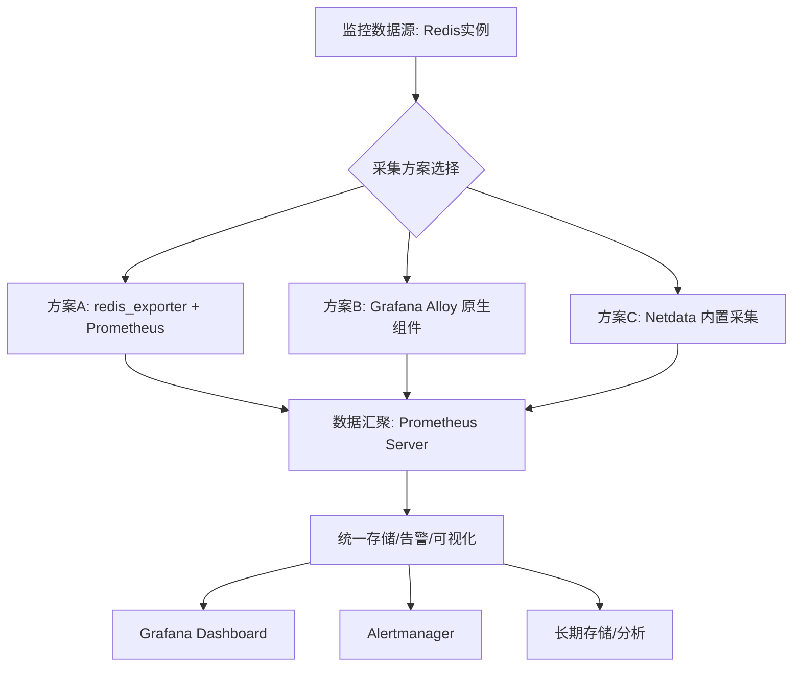

系统剖析 Redis 可观测性的三大主流方案，提供覆盖部署、架构、指标与集成的矩阵化选型决策。

## 引言与核心方案
构建 Redis 监控体系时，常面临方案选择的困惑：是使用独立的 `redis_exporter`，还是嵌入更现代的采集框架如 **Grafana Alloy**，或是选择开箱即用的 **Netdata**？本文将拆解这三个方案的技术内核、架构差异与适用场景，通过矩阵对比，为决策提供精确依据。

## 核心参考文档（官方链接）
为便于技术验证与快速上手，以下汇总各方案的官方文档入口。所有链接均完整可点击，直达技术细节第一手来源：

+ [**Prometheus redis_exporter**](https://github.com/oliver006/redis_exporter)：最权威的开源 Redis 监控 exporter，提供完整的部署指南、配置参数与指标说明。
+ [**Grafana Alloy**](https://grafana.com/docs/alloy/latest/)：Grafana 推出的下一代可观测性数据采集器，其 `redis.receiver` 组件说明与集成方法可在此找到。
+ [**Netdata**](https://learn.netdata.cloud/docs/agent/collectors/redis.plugin)：关于其内置 Redis 监控插件的配置、图表解释以及告警设置，Netdata 官方文档提供了最详细的指南。




## 方案一：redis_exporter + Prometheus（标准化方案）
作为 CNCF 生态下的事实标准，此方案成熟、稳定，社区支持广泛。

### 核心组件与部署
+ **采集器项目**：[oliver006/redis_exporter](https://github.com/oliver006/redis_exporter) (⭐ 3.3k)
    - **官方最佳实践**：项目 README 详细说明了不同部署环境（Docker, Kubernetes, systemd）的配置要点，强烈建议在生产部署前通读[部署指南](https://github.com/oliver006/redis_exporter#installation)。
+ **工作原理**：直连 Redis 实例，通过 `INFO`、`STATS` 等命令拉取运行时指标，在 TCP 9121 端口以 Prometheus 格式 (`/metrics`) 暴露。
+ **部署模式支持**：单实例、Redis Sentinel、Redis Cluster。启动时通过 `--redis.addr` 参数指定目标地址。
    - **关键配置细节**：对于认证连接，务必使用 `--redis.password-file`（而非命令行明文传递密码）。对于哨兵/集群模式，请查阅文档中的 `--redis.sentinel-master-name` 和 `--redis.cluster.enabled` 参数说明，以确保正确的拓扑发现。
+ **暴露方式**：静态配置文件、Kubernetes ServiceMonitor、Consul 服务发现等。
    - **Prometheus Operator 深度集成**：若在 Kubernetes 集群中使用，可参考官方 ServiceMonitor 示例，并合理配置 `interval`（建议15-30s）与 `scrapeTimeout`，以平衡数据时效性与查询性能。

### 核心监控指标矩阵
| **指标类别** | **关键指标** | **描述** | **告警阈值建议** |
| --- | --- | --- | --- |
| **内存** | `redis_memory_used_bytes` | 当前已用内存 | > `redis_memory_max_bytes` 的 80% |
| | `redis_memory_max_bytes` | 配置的最大内存限制 | — |
| **性能** | `redis_keyspace_hits_total`，`redis_keyspace_misses_total` | 缓存命中与未命中总数 | 命中率 < 90% 需排查 |
| **连接** | `redis_connected_clients` | 当前活跃客户端连接数 | 持续 > 2000 需关注 |
| **复制** | `redis_replication_lag` | 主从复制延迟（秒） | > 1 秒 |
| **可用性** | `redis_uptime_in_seconds` | 实例运行时间 | 短时间骤降表示重启 |
| **数据** | `redis_db_keys` | 各数据库的 Key 数量 | 单 DB > 1000 万需规划 |
| **慢查询** | `redis_slowlog_length` | 当前慢查询日志队列长度 | > 0 且持续增长 |


### 集成配置示例
```yaml
# Prometheus 静态配置 (二进制/Docker)
1job_name: 'redis'
  static_configs:
    - targets: ['redis-host-01:9121', 'redis-host-02:9121']
  labels:
    service: 'redis-cache'
    env: 'production'
  # 建议：针对生产环境，合理配置 scrape_interval 和 scrape_timeout
  scrape_interval: 15s
  scrape_timeout: 10s

# Kubernetes ServiceMonitor (Prometheus Operator)
apiVersion: monitoring.coreos.com/v1
kind: ServiceMonitor
metadata:
  name: redis-monitor
  namespace: observability
spec:
  selector:
    matchLabels:
      app: redis-exporter
  endpoints:
  - port: metrics
    interval: 15s
    path: /metrics
    # 高级配置：添加认证、TLS等，请查阅 Prometheus Operator 官方文档
```

### 核心告警规则 (Alertmanager)
```yaml
- alert: RedisMemoryHigh
  expr: redis_memory_used_bytes / redis_memory_max_bytes * 100 > 80
  for: 5m
  annotations:
    summary: "Redis 内存使用率过高 ({{ $value | humanizePercentage }})"
    description: "实例 {{ $labels.instance }} 内存使用率持续超过80%，可能影响性能。"

- alert: RedisCacheHitRateLow
  expr: 
    rate(redis_keyspace_hits_total[5m]) 
    / 
    (rate(redis_keyspace_hits_total[5m]) + rate(redis_keyspace_misses_total[5m])) 
    * 100 < 90
  for: 10m
  annotations:
    summary: "Redis 缓存命中率低于90%"
    description: "实例 {{ $labels.instance }} 缓存命中率持续偏低，需检查热点数据与淘汰策略。"

- alert: RedisReplicationLagHigh
  expr: redis_replication_lag > 1
  for: 2m
  annotations:
    summary: "Redis 主从复制延迟过高 ({{ $value }}s)"
    description: "从节点 {{ $labels.instance }} 复制延迟超过1秒，影响数据一致性。"
```

## 方案二：Grafana Alloy（现代化原生采集方案）
Grafana Alloy 是下一代 Grafana 可观测性采集器，采用声明式配置，内置丰富的采集组件，旨在简化数据管道。

### 核心优势
其核心价值在于简化数据管道，具体优势如下（建议结合 [**Grafana Alloy 官方文档 - Prometheus Exporter 组件**](https://grafana.com/docs/alloy/latest/reference/components/prometheus.exporter.redis/) 深入学习配置细节）：

1. **无需独立 Exporter**：内置 `prometheus.exporter.redis` 组件，可直接采集 Redis 指标，减少组件依赖和运维成本。
2. **声明式配置**：配置即代码，版本化管理，易于复现和审计。
3. **统一数据处理管道**：支持将指标、日志、跟踪数据通过同一管道处理并转发至多种后端（Prometheus, Loki, Tempo, 第三方）。

### 配置模式详解
#### 模式A：使用 Alloy 原生 Redis 采集组件（推荐）
此模式利用 Alloy 内置能力，架构最简洁。

```plain
// 1. 定义 Redis 目标（支持动态发现）
discovery.relabel "redis_targets" {
  targets = [
    { "__address__" = "redis://primary-cache:6379", "role" = "primary", "service" = "cache" },
    { "__address__" = "redis://replica-cache:6380", "role" = "replica", "service" = "cache" },
  ]
  rule {
    source_labels = ["__address__"]
    regex = "redis://(.+):(\\d+)"
    target_label = "instance"
    replacement = "$1:$2"
  }
}

// 2. 配置 Redis 指标采集器
prometheus.exporter.redis "redis_primary" {
  redis_targets = discovery.relabel.redis_targets.targets
  // 可选高级参数
  // check_keys = ["*", "user:*"] // 监控特定键模式
  // ping_on_connect = true // 连接时执行PING
}

// 3. 配置抓取任务，并转发至远程写入端点
prometheus.scrape "scrape_redis" {
  targets    = prometheus.exporter.redis.redis_primary.targets
  forward_to = [prometheus.remote_write.central_prom.receiver]
}

// 4. 配置远程写入（如 Grafana Cloud 或自有 Prometheus）
prometheus.remote_write "central_prom" {
  endpoint {
    url = "http://prometheus-server:9090/api/v1/write"
    // basic_auth { ... }
    // tls_config { ... }
  }
}
```

#### 模式B：抓取现有 redis_exporter（兼容存量环境）
若环境中已部署独立的 `redis_exporter`，Alloy 可作为统一的抓取与转发网关。

```plain
// 抓取已部署的 redis_exporter 实例
prometheus.scrape "scrape_external_exporter" {
  targets = [
    { "__address__" = "redis-exporter.prod.svc.cluster.local:9121", "job" = "redis" }
  ]
  forward_to = [prometheus.remote_write.central_prom.receiver]
}
```

## 方案三：Netdata（实时监控与快速验证方案）
Netdata 是一款实时的分布式性能监控工具，强调秒级数据采集和开箱即用的仪表盘。

### 核心特性与部署
其设计哲学强调轻量与实时（部署前务必查阅 [**Netdata 官方 Redis Collector 文档**](https://learn.netdata.cloud/docs/data-collection/collectors/collectors.plugin/#redis) 以获取精准的配置参数和指标定义），主要包括：

+ **一键部署**：Docker 或包管理器安装后，自动发现并监控宿主机及容器内的 Redis 实例。
+ **内置 Collector**：无需额外配置 `redis_exporter`，通过内置的 `redis` collector 自动采集核心指标。
+ **超高精度**：默认秒级数据采集，适合需要实时洞察性能波动的场景。
+ **丰富仪表盘**：提供包含内存、命令、连接、网络、持久化等维度的预置仪表盘。

### 部署与集成
```bash
# 使用 Docker 快速启动 Netdata（自动发现 Redis）
docker run -d --name=netdata \
  --pid=host \
  --network=host \
  -p 19999:19999 \
  -v /etc/passwd:/host/etc/passwd:ro \
  -v /etc/group:/host/etc/group:ro \
  -v /proc:/host/proc:ro \
  -v /sys:/host/sys:ro \
  -v /var/run/docker.sock:/var/run/docker.sock:ro \
  --restart unless-stopped \
  --cap-add SYS_PTRACE \
  --security-opt apparmor=unconfined \
  netdata/netdata
```

### 与 Prometheus 生态集成
Netdata 原生提供 Prometheus 格式的端点，可无缝接入现有监控栈。

1. **Prometheus 抓取配置**：

```yaml
# prometheus.yml
scrape_configs:
  - job_name: 'netdata'
    static_configs:
      - targets: ['netdata-host:19999']
    metrics_path: '/api/v1/allmetrics'
    params:
      format: ['prometheus']
    honor_labels: true  # 保留 Netdata 的原始标签
    scrape_interval: 15s  # 可按需调整
```

2. **Netdata 端优化（可选）**：通过编辑 `/etc/netdata/netdata.conf`，可控制指标导出的粒度和性能。

```plain
[web]
    enable metric correlations = no  # 关闭相关性计算以提升导出性能
    maximum metrics exported = 2000  # 限制单次导出的指标数量，避免Prometheus拉取超时
```

## 三大方案矩阵对比与选型建议
| **评估维度** | **redis_exporter + Prometheus** | **Grafana Alloy** | **Netdata** |
| --- | --- | --- | --- |
| **架构复杂度** | 中等 | **低** (Alloy 内置采集) | **极低** (一键安装) |
| **组件依赖** | 需独立部署 exporter | 仅需 Alloy，无额外 exporter | 无，开箱即用 |
| **配置方式** | YAML 配置文件 | 声明式 Alloy 配置 (代码化) | Web UI / 配置文件 |
| **数据精度** | 可调 (默认15s) | 可调 (默认10s) | **秒级 (1s)** |
| **指标覆盖面** | Redis INFO/STATS 全量指标 | 同左，通过内置组件 | 核心性能指标，预筛选 |
| **告警能力** | 依赖 Alertmanager，规则灵活 | 内置告警规则，或转发至 Alertmanager | **内置智能异常检测** |
| **可视化** | 依赖 Grafana，需自建仪表盘 | 原生 Grafana 集成，体验一致 | **提供完整预置仪表盘** |
| **长期存储/分析** | 支持 Prometheus TSDB 及远端存储 | 支持，通过 remote_write | 需集成 Prometheus 实现 |
| **学习/维护成本** | 低 (社区成熟) | 中 (需学习 Alloy 语法) | 极低 |
| **最佳适用场景** | 已有成熟 Prometheus 技术栈；需要最标准化、可控的方案 | Grafana 技术栈用户；追求现代化、声明式配置和统一采集管道 | 快速概念验证(PoC)；需要实时监控和开箱即用仪表盘；无专职运维团队 |


### 最终选型决策树
1. **问：是否需要与现有 Prometheus/Grafana 生态深度集成？**
    - **是** -> 进入步骤2。
    - **否，追求最快上手和实时洞察** -> **选择 Netdata**。
2. **问：技术栈是否以 Grafana 为核心，且团队愿意接受声明式新工具？**
    - **是** -> **选择 Grafana Alloy**，以获得更简洁的架构和未来的统一数据管道优势。
    - **否，希望采用最稳定、社区支持最广的方案** -> **选择 redis_exporter + Prometheus**。

## 总结
Redis 监控方案的选型本质是在 **标准化、现代化、便捷化** 三个维度间权衡。

    - `redis_exporter + Prometheus` 提供了**行业标准的稳定性和灵活性**，是大多数生产环境的可靠选择。
    - **Grafana Alloy** 代表了**下一代统一采集的趋势**，通过减少组件和声明式配置，为 Grafana 全栈用户带来长期运维收益。
    - **Netdata** 则凭借**极致的易用性和实时性**，在快速验证、无专职监控团队或需要秒级洞察的场景中无可替代。

**建议团队根据自身技术栈现状、运维能力和对实时性的要求，参照上述决策树进行选择。在混合环境中，亦可采用组合策略，如使用 Netdata 进行实时调试，同时使用 **`**redis_exporter**`** 或 Alloy 进行标准化指标采集与长期存储**。

## 参考文档与进阶资源
### 官方文档
- **Redis Monitoring**：[官方关于 INFO 命令及所有监控指标的详细说明(https://redis.io/docs/latest/operate/oss_and_stack/managementmonitoring/)。
- **redis_exporter**：[GitHub 仓库的 README](https://github.comoliver006/redis_exporter)，包含完整的配置参数、指标含义与 Prometheus 集步骤。
- **Netdata Redis Collector**：[官方 Wiki](https://learn.netdatacloud/docs/data-collection/collectors/collectors.plugin/#redis)，解收集逻辑、图表含义与实时调试用例。
- **Grafana Alloy**：[官方配置语法手册与 Redis 集成指南](https:/grafana.com/docs/alloy/latest/)，涵盖 OpenTelemetry 与 Prometheus 接器的配置范例。

### 最佳实践指南
- **Prometheus 监控 Redis 最佳实践**：[SRE 视角的容量规划、告警规则配置长期趋势分析策略](https://prometheus.io/docs/practices/monitoring#redis)。
- **Netdata 在生产环境中的部署模式**：[针对高并发 Redis 实例的代理配置、据保留策略与告警调优](https://learn.netdata.cloud/docsconfiguration/)。
- **OpenTelemetry 可观测性统一接入实践**：[以 Alloy 为例，阐述如何将Redis 指标、日志与链路追踪统一纳管](https://opentelemetry.io/docs/)。
### 技术博客与深度分析
- **深入理解 Redis 延迟的 5 个维度**：[从内核参数、网络栈、RDB/AOF 到客户端库的全链路剖析](https://redis.com/blog/)。
- **redis_exporter vs. Netdata**：[一次基准测试的横向对比，量化不同采集频率下的系统开销与数据精度差异](https://github.com/oliver006/redis_exporter/issues)。
- **从监控到可观测性：现代 Redis 运维的范式转变**：[探讨指标之外的日志结构化、慢查询分析与预测性容量管理](https://grafana.com/blog/)。

### 最佳实践指南
- **Prometheus 监控 Redis 最佳实践**：SRE 视角的容量规划、告警规则配置与期趋势分析策略。
- **Netdata 在生产环境中的部署模式**：针对高并发 Redis 实例的代理配置、据保留策略与告警调优。
- **OpenTelemetry 可观测性统一接入实践**：以 Alloy 为例，阐述如何将Redis 指标、日志与链路追踪统一纳管。

### 技术博客与深度分析
- **深入理解 Redis 延迟的 5 个维度**：从内核参数、网络栈、RDB/AOF 到客户库的全链路剖析。
- **redis_exporter vs. Netdata**：一次基准测试的横向对比，量化不同采集率下的系统开销与数据精度差异。
- **从监控到可观测性：现代 Redis 运维的范式转变**：探讨指标之外的日志结构化、慢查询分析与预测性容量管理。
