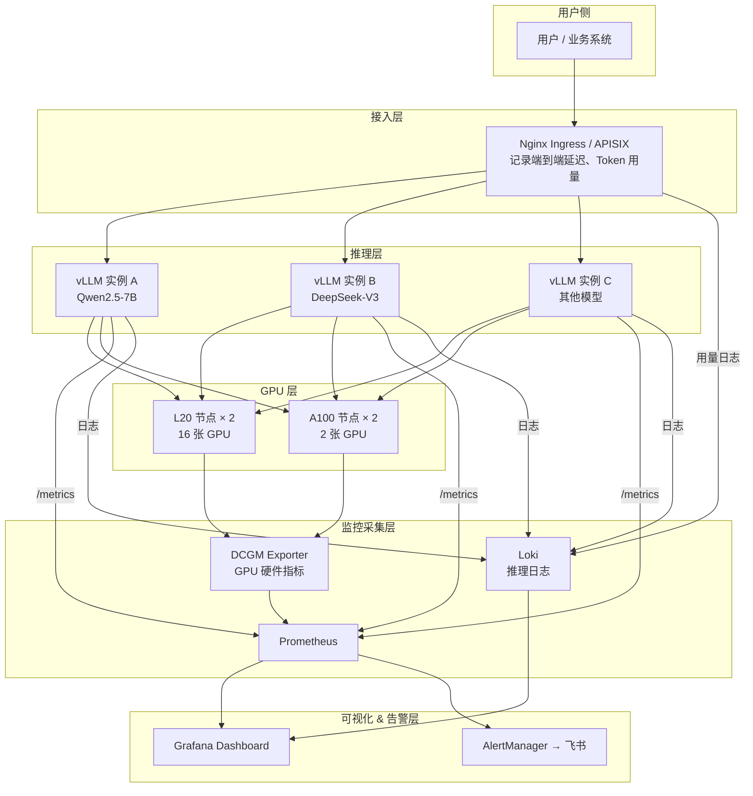
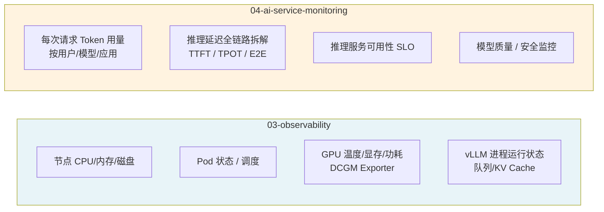
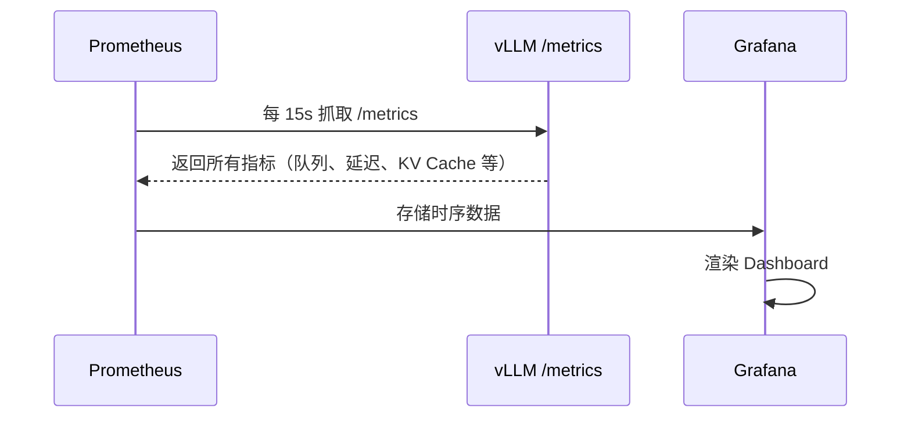
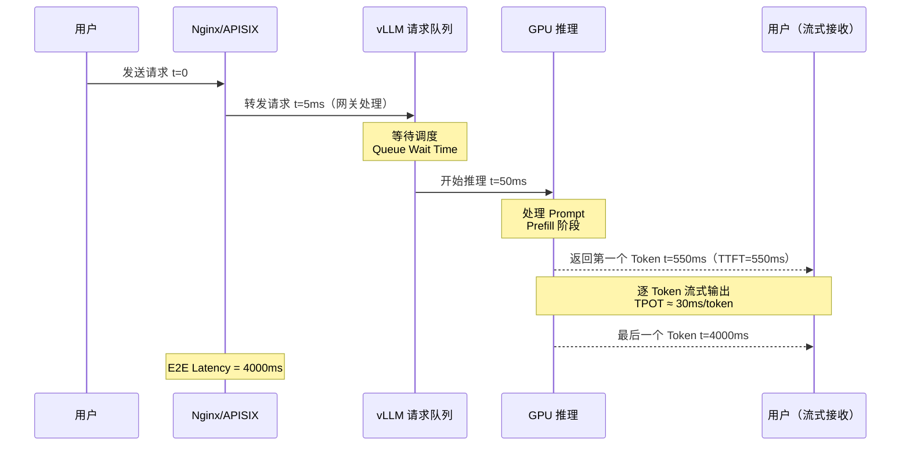
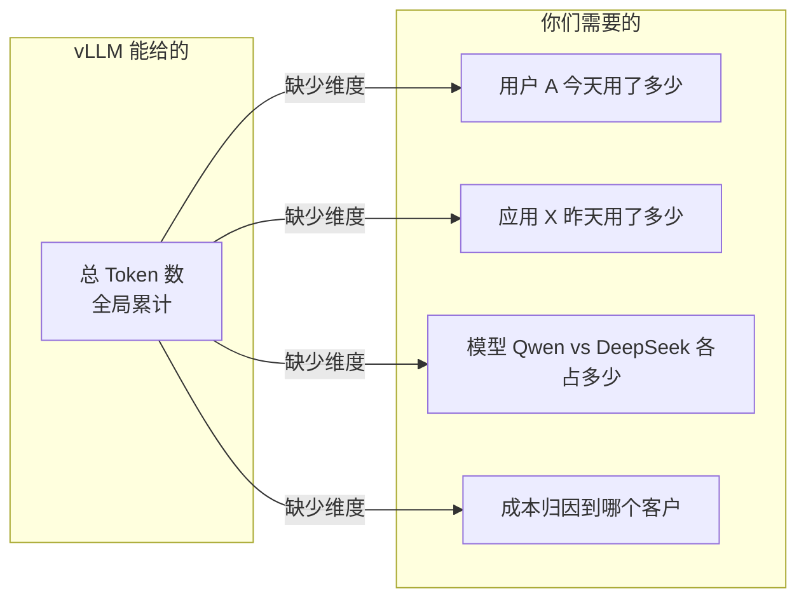
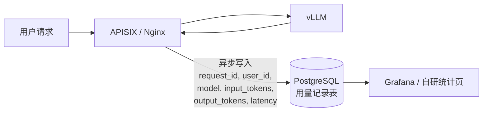
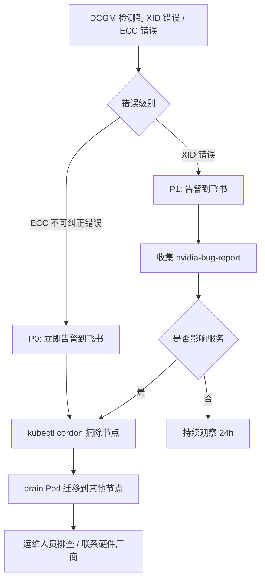
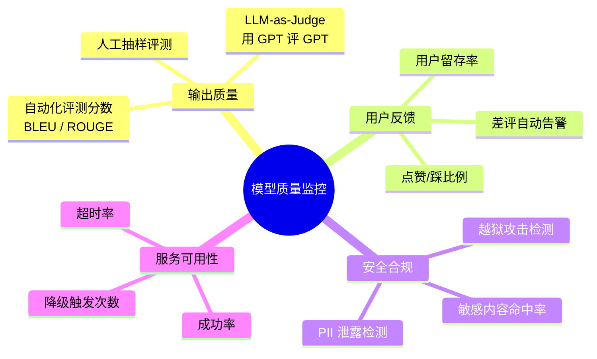

# AI 服务专项监控

> 本模块专注于 AI 推理服务的**业务层监控**，和 03-observability 的基础设施监控互补，共同构成完整的可观测性体系。

---

## 为什么 AI 服务需要专项监控？

传统 Web 服务监控关注 QPS、错误率、P99 延迟，这些指标对 AI 推理服务同样适用，但远远不够。AI 推理服务有以下独特性：

| 特点 | 传统服务 | AI 推理服务 |
|---|---|---|
| 响应时间 | 毫秒级，短 | 秒到分钟级，且是流式输出 |
| 资源消耗 | CPU/内存 | GPU 显存是核心瓶颈 |
| 计量单位 | 请求次数 | Token 数（输入 + 输出）|
| 队列特性 | 并发高峰会排队 | KV Cache 满了会把请求"换出"到 CPU |
| 质量维度 | 状态码 200/500 | 回答是否准确、是否有害内容 |

因此，需要在通用监控之上，建立一套针对 AI 推理的**专项指标体系**。

---

## 监控架构总览



**两层监控的分工：**



> 简单记忆：03 关心"服务是否在跑"，04 关心"服务跑得好不好、用了多少"。

---

## 建设目标

基于当前现状（vLLM 已在生产运行，但无任何 AI 专项监控），分阶段建设：

| 阶段 | 目标 | 工作量 |
|---|---|---|
| **Phase 1（立即）** | vLLM 推理指标接入 Prometheus，看到队列/延迟/KV Cache | 低：加一条 scrape 配置 |
| **Phase 2（近期）** | 推理延迟告警规则 + Grafana Dashboard | 中：建面板 + 告警规则 |
| **Phase 3（中期）** | Token 用量统计，支持按用户/模型维度分析 | 高：需要网关层改造 |
| **Phase 4（后期）** | 模型质量监控，SLO 体系 | 高：需要业务侧配合 |

---

## 1. 推理引擎指标监控（vLLM 原生支持，零改造）

### vLLM 指标采集原理

vLLM 启动后默认在 `:8000/metrics` 暴露 Prometheus 格式指标，**不需要任何插件或额外开发**。



### 立即接入（仅需在 Prometheus 添加）

```yaml
# prometheus.yml 中添加 scrape job
scrape_configs:
  - job_name: vllm-inference
    scrape_interval: 15s
    static_configs:
      - targets:
          - "vllm-qwen25-7b.ai-infra.svc:8000"    # 按实际服务地址填写
          - "vllm-deepseek.ai-infra.svc:8000"
        labels:
          env: prod
    metrics_path: /metrics
```

验证采集是否成功：
```bash
curl http://<vllm-host>:8000/metrics | grep "^vllm:"
```

### vLLM 全量指标说明

**推理性能：**

| 指标名 | 类型 | 含义 | 告警建议 |
|---|---|---|---|
| `vllm:time_to_first_token_seconds` | Histogram | 首 Token 延迟（TTFT）| P99 > 3s 告警 |
| `vllm:time_per_output_token_seconds` | Histogram | 每个输出 Token 耗时（流速）| P99 > 300ms 告警 |
| `vllm:e2e_request_latency_seconds` | Histogram | 端到端请求总延迟 | 按 SLO 定 |
| `vllm:generation_tokens_total` | Counter | 累计生成 Token 数 | 用于吞吐量计算 |
| `vllm:prompt_tokens_total` | Counter | 累计 Prompt Token 数 | 用于成本估算 |

**并发与队列：**

| 指标名 | 类型 | 含义 | 告警建议 |
|---|---|---|---|
| `vllm:num_requests_running` | Gauge | 当前正在推理的请求数 | 超并发上限 |
| `vllm:num_requests_waiting` | Gauge | 队列中排队请求数 | > 20 关注，> 100 告警 |
| `vllm:num_requests_swapped` | Gauge | 被换出到 CPU 内存的请求数 | **> 0 即告警**（显存严重不足）|

**GPU KV Cache：**

| 指标名 | 类型 | 含义 | 告警建议 |
|---|---|---|---|
| `vllm:gpu_cache_usage_perc` | Gauge | GPU KV Cache 使用率（0~1）| > 0.90 告警 |
| `vllm:cpu_cache_usage_perc` | Gauge | CPU KV Cache 使用率 | > 0.5 告警（说明 GPU Cache 已满）|
| `vllm:gpu_cache_hits_total` | Counter | Prefix Cache 命中次数 | 越高越好 |

### Prometheus 告警规则

```yaml
groups:
  - name: vllm-alerts
    rules:
      # TTFT 过高（用户感知最直接的延迟）
      - alert: VllmTTFTHigh
        expr: histogram_quantile(0.99, rate(vllm:time_to_first_token_seconds_bucket[5m])) > 3
        for: 3m
        labels:
          severity: warning
        annotations:
          summary: "vLLM 首 Token 延迟过高（P99 > 3s）"
          description: "实例 {{ $labels.instance }} 的 P99 TTFT = {{ $value | humanizeDuration }}"

      # 请求积压
      - alert: VllmQueueBacklog
        expr: vllm:num_requests_waiting > 50
        for: 2m
        labels:
          severity: warning
        annotations:
          summary: "vLLM 请求队列积压 {{ $value }} 个"

      # KV Cache 即将耗尽（触发则会把请求换出到 CPU，延迟剧增）
      - alert: VllmKVCacheCritical
        expr: vllm:gpu_cache_usage_perc > 0.92
        for: 1m
        labels:
          severity: critical
        annotations:
          summary: "vLLM GPU KV Cache 使用率 {{ $value | humanizePercentage }}，即将耗尽"

      # 请求被换出到 CPU（体验严重劣化）
      - alert: VllmRequestSwapped
        expr: vllm:num_requests_swapped > 0
        for: 1m
        labels:
          severity: warning
        annotations:
          summary: "有 {{ $value }} 个请求被换出到 CPU，GPU 显存不足"
```

### Grafana Dashboard

社区官方 Dashboard，直接导入无需手建面板：

```
Grafana → Import → Dashboard ID: 21766
```

---

## 2. 推理延迟全链路拆解

### 一次请求的完整延迟路径



### 各阶段延迟含义

| 阶段 | 指标名 | 影响因素 | 优化方向 |
|---|---|---|---|
| 网关处理 | 网关自身延迟 | 鉴权/限流逻辑 | 轻量化鉴权 |
| 排队等待 | `num_requests_waiting` | 并发量 vs 吞吐能力 | 扩容 / 增加实例 |
| Prefill（处理 Prompt）| TTFT 的主要部分 | Prompt 长度、GPU 算力 | 缩短 Prompt、Chunked Prefill |
| Decode（生成 Token）| TPOT | 模型大小、批大小 | 张量并行、量化 |

### 不同场景的延迟目标

| 使用场景 | TTFT 目标 | E2E 目标 | 说明 |
|---|---|---|---|
| 实时对话 | < 500ms | < 10s（256 token）| 用户实时感知 |
| 文档分析 | < 2s | < 60s | 长文本，可以接受 |
| 批量处理 | 不关注 | 吞吐优先 | 离线任务 |
| API 调用（第三方）| < 1s | 按合同 SLO | 有 SLA 承诺 |

---

## 3. Token 用量统计（需要网关层改造）

### 为什么 vLLM 采集到的不够用？

vLLM 的 `prompt_tokens_total` 和 `generation_tokens_total` 是**全局累计值**，无法区分是哪个用户、哪个应用在用。



**解决方案：在 APISIX/Nginx 层拦截记录每次请求的元数据。**

### 用量采集架构



### 用量记录表结构

```sql
CREATE TABLE ai_usage_records (
    id              BIGSERIAL PRIMARY KEY,
    request_id      VARCHAR(64) NOT NULL,
    user_id         VARCHAR(64),           -- 用户标识
    app_id          VARCHAR(64),           -- 应用/产品
    model           VARCHAR(64) NOT NULL,  -- 模型名称
    input_tokens    INTEGER NOT NULL,
    output_tokens   INTEGER NOT NULL,
    latency_ms      INTEGER,
    status          VARCHAR(16),           -- success / error / timeout
    error_code      VARCHAR(32),
    created_at      TIMESTAMPTZ DEFAULT NOW()
);

-- 查询某用户今日用量
SELECT user_id,
       SUM(input_tokens + output_tokens) AS total_tokens,
       COUNT(*) AS request_count
FROM ai_usage_records
WHERE created_at >= CURRENT_DATE
GROUP BY user_id
ORDER BY total_tokens DESC;
```

### APISIX 插件方式记录用量

```lua
-- APISIX 自定义插件（log-ai-usage）
local function log_usage(conf, ctx)
    local response_body = ctx.var.response_body
    -- 从 vLLM 响应中解析 usage 字段
    local usage = cjson.decode(response_body).usage
    if usage then
        local record = {
            request_id   = ctx.var.request_id,
            user_id      = ctx.var.consumer_name,
            app_id       = ctx.var.app_id,
            model        = conf.model_name,
            input_tokens = usage.prompt_tokens,
            output_tokens = usage.completion_tokens,
            latency_ms   = ctx.var.upstream_response_time * 1000,
            status       = ctx.var.status == 200 and "success" or "error",
        }
        -- 异步写入，不影响响应
        ngx.timer.at(0, write_to_db, record)
    end
end
```

---

## 4. GPU 硬件监控（与 03-observability 共享）

> GPU 硬件指标由 DCGM Exporter 采集，统一存入 Prometheus，本模块和 03-observability 共用同一数据源，只是面向 AI 服务的 Dashboard 视角不同。

### GPU 关键指标

| 指标（DCGM）| 含义 | 告警阈值 |
|---|---|---|
| `DCGM_FI_DEV_GPU_UTIL` | GPU 算力利用率 | < 10% 持续 30min → 资源浪费 |
| `DCGM_FI_DEV_FB_USED` | GPU 显存使用量 | > 90% → P1 告警 |
| `DCGM_FI_DEV_GPU_TEMP` | GPU 温度 | L20 > 80°C，A100 > 85°C → P1 |
| `DCGM_FI_DEV_POWER_USAGE` | GPU 功耗（W）| 接近 TDP → P2 关注 |
| `DCGM_FI_DEV_XID_ERRORS` | NVIDIA XID 错误 | 任何出现 → P1 立即排查 |
| `DCGM_FI_DEV_ECC_DBE_VOL_TOTAL` | 不可纠正的 ECC 错误 | > 0 → P0，立即摘除节点 |

### GPU 故障处理流程



---

## 5. 模型质量监控（后期建设）

> 当前阶段可以不做，但需要了解有哪些手段，未来客户有 SLA 要求时可以快速落地。

### 可监控的质量维度



### 用户反馈采集（最简单的质量指标）

```python
# 在 AI 服务 API 中加入反馈端点
@app.post("/v1/feedback")
async def collect_feedback(
    request_id: str,
    score: int,      # 1=好，-1=差，0=中性
    comment: str = ""
):
    # 写入 feedback 表，关联 request_id
    await db.execute("""
        INSERT INTO ai_feedback (request_id, score, comment, created_at)
        VALUES ($1, $2, $3, NOW())
    """, request_id, score, comment)

    # 差评自动触发告警（score == -1 且累计超阈值）
    if score == -1:
        await check_negative_rate_alert()
```

---

## 工具选型

| 工具 | 用途 | 现状 |
|---|---|---|
| Prometheus | 采集 vLLM 指标、DCGM 指标 | 已有，加 scrape 配置即可 |
| Grafana | 推理监控 Dashboard | 已有，导入 ID 21766 |
| DCGM Exporter | GPU 硬件指标采集 | 待安装（见 02-ai-infra README）|
| nvidia-gpu-exporter | 宿主机进程级 GPU 显存监控 | 按需安装（针对非容器进程）|
| PostgreSQL | 用量记录存储 | 已有（产品已在用）|
| APISIX / Nginx | Token 用量拦截记录 | 已有网关，需开发插件 |

---

## 6. 不同部署方式的监控覆盖说明

> 你们生产环境目前 K8s Pod、Docker 容器、宿主机直跑三种方式并存，监控接入方式各不相同。

### 三种部署方式的监控能力对比

| 进程类型 | 推理指标（vLLM）| GPU 硬件（DCGM）| 容器显存归因（HAMI）|
|---|---|---|---|
| **K8s Pod + HAMI + vLLM** | ✅ ServiceMonitor 自动发现 | ✅ | ✅ 每 Pod 各自用量 |
| **Docker + vLLM** | ✅ 手动加 static_configs | ✅ | ❌ |
| **宿主机直跑 vLLM** | ✅ 手动加 static_configs | ✅ | ❌ |
| **宿主机直跑 Python 脚本** | ❌ 无 /metrics | ✅（只有硬件总量）| ❌ |

HAMI 是 K8s Device Plugin，**只在 K8s 环境下生效**，Docker 和宿主机进程均不受 HAMI 管控，也无法通过 HAMI 做显存隔离或监控。

> 💡 DCGM 和 HAMI 的指标差值 = 宿主机裸进程消耗的 GPU 显存（不受管控部分）

### 方案一：宿主机 / Docker 跑 vLLM（零改造）

vLLM 不论以何种方式运行，都默认在 `:8000/metrics` 暴露指标。只需确保 vLLM 启动时监听 `0.0.0.0`（非 `127.0.0.1`），然后在 Prometheus 加静态配置：

```bash
# 确认 vLLM 是否监听外部
ss -tlnp | grep 8000
# 如果只有 127.0.0.1:8000，需要重启时加 --host 0.0.0.0
```

```yaml
# prometheus.yml
scrape_configs:
  - job_name: vllm-bare-metal
    static_configs:
      - targets:
          - "192.168.11.50:8000"    # llm-l20-20250909 宿主机 IP
          - "192.168.0.248:8000"    # iz2ze8fusva2xt3sjsi0ywz（A100 节点）
        labels:
          env: prod
          deploy_type: bare-metal
```

接入后可采集全量 vLLM 推理指标（TTFT、队列、KV Cache 等），和 K8s 部署完全一致。

### 方案二：宿主机跑非 vLLM 的 Python 推理脚本

对于无 `/metrics` 端点的裸进程，用 `nvidia-gpu-exporter` 拿到进程级 GPU 显存归因：

```bash
# 下载单二进制，无依赖
wget https://github.com/utkuozdemir/nvidia_gpu_exporter/releases/latest/download/nvidia_gpu_exporter_linux_amd64
chmod +x nvidia_gpu_exporter_linux_amd64

# 后台启动（默认端口 9835）
nohup ./nvidia_gpu_exporter_linux_amd64 --port 9835 &

# 验证
curl http://localhost:9835/metrics | grep nvidia_smi_memory
```

采集后可按进程名看每张卡的显存分布：

```promql
# 按进程名聚合各节点 GPU 显存用量
sum by (process_name, instance) (
  nvidia_smi_memory_used_bytes
)
```

```yaml
# prometheus.yml 添加
- job_name: nvidia-process
  static_configs:
    - targets:
        - "192.168.11.50:9835"
        - "192.168.0.248:9835"
      labels:
        env: prod
```

### 方案三：自有推理代码主动上报（需改代码）

如果是团队自己维护的推理脚本，几行代码即可把任意业务指标推给 Prometheus：

```python
from prometheus_client import start_http_server, Gauge, Counter, Histogram
import time

# 定义指标
inference_latency = Histogram(
    'custom_inference_latency_seconds',
    '推理延迟',
    ['model', 'node'],
    buckets=[0.1, 0.5, 1.0, 2.0, 5.0, 10.0]
)
inference_requests = Counter('custom_inference_requests_total', '推理请求总数', ['model', 'status'])
gpu_memory_used = Gauge('custom_gpu_memory_used_mb', '自报显存使用', ['model'])

# 启动 metrics HTTP server（暴露 /metrics 端点）
start_http_server(9100)

# 推理循环中埋点
while True:
    with inference_latency.labels(model="qwen-7b", node="llm-l20").time():
        result = model.generate(prompt)
    inference_requests.labels(model="qwen-7b", status="success").inc()
```

---

## 当前可观测性覆盖度

```mermaid
graph LR
    subgraph 已覆盖 ✅
        A[节点基础监控<br/>Zabbix]
        B[中间件状态<br/>Zabbix]
    end

    subgraph 加一行配置即可 🟡
        C[K8s vLLM 推理指标<br/>Prometheus ServiceMonitor]
        D[Docker/宿主机 vLLM 指标<br/>static_configs]
        E[GPU 硬件指标<br/>安装 DCGM Exporter]
        F[宿主机进程级显存<br/>安装 nvidia-gpu-exporter]
    end

    subgraph 需要开发 🔴
        G[Token 用量统计<br/>网关插件]
        H[用户维度分析<br/>用量记录表]
        I[模型质量监控<br/>反馈系统]
    end
```

---

## 关键指标 SLO 参考

| 指标 | 当前 | 目标 |
|---|---|---|
| vLLM TTFT P99 | 未监控 | < 2s（对话场景）|
| vLLM 请求成功率 | 未监控 | > 99.5% |
| GPU KV Cache 使用率 | 未监控 | 告警阈值 90% |
| Token 用量统计延迟 | 无 | < 1min（准实时）|
| GPU 故障摘除时间 | 手动 | < 5min（自动化）|
