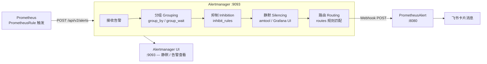
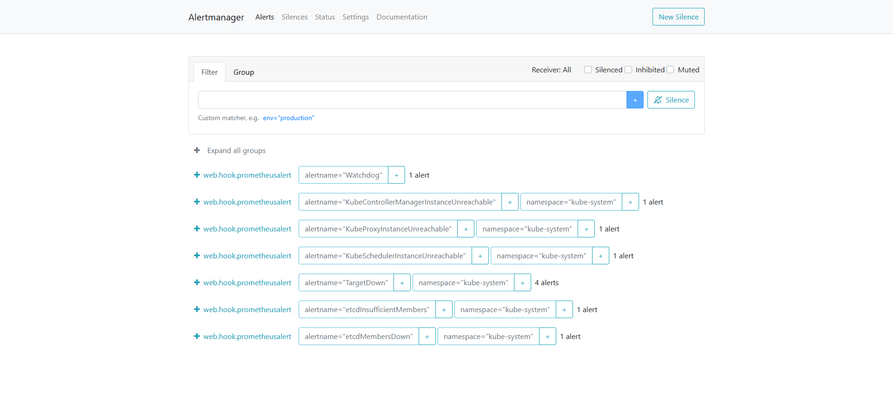

# Alertmanager — 告警路由、分组与静默引擎

**更新日期：** 2026年06月04日
**信息来源：** 官方文档、GitHub 仓库、用户实测记录
**参考地址：**

1. GitHub：[prometheus/alertmanager](https://github.com/prometheus/alertmanager)（~8.5k stars）
2. 官方文档：[Alertmanager Docs](https://prometheus.io/docs/alerting/latest/alertmanager/)
3. 配置参考：[alertmanager-configuration](https://prometheus.io/docs/alerting/latest/configuration/)

> Star 数会持续变化。正式对外汇报前建议以 GitHub 实时数据复核。

---

## 1. 结论摘要

Alertmanager 是 Prometheus 生态官方的告警管理组件，负责接收 Prometheus 触发的告警，并对其执行**分组（Grouping）、抑制（Inhibition）、静默（Silencing）**后路由到目标通知渠道。它是 CNCF Graduated 项目，随 kube-prometheus-stack 一起部署，零额外成本。

在本项目中，Alertmanager 是告警链路中的**路由决策层**：判断告警该发给谁、发多频繁、是否被抑制，然后将告警 POST 给 PrometheusAlert，由后者完成飞书卡片渲染。

| 关键信息 | 值 |
| --- | --- |
| 端口 | `9093`（ClusterIP，集群内访问） |
| 集群内地址 | `alertmanager-operated.monitoring.svc.cluster.local:9093` |
| 命名空间 | `monitoring` |
| 部署方式 | kube-prometheus-stack 内置 |
| 当前 Receiver | `web.hook.prometheusalert`（→ PrometheusAlert） |
| group_wait | `10m` |
| repeat_interval | `10m` |

---

## 2. 产品概况

| 项目 | 内容 |
| --- | --- |
| 产品名称 | Alertmanager |
| 开发者 | Prometheus Authors（CNCF） |
| CNCF 状态 | ✅ Graduated（随 Prometheus 一起毕业） |
| 开源协议 | Apache-2.0 |
| 部署形态 | 独立进程 / Docker / K8s StatefulSet |
| 当前版本 | kube-prometheus-stack v86.0.0 内置版本 |
| 核心职责 | 告警分组、路由、抑制、静默；不负责渲染通知格式 |
| 配套组件 | Prometheus（上游告警源）、PrometheusAlert（下游通知渲染） |

---

## 3. 产品定位与典型场景

| 场景 | Alertmanager 解决的问题 | 价值 |
| --- | --- | --- |
| 告警风暴防护 | 同一问题触发数十条告警 | `group_by` + `group_wait` 将同组告警合并为一条 |
| 告警抑制 | 节点宕机时 Pod 级告警无意义 | `inhibit_rules` 让 critical 自动抑制 warning/info |
| 维护窗口静默 | 发布期间不希望收到告警 | `amtool silence` 或 Grafana UI 创建静默规则 |
| 多团队路由 | GPU 告警给 AI 团队，中间件告警给后端团队 | `routes` 按标签精确匹配，分发到不同 Receiver |
| 恢复通知 | 告警恢复后自动通知 | `send_resolved: true` |

---

## 4. 技术架构



| 阶段 | 说明 |
| --- | --- |
| 分组（Grouping） | 将具有相同标签集（`group_by`）的告警合并，`group_wait` 内的告警汇聚后一次性发出 |
| 抑制（Inhibition） | `inhibit_rules` 定义"source 告警存在时，压制 target 告警"；用于父子故障去噪 |
| 静默（Silencing） | 手动创建时间窗口，匹配的告警在窗口期内不发送通知 |
| 路由（Routing） | 树形 `routes` 结构，按标签匹配决定使用哪个 Receiver |

---

## 5. 部署

Alertmanager 随 kube-prometheus-stack 自动部署，无需单独安装。配置通过 `prom-values.yaml` 中的 `alertmanager.config` 传入。

### 5.1 当前生效的 prom-values.yaml 配置

```yaml
alertmanager:
  config:
    global:
      resolve_timeout: 5m
    route:
      group_by: ['alertname', 'namespace']
      group_wait: 10m
      group_interval: 5s
      repeat_interval: 10m
      receiver: web.hook.prometheusalert
    receivers:
      - name: web.hook.prometheusalert
        webhook_configs:
          - url: >-
              http://prometheus-alert-center.default.svc.cluster.local:8080/prometheusalert?type=fs&tpl=prometheus-fs&fsurl=https://open.feishu.cn/open-apis/bot/v2/hook/90f43268-45ff-4016-8a0f-8ab52898b89c
            send_resolved: true
    inhibit_rules:
      - source_matchers:
          - 'severity = critical'
        target_matchers:
          - 'severity =~ warning|info'
        equal: ['namespace', 'alertname']
      - source_matchers:
          - 'severity = warning'
        target_matchers:
          - 'severity = info'
        equal: ['namespace', 'alertname']
      - source_matchers:
          - 'alertname = InfoInhibitor'
        target_matchers:
          - 'severity = info'
        equal: ['namespace']
```

### 5.2 应用配置变更

```bash
# 修改 prom-values.yaml 后执行 Helm 升级
helm upgrade --install prometheus kube-prometheus-stack-86.0.0.tgz -f prom-values.yaml --namespace monitoring
```

---

## 6. 访问与验证

### 6.1 Alertmanager UI

Alertmanager 默认以 ClusterIP 暴露，集群内可访问：

```bash
# 临时端口转发（本地调试）
kubectl port-forward -n monitoring svc/prometheus-kube-prometheus-alertmanager 9093:9093
# 然后访问 http://localhost:9093


kubectl patch svc prometheus-kube-prometheus-alertmanager -n monitoring \
  -p '{"spec": {"type": "NodePort", "ports": [{"port": 9093, "targetPort": 9093, "nodePort": 30093}]}}'

# 浏览器访问
open http://localhost:9093
```

在 UI 中可查看：当前活跃告警、已分组状态、静默规则列表、抑制规则。


### 6.2 验证告警链路

```bash
# 查看 Alertmanager 接收到的所有活跃告警
kubectl exec -n monitoring \
  $(kubectl get pod -n monitoring -l "app.kubernetes.io/name=alertmanager" -o name | head -1) \
  -- amtool alert --alertmanager.url=http://localhost:9093

# 查看当前生效的路由配置
kubectl exec -n monitoring \
  $(kubectl get pod -n monitoring -l "app.kubernetes.io/name=alertmanager" -o name | head -1) \
  -- amtool config routes --alertmanager.url=http://localhost:9093
```

### 6.3 Watchdog 告警

kube-prometheus-stack 默认开启名为 `Watchdog` 的"心跳告警"（始终处于 firing 状态），用于验证告警链路端到端畅通。若飞书群中持续收到 Watchdog resolved/firing 消息，说明链路正常。可通过 `inhibit_rules` 静默 Watchdog 以减少噪音，详见 [Prometheus.md FAQ](Prometheus.md)。

---

## 7. 路由配置详解

### 7.1 分组参数速查

| 参数 | 作用 | 本项目当前值 | 推荐说明 |
| --- | --- | --- | --- |
| `group_by` | 按哪些标签合并告警 | `['alertname', 'namespace']` | 生产可加 `cluster` |
| `group_wait` | 等待同组告警汇聚的时间 | `10m` | 控制首次通知延迟 |
| `group_interval` | 同组已发送后，新告警加入再等待时间 | `5s` | 设置过小会导致频繁通知 |
| `repeat_interval` | 同一已发送告警的重复通知间隔 | `10m` | 生产建议 `4h` 以上 |

### 7.2 多级路由示例

```yaml
route:
  group_by: ['alertname', 'namespace']
  group_wait: 30s
  repeat_interval: 4h
  receiver: default-feishu       # 兜底 Receiver

  routes:
    # P0 级告警：立即通知，重复间隔短
    - matchers:
        - severity="critical"
      receiver: oncall-feishu
      group_wait: 10s
      repeat_interval: 30m
      continue: false             # 不继续匹配下级路由

    # GPU 告警路由到 AI 运维群
    - matchers:
        - alertname=~"DCGM.*|VLLM.*|HAMI.*"
      receiver: gpu-feishu

receivers:
  - name: default-feishu
    webhook_configs:
      - url: "http://prometheus-alert-center.default.svc.cluster.local:8080/prometheusalert?type=fs&tpl=prometheus-fs&fsurl=<默认群token>"
        send_resolved: true
  - name: oncall-feishu
    webhook_configs:
      - url: "http://prometheus-alert-center.default.svc.cluster.local:8080/prometheusalert?type=fs&tpl=prometheus-fs&fsurl=<oncall群token>&at_user_id=<值班人open_id>"
        send_resolved: true
  - name: gpu-feishu
    webhook_configs:
      - url: "http://prometheus-alert-center.default.svc.cluster.local:8080/prometheusalert?type=fs&tpl=prometheus-fs&fsurl=<gpu群token>"
        send_resolved: true
```

### 7.3 抑制规则（inhibit_rules）

抑制规则用于"父故障发生时，屏蔽子故障的通知"，避免节点宕机时收到几十条 Pod 级别告警。

```yaml
inhibit_rules:
  # critical 抑制同 namespace+alertname 下的 warning 和 info
  - source_matchers:
      - severity="critical"
    target_matchers:
      - severity=~"warning|info"
    equal: [namespace, alertname]

  # warning 抑制同 namespace+alertname 下的 info
  - source_matchers:
      - severity="warning"
    target_matchers:
      - severity="info"
    equal: [namespace, alertname]
```

---

## 8. 告警分级规范

与 [10-SRE 稳定性工程/02-告警体系](../../10-SRE%E7%A8%B3%E5%AE%9A%E6%80%A7%E5%B7%A5%E7%A8%8B/02-告警体系/) 保持一致。

| 级别 | `severity` 标签值 | 响应时间 | 通知方式 | Alertmanager 配置要点 |
| --- | --- | --- | --- | --- |
| P0 | `critical` | 5 分钟内 | 飞书 @OnCall + 电话 | `repeat_interval: 30m`，专用 receiver |
| P1 | `warning` | 30 分钟内 | 飞书 @OnCall | `repeat_interval: 2h` |
| P2 | `info` | 工作时间 | 飞书通知（不 @） | `repeat_interval: 8h`，可合并到日报 |

---

## 9. 静默操作

### 9.1 amtool CLI

```bash
# 创建静默（维护窗口期间屏蔽 prod namespace 所有告警，持续 2 小时）
amtool --alertmanager.url=http://localhost:9093 silence add \
  --author="ops-zhangsan" \
  --comment="prod 发布维护窗口" \
  --duration="2h" \
  namespace="prod"

# 查看所有静默规则
amtool --alertmanager.url=http://localhost:9093 silence query

# 删除静默
amtool --alertmanager.url=http://localhost:9093 silence expire <silence-id>
```

### 9.2 Grafana Alerting UI

Grafana → **Alerting → Silences** 提供图形化静默管理，支持按时间范围、标签匹配创建静默，操作比 CLI 更直观，推荐日常运维使用。

---

## 10. 常见问题

### 飞书收不到告警通知

**排查顺序：**
1. 检查 Alertmanager 是否收到告警：访问 `http://localhost:9093` UI 查看 Alerts 页面
2. 检查路由是否命中 Receiver：UI → Status → Config 查看路由树
3. 检查 PrometheusAlert 是否正常：`kubectl logs -l app=prometheus-alert-center`
4. 手动测试 PrometheusAlert Webhook（详见 [PrometheusAlertCenter.md](PrometheusAlertCenter.md) 第 6.3 节）

---

### 告警风暴（同时收到大量告警）

**原因：** `group_by` 标签粒度太细，或 `group_wait` 时间太短，同一故障触发的多条告警未被合并。

**解决：** 增加 `group_by` 维度（如加入 `alertname`、`namespace`），适当调大 `group_wait`（建议 30s～2m）。若告警本身规则有问题，参考 Prometheus.md 的 PrometheusRule 配置。

---

### 告警恢复后没有收到"已解决"通知

**原因：** Receiver 配置中 `send_resolved: false`（默认值）。

**解决：** 将对应 `webhook_configs` 中的 `send_resolved` 改为 `true`，并执行 Helm upgrade 生效。

---

### repeat_interval 太短，告警重复刷屏

当前配置 `repeat_interval: 10m` 对持续性告警会每 10 分钟发一次，容易刷屏。

**建议：** 生产环境建议将 `repeat_interval` 提升至 `4h`，配合 Grafana 仪表盘主动巡检代替高频推送。

---

## 11. 参考文档

1. [Alertmanager 官方文档](https://prometheus.io/docs/alerting/latest/alertmanager/)
2. [Alertmanager 配置参考](https://prometheus.io/docs/alerting/latest/configuration/)
3. [amtool 使用指南](https://github.com/prometheus/alertmanager#amtool)
4. [kube-prometheus-stack Alertmanager 配置示例](https://github.com/prometheus-community/helm-charts/blob/main/charts/kube-prometheus-stack/values.yaml)

---

