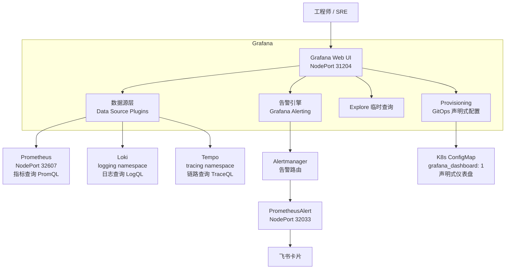
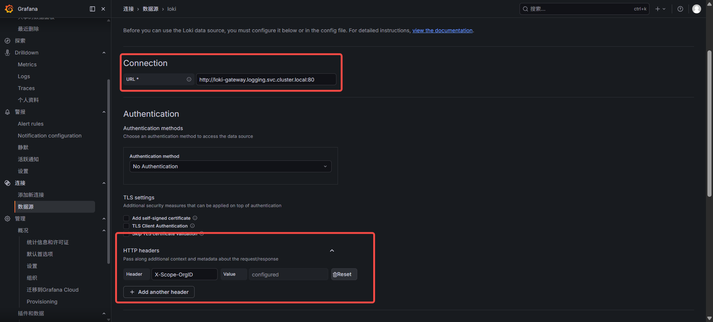
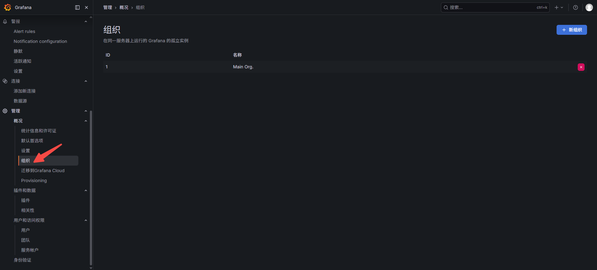
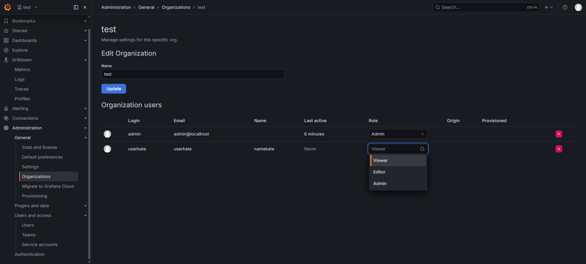
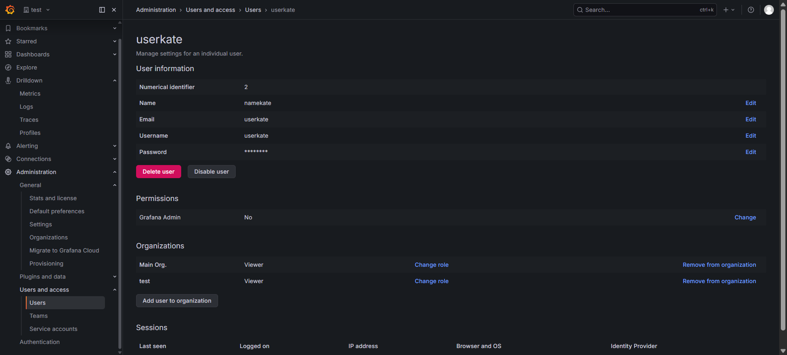
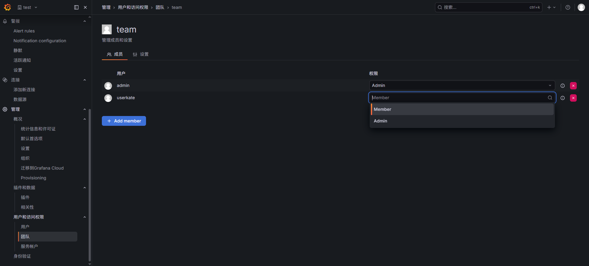
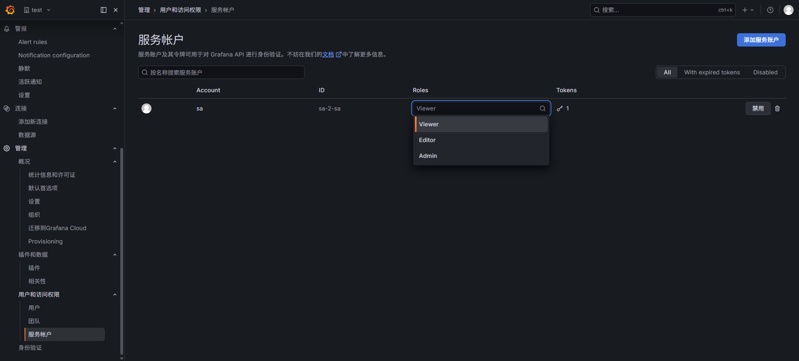

# Grafana — 统一可视化与告警平台

**更新日期：** 2026年06月04日
**信息来源：** 官方文档、GitHub 仓库、用户实测记录、社区实践
**参考地址：**

1. GitHub：[grafana/grafana](https://github.com/grafana/grafana)（74.1k stars）
2. 官方文档：[Grafana Docs](https://grafana.com/docs/grafana/latest/)
3. Dashboard 市场：[Grafana Dashboard Library](https://grafana.com/grafana/dashboards/)
4. Helm Chart（kube-prometheus-stack）：[prometheus-community/helm-charts](https://github.com/prometheus-community/helm-charts/tree/main/charts/kube-prometheus-stack)
5. 数据源插件列表：[Grafana Data Sources](https://grafana.com/docs/grafana/latest/datasources/)
6. 告警文档：[Grafana Alerting](https://grafana.com/docs/grafana/latest/alerting/)

> Star 数会持续变化。正式对外汇报前建议以 GitHub 实时数据复核。

---

## 1. 结论摘要

Grafana 是可观测性领域中可视化与告警的事实标准，核心价值是把来自 Prometheus、Loki、Tempo 等多个数据源的指标、日志和链路数据在同一面板中统一呈现，并提供内置告警引擎、模板变量、Explore 临时查询等能力，使问题排查从"多系统跳转"变成"单页面下钻"。

Grafana 在本项目中通过 kube-prometheus-stack Helm Chart 随 Prometheus 一起部署，是整个可观测性体系唯一的可视化入口。它本身不存储任何数据，所有查询实时转发给后端数据源（Prometheus / Loki / Tempo），这使得它的水平扩展和升级风险较低。

**对本项目的核心价值：** Grafana 在架构上是"只读展示层"，优先保证现有 9 张关键仪表盘（K8s / GPU / vLLM / 日志 / 中间件）正常工作，并在后期对接 Alertmanager → PrometheusAlert → 飞书的告警链路，实现告警从触发到推送的完整闭环。

---

## 2. 产品概况

| 项目 | 内容 |
| --- | --- |
| 产品名称 | Grafana |
| 产品定位 | 开源可观测性统一可视化与告警平台 |
| 主要形态 | Web UI + HTTP API + Provisioning（GitOps） |
| 开源协议 | AGPL-3.0（OSS 版）/ 商业版（Grafana Enterprise） |
| 目标用户 | 平台工程师、SRE、运维团队、业务监控负责人 |
| 典型场景 | 指标仪表盘、日志查询、链路追踪、告警管理、多租户可观测 |
| 部署方式 | Docker、Kubernetes（kube-prometheus-stack）、二进制、云托管（Grafana Cloud） |
| 当前版本 | 随 kube-prometheus-stack v86.0.0 集成部署 |
| 竞品 | Kibana（Elastic 生态）、Datadog（SaaS 商业）、Perses（CNCF 新兴）|

---

## 3. 产品定位与典型场景

| 场景 | Grafana 解决的问题 | 价值 |
| --- | --- | --- |
| 多数据源统一展示 | Prometheus 指标 / Loki 日志 / Tempo 追踪分散在不同系统 | 同一面板联动展示，日志行直接跳转链路追踪 |
| K8s 基础设施监控 | Pod / 节点 / Deployment 状态零散，难以全局把握 | 导入社区成熟仪表盘（ID 15760 / 1860），开箱即用 |
| AI 推理服务监控 | vLLM TTFT / TPOT / KV Cache 等 AI 特有指标无标准展示 | 官方提供 grafana.json，从 GitHub 直接导入 |
| GPU 资源监控 | DCGM Exporter 指标复杂，手写 PromQL 费时 | 导入 Dashboard 12239，覆盖利用率 / 温度 / 显存 |
| 告警规则管理 | Alertmanager 原生 UI 只能查看，不能编辑规则 | Grafana Alerting UI 可视化创建、编辑、静默告警规则 |
| 问题排查（Explore） | 线上告警后快速定位，PromQL / LogQL 临时查询 | 不需要写 Dashboard，在 Explore 页面直接拉取数据 |
| 飞书 SSO 统一登录 | 内部成员不想维护独立账号 | OAuth 对接飞书 OIDC，使用飞书账号登录 |

---

## 4. 技术架构



| 层级 | 说明 |
| --- | --- |
| Web UI 层 | 面板展示、告警配置、Explore 查询、插件管理，所有操作入口 |
| 数据源插件层 | 每种数据源对应一个插件，负责将用户的查询语句翻译为对应数据源的 HTTP API 请求 |
| 告警引擎层 | 内置统一告警，从 Panel 中提取 PromQL / LogQL 作为告警条件，并发送到 Alertmanager |
| Provisioning 层 | 通过 ConfigMap / YAML 文件声明数据源、仪表盘、告警规则，支持 GitOps 管理 |
| 存储层 | Grafana 自身使用 SQLite（默认）/ PostgreSQL 存储仪表盘配置、用户、组织等元数据，**不存储可观测数据** |

---

## 5. 部署

### 5.1 与 kube-prometheus-stack 集成部署

Grafana 不单独部署，随 kube-prometheus-stack Helm Chart 一起安装。Chart 内已包含 Grafana Deployment、Service、Ingress、默认仪表盘 ConfigMap 等资源。

```bash
# 在线安装
helm repo add prometheus-community https://prometheus-community.github.io/helm-charts
helm repo update
helm install kube-prometheus-stack prometheus-community/kube-prometheus-stack \
  -n monitoring --create-namespace \
  -f prom-values.yaml

# 离线安装（本项目实际方式）
helm pull prometheus-community/kube-prometheus-stack
helm install kube-prometheus-stack kube-prometheus-stack-<version>.tgz \
  -n monitoring --create-namespace \
  -f prom-values.yaml

# 升级
helm upgrade kube-prometheus-stack kube-prometheus-stack-<version>.tgz \
  -n monitoring \
  -f prom-values.yaml
```

### 5.2 当前生效的 prom-values.yaml 配置

```yaml
# 📊 2. 挂载 Grafana 数据卷并对齐国内镜像名字
grafana:
  persistence:
    enabled: true
    storageClassName: "local-path"
    size: 5Gi
  # 🌟🌟 核心修复参数：彻底关闭导致报错卡死的 initChownData 初始化容器 🌟🌟
  initChownData:
    enabled: false
  # 🌟🌟 辅助安全修复：确保 Grafana 进程不使用非特权高难度 ID 去强行读写本地卷
  securityContext: {}
  podSecurityContext: {}
  service:
    type: NodePort
    nodePort: 31204

```

### 5.3 镜像拉取（国内加速）

kube-prometheus-stack 中的 Grafana 镜像在国内可能拉取失败，可通过以下方式加速：

```bash
# 查看 Chart 使用的 Grafana 镜像版本
helm show values prometheus-community/kube-prometheus-stack | grep "grafana:" -A 5

# 通过 DaoCloud 加速拉取
crictl pull m.daocloud.io/docker.io/grafana/grafana:<version>

# 导入本地节点（离线环境）
ctr -n k8s.io images import grafana-<version>.tar
```

---

## 6. 访问与验证

### 6.1 访问地址

| 服务 | 地址 | 说明 |
|------|------|------|
| Grafana UI（外部访问） | `http://<NodeIP>:31204` | NodePort，集群外访问 |
| Grafana Service（集群内） | `prometheus-grafana.monitoring.svc:80` | 集群内部地址 |

### 6.2 获取管理员密码

```bash
# 方式一：从 K8s Secret 读取
kubectl get secret --namespace monitoring \
  -l app.kubernetes.io/component=admin-secret \
  -o jsonpath="{.items[0].data.admin-password}" | base64 --decode ; echo

# 方式二：端口转发本地调试
kubectl port-forward -n monitoring svc/prometheus-grafana 3000:80
# 浏览器访问 http://localhost:3000
```

### 6.3 已部署组件状态

```
# kubectl get all -n monitoring（节选 Grafana 相关）
NAME                                                       READY   STATUS    RESTARTS
pod/prometheus-grafana-<hash>                              3/3     Running   0

NAME                                        TYPE        CLUSTER-IP     PORT(S)
service/prometheus-grafana                  NodePort    10.x.x.x       80:31204/TCP
```

### 6.4 验证数据源连通性

1. Grafana UI → **Connections → Data Sources**
2. 点击每个数据源 → **Save & Test**
3. Prometheus 应返回 `Data source is working`
4. Loki 应返回 `Data source connected and labels found`
5. 如果 Loki 返回 401 / 无数据，检查 `X-Scope-OrgID` Header 是否配置为 `101`

---

## 7. 数据源集成

### 7.1 已配置的数据源

| 数据源 | 用途 | 集群内 URL | 备注 |
|--------|------|-----------|------|
| Prometheus | 指标查询（PromQL） | `http://prometheus-kube-prometheus-prometheus.monitoring.svc:9090` | 默认数据源 |
| Loki | 日志查询（LogQL） | `http://loki-gateway.logging.svc.cluster.local:80` | 需加 `X-Scope-OrgID: 101` Header |
| Tempo | 链路追踪（TraceQL） | `http://tempo.tracing.svc:3200` | 支持从 Loki 日志直接跳转 |

### 7.2 配置 Loki 数据源（多租户场景）

Alloy 写入 Loki 时使用了租户 ID `101`（在 `loki.write` 中配置 `X-Scope-OrgID: 101` Header），因此 Grafana 查询 Loki 时也必须带上同样的租户头，否则返回空结果或 401。

**UI 配置路径：** Connections → Data Sources → Loki → HTTP Headers → 添加 `X-Scope-OrgID: 101`

```
# Alloy River 配置中的租户来源（参考）
loki.write "default" {
    endpoint {
        url = "http://loki-gateway.logging.svc.cluster.local:80/loki/api/v1/push"
        headers = { "X-Scope-OrgID" = "101" }
    }
}
```



### 7.3 Loki 多租户管理

#### 租户 ID 是什么？和用户账号有什么区别？

Loki 的租户 ID（`X-Scope-OrgID`）**不是用户名和密码**，它只是一个你自己随意定义的字符串标签，用于在 Loki 内部对日志数据做物理隔离分区。

| 对比项 | Loki 租户 ID | 普通用户账号 |
| --- | --- | --- |
| 本质 | 数据分区标签（任意字符串） | 身份凭证（用户名 + 密码） |
| 谁来校验 | Loki 只检查 Header 是否存在，不校验值是否"正确" | 认证系统校验密码哈希 |
| 怎么创建 | 不需要创建，写 Header 时直接生效 | 需要在用户系统中注册 |
| 示例值 | `101`、`prod`、`team-ai`（随便写） | `alice` + `password123` |
| 安全性 | 本身无认证，需在网关层做鉴权 | 账号系统自带认证 |

**本项目中的 `101` 是怎么来的？**

完全是人为指定的。在配置 Alloy 写入 Loki 时，手动填了 `X-Scope-OrgID: 101`，Loki 就自动把这些日志存到了名为 `101` 的分区里。换成 `prod`、`smartvision`、任何字符串都可以，只要写入端和读取端保持一致即可。

**Loki 自己不做认证，那安全靠什么？**

Loki 把认证责任完全交给上层：
- **集群内部**（Alloy → Loki）：在 K8s 内网中访问，依赖网络隔离，不需要额外鉴权
- **外部访问**（Grafana → Loki）：Grafana 也在集群内，走 Service 内网地址，同样依赖网络隔离
- **如果需要严格鉴权**：在 Loki Gateway（Nginx）前面加 BasicAuth 或 mTLS，由网关做身份验证，通过后再透传租户 Header

> 简单理解：租户 ID 管的是"数据放在哪个箱子里"，不管"谁能来取数据"。后者需要另外的网关鉴权机制。

#### 那 A 租户怎么看不到 B 租户的数据？

这是两层机制叠加实现的，需要分开理解：

**第一层：Loki 存储隔离（数据层）**

Loki 在存储时以租户 ID 为 key 做物理分区。查询时，Loki 只返回与请求 Header 中 `X-Scope-OrgID` 一致的数据，不同租户的数据在底层存储桶/目录中就是隔开的。所以带 `101` 查询永远只能查出 `101` 的日志，这一点 Loki 自己保证。

**第二层：谁能伪造 Header？（访问控制层）**

问题在于：Loki 自己不验证"你有没有权限用这个租户 ID"，只要客户端发来什么 Header 就用什么查。所以"A 不能看 B"不是 Loki 保证的，而是靠以下两种方式之一来保证：

```
方式 ①：依赖 Grafana 的用户权限控制（本项目当前方式）

  用户 A (Grafana Viewer) ─→ 只能访问"Loki-生产(101)"数据源
  用户 B (Grafana Viewer) ─→ 只能访问"Loki-测试(102)"数据源
                              ↑
              Grafana 的数据源权限控制谁能看哪个数据源
              用户 A 根本看不到"Loki-测试(102)"这个数据源
              就算想改 Header 也没有 UI 入口
```

```
方式 ②：在 Loki Gateway 层强制覆写 Header（严格隔离方式）

  用户认证 ─→ Gateway(Nginx) ─→ 根据身份强制注入 X-Scope-OrgID ─→ Loki
                                  客户端发来的 Header 被忽略/覆写
                                  彻底杜绝伪造
```

**本项目用的是方式 ①**，依赖 Grafana 自身的数据源权限控制：
- Grafana 管理员按团队/角色配置哪些用户/组能看哪个 Loki 数据源
- 用户登录 Grafana 后看不到无权限的数据源，自然也无法查询其他租户的日志
- 适合内部团队场景，简单够用

方式 ② 适合对安全有更高要求的多客户 SaaS 场景，需要在 Loki Gateway 前做完整的认证鉴权系统。

---

#### 为什么不配置租户 ID 就无法添加数据源？

Loki 在启用多租户模式（`auth_enabled: true`，Helm 默认值）后，所有读写请求都必须携带 `X-Scope-OrgID` Header，否则 Loki Gateway 会返回 **400 no org id**，导致 Grafana 的 "Save & Test" 直接报错。

这不是 Grafana 的问题，而是 Loki 的强制要求：只要 `auth_enabled: true`，Header 就不能省略。

#### 两种模式对比

| 模式 | Loki 配置 | Grafana 数据源 | 适用场景 |
| --- | --- | --- | --- |
| **单租户模式（禁用多租户）** | `loki.auth_enabled: false` | 不需要配置 Header | 小团队、单集群、不需要数据隔离 |
| **多租户模式（默认）** | `loki.auth_enabled: true` | 每个租户对应一个数据源，固定 Header | 多团队/多环境日志隔离 |

#### 方案一：关闭多租户（最简单）

如果不需要数据隔离，直接在 Loki Helm values 中关闭多租户：

```yaml
# loki-values.yaml
loki:
  auth_enabled: false
```

关闭后，Grafana 数据源无需配置 `X-Scope-OrgID` Header，所有日志都在同一个默认租户下。

> ⚠️ 已经用租户 `101` 写入的日志，关闭后需要用 Header `X-Scope-OrgID: fake`（Loki 单租户模式的内置租户名）重新查询，旧数据不会自动迁移。

#### 方案二：多数据源（多租户推荐方式）

多租户时，每个租户在 Grafana 中配置一个独立的数据源，通过固定 Header 区分。这样不同团队登录 Grafana 后选择对应的数据源即可，数据天然隔离。

```
Loki 数据源 - 租户101（默认/生产）    → X-Scope-OrgID: 101
Loki 数据源 - 租户102（测试环境）      → X-Scope-OrgID: 102
Loki 数据源 - 租户103（AI推理服务）    → X-Scope-OrgID: 103
```

通过 Helm Values 批量预置多个 Loki 数据源：

```yaml
# prom-values.yaml
grafana:
  additionalDataSources:
    - name: Loki-生产(101)
      type: loki
      url: http://loki-gateway.logging.svc.cluster.local:80
      jsonData:
        httpHeaderName1: "X-Scope-OrgID"
      secureJsonData:
        httpHeaderValue1: "101"
    - name: Loki-测试(102)
      type: loki
      url: http://loki-gateway.logging.svc.cluster.local:80
      jsonData:
        httpHeaderName1: "X-Scope-OrgID"
      secureJsonData:
        httpHeaderValue1: "102"
```

#### 方案三：数据源变量（单数据源查多租户，进阶用法）

Grafana 支持通过 Dashboard 变量动态切换数据源。先按方案二配置多个 Loki 数据源，然后在 Dashboard 中创建 `datasource` 类型的变量：

1. Dashboard Settings → Variables → Add variable
2. Type 选 **Data source**，Data source type 选 **Loki**
3. 面板中所有数据源选择器改为 `$loki_datasource` 变量

这样同一个 Dashboard 可以通过顶部下拉切换查看不同租户的日志，而不需要为每个租户维护一套独立的 Dashboard。

#### 本项目当前状态

本项目目前只有一个租户 `101`，写入端（Alloy）和读取端（Grafana）统一使用该租户。如后续需要按环境（prod / staging / dev）隔离日志，建议：

1. Alloy 按不同环境配置不同的 `X-Scope-OrgID`（如 `prod=101`、`staging=102`）
2. Grafana 按方案二添加对应数据源，并配合 **第 8 章** 的 Organizations 把不同团队限制到对应 Org——每个 Org 只配置本团队的 Loki 数据源，数据隔离（Loki 租户）和访问控制（Grafana Org）两层同时生效
3. 社区仪表盘（如 Loki Dashboard 13639）建议使用方案三的变量方式导入一份即可

---

### 7.4 常用 LogQL 查询示例

```logql
# 查询 vLLM Pod 的 ERROR 日志
{namespace="prod", pod=~"vllm-.*"} |= "error"

# 查询特定服务的慢请求日志（按关键字过滤）
{namespace="prod", app="api-gateway"} | json | duration > 2s

# 统计各 namespace 的日志量趋势（Rate 查询）
sum by (namespace) (rate({cluster="smartvision"}[5m]))
```

---

## 8. 用户、团队与权限管理

Grafana 有一套内置的用户管理体系，与 Loki 租户隔离配合，共同构成完整的多租户访问控制链路。

### 8.1 用户（Users）

- 可在 Grafana 内创建本地账号，或通过 OAuth（飞书 SSO）让用户自动同步进来
- 每个用户有全局角色：`Admin`（管理员）/ `Editor`（可编辑面板）/ `Viewer`（只读）
- 管理入口：**Administration → Users**

### 8.2 团队（Teams）

- 可以创建 Team，把多个用户加入同一个 Team，统一分配 Dashboard 权限
- 比逐一授权用户效率更高，适合按部门或项目组管理
- 管理入口：**Administration → Teams**（左侧导航 → Administration）

### 8.3 服务账号（Service Account）

服务账号是给**机器/程序**用的身份，不是给人登录的，Grafana 9+ 版本推荐用它替代旧的 API Keys。

**典型用途：**
- CI/CD 流水线自动导入/更新 Dashboard
- 外部脚本定期查询告警状态
- IaC 工具（Terraform、Ansible）通过 API 配置数据源
- 第三方系统集成 Grafana（如从飞书告警卡片跳转时鉴权）

**使用方式：**
1. **Administration → Service Accounts → Add service account** 创建账号并分配角色（Viewer / Editor / Admin）
2. 进入该账号 → **Add service account token** 生成 Token
3. 外部程序在 HTTP 请求 Header 中带上：`Authorization: Bearer <token>`

**相比旧 API Keys 的优势：** 可集中管理多个 Token、设置有效期、随时吊销单个 Token 而不影响其他 Token。

### 8.4 数据源权限（OSS vs Enterprise）

| 能力 | Grafana OSS（开源版） | Grafana Enterprise（商业版） |
| --- | --- | --- |
| 数据源对所有登录用户可见 | ✅ 默认行为 | ✅ |
| 按用户/Team 限制单个数据源访问 | ❌ 不支持 | ✅ Permissions 标签页 |

> **注意：** 数据源细粒度权限（Permissions）是 Enterprise 功能。开源版中所有数据源对所有已登录用户可见，无法单独限制某个数据源只给特定用户。

### 8.5 Organizations（组织）—— OSS 完整隔离方案

Grafana OSS 提供 **Organizations** 机制实现跨团队的完整隔离——不同 Org 之间的用户、数据源、Dashboard 完全独立，互相看不到。

> ⚠️ **注意权限层级：** Organizations 是服务器级（Server Admin）功能，只有用安装时的 `admin` 超级账号登录才能看到和管理。普通 Org Admin 只能看到"用户 / 团队 / 服务帐户"三项，看不到 Organizations 入口。
>
> 访问路径：右上角头像 → **Server Admin → Organizations**，或直接访问 `http://<NodeIP>:31204/admin/orgs`

```
Org 1（生产团队）
  ├── 数据源：Loki-生产(101)、Prometheus
  ├── Dashboard：K8s 集群概览、vLLM 监控
  └── 用户：alice、bob

Org 2（测试团队）
  ├── 数据源：Loki-测试(102)、Prometheus
  ├── Dashboard：测试环境概览
  └── 用户：charlie、dave
```

操作方式：
1. 用 `admin` 账号登录 → **Server Admin → Organizations → New org** 创建组织
2. 切换到目标 Org（右上角用户头像 → Switch organization）
3. 在该 Org 内单独配置数据源、导入 Dashboard、添加用户
4. 同一个用户可以属于多个 Org，每次切换 Org 后看到的是完全独立的工作空间



### 8.6 与 Loki 租户配合使用

Loki 的多租户和 Grafana 的 Organizations 是两个独立机制，需要手动对齐才能形成完整隔离：

```
Alloy（生产节点）  ──写入──▶  Loki 租户 101
Alloy（测试节点）  ──写入──▶  Loki 租户 102

Grafana Org 1（生产团队）
  └── 数据源 Loki-生产  ──查询──▶  Loki 租户 101（Header: X-Scope-OrgID: 101）

Grafana Org 2（测试团队）
  └── 数据源 Loki-测试  ──查询──▶  Loki 租户 102（Header: X-Scope-OrgID: 102）
```

**配置步骤：**
1. Alloy 按环境设置对应的 `X-Scope-OrgID`（写入端打标签）
2. 创建两个 Grafana Org，分别在各自 Org 内配置对应 Header 的 Loki 数据源
3. 将生产团队用户加入 Org 1，测试团队用户加入 Org 2
4. 用户登录后只能看到本 Org 内的数据源和 Dashboard，自然无法查询其他租户的日志

**结果：** Loki 保证数据分区正确（带 `101` 查不出 `102` 的数据），Grafana Org 保证用户只能接触到对应 Org 的数据源——两层叠加，互相补充。

### 8.7 权限控制总结

| 隔离需求 | 推荐方案 |
| --- | --- |
| 同一团队内，不同人只读/可编辑 | 用户角色（Viewer / Editor / Admin） |
| 同一 Org 内按项目组管理 Dashboard 权限 | Teams |
| 不同团队/环境完全隔离（数据源 + Dashboard） | Grafana Organizations（OSS 免费） |
| 数据源级别细粒度授权 | Grafana Enterprise Permissions |
| 外部用户自动同步 + 角色映射 | 飞书 OAuth SSO + `role_attribute_path` |

### 实操

1. 创建组织


2. 创建用户
一个用户能加入多个组织


2. 创建team


3. 创建sa

---

## 9. 仪表盘管理

### 8.1 关键仪表盘清单

| 仪表盘 | 数据源 | 覆盖内容 | grafana.com ID | GitHub 地址 | Stars |
|--------|--------|----------|----------------|------------|-------|
| K8s 集群概览 | Prometheus | 节点/Pod/容器资源使用 | [15760](https://grafana.com/grafana/dashboards/15760) | [dotdc/grafana-dashboards-kubernetes](https://github.com/dotdc/grafana-dashboards-kubernetes) | 3.6k |
| 节点指标详情 | Prometheus | CPU/内存/磁盘/网络全量指标 | [1860](https://grafana.com/grafana/dashboards/1860) | [rfmoz/grafana-dashboards](https://github.com/rfmoz/grafana-dashboards) | 1.7k |
| GPU 监控（DCGM） | Prometheus | GPU 利用率/温度/显存带宽 | [12239](https://grafana.com/grafana/dashboards/12239) | 未找到 | — |
| vLLM 推理监控 | Prometheus | TTFT/TPOT/KV Cache/并发请求 | 无（官方未发布到 grafana.com） | [vllm-project/vllm — examples/observability/dashboards](https://github.com/vllm-project/vllm/blob/main/examples/observability/dashboards/grafana/README.md) | — |
| Loki 日志概览 | Loki | 日志量趋势/错误率/快速搜索 | [13639](https://grafana.com/grafana/dashboards/13639) | 未找到 | — |
| PostgreSQL | Prometheus | 连接池/查询性能/负载 | [9628](https://grafana.com/grafana/dashboards/9628) | [lstn/misc-grafana-dashboards](https://github.com/lstn/misc-grafana-dashboards) | 110 |
| Redis | Prometheus | 命中率/内存/连接数/慢查询 | [11835](https://grafana.com/grafana/dashboards/11835) | 未找到 | — |
| Nginx Ingress | Prometheus | 请求量/延迟/错误率/上游 4xx/5xx | [9614](https://grafana.com/grafana/dashboards/9614) | [kubernetes/ingress-nginx 官方仓库](https://github.com/kubernetes/ingress-nginx/tree/main/deploy/grafana/dashboards) | — |
| Alertmanager | Prometheus | 告警数量/状态/路由分布 | [9578](https://grafana.com/grafana/dashboards/9578) | [FUSAKLA/alertmanager-grafana-dashboard](https://github.com/FUSAKLA/alertmanager-grafana-dashboard) | 33 |

### 8.2 Dashboard 导入方式

**方式一：UI 手动导入（有 grafana.com ID 的仪表盘）**

1. Grafana UI → **Dashboards → New → Import**
2. 输入 Dashboard ID（如 `15760`），点击 **Load**
3. 选择数据源映射（将面板中的 `${datasource}` 映射到对应 Prometheus 数据源）
4. 保存到指定文件夹

**方式二：上传 JSON 文件（vLLM 等无 grafana.com ID 的仪表盘）**

1. 从 GitHub 下载 JSON 文件（如 vllm 的 `grafana.json`）
2. Grafana UI → **Dashboards → New → Import → Upload JSON file**
3. 选择数据源映射后保存

**方式三：ConfigMap Sidecar 声明式管理（推荐，适合 GitOps）**

kube-prometheus-stack 内置 `sidecar.dashboards` 功能，自动扫描带特定标签的 ConfigMap 并注入 Dashboard，Grafana 重启后自动恢复，无需手动操作。

```yaml
# prom-values.yaml 开启 sidecar（已在部署章节配置）
grafana:
  sidecar:
    dashboards:
      enabled: true
      label: grafana_dashboard
      labelValue: "1"
      searchNamespace: ALL
```

```yaml
# dashboard-vllm.yaml 示例：将 JSON 内容存入 ConfigMap
apiVersion: v1
kind: ConfigMap
metadata:
  name: dashboard-vllm
  namespace: monitoring
  labels:
    grafana_dashboard: "1"    # 必须匹配 sidecar 配置的 label
data:
  vllm.json: |
    { ...从 GitHub 下载的 Dashboard JSON 内容... }
```

### 8.3 仪表盘模板变量使用

大多数社区仪表盘使用模板变量实现动态过滤，导入后需确认以下变量已正确自动发现：

| 变量名 | 典型来源 | 说明 |
| --- | --- | --- |
| `$datasource` | Prometheus 数据源列表 | 选择实际查询的 Prometheus 实例 |
| `$namespace` | `label_values(kube_pod_info, namespace)` | 按命名空间过滤 |
| `$node` | `label_values(node_uname_info, nodename)` | 按节点过滤 |
| `$pod` | `label_values(kube_pod_info{namespace="$namespace"}, pod)` | 按 Pod 名称过滤 |

---

## 10. Grafana Alerting（内置告警引擎）

Grafana 在 v9+ 版本引入了统一告警引擎（Unified Alerting），可作为 Prometheus Alerting Rules 的补充，也可以单独基于 LogQL / TraceQL 创建告警。

### 10.1 告警架构在本项目中的位置

```
Prometheus 评估 Recording/Alerting Rules
       ↓
Alertmanager（路由、分组、静默）
       ↓
PrometheusAlert（告警模板渲染）
       ↓
飞书卡片推送
```

Grafana Alerting 在本项目中主要作为 **Alertmanager 的可视化管理界面**，用于查看和静默告警，不重复配置告警规则（规则统一写在 Prometheus Rules 中）。

### 10.2 Grafana 告警 vs Prometheus 原生 Alerting Rules

| 对比项 | Prometheus Alerting Rules | Grafana Unified Alerting |
| --- | --- | --- |
| 告警评估位置 | Prometheus 服务端 | Grafana 服务端 |
| 支持数据源 | 仅 Prometheus | Prometheus / Loki / Tempo / 多种数据源 |
| 配置方式 | PrometheusRule CRD / YAML | Grafana UI / API / 代码配置 |
| 与 Alertmanager 集成 | 原生集成 | 需要配置 Alertmanager 地址 |
| GitOps 友好度 | 高（PrometheusRule CRD） | 中（需通过 API 或 Provisioning） |
| 适合场景 | 基础设施告警、SLO 告警 | 业务指标告警、日志告警、多数据源联合告警 |

**本项目建议：** 基础设施与 SLO 告警使用 PrometheusRule CRD 管理，Grafana Alerting UI 只用于静默（Silence）操作和告警状态查看。

### 10.3 创建告警静默（Silence）

1. Grafana UI → **Alerting → Silences → Add Silence**
2. 填写告警标签匹配条件（如 `alertname="KubePodCrashLooping", namespace="prod"`）
3. 设置静默持续时间（如变更窗口期 2 小时）
4. 添加创建者和原因备注

---

## 11. 关键配置参考

### 11.1 配置项总览

| 配置项 | 说明 | 推荐值 |
|------|------|--------|
| 默认数据源 | 登录后默认展示的数据源 | Prometheus |
| 面板自动刷新 | 过高刷新率会增加 Prometheus 查询压力 | 生产环境关闭自动刷新，排查时手动刷新 |
| 用户认证 | 默认内置用户名密码登录 | 生产建议对接飞书 OAuth SSO |
| 面板权限 | 不同角色的读写权限 | 监控人员只给 Viewer，运维给 Editor |
| 插件管理 | 网络隔离环境插件无法在线安装 | 提前下载 .zip 插件包，解压到 plugins 目录 |
| `root_url` | 告警消息中嵌入的面板跳转地址 | 设置为实际对外 NodePort 地址 |

### 11.2 飞书 SSO 配置（可选）

将 Grafana 登录对接到飞书 OAuth2，内部成员通过飞书账号直接登录，无需维护独立密码。

> ⚠️ **注意三个易错点**（经飞书官方文档核实）：
> 1. 授权页域名是 `accounts.feishu.cn`，**不是** `open.feishu.cn`
> 2. Token 接口当前版本是 `/authen/v2/oauth/token`，**不是** `/authen/v1/oidc/access_token`（v1 路径已废弃）
> 3. 飞书 userinfo 接口**不返回 `groups` 字段**，不能用 `groups[*]` 做角色映射；角色需手动指定或通过 Grafana Teams 管理

```yaml
# prom-values.yaml
grafana:
  grafana.ini:
    server:
      root_url: https://grafana.smartvision.internal   # 或 NodePort 地址
    auth.generic_oauth:
      enabled: true
      name: 飞书
      client_id: ${FEISHU_CLIENT_ID}         # 从 K8s Secret 注入
      client_secret: ${FEISHU_CLIENT_SECRET}
      scopes: openid
      # ✅ 授权页：domain 必须是 accounts.feishu.cn
      auth_url: https://accounts.feishu.cn/open-apis/authen/v1/authorize
      # ✅ Token 接口：当前版本 v2/oauth/token（v1/oidc/access_token 已废弃）
      token_url: https://open.feishu.cn/open-apis/authen/v2/oauth/token
      # ✅ 用户信息接口（注意是 user_info，带下划线）
      api_url: https://open.feishu.cn/open-apis/authen/v1/user_info
      use_pkce: true
      allow_sign_up: true
      # ⚠️ 飞书 userinfo 不返回 groups 字段，此处统一给 Viewer
      # Admin 权限需在 Grafana UI 中手动提升，或通过 Grafana Teams 管理
      role_attribute_path: '"Viewer"'
      # 如果不想让 role_attribute_path 控制角色（保留已有角色），设为 true
      # role_attribute_strict: false
```

配置步骤：
1. 在飞书开放平台创建**自建应用**，获取 `App ID`（即 `client_id`）和 `App Secret`（即 `client_secret`）
2. 在应用「安全设置」→「重定向 URL」中添加：`https://grafana.smartvision.internal/login/generic_oauth`
3. 在应用「权限管理」中申请 `auth:user.id:read`（用户基本信息）权限
4. 将 `client_id` 和 `client_secret` 存入 K8s Secret 并通过 `envFrom` 注入到 Grafana Pod
5. 更新 Helm Values 并执行 `helm upgrade`
6. 首次登录的飞书用户默认为 Viewer；需要 Admin 权限的用户在 Grafana → Administration → Users 中手动提升

**参考链接：**
- 飞书：[获取授权码（auth_url 来源）](https://open.feishu.cn/document/common-capabilities/sso/api/obtain-oauth-code) — 授权页域名 `accounts.feishu.cn` 出处
- 飞书：[获取 user_access_token（token_url 来源）](https://open.feishu.cn/document/authentication-management/access-token/get-user-access-token) — v2 接口，含 Golang 完整示例
- 飞书：[获取用户身份信息（api_url 来源）](https://open.feishu.cn/document/uAjLw4CM/ukTMukTMukTM/reference/authen-v1/user_info/get) — 返回字段列表，确认无 `groups`
- Grafana：[Configure generic OAuth2 authentication](https://grafana.com/docs/grafana/latest/setup-grafana/configure-security/configure-authentication/generic-oauth/) — `role_attribute_path` 语法说明

> **说明：** 飞书官方暂无针对 Grafana 的专项集成文档，Grafana 内置 OAuth 提供商列表中也不包含飞书（仅有 GitHub、GitLab、Google、Okta、Keycloak、Azure AD）。本节配置由飞书 OAuth2 官方 API 文档与 Grafana Generic OAuth 文档整合而来。遇到问题需分别查阅上方两侧文档；网络上大多数飞书+Grafana 博客使用的是已废弃的 v1 接口，请注意甄别。

### 11.3 告警返回链接配置

Grafana 告警触发时，消息体中可使用 `{{ $externalURL }}` 变量将面板链接嵌入飞书卡片，这要求 `root_url` 设置为集群外部可访问的实际地址。

**配置位置：** kube-prometheus-stack 的 `values.yaml`，在已有的 `grafana:` 块内**新增** `grafana.ini:` 子块即可，与 `persistence:`、`service:` 等并列：


root_url：是grafana.ini 中 server 部分的配置项，指定了 Grafana 的根 URL，告警消息中的跳转链接会基于这个 URL 生成。必须设置为实际对外访问的地址（如 NodePort 地址），否则告警中的链接将无法正确跳转到 Grafana 仪表盘。

```yaml
# kube-prometheus-stack values.yaml（节选，与现有 grafana: 块合并）
grafana:
  persistence:
    enabled: true
    storageClassName: "local-path"
    size: 5Gi
  initChownData:
    enabled: false
  securityContext: {}
  podSecurityContext: {}
  service:
    type: NodePort
    nodePort: 31204
  # ↓ 新增此块，使告警消息中的跳转链接指向正确地址
  grafana.ini:
    server:
      root_url: http://<NodeIP>:31204   # 替换为实际 Node IP
```

> `grafana.ini` 下的所有键最终会被 Helm Chart 渲染为 `/etc/grafana/grafana.ini` 配置文件注入容器，无需手动挂载 ConfigMap。

---

## 12. 常见问题

### Loki 数据源无法添加（报错 no org id）

**现象：** 添加 Loki 数据源时点击 "Save & Test" 报错，提示 `no org id` 或 `400 Bad Request`。

**原因：** Loki 启用了多租户模式（`auth_enabled: true`），所有请求必须携带 `X-Scope-OrgID` Header，没有该 Header 时 Loki Gateway 直接拒绝请求。

**解决方案：**
- **方案 A（快速）：** 在数据源配置中添加 Header：Connections → Data Sources → Loki → HTTP Headers → `X-Scope-OrgID: 101`
- **方案 B（彻底关闭多租户）：** 在 Loki Helm values 中设置 `loki.auth_enabled: false`，重新 helm upgrade 后数据源无需任何 Header

> 详细多租户管理方式参考 **7.3 Loki 多租户管理**。

---

### Loki 数据源查不到日志

**现象：** 在 Explore 中选择 Loki 数据源，执行 LogQL 查询返回空结果或 401。

**原因：** Alloy 写入 Loki 时指定了租户 `X-Scope-OrgID: 101`，但 Grafana 数据源配置未携带该 Header。

**解决：** Connections → Data Sources → Loki → HTTP Headers → 添加 `X-Scope-OrgID: 101`。

---

### Dashboard 导入后所有指标显示 N/A

**原因：** 面板中的 `$datasource` 模板变量未正确映射，或数据源名称与面板预设不匹配。

**解决：** 进入 Dashboard Settings → Variables → 检查 `datasource` 变量，确保下拉列表能选中本项目的 Prometheus 数据源。

---

### Grafana Pod 重启后仪表盘丢失

**原因：** 仪表盘通过 UI 手动创建，未持久化到 ConfigMap 或外部数据库。Grafana 默认使用 SQLite，Pod 重启后数据可能丢失。

**解决：** 使用 ConfigMap Sidecar 方式（参考 8.2 方式三）将仪表盘 JSON 持久化为 K8s ConfigMap，或为 Grafana 配置持久化 PVC。

---

### vLLM 仪表盘无法通过 ID 导入

**原因：** vLLM 官方未将 Dashboard 发布到 grafana.com，因此没有 Dashboard ID。

**解决：** 从 GitHub 下载 JSON 文件，通过 UI **Upload JSON file** 方式导入，或存入 ConfigMap。
- 下载地址：[vllm-project/vllm — examples/observability/dashboards](https://github.com/vllm-project/vllm/tree/main/examples/observability/dashboards)

---

## 13. 参考文档

| 文档 | 地址 |
| --- | --- |
| Grafana 官方文档 | https://grafana.com/docs/grafana/latest/ |
| Dashboard 市场 | https://grafana.com/grafana/dashboards/ |
| kube-prometheus-stack Values 参考 | https://github.com/prometheus-community/helm-charts/blob/main/charts/kube-prometheus-stack/values.yaml |
| Grafana Provisioning（声明式配置） | https://grafana.com/docs/grafana/latest/administration/provisioning/ |
| Grafana Alerting 文档 | https://grafana.com/docs/grafana/latest/alerting/ |
| 飞书 OAuth 配置参考 | https://open.feishu.cn/document/common-capabilities/sso/api/get-access_token |
