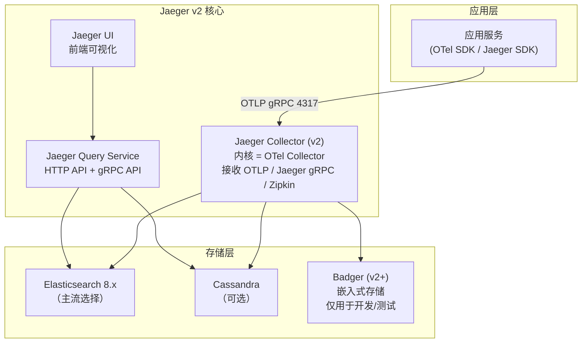

# Jaeger — 分布式链路追踪（对比参考）

**更新日期：** 2026年06月04日
**信息来源：** 官方文档、GitHub 仓库、CNCF 资料、社区实践
**参考地址：**

1. GitHub：[jaegertracing/jaeger](https://github.com/jaegertracing/jaeger)（~20k stars）
2. 官方文档：[jaegertracing.io/docs](https://www.jaegertracing.io/docs/latest/)
3. Helm Chart：[jaegertracing/helm-charts](https://github.com/jaegertracing/helm-charts)
4. Jaeger v2 迁移指南：[Jaeger v2 Migration](https://www.jaegertracing.io/docs/latest/migration/)
5. CNCF 项目页：[Jaeger at CNCF](https://www.cncf.io/projects/jaeger/)

> Jaeger 是业界最成熟的分布式追踪方案之一，本项目选用 Tempo 而非 Jaeger，但理解 Jaeger 对技术选型决策有重要参考价值。

---

## 1. 结论摘要

Jaeger 是 CNCF 毕业项目，由 Uber 于 2015 年开源，是分布式追踪领域的先驱工具。它率先推广了 OpenTracing 标准（现已合并为 OpenTelemetry），目前仍是全球使用最广泛的分布式追踪系统之一。

Jaeger v2（2024年发布）是一次重大架构重写：统一了 Agent/Collector/Query 三个组件为单个二进制，并改用 **OpenTelemetry Collector** 作为内核，彻底拥抱 OTLP 协议。这使得 Jaeger v2 的架构复杂度大幅降低，与 Tempo 的差距缩小。

**本项目未采用 Jaeger 的核心原因**：Jaeger 仍然需要 Elasticsearch 或 Cassandra 作为存储后端（v2 新增了实验性的内置存储），运维成本高于 Tempo 的纯对象存储方案；同时 Grafana + Loki 的三维联动在 Tempo 上是原生特性，Jaeger 需要额外适配。

| 关键信息 | 值 |
| --- | --- |
| CNCF 状态 | CNCF 毕业项目（2019年毕业）|
| 开源协议 | Apache 2.0 |
| 实现语言 | Go |
| 存储后端 | Elasticsearch、Cassandra、Kafka、内置 Badger（v2+）|
| 接受协议 | OTLP（v2+）、Jaeger Thrift/gRPC、Zipkin |
| 当前版本 | v2.x（2024年发布，架构重写）|
| Stars | ~20k（GitHub）|

---

## 2. 产品概况

| 项目 | 内容 |
| --- | --- |
| 产品名称 | Jaeger |
| 产品定位 | 端到端分布式追踪平台 |
| 开发者 | Uber 开源 → CNCF 社区维护 |
| CNCF 状态 | ✅ CNCF 毕业（Graduated）|
| 开源协议 | Apache 2.0 |
| 历史 | 2015年由 Uber 开源，受 Google Dapper 和 OpenZipkin 启发 |
| 当前状态 | v2.0+ 已全面重写，内核改为 OTel Collector，架构大幅简化 |
| 主要形态 | 单二进制（Jaeger v2）或微服务模式 |
| 目标用户 | 需要成熟追踪方案、已有 ES 集群、对 Grafana 依赖不强的团队 |

---

## 3. Jaeger 架构演进

### 3.1 Jaeger v1 架构（已过时，仅供了解）

```
应用服务
  | Jaeger Client (SDK)
  v
Jaeger Agent (UDP 6831/6832, 本地 sidecar)
  |
  v
Jaeger Collector (HTTP 14268 / gRPC 14250)
  |
  v
Elasticsearch / Cassandra
  |
  v
Jaeger Query + Jaeger UI (HTTP 16686)
```

v1 的问题：
- Jaeger Agent 必须以 DaemonSet 或 Sidecar 部署在每个节点
- UDP 传输不可靠（丢包）
- 与 OTel 标准未完全对齐

### 3.2 Jaeger v2 架构（当前推荐）



v2 改进：
- **单一进程**：Collector + Query 合并，组件从 4 个降为 2 个
- **原生 OTLP**：完全支持 OTLP，无需 OTel Collector 做转换
- **插件化存储**：通过配置切换存储后端

---

## 4. 核心能力

### 4.1 链路可视化 UI

Jaeger UI 是其核心优势之一，提供丰富的链路可视化功能：

- **Trace Timeline**：瀑布图展示 Span 执行时间线
- **Critical Path**：高亮关键路径（决定整体延迟的 Span 链）
- **Trace Comparison**：对比两条链路的差异（排查不同版本的性能变化）
- **Service Graph**：服务依赖关系拓扑图（依赖 spark-dependencies 组件）
- **Deep Dependency Graph**：多跳服务依赖的深度可视化

### 4.2 采样策略

Jaeger 支持多种采样策略：

| 采样策略 | 说明 | 适用场景 |
| --- | --- | --- |
| 固定比率（Probabilistic）| 按概率采样（0.0~1.0）| 高吞吐量、预算可控 |
| 全量采样（Const=1）| 记录所有链路 | 开发/测试环境 |
| 限速采样（Rate Limiting）| 每秒最多 N 条链路 | 流量不可预测时 |
| 远程采样（Remote）| 服务端动态下发采样规则 | 生产动态调整 |
| 自适应采样（Adaptive）| 根据流量自动调整，保证每个操作 N 条/秒 | 推荐生产配置 |

### 4.3 自适应采样配置（推荐）

```yaml
# Jaeger Collector 配置
sampling:
  strategies:
    default_strategy:
      type: adaptive
      param: 100  # 每秒每个操作最少保留 100 条链路
    per_operation_strategies:
      - operation: "GET /healthz"
        type: const
        param: 0  # 健康检查不采样
      - operation: "POST /api/infer"
        type: adaptive
        param: 500  # AI 推理接口保留更多采样
```

---

## 5. 部署方式

### 5.1 使用 Helm 部署（生产推荐）

```bash
helm repo add jaegertracing https://jaegertracing.github.io/helm-charts
helm repo update

# 使用 Elasticsearch 作为存储
cat <<EOF > jaeger-values.yaml
provisionDataStore:
  cassandra: false
  elasticsearch: false  # 假设 ES 已有

storage:
  type: elasticsearch
  elasticsearch:
    host: elasticsearch-master.elastic.svc.cluster.local
    port: 9200
    scheme: http
    username: elastic
    password: changeme

query:
  ingress:
    enabled: true
    hosts:
      - jaeger.example.com

collector:
  resources:
    limits:
      memory: 2Gi
      cpu: "1"
EOF

helm upgrade --install jaeger jaegertracing/jaeger \
  --namespace monitoring \
  --values jaeger-values.yaml
```

### 5.2 Jaeger v2 All-in-One（开发测试用）

```bash
# Docker 快速启动（内置 Badger 存储，数据不持久化）
docker run --rm --name jaeger \
  -p 16686:16686 \    # Jaeger UI
  -p 4317:4317 \      # OTLP gRPC
  -p 4318:4318 \      # OTLP HTTP
  jaegertracing/jaeger:2.x.x
```

---

## 6. 与 Tempo 的详细对比

| 对比维度 | Jaeger | Tempo | 说明 |
| --- | --- | --- | --- |
| **存储后端** | ES / Cassandra / Badger | 仅对象存储 (S3) | Tempo 不需要维护 ES 集群 |
| **存储成本** | 高（ES 资源消耗大）| 低（S3 极便宜）| ES 需要专用节点，S3 按量付费 |
| **运维复杂度** | 中（v2 后有改善）| 低（对象存储自维护）| |
| **Grafana 集成** | 需要 Grafana 插件 | 原生 Tempo 数据源 | Grafana 内置 Tempo 支持更完整 |
| **Loki 联动** | 需手动配置 | 原生支持 `tracesToLogsV2` | |
| **Prometheus 联动** | 需手动配置 Exemplar | 原生 + metrics-generator | Tempo 可自动生成 RED 指标 |
| **查询语言** | Jaeger UI（图形化）、部分 JSON 过滤 | TraceQL（功能更强）| TraceQL 支持聚合和计算 |
| **UI 丰富度** | ★★★★★（Critical Path、Trace Diff 等）| ★★★（Grafana Explore）| Jaeger UI 是亮点 |
| **OTLP 原生支持** | ✅ v2+ | ✅ | |
| **自适应采样** | ✅ 原生内置 | 需 Alloy/OTel Collector 实现 | |
| **生产成熟度** | ★★★★★（2015年至今）| ★★★★（2020年，快速成熟）| |
| **Python/AI 生态** | ★★★（通过 OTel）| ★★★★（OTel + Grafana 生态）| |

### 选择建议

```
如果你的团队：
  ✅ 已有 Elasticsearch 集群（可复用存储）→ 考虑 Jaeger
  ✅ 对 Jaeger UI 的 Critical Path / Trace Diff 功能有强依赖 → 选 Jaeger
  ✅ 已经完全在 Grafana 生态中（Loki + Prometheus）→ 选 Tempo
  ✅ 希望最低运维成本 + 对象存储后端 → 选 Tempo
  ✅ 需要 metrics-generator 无侵入生成 RED 指标 → 选 Tempo
```

---

## 7. 何时重新考虑 Jaeger

以下情况可以重新评估是否引入 Jaeger：

1. **已有 ES 集群**：如果项目已运行 Elasticsearch（如日志存储），可以复用节点降低增量成本
2. **需要 Trace Diff**：Jaeger 的链路对比（Trace Diff）功能可快速发现版本间性能退化，是 Grafana/Tempo 目前缺失的功能
3. **团队熟悉度**：如果团队 SRE 对 Jaeger 非常熟悉，迁移的认知成本可能高于存储节省
4. **多云场景**：Jaeger 的 ES 存储支持更复杂的跨云数据复制场景

---

## 8. 常见问题 FAQ

**Q1：Jaeger v1 和 v2 有什么本质区别？**
A：v2 用 OTel Collector 替代了 Jaeger Agent（取消 UDP），统一了 Collector+Query 为单进程，并原生支持 OTLP。升级后架构从 4 个组件降为 2 个，Agent 不再需要 DaemonSet 部署。

**Q2：Jaeger 能接收 OTel SDK 发出的数据吗？**
A：可以。Jaeger v2 原生支持 OTLP gRPC（端口 4317）和 OTLP HTTP（端口 4318），OTel SDK 的 `otlp` exporter 可以直接发到 Jaeger v2。

**Q3：Jaeger 能和 Grafana 集成吗？**
A：可以，但不是原生支持。需要在 Grafana 中配置 Jaeger 数据源（type: jaeger），然后在 Explore 页面查询。与 Tempo 相比，Loki 联动和 metrics-generator 等功能需要额外配置或无法实现。

**Q4：本项目使用 Tempo，还需要了解 Jaeger 吗？**
A：了解 Jaeger 有价值，原因：1）Tempo 接受 Jaeger 格式的 Span，有些老服务可能还用 Jaeger SDK；2）技术评审时需要能说明为何选 Tempo 而非 Jaeger；3）未来项目可能有特殊需求（如 Trace Diff）需要引入 Jaeger。

---

## 9. 参考文档

1. [Jaeger 官方文档](https://www.jaegertracing.io/docs/latest/)
2. [Jaeger v2 迁移指南](https://www.jaegertracing.io/docs/latest/migration/)
3. [Jaeger Helm Chart](https://github.com/jaegertracing/helm-charts)
4. [Jaeger 自适应采样](https://www.jaegertracing.io/docs/latest/sampling/)
5. [CNCF Jaeger 项目](https://www.cncf.io/projects/jaeger/)
6. [Jaeger vs Tempo 对比（Grafana 博客）](https://grafana.com/blog/2021/10/19/how-tempo-is-better-than-jaeger-at-storing-trace-data/)

