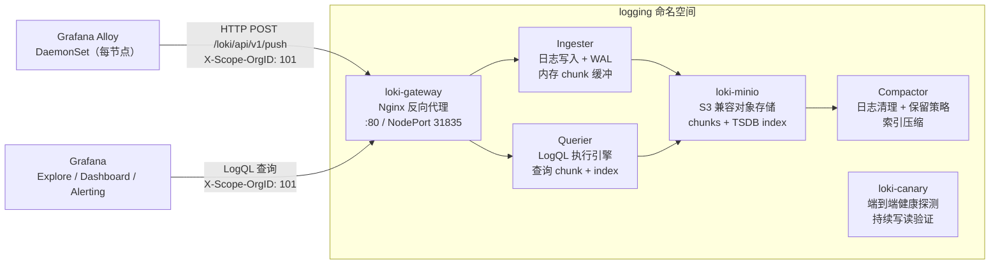

# Loki — 日志聚合与查询系统

**更新日期：** 2026年06月04日
**信息来源：** 官方文档、GitHub 仓库、用户实测记录、社区实践
**参考地址：**

1. GitHub：[grafana/loki](https://github.com/grafana/loki)（~28.3k stars）
2. 官方文档：[Grafana Loki Docs](https://grafana.com/docs/loki/latest/)
3. Helm Chart 安装：[Loki Helm Install](https://grafana.com/docs/loki/latest/setup/install/helm/)
4. LogQL 语法：[LogQL Reference](https://grafana.com/docs/loki/latest/query/)
5. 多租户：[Loki Multi-tenancy](https://grafana.com/docs/loki/latest/operations/multi-tenancy/)
6. 存储配置：[Loki Storage](https://grafana.com/docs/loki/latest/operations/storage/)
7. 日志保留：[Loki Retention](https://grafana.com/docs/loki/latest/operations/storage/retention/)

> Star 数会持续变化。正式对外汇报前建议以 GitHub 实时数据复核。

---

## 1. 结论摘要

Loki 是 Grafana Labs 参照 Prometheus 设计理念构建的日志聚合系统，核心特性是**只索引标签（Label），不索引日志内容**。日志内容以压缩 chunk 形式存入对象存储（S3/MinIO），查询时才扫描内容，存储成本比 Elasticsearch 低 5~10 倍，运维复杂度显著降低。

它不是"功能完备的日志平台"，而是专注于**低成本长期存储 + Grafana 原生集成**。Loki 天然适合已经在用 Grafana 的团队：在同一个 Grafana 界面里，可以把 Prometheus 指标图表和 Loki 日志流并排展示，时间轴对齐，无需跳转多个系统。

**对本项目的核心价值：** 已以单体（Monolithic）模式部署在 `logging` 命名空间，使用内置 MinIO 作为对象存储，开启多租户（`auth_enabled: true`），租户 ID 为 `101`。全集群容器日志由 Alloy DaemonSet 采集后推送至 Loki Gateway，在 Grafana Explore 中通过 LogQL 查询。当前日志保留策略为 30 天。

| 关键信息 | 值 |
| --- | --- |
| 命名空间 | `logging` |
| 部署模式 | 单体（Monolithic），1 副本 |
| 对象存储 | 内置 MinIO |
| 多租户 | `auth_enabled: true`，租户 ID `101` |
| Gateway（集群内） | `http://loki-gateway.logging.svc.cluster.local:80` |
| Loki 直连 NodePort | `32527`（内部端口 `3100`） |
| Gateway NodePort | `31835` |
| 日志保留策略 | 30 天（`retention_period: 720h`） |
| 索引类型 | TSDB（schema v13） |

---

## 2. 产品概况

| 项目 | 内容 |
| --- | --- |
| 产品名称 | Grafana Loki |
| 开发者 | Grafana Labs |
| CNCF 状态 | ✅ CNCF Graduated |
| 开源协议 | AGPL-3.0 |
| 核心理念 | 只索引 Label，内容存对象存储（"Prometheus for logs"） |
| 部署形态 | 单体 / 读写分离 / 微服务三种模式 |
| 对象存储支持 | S3 / GCS / Azure Blob / MinIO / 本地文件系统 |
| 查询语言 | LogQL（类 PromQL，支持流过滤、管道解析、指标聚合） |
| 配套采集器 | Grafana Alloy（推荐）/ Promtail（维护模式）/ FluentBit / Fluentd |
| 竞品 | Elasticsearch/OpenSearch（重量级）、Splunk（商业）、ClickHouse（分析型） |

---

## 3. 产品定位与典型场景

| 场景 | Loki 解决的问题 | 价值 |
| --- | --- | --- |
| K8s 全集群日志集中存储 | Pod 重启后日志消失，难以回溯故障 | Alloy DaemonSet 持续采集，日志永久存入 MinIO，支持跨 Pod/节点检索 |
| 低成本日志存储 | Elasticsearch 索引全文内容，磁盘消耗极大 | 只索引 Label，内容 gzip 压缩存 MinIO，成本降低 5~10x |
| 日志与指标关联 | 告警触发时需要跳转多个系统查日志 | Grafana 同界面展示 Prometheus 指标 + Loki 日志，时间轴完全对齐 |
| 多租户日志隔离 | 多团队共用集群，日志不能互相可见 | `auth_enabled: true` + `X-Scope-OrgID` 实现强租户隔离 |
| 日志驱动告警 | 需要对错误关键词或异常日志频率告警 | LogQL metric query + Grafana Alerting 实现"日志触发告警" |
| 链路日志关联 | 分布式系统中难以找到特定请求的完整日志 | LogQL 过滤 `traceID` 字段，或通过 Grafana Tempo 直接跳转到对应日志 |
| 长期日志归档 | 本地日志保留时间短，监管合规需要更长保留 | MinIO 对象存储可配置生命周期策略实现冷热分层，成本可控 |

---

## 4. 技术架构



### 4.1 核心组件说明

| 组件 | 职责 | 本项目部署方式 |
| --- | --- | --- |
| **loki-gateway** | Nginx 反向代理，统一写入/读取入口，按路由分发到 Ingester/Querier | 独立 Deployment，NodePort 31835 |
| **Ingester** | 接收日志流，写入内存 chunk，定期 flush 到对象存储；WAL 防止丢数据 | 单体模式内置 |
| **Querier** | 执行 LogQL 查询，从对象存储读取 chunk 并扫描匹配内容 | 单体模式内置 |
| **Compactor** | 定期压缩 TSDB 索引，执行日志保留策略（删除过期 chunk）| 单体模式内置 |
| **Ruler** | 定时执行 LogQL 规则，生成指标或触发告警（类似 Prometheus Recording/Alerting Rules） | 单体模式内置，已开启 API |
| **loki-minio** | 内置 MinIO，提供 S3 兼容的对象存储，存放日志 chunk 和 TSDB 索引 | 独立 StatefulSet |
| **loki-canary** | 持续向 Loki 写入测试日志并查询，监控端到端写入延迟和丢失率 | DaemonSet |

### 4.2 日志写入流程

```
Alloy 采集日志
  → 打上 namespace/pod/container 等 Label
  → HTTP POST /loki/api/v1/push（携带 X-Scope-OrgID: 101）
  → loki-gateway 路由到 Ingester
  → Ingester 按 Label 分组写入内存 chunk + WAL
  → chunk 满 / 超时 → flush 到 MinIO（gzip 压缩）
  → TSDB index 记录 Label → chunk 的映射关系
```

### 4.3 日志查询流程

```
Grafana Explore 执行 LogQL
  → HTTP GET /loki/api/v1/query_range（携带 X-Scope-OrgID: 101）
  → loki-gateway 路由到 Querier
  → Querier 查询 TSDB index → 找到匹配 Label 的 chunk
  → 从 MinIO 读取 chunk → 解压 → 扫描内容匹配 filter
  → 返回匹配的日志行（带时间戳和 Label）
```

---

## 5. 部署

### 5.1 部署模式选型

Loki 支持三种部署模式，适用于不同规模：

| 模式 | 适用场景 | 组件数 | 本项目 |
| --- | --- | --- | --- |
| **单体（Monolithic）** | 单节点、测试环境、中小规模（< 100 GB/天） | 1 个进程包含所有组件 | ✅ 当前使用 |
| **读写分离（Simple Scalable）** | 中等规模，需要独立扩缩写入和查询 | 3 类部署：write / read / backend | 可升级路径 |
| **微服务（Microservices）** | 大规模、高可用、精细化资源控制 | 10+ 独立组件 | 暂不需要 |

### 5.2 Helm 安装

```bash
# 在线安装（使用 grafana-community 官方 repo）
helm repo add grafana-community https://grafana-community.github.io/helm-charts
helm repo update
helm install loki grafana-community/loki -n logging --create-namespace -f loki-values.yaml

# 离线安装
helm pull grafana-community/loki
helm install loki loki-17.1.6.tgz -n logging --create-namespace -f loki-values.yaml

# 更新配置
helm upgrade loki loki-17.1.6.tgz -n logging -f loki-values.yaml
```

### 5.3 loki-values.yaml（当前生效配置）

```yaml
loki:
  auth_enabled: true      # 开启多租户，查询须携带 X-Scope-OrgID
  commonConfig:
    replication_factor: 1
  schemaConfig:
    configs:
      - from: "2024-04-01"
        store: tsdb           # TSDB 索引（Loki 2.8+ 推荐）
        object_store: s3      # 使用 S3 兼容存储（此处为内置 MinIO）
        schema: v13
        index:
          prefix: loki_index_
          period: 24h
  pattern_ingester:
    enabled: true
  limits_config:
    allow_structured_metadata: true
    volume_enabled: true
    retention_period: 720h   # 30 天日志保留（需 compactor 配合生效）
  ruler:
    enable_api: true

# 关闭内存缓存（小规模部署节省内存；大规模时建议开启）
chunksCache:
  allocatedMemory: 0
  enabled: false
resultsCache:
  enabled: false

# 内置 MinIO 对象存储
minio:
  enabled: true

# 单体模式部署
deploymentMode: Monolithic

singleBinary:
  replicas: 1

# 关闭读写分离模式的各组件（单体模式不使用，避免额外资源消耗）
backend:
  replicas: 0
read:
  replicas: 0
write:
  replicas: 0
ingester:
  replicas: 0
querier:
  replicas: 0
queryFrontend:
  replicas: 0
queryScheduler:
  replicas: 0
distributor:
  replicas: 0
compactor:
  replicas: 0
indexGateway:
  replicas: 0
bloomPlanner:
  replicas: 0
bloomBuilder:
  replicas: 0
bloomGateway:
  replicas: 0
```

### 5.4 关键配置项说明

| 配置项 | 说明 | 当前值 |
| --- | --- | --- |
| `auth_enabled` | 开启多租户，所有请求须携带 `X-Scope-OrgID` | `true` |
| `replication_factor` | 日志副本数，单节点设置为 1 | `1` |
| `store: tsdb` | 使用 TSDB 索引格式（Loki 2.8+ 新格式，性能更好） | `tsdb` |
| `schema: v13` | 最新 schema 版本，不可降级 | `v13` |
| `retention_period` | 日志保留时长，720h = 30 天 | `720h` |
| `pattern_ingester` | 自动识别日志中的模式，提升查询效率 | `enabled: true` |
| `allow_structured_metadata` | 允许结构化元数据（OTel 日志格式需要） | `true` |
| `chunksCache.enabled` | 热数据内存缓存，小规模关闭，大规模建议开启 | `false` |

---

## 6. 访问与验证

### 6.1 访问地址

| 服务 | 地址 | 用途 |
| --- | --- | --- |
| Gateway（集群内，推荐） | `http://loki-gateway.logging.svc.cluster.local:80` | Alloy 推送、Grafana 查询的统一入口 |
| Gateway NodePort（外部调试） | `http://<NodeIP>:31835` | 集群外手动测试 |
| Loki 直连 NodePort | `http://<NodeIP>:32527` | 直连 Loki API，需手动携带 OrgID 头 |
| MinIO 控制台 | 集群内 `loki-minio-console.logging.svc:9001` | 查看 MinIO 存储桶和对象 |

### 6.2 已部署状态

```bash
kubectl get all -n logging
# NAME                                READY   STATUS    RESTARTS   AGE
# pod/alloy-zgjt6                     2/2     Running   0          3h39m
# pod/loki-0                          2/2     Running   0          4h26m
# pod/loki-canary-zrh8g               1/1     Running   0          6h27m
# pod/loki-gateway-7f754c9697-7qqrt   2/2     Running   0          6h27m
# pod/loki-minio-0                    1/1     Running   0          6h27m
#
# daemonset.apps/alloy          1   1   1   1   1   <none>  6h21m
# daemonset.apps/loki-canary    1   1   1   1   1   <none>  6h27m
# deployment.apps/loki-gateway  1/1  1  1  6h27m
# statefulset.apps/loki         1/1  6h27m
# statefulset.apps/loki-minio   1/1  6h27m
#
# service/loki           NodePort    10.1.147.205   <none>   3100:32527/TCP,...
# service/loki-gateway   NodePort    10.1.192.120   <none>   80:31835/TCP
```

### 6.3 手动推送验证

```bash
# 向 Gateway 推送一条测试日志（生产验证方式）
curl -X POST \
  "http://<NodeIP>:31835/loki/api/v1/push" \
  -H "Content-Type: application/json" \
  -H "X-Scope-OrgID: 101" \
  -d "{
    \"streams\": [{
      \"stream\": {\"job\": \"test\", \"env\": \"dev\"},
      \"values\": [[\"$(date +%s)000000000\", \"hello from manual push\"]]
    }]
  }"

# 预期返回：HTTP 204（空响应体表示成功）
```

### 6.4 Grafana 数据源配置

1. Grafana → **Connections → Data sources → Add data source → Loki**
2. URL 填写：`http://loki-gateway.logging.svc.cluster.local:80`
3. 展开 **Custom HTTP Headers**，添加：
   - Header: `X-Scope-OrgID`
   - Value: `101`
4. 点击 **Save & test**，显示 "Data source connected and labels found" 即配置成功

---

## 7. 多租户配置

### 7.1 工作原理

`auth_enabled: true` 时，Loki 使用 `X-Scope-OrgID` HTTP Header 作为租户标识。同一个 Loki 实例中，不同 OrgID 的日志**完全隔离**——A 租户看不到 B 租户的任何日志，索引也相互独立。

### 7.2 各组件配置对照

| 组件 | 配置位置 | 配置值 |
| --- | --- | --- |
| Alloy（日志推送） | `loki.write.endpoint.headers` | `headers = { "X-Scope-OrgID" = "101" }` |
| Grafana 数据源 | Custom HTTP Headers | `X-Scope-OrgID: 101` |
| curl 手动测试 | HTTP Header | `-H "X-Scope-OrgID: 101"` |
| Alertmanager（若用 Loki ruler 告警）| ruler 配置 | `ruler.alertmanager_url` + OrgID |

### 7.3 多团队扩展方案

后续如需接入多个团队，分配不同 OrgID，Grafana 侧建立多个 Loki 数据源分别指向对应 OrgID：

| 团队 | OrgID | Grafana 数据源 |
| --- | --- | --- |
| 平台运维 | `101` | Loki-Platform |
| AI 团队 | `102` | Loki-AI |
| 产品团队 | `103` | Loki-Product |

---

## 8. 日志保留策略

### 8.1 全局保留配置

日志保留通过 `limits_config.retention_period` + Compactor 共同实现：

```yaml
loki:
  limits_config:
    retention_period: 720h   # 30 天，0 表示永久保留

  compactor:
    retention_enabled: true
    delete_request_store: filesystem
```

> 注意：`retention_period` 必须配合 `compactor.retention_enabled: true` 才会真正删除过期数据。只配置 `retention_period` 但不启用 compactor，数据不会被清理。

### 8.2 租户级差异化保留

生产环境可以为不同租户设置不同的保留时长：

```yaml
loki:
  limits_config:
    retention_period: 720h    # 默认 30 天

  per_tenant_override_config: /etc/loki/per-tenant-override.yaml
```

```yaml
# per-tenant-override.yaml
overrides:
  "101":           # 平台运维：保留 90 天
    retention_period: 2160h
  "102":           # AI 团队：保留 14 天
    retention_period: 336h
```

---

## 9. LogQL 查询语言

LogQL 是 Loki 的查询语言，语法参照 PromQL 设计。分为两大类：
- **日志查询（Log queries）**：返回日志行，用于 Explore 检索
- **指标查询（Metric queries）**：对日志流聚合计算，返回时间序列，可用于告警

### 9.1 日志流选择器（必须）

LogQL 查询必须以日志流选择器开头，用 `{}` 包裹，通过 Label 匹配缩小扫描范围：

```logql
# 精确匹配
{namespace="monitoring", app="alertmanager"}

# 正则匹配（~= 正则，!~ 不匹配）
{namespace=~"monitoring|logging"}
{app!~"loki.*"}

# 排除某个 namespace
{namespace!="kube-system"}
```

> **性能关键**：Label 基数（cardinality）越低查询越快。`namespace`、`app`、`pod` 是典型低基数 Label；不要用 `traceID` 这类高基数值作为 Label（应放在日志内容里用 `| json` 提取）。

### 9.2 过滤表达式（Pipeline）

在流选择器后接 `|` 管道符，逐步缩小结果：

```logql
# 包含关键词（大小写敏感）
{namespace="prod"} |= "error"

# 排除关键词（去除 healthcheck 噪音）
{namespace="prod", app="api"} != "healthcheck"

# 正则过滤（包含 error 或 warn）
{namespace="prod"} |~ "error|warn"

# 正则排除
{namespace="prod"} !~ "health.*check"

# 多个过滤叠加（AND 逻辑）
{namespace="prod"} |= "error" != "healthcheck" != "404"
```

### 9.3 解析表达式

将非结构化日志解析为键值对，解析后的字段可以用于过滤和聚合：

```logql
# JSON 解析（适合 JSON 格式日志）
{namespace="prod"} | json

# 解析后再过滤
{namespace="prod"} | json | level="error"

# 提取指定字段（减少开销）
{namespace="prod"} | json level, traceID, message

# logfmt 格式解析（key=value 格式）
{namespace="monitoring"} | logfmt

# 正则提取（适合非结构化日志）
{namespace="prod"} | regexp `(?P<method>GET|POST|PUT|DELETE) (?P<path>/\S+) (?P<status>\d{3})`

# 解析后按字段过滤
{namespace="prod"} | regexp `status=(?P<status>\d+)` | status >= 500
```

### 9.4 标签过滤表达式

解析后可对提取的字段做数值比较或条件过滤：

```logql
# 数值比较
{namespace="prod"} | json | duration > 1000

# 字符串匹配
{namespace="prod"} | json | level=~"error|critical"

# 复合条件
{namespace="prod"} | json | level="error" | status >= 500 | path != "/healthz"
```

### 9.5 格式化表达式

```logql
# 自定义输出格式（line_format 使用 Go template）
{namespace="prod"} | json | line_format "{{.level}} [{{.traceID}}] {{.message}}"

# 添加新 Label（label_format）
{namespace="prod"} | json | label_format severity=level
```

### 9.6 指标查询（用于 Grafana 图表和告警）

```logql
# 统计每分钟所有错误日志总数
count_over_time({namespace="prod"} |= "error" [5m])

# 按 app 分组统计错误率（rate 返回每秒速率）
sum(rate({namespace="prod"} |= "error" [5m])) by (app)

# 统计各 HTTP 状态码的请求量
sum(count_over_time({namespace="prod"} | json | status != "" [1m])) by (status)

# P99 响应时间（需要日志中有 duration 字段）
quantile_over_time(0.99, {namespace="prod"} | json | unwrap duration [5m]) by (app)

# 按 namespace 统计日志量（用于监控日志流量异常）
sum(bytes_over_time({namespace=~".+"} [5m])) by (namespace)
```

### 9.7 常用场景查询速查

```logql
# ---- 故障排查 ----
# 某 Pod 最近 1 小时的错误日志
{namespace="prod", pod="api-server-xxx"} |= "error" | json

# 全集群 OOMKilled 事件
{namespace="kube-system"} |= "OOMKilled"

# 特定 Trace 的完整日志（与 Grafana Tempo 联动）
{namespace="prod"} | json | traceID="4bf92f3577b34da6a3ce929d0e0e4736"

# 慢请求（响应时间超过 2000ms）
{namespace="prod", app="api"} | json | duration > 2000

# ---- 告警规则 ----
# 每分钟 5xx 错误次数（用于 Grafana Alert 规则）
sum(rate({namespace="prod"} | json | status >= 500 [1m])) by (app)

# 每分钟 panic 日志次数
count_over_time({namespace="prod"} |= "panic" [1m])

# ---- 日常巡检 ----
# 最近 1 小时各 namespace 日志量排名
sum(bytes_over_time({namespace=~".+"} [1h])) by (namespace)

# 最近 15 分钟错误日志频率（按 app 分组）
sum(rate({namespace="prod"} |= "error" [15m])) by (app)
```

---

## 10. 与 Elasticsearch 对比

Elasticsearch 是日志存储的主流选择，Loki 的设计理念与其截然不同。

| 维度 | Loki | Elasticsearch |
| --- | --- | --- |
| 索引方式 | 只索引 Label（标签），不索引内容 | 全文索引，对日志内容建立倒排索引 |
| 存储成本 | 低（日志内容 gzip 压缩存对象存储） | 高（全文索引占用大量 SSD 空间） |
| 查询速度（精确 Label 过滤） | 快（TSDB 直接定位 chunk） | 快 |
| 查询速度（全文搜索） | 慢（需要扫描 chunk 内容） | 快（倒排索引直接命中） |
| 运维复杂度 | 低（单体模式几个组件） | 高（Master/Data/Coordinating 节点，集群管理复杂） |
| Grafana 集成 | ✅ 原生无缝集成 | ⚠️ 需额外配置 Elasticsearch 数据源 |
| 与 Prometheus 协同 | ✅ 同一 Grafana 界面，时间轴对齐 | ❌ 两套系统独立 |
| 多租户 | ✅ 内置 X-Scope-OrgID | ⚠️ 需要 X-Pack 或 OpenSearch Security |
| 适用场景 | K8s 容器日志、基础设施日志、与 Prometheus 配套使用 | 应用业务日志的精细化全文检索、复杂聚合分析 |
| 不适合的场景 | 需要全文关键词模糊搜索、复杂文本分析 | 成本敏感、运维资源有限、Grafana 为主要查询界面 |

**结论：** 本项目选择 Loki 的核心原因：已有 Grafana 作为统一观测界面、成本敏感（MinIO 对象存储远比 SSD 便宜）、运维团队规模小（Elasticsearch 集群运维成本过高）。若未来有全文检索或复杂日志分析需求，可在 Loki 之外补充 Elasticsearch 处理特定业务日志。

---

## 11. 常见问题

### 查询报错 `No org ID found`

**原因：** `auth_enabled: true` 时所有请求必须携带 `X-Scope-OrgID` Header。

**解决：**
- Grafana 数据源：添加 Custom HTTP Header `X-Scope-OrgID: 101`
- curl 测试：添加 `-H "X-Scope-OrgID: 101"`
- Alloy 推送：确认 `loki.write.endpoint.headers` 中已配置

---

### Alloy 推送日志报 429 Too Many Requests

**原因：** Loki `limits_config` 中 `ingestion_rate_mb`（默认 4 MB/s）或 `ingestion_burst_size_mb`（默认 6 MB）超限。

**解决：**
```yaml
# 在 loki-values.yaml 的 limits_config 中调大限额
loki:
  limits_config:
    ingestion_rate_mb: 16
    ingestion_burst_size_mb: 32
```
也可以在 Alloy 侧增加 `loki.process` 过滤规则，减少无用日志（如过滤 healthcheck、debug 级别日志）。

---

### 日志延迟高（Grafana 看不到最新日志）

**原因：** Ingester 的 `chunk_idle_period`（默认 30m）到期才 flush，内存中的最新日志不会立即持久化，但查询时 Querier 会从 Ingester 内存中读取，一般延迟在秒级。若延迟超预期，检查：
1. Alloy 端是否有写入错误：`kubectl logs -n logging -l app.kubernetes.io/name=alloy`
2. Loki Ingester 是否内存不足导致背压：查看 Pod 资源使用情况

---

### MinIO 磁盘占满，Loki 写入失败

**现象：** Loki 日志出现 `storage: too many chunks` 或写入 503。

**排查与解决：**
1. 检查 `retention_period` + `compactor.retention_enabled` 是否同时生效
2. 检查 MinIO PVC 容量：`kubectl get pvc -n logging`
3. 查看 compactor 日志确认清理是否正常执行：`kubectl logs loki-0 -n logging -c loki | grep compactor`
4. 临时扩容 PVC，或清理低价值租户的旧日志

---

### 日志保留配置了但数据没有被删除

**原因：** `compactor.retention_enabled` 未设置为 `true`，或 compactor 未正常运行。

**解决：** 在 `loki-values.yaml` 中确认：
```yaml
loki:
  compactor:
    retention_enabled: true
```
并检查 compactor 是否有错误日志。单体模式下 compactor 集成在 `loki-0` Pod 中，可通过 `loki.compactor` 配置段控制。

---

### Grafana 数据源测试提示"No labels found"

**原因：** Loki 中还没有日志数据，或 OrgID 不匹配（查询的租户下没有日志）。

**解决：**
1. 用 curl 手动推送一条日志（见第 6.3 节）
2. 确认 Grafana 数据源中 `X-Scope-OrgID` 值与 Alloy 推送时的值一致（均为 `101`）

---

## 12. 参考文档

1. [Grafana Loki 官方文档](https://grafana.com/docs/loki/latest/)
2. [Loki Helm Chart 安装指南](https://grafana.com/docs/loki/latest/setup/install/helm/)
3. [LogQL 查询语言完整参考](https://grafana.com/docs/loki/latest/query/)
4. [Loki 多租户配置](https://grafana.com/docs/loki/latest/operations/multi-tenancy/)
5. [Loki 日志保留策略配置](https://grafana.com/docs/loki/latest/operations/storage/retention/)
6. [Loki 存储架构说明](https://grafana.com/docs/loki/latest/operations/storage/)
7. [Loki 部署模式选型](https://grafana.com/docs/loki/latest/get-started/deployment-modes/)

