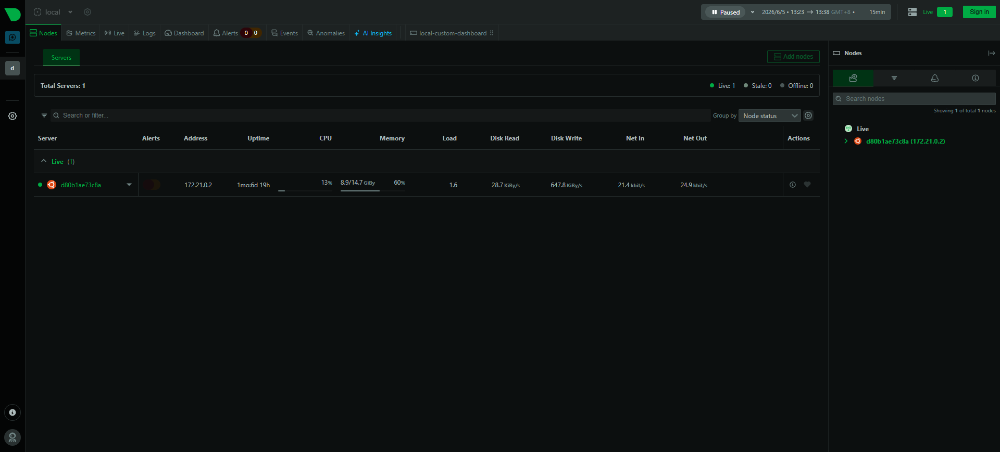
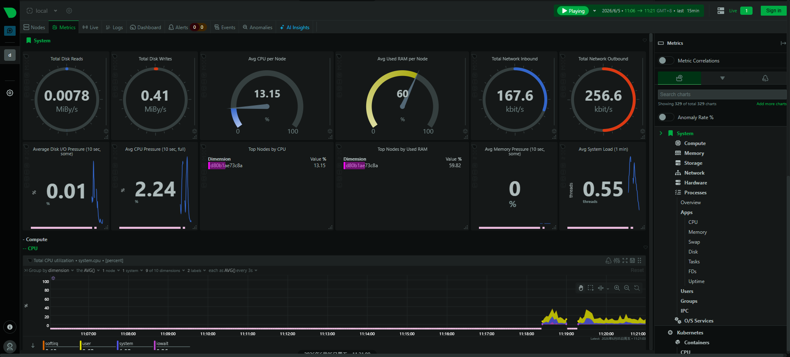
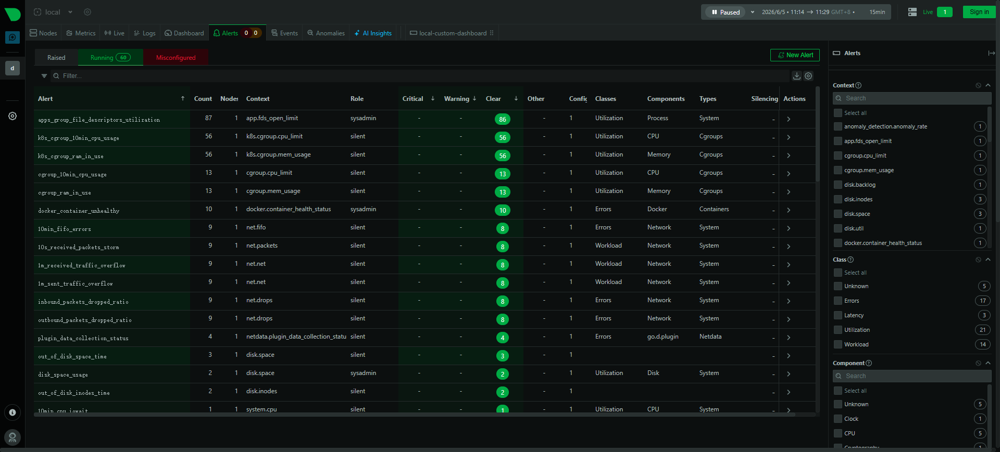
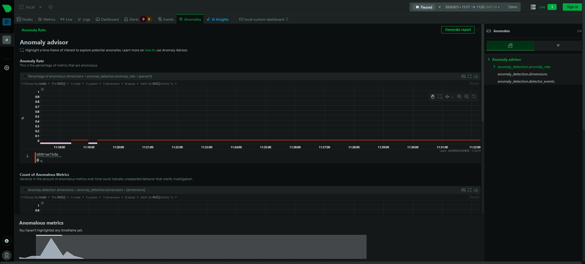
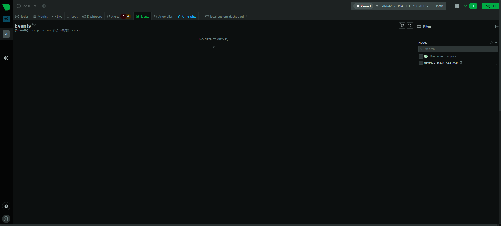
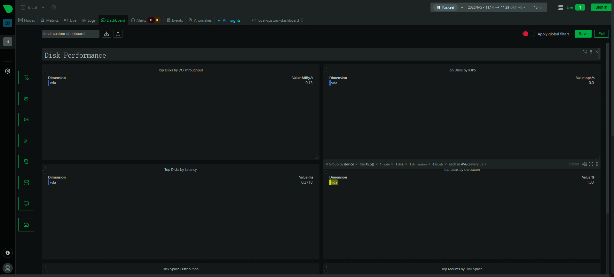
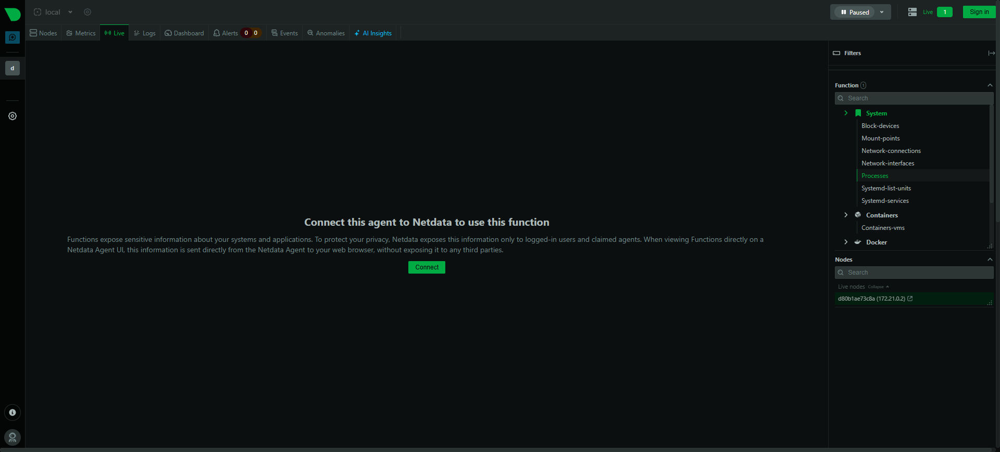
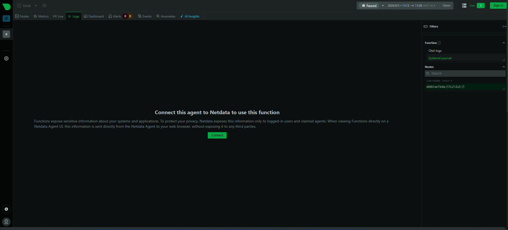
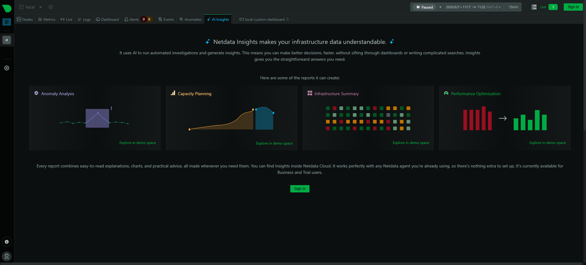

# Netdata — 实时高精度系统监控（对比参考）

**更新日期：** 2026年06月04日
**信息来源：** 官方文档、GitHub 仓库、社区实践
**参考地址：**

1. GitHub：[netdata/netdata](https://github.com/netdata/netdata)（~79.1k stars）
2. 官方文档：[learn.netdata.cloud](https://learn.netdata.cloud/)
3. Kubernetes 部署：[Netdata Helm Chart](https://github.com/netdata/helmchart)
4. Prometheus 集成：[Netdata + Prometheus](https://learn.netdata.cloud/docs/exporting-metrics/prometheus)
5. askai: https://learn.netdata.cloud/docs/ask-nedi

> Netdata 是实时监控领域明星项目（~79.1k stars）。它的核心卖点是**每秒精度**的高频采集和**零配置安装**，适合需要快速获得系统监控视图的个人开发者和小团队。但与 Prometheus + Grafana 的组合相比，Netdata 在企业级监控体系中的适用性需要评估。本文将对 Netdata 的核心能力、使用方式以及与 Prometheus 的差异进行详细分析，帮助决策是否纳入常规监控体系。

---

## 1. 结论摘要

Netdata 是开箱即用的实时系统监控工具，特点是**每秒精度**的高频采集和**零配置安装**——单条命令即可在任意 Linux 主机上获得覆盖 CPU/内存/磁盘/网络/进程等数百项指标的美观仪表盘。

本项目主要是对比netdata与 Prometheus + Grafana 的差异，评估是否适合纳入常规监控体系。结论是：

<!-- 暂无结论，先对比 -->

| 关键信息 | 值 |
| --- | --- |
| 开源协议 | GPL v3（Netdata Agent）、商业版（Netdata Cloud）|
| 实现语言 | C（Agent 核心）+ Python/Go 插件 |
| 采集精度 | **1 秒**（vs Prometheus 默认 15 秒）|
| 安装方式 | 单命令安装，零配置，自动发现所有采集器 |
| Stars | ~79.1k（GitHub，高人气）|
| 对 Prometheus 集成 | 支持（但非默认配置）|

---

## 2. 产品概况

| 项目 | 内容 |
| --- | --- |
| 产品名称 | Netdata |
| 产品定位 | 零配置实时系统监控，每秒精度 |
| 开发者 | Netdata Inc. |
| 开源协议 | GPL v3（Agent）|
| 发布年份 | 2013年 |
| 主要形态 | Agent（每个节点运行）+ Netdata Cloud（可选云端汇聚）|
| 目标用户 | 个人开发者、小团队，希望快速获得系统监控视图 |
| 竞争对手 | Prometheus + Grafana（功能更强但配置复杂）|

---

## 3. 核心能力

### 3.1 零配置自动发现

Netdata 安装后自动启用 300+ 个采集器，无需手动配置目标：

| 采集类别 | 覆盖范围 |
| --- | --- |
| 系统指标 | CPU 每核使用率、内存、swap、disk IO、网络接口 |
| 进程 | 每个进程的 CPU/内存/IO 资源消耗 |
| 应用中间件 | MySQL、Redis、Nginx、Apache、MongoDB 等（自动检测）|
| 容器 | Docker 容器资源使用（cgroup 指标）|
| K8s | Kubelet、kube-proxy、etcd 指标（需 Helm 部署）|
| 网络 | TCP 连接状态、流量、包丢失、延迟 |

### 3.2 每秒精度的价值

Prometheus 默认 15 秒采集间隔，在以下场景下分辨率不足：

| 场景 | 15s 粒度的问题 | Netdata 1s 的优势 |
| --- | --- | --- |
| CPU 短暂 Throttling | 15 秒内的毛刺被均值掩盖 | 精确显示哪一秒 CPU 100% |
| 内存突刺（OOM 前）| 峰值被平滑 | 看到内存在几秒内如何增长 |
| 网络包丢失 | 短暂丢包在 15s 均值中消失 | 精确显示丢包发生的时间点 |
| 磁盘 IO 毛刺 | 写操作集中在 1-2 秒但被均摊 | 可见 IO 突刺 |

### 3.3 内置告警规则

Netdata 内置数百条告警规则，安装即生效（无需配置）：

- CPU 使用率 > 80% 持续 10 分钟
- 磁盘空间 > 90%
- 内存使用 > 90%
- 网络接口丢包 > 1%
- 进程数超限

告警通知支持：Email、Slack、PagerDuty、Telegram、AWS SNS 等。但**不支持 Feishu（飞书）**，与现有告警体系不统一。

---

## 4. 使用方式


### 4.1 docker-compose(实测使用)

```yaml
services:
  netdata:
    image: netdata/netdata
    container_name: netdata
    pid: host
    # 删除了 network_mode: host，默认使用 bridge 模式
    ports:
      - "30001:19999" # 显式设置端口映射 [宿主机端口:容器内端口]
    restart: unless-stopped
    cap_add:
      - SYS_PTRACE
      - SYS_ADMIN
    security_opt:
      - apparmor:unconfined
    environment:
      - NETDATA_LISTEN_PORT=19999 # 显式告知 Netdata 内部监听端口
    volumes:
      - netdataconfig:/etc/netdata
      - netdatalib:/var/lib/netdata
      - netdatacache:/var/cache/netdata
      - /:/host/root:ro,rslave
      - /etc/passwd:/host/etc/passwd:ro
      - /etc/group:/host/etc/group:ro
      - /etc/localtime:/etc/localtime:ro
      - /proc:/host/proc:ro
      - /sys:/host/sys:ro
      - /etc/os-release:/host/etc/os-release:ro
      - /var/log:/host/var/log:ro
      - /var/run/docker.sock:/var/run/docker.sock:ro
      - /run/dbus:/run/dbus:ro

volumes:
  netdataconfig:
  netdatalib:
  netdatacache:

```

### 4.2 快速安装（单命令）

```bash
# 在目标节点上安装（Linux）
bash <(curl -Ss https://my-netdata.io/kickstart.sh)

# 安装完成后访问 http://<节点IP>:19999
# 默认用户名/密码无需登录（本地访问）
```

### 4.3 K8s 内使用 kubectl port-forward 访问

如果在 K8s 节点上无法直接访问 19999 端口，通过 DaemonSet 部署后 port-forward 访问：

```bash
# 临时部署 Netdata DaemonSet（仅调试用，用完删除）
helm repo add netdata https://netdata.github.io/helmchart/
helm install netdata netdata/netdata --namespace netdata --create-namespace \
  --set persistence.enabled=false \  # 不持久化，调试完删除即可
  --set sd.child.enabled=false

# 访问特定节点的 Netdata（找到该节点上的 Pod）
kubectl port-forward -n netdata pod/netdata-<pod-name> 19999:19999

# 调试完毕，删除
helm uninstall netdata -n netdata
```

### 4.4 Docker 快速启动（最轻量）

```bash
# 在 K8s 节点上用 Docker 快速启动
docker run -d --name=netdata \
  --pid=host \
  --network=host \
  -v netdataconfig:/etc/netdata \
  -v netdatalib:/var/lib/netdata \
  -v netdatacache:/var/cache/netdata \
  -v /etc/passwd:/host/etc/passwd:ro \
  -v /etc/group:/host/etc/group:ro \
  -v /proc:/host/proc:ro \
  -v /sys:/host/sys:ro \
  -v /etc/os-release:/host/etc/os-release:ro \
  --restart unless-stopped \
  --cap-add SYS_PTRACE \
  --security-opt apparmor=unconfined \
  netdata/netdata

# 访问 http://localhost:19999

# 调试完毕，删除容器
docker rm -f netdata
```

## 5. 仪表盘与可视化

### 5.1 整体 UI 结构

Netdata 有两种访问入口，Tab 组成不同：

| 入口 | 地址 | 说明 |
|------|------|------|
| **本地 Agent UI（开源版）** | `http://<节点IP>:19999` | 单节点部署，无需账号，本文实测基于此 |
| **Netdata Cloud（官方演示）** | `https://app.netdata.cloud` | 需注册账号，多节点汇聚，有付费功能 |

> **重要区分：** 官方演示地址（`app.netdata.cloud`）显示的 Tab 和本地 Agent UI 不完全相同。Home Tab **仅在 Cloud 版存在**，本地开源版没有。

#### 本地 Agent UI Tab 总览（实测）

| Tab | 功能定位 | 登录要求（精确版） |
|---|---|---|
| **Home** | Room 实时概览（节点地图、Top alerts、保留期） | 无需登录（Cloud tab） |
| **Nodes** | 节点列表、状态、实时指标摘要 | 查看无需登录；添加 silencing rule / 配置需 Community+ |
| **Metrics** | 所有指标图表，按 context 分组，1 秒精度 | 无需登录 |
| **Alerts** | 活跃告警、告警配置、silencing | 查看无需登录；创建 silencing 需 Community+；AI/Manager 配置需 Paid |
| **Anomaly Advisor** | 基于 ML 异常率评分排序 | 无需登录 |
| **Events** | 基础设施事件时间线（审计/拓扑/告警变更） | **需登录**（Cloud 特性，本地无此 tab） |
| **Dashboards** | 自定义仪表盘 | 匿名可建 1 个/agent；Paid 不限；TV Mode 可生成免登录 URL |
| **Live** | 节点诊断 Functions | **混合**——6 个公开 Function 匿名可用；8 个敏感 Function 需登录 |
| **Logs** | systemd-journal / OTLP / Windows Events | **需登录**（对应 Systemd Journal / Windows Events 敏感 Function） |

> Live 和 Logs 需要登录的原因：Netdata 决定只维护一套 UI 代码（Cloud UI = Agent UI），所以 Cloud 那边的访问控制也跟着带到了本机 Agent 上。

---

### 5.2 无需登录的 Tab（开源本地版）

#### 5.2.1 Nodes Tab — 节点列表

无需登录。显示当前 Agent 监控的所有节点（单机部署时只有一个节点，Parent 架构下会聚合所有子节点）。

| 操作 | 你能看到/得到什么 | 是否需要登录 |
|---|---|:---:|
| **View status** | 节点连接状态（live/stale/reachable）| 无需 |
| **Open the single node dashboard** | 进入该节点的单节点 Metrics 视图 | 无需 |
| **Access node details via the sidebar** | 右侧边栏显示该节点详细信息 | 无需 |
| **View active alerts** | 该节点当前告警列表 | 无需 |
| **Check Machine Learning status** | ML 是否在跑、训练进度 | 无需 |
| **Check Functions capability status** | Live/Logs Functions 是否可用 | 无需 |
| **View key collected attributes** | 节点关键元数据 | 无需 |
| **Add configuration (beta)** | 给该节点写配置（动态配置）| 需 Community+ |
| **Add alert silencing rules** | 静默该节点告警 | 需 Community+ |




#### 5.2.2 Metrics Tab — 实时指标图表

**能看什么：**
- 所有采集器上报的指标，按 context（指标类型）分组展示，覆盖：

| 分组 | 包含指标 |
|------|---------|
| system | compute（CPU/内存/磁盘/网络）、processes（进程资源使用）、memory（内存细分指标）、storage（磁盘 IO/使用率）、network（接口流量/丢包/连接数）、hardware（温度/风扇/电源）等 |
| kubernetes | containers (cpu、psi、memory、disk、network、process) |
| containers & VMs | Docker / cgroup 容器的 CPU/内存/磁盘/网络 |
| docker | Summary、Containers、Health、Images 等 Docker 相关指标 |
| Netdata | Agent、Plugins、ML |
| snmp | SNMP 采集的网络设备指标（如已配置）|
| cgroup | 每个 cgroup 的资源隔离指标 |



**能配置什么：**
- 每张图表支持 NIDL 框架过滤：按 Node / Instance / Dimension / Label 筛选数据
- 按节点过滤、Host Labels 过滤、按 Netdata 版本过滤
- 图表支持 Pan / Highlight / Zoom，可高亮时间段触发 Metric Correlations
- 右侧导航菜单可快速跳转到任意指标分组，AR% 按钮显示每分组的异常率

**配置效果：** 快速定位某段时间内某节点某指标的异常，与 Anomalies Tab 联动可自动关联相关指标。

---

#### 5.2.2 Alerts Tab — 告警管理

**能看什么：**

Tab 分为两个子页面：

**① Raised Alerts（活跃告警）：**

| 列 | 内容 |
|----|------|
| Alert Name | 告警名，点击进入详情 |
| Status | Warning / Critical |
| Class | 分类（Latency / Utilization / Errors 等）|
| Type & Component | 系统类型和涉及组件（CPU / Disk / Web Server 等）|
| Node Name | 触发节点 |
| Silencing Rule | 是否已有静默规则 |
| Actions | 创建静默规则 / 让 AI 分析 |

点击告警名进入详情页，可查看：触发时间、图表快照（告警发生时的指标视图）、告警配置参数、节点实例值，以及跳转到实时图表运行 Metric Correlations。

**② Alert Configurations（告警配置列表）：** 展示所有正在运行的告警规则（仅匹配到当前采集指标的规则才显示）。



**能配置什么（免费 / 付费分层）：**

| 配置方式 | 说明 | 计划要求 |
|---------|------|---------|
| 手动编辑 `health.d/*.conf` | 完整控制告警阈值、计算方式、通知目标；修改后执行 `sudo netdatacli reload-health` 立即生效 | 免费 |
| 告警静默规则 | 在 UI 中创建静默规则，指定时间范围和节点范围 | Community 免费 |
| Alerts Configuration Manager | 可视化向导配置告警，无需手写配置文件 | **付费计划** |
| Alerts Automation（AI 生成）| 用自然语言描述条件，AI 自动生成告警配置 | **付费计划** |

**配置效果：** 内置数百条告警规则安装即生效（CPU > 80%、磁盘 > 90%、内存 > 90% 等），通过调整 `health.d/` 配置可自定义任意阈值和告警目标。

---

#### 5.2.3 Anomalies Tab — 异常检测面板

**能看什么：**

Anomaly Advisor 基于 Agent 本地 ML（每个指标独立训练模型，零配置），提供三个核心视图：

| 视图 | 说明 | 使用场景 |
|------|------|---------|
| Anomaly Rate | 每个节点的异常指标百分比趋势（时间轴）| 快速判断"这段时间哪个节点最异常" |
| Count of Anomalous Metrics | 异常指标的绝对数量 | 节点间指标数差异大时更直观 |
| Anomaly Events Detected | 异常率触发节点级事件的时间点 | 过滤噪声，聚焦真正有意义的峰值 |

**使用流程：** 高亮时间范围 → 右侧出现按异常率排序的指标索引 → 点击跳转对应图表 → 图表顶部紫色 Anomaly Rate ribbon 显示细粒度异常情况。



**能配置什么：** 无需配置，ML 引擎全自动运行。可在节点过滤器中限定分析范围（缩小到特定节点再高亮，排名精度更高）。

**配置效果：** 在没有 Prometheus 告警规则的情况下，自动发现"不知道该告什么警"的异常行为，是 Prometheus 规则驱动告警的补充。

---

#### 5.2.4 Events Tab — 事件时间线

**能看什么：**

| 事件类型 | 内容 | 保留时长（免费 / 付费）|
|---------|------|----------------------|
| **Alert events** | 告警状态变更（Cleared / Warning / Critical / Removed）| 4 小时本地 / 90 天 Cloud |
| **Topology events** | 节点上线/下线/创建/删除、Agent 连接/断开 | 4 小时本地 / 14 天 Cloud |
| **Auditing events** | Space 配置变更、用户操作（仅 Cloud Admin 可见）| 4 小时本地 / 90 天 Cloud |

**能配置什么：** 可按时间段、事件类型、节点、告警严重程度过滤。

**配置效果 / 典型用法：** 某个指标在某时刻突变时，在 Events Tab 查看同期是否有节点重启（Topology event）或告警触发（Alert event），从而关联根因。相比 Grafana 的 Annotations，Events 是全自动记录，无需主动写入。



#### 5.2.6 Dashboards Tab — 自定义仪表盘

**能配置什么：**
- 从现有图表拖拽添加到自定义仪表盘
- 保存仪表盘配置（本地保存，刷新后保留）
- 跨指标组合图表到同一视图

**能看什么：** 保存的自定义仪表盘列表，点击进入查看。

**配置效果：** 把常用的几张图表固定在一起，不需要每次重新从 Metrics Tab 逐一查找。功能比 Grafana Dashboard 简单，但零配置可用。



---

### 5.3 需要登录才能使用的 Tab（开源本地版）

#### 5.3.1 Live Tab — 节点诊断 Functions

**为什么需要登录：** Functions 会直接执行节点级操作并暴露敏感系统信息（进程列表、网络连接详情、数据库查询语句等），通过 ACLK 协议仅向已认证用户开放。

**能看什么 / 能执行什么：**

| Function | 功能 | 类比工具 | 需要 Cloud |
|---------|------|---------|-----------|
| Processes | 实时进程 CPU/内存/IO，支持排序和搜索 | top / htop | 需要 |
| Network-connections | 所有 TCP/UDP 连接状态（端口、协议、状态）| netstat / ss | 需要 |
| Network-interfaces | 网络接口流量、丢包率、MTU、速率 | bmon / bwm-ng | 不需要 |
| Block-devices | 块设备 IO 活动（传输量、IOPS）| iostat | 不需要 |
| Containers-vms | 容器和 QEMU VM 的 CPU/内存/磁盘/网络 | docker stats | 不需要 |
| Systemd-list-units | 所有 systemd 服务列表和状态 | systemctl list-units | 需要 |
| Top-queries | 数据库聚合 SQL 性能指标（ClickHouse/MySQL/Postgres/Redis 等）| 数据库 slow query log | 需要 |
| Running-queries | 数据库当前正在执行的 SQL | SHOW PROCESSLIST | 需要 |
| Mount-points | 每个挂载点的磁盘使用情况 | df | 不需要 |

**能配置什么：** 在右侧 Functions Bar 选择要执行的 Function、目标节点，并应用过滤条件（如按设备名、DB 实例过滤）；可设置自动刷新间隔。

**配置效果：** 相当于一个安全的远程诊断终端，无需 SSH 到节点即可查看实时进程状态、当前慢查询、网络连接，适合临时排查问题。



---

#### 5.3.2 Logs Tab — 日志查看器

**为什么需要登录：** 日志可能包含敏感业务信息，同 Live Tab 一样需要认证。

**能看什么：**

支持三种日志来源（取决于节点操作系统）：

| 来源 | 内容 | 适用系统 |
|------|------|---------|
| **systemd-journal** | Linux 系统日志（journald），支持所有 journal fields 查询 | Linux（有 systemd）|
| **otel-logs** | 通过 OTLP 协议接收的应用日志 | 任意（需应用端配置 OTLP exporter）|
| **Windows Event Logs** | Windows 事件日志（Event Channel）| Windows 节点 |

**能配置什么：**
- 全文搜索（支持 journal fields 精确匹配和全文检索）
- 时间范围过滤
- 自定义应用日志接入：通过 `log2journal` 将 Nginx/Apache access log 管道到 journald，即可在 Logs Tab 查看（需要配置 systemd service）

**配置效果：** 在同一界面内关联指标图表和对应时间段的日志，无需切换到 Kibana 或 Loki（但功能比 Loki + Grafana 弱，无标签化查询，不适合大规模日志分析）。



---

### 5.4 Netdata Cloud 专属 Tab

以下 Tab **在本地 Agent UI（开源版）中不存在**，需要注册 Netdata Cloud 账号并将 Agent Claim 到 Cloud 后才能看到。

#### 5.4.1 Home Tab — 全局基础设施概览（Cloud Only）

**开源版没有此 Tab。** 官方演示地址（`app.netdata.cloud`）和连接 Cloud 后才会出现。

**能看什么：**
- 所有已 Claim 节点的总数（Live / Offline / Stale 状态分布）
- 活跃告警数量（Critical / Warning 分类）
- 节点六边形地图（可按状态、云厂商、地域、自定义 Labels 着色）
- Parent / Children / Standalone 节点拓扑分布
- 数据复制因子分布（None / Single / Multi）
- 过去 24 小时告警最多的 Top 节点和 Top 告警类型

**适用场景：** 多节点基础设施的值班 Overview 大屏，类似 Grafana 的全局概览 Dashboard。

---

### 5.5 付费版专属功能

以下功能在本地开源版和免费 Community 计划中**不可用**，需要 Homelab 或 Business 付费计划：

| 功能 | 说明 | 效果 |
|------|------|------|
| **Metric Correlations** | 高亮图表中某段时间后，自动发现相似行为的其他指标 | 加速根因分析，无需手动逐一排查 |
| **Alerts Configuration Manager** | 可视化向导创建告警规则 | 无需手写 `health.d/*.conf` |
| **Alerts Automation（AI）** | 用自然语言描述条件，AI 生成告警配置 | 快速设置新告警，但仍需人工验证 |
| **AI Insights** | 自动生成 2-3 分钟的异常分析报告（容量规划、性能优化建议）| 类似 Grafana AI 摘要，适合快速生成汇报 |
| **RBAC 权限控制** | Admin / Manager / Troubleshooter / Observer 角色 | 团队多人协作时限制操作权限 |
| **Mobile App 推送** | 通过 Netdata App 接收告警推送 | 替代 Email/Slack 通知 |



> **对本项目的判断：** 以上付费功能与已有的 Prometheus + Alertmanager + PrometheusAlert（飞书）+ Grafana 体系功能重叠，且 Netdata Cloud 为 SaaS，数据主权有限。不建议采购付费计划。

---

### 5.6 与 Prometheus / Grafana 集成

Netdata 有两种独立的集成路径，目标不同：

#### 5.6.1 Prometheus 集成（将指标导入 Prometheus）

**适用场景：** 已有 Prometheus + Grafana 体系，想把 Netdata 的每秒精度指标也汇入 Prometheus，继续用 Grafana 展示。

数据流：`Netdata Agent → Prometheus → Grafana`

**方式一：Prometheus Remote Write（Netdata 主动推送，推荐）**

```ini
# /etc/netdata/exporting.conf
[exporting:prometheus_remote_write:my_prometheus]
    enabled = yes
    destination = http://prometheus.monitoring.svc.cluster.local:9090/api/v1/write
    send hosts matching = *
    send charts matching = *
    update every = 10     # 每 10 秒推送一次（不建议 1s，存储压力大）
```

**方式二：Prometheus Scrape 端点（Prometheus 主动拉取）**

Netdata 内置 `/api/v1/allmetrics` 端点，可直接被 Prometheus scrape：

```yaml
# prometheus.yml
scrape_configs:
  - job_name: 'netdata'
    metrics_path: '/api/v1/allmetrics'
    params:
      format: [prometheus]
    scrape_interval: 15s
    static_configs:
      - targets: ['<节点IP>:19999']
```

> **注意：** Netdata 的指标命名与 Prometheus `node_exporter` 不同（如 `netdata_system_cpu_percentage_average` vs `node_cpu_seconds_total`），无法直接复用 kube-prometheus-stack 的告警规则和 Grafana Dashboard，仅适合临时补充秒级精度观测。

---

#### 5.6.2 Grafana 数据源插件（Netdata 直连 Grafana）

**适用场景：** 想在 Grafana 中直接查询 Netdata，不经过 Prometheus，保留 1 秒精度。

数据流：`Netdata Agent → Grafana（原生插件直连）`

Netdata 官方提供 Grafana 数据源插件（`netdata-datasource`），安装后可在 Grafana 中将 Netdata Agent 配置为数据源，在 Grafana 面板里直接写 Netdata 原生查询。

```bash
# 安装 Grafana 插件
grafana-cli plugins install netdata-datasource

# 重启 Grafana 后，在 Grafana → Data Sources → Add → 搜索 Netdata
# 填入 Agent 地址：http://<节点IP>:19999
```

**两种集成方式对比：**

| 维度 | Prometheus 集成 | Grafana 插件直连 |
|------|----------------|----------------|
| 数据精度 | 受 scrape_interval 限制（通常 15s）| 保留 1 秒精度 |
| 历史数据 | 存储在 Prometheus TSDB，长期保留 | 受 Netdata Agent 本地存储限制 |
| 告警规则 | 可基于 Prometheus 写 PromQL 告警 | 无法使用 Prometheus 告警 |
| 与现有体系融合 | ✅ 融入现有 Prometheus + Grafana | ⚠️ 单独的数据源，不与 Loki/Tempo 联动 |
| 指标命名 | Netdata 命名，与 node_exporter 不兼容 | 同左 |
| **推荐场景** | 临时把 Netdata 秒级数据补充进监控体系 | 临时调试，直接在 Grafana 看 Netdata 原生视图 |

---

## 6. 开源版能做什么，有什么限制

### 6.1 开源版（Netdata Agent）完整能力

Netdata Agent 采用 GPL v3 开源协议，**所有采集、存储、告警、导出功能完全免费**：

| 能力 | 开源版 | 说明 |
|------|--------|------|
| 指标采集 | ✅ | 300+ 采集器，每秒精度，自动发现 |
| 本地仪表盘 | ✅ | `http://<IP>:19999`，所有指标实时展示 |
| 本地告警 | ✅ | 内置数百条告警规则，安装即生效 |
| 本地通知 | ✅ | 支持 Email / Slack / PagerDuty / Telegram 等 |
| 指标导出 | ✅ | 导出到 Prometheus / InfluxDB / Graphite 等 30+ 数据库 |
| 长期存储 | ✅ | 分层数据库设计，可保留数月到数年数据 |
| ML 异常检测 | ✅ | 本地 ML 引擎，零配置运行 |
| 多节点聚合 | ✅ | Netdata Parent 架构，支持层级化部署 |

### 6.2 开源版的限制

| 限制项 | 说明 |
|--------|------|
| **无多节点统一视图** | 每个 Agent 独立运行，无法在一个仪表盘中看到所有节点（除非连接 Cloud 或部署 Parent）|
| **无团队协作** | 无 Spaces / Rooms / RBAC 权限控制 |
| **无 Mobile 推送** | 告警只能通过本地通知方式（Email / Slack 等），无 Netdata Mobile App |
| **无 AI 功能** | 无 AI Chat / AI Insights / Anomaly Advisor（ML 异常检测本身免费） |
| **无 Metric Correlations** | 无法自动发现相关指标 |
| **无集中告警管理** | 告警配置分散在每个 Agent 上，无法集中管理 |
| **告警通知不支持飞书** | 不支持 Feishu（飞书），与现有告警体系不统一 |
| **无 SSO 集成** | 无法对接企业 OAuth / OIDC 登录 |
| **无 On-Prem 版本** | Cloud 版本为 SaaS，私有化部署需 Enterprise 版本 |

### 6.3 Netdata Cloud 计划对比

| 计划 | 价格 | 节点限制 | 主要特性 |
|------|------|---------|---------|
| **Community** | 免费 | 无限 | 基础多节点视图、集中通知、基础仪表盘 |
| **Homelab** | 付费 | 按节点计费 | 自定义仪表盘、Metric Correlations、AI Chat |
| **Business** | 付费（年付） | 承诺节点数 + 超量计费 | RBAC 权限、AI Insights、Mobile 推送、优先支持 |
| **Enterprise On-Prem** | 定制 | 定制 | 本地部署 Netdata Cloud，完全数据主权 |

> **对本项目的意义：** 开源版 Agent 的采集和本地告警能力足够用于临时调试。但如果要纳入常规可观测体系，缺乏多节点统一视图、自定义仪表盘和团队协作是主要瓶颈。

---

## 7. 与 Prometheus 的对比

### 7.1 架构差异

| 对比维度 | Netdata | Prometheus + Grafana |
|----------|---------|---------------------|
| **架构模式** | 每节点独立 Agent，数据本地存储 | 中心化 Server 拉取各节点指标 |
| **数据采集** | Agent 主动采集（推模式），每秒精度 | Prometheus 主动拉取（拉模式），默认 15s |
| **数据存储** | Agent 本地分层 DB（秒级 → 分钟级 → 小时级） | 本地 TSDB + 可选 Remote Write（Thanos / VictoriaMetrics） |
| **服务发现** | 自动发现所有采集器，零配置 | 需配置 scrape_configs / 服务发现（consul / K8s SD） |
| **告警引擎** | Agent 内置，每秒评估 | Prometheus 内置，评估周期可配置 |
| **可视化** | Agent 内置仪表盘（固定样式） | Grafana（高度可定制） |
| **多节点汇聚** | 需连接 Cloud 或部署 Parent | Thanos / VictoriaMetrics 或联邦集群 |
| **长期存储** | Agent 分层 DB 原生支持 | Thanos / VictoriaMetrics / Cortex 扩展 |

### 7.2 功能对比

| 功能 | Netdata | Prometheus + Grafana |
|------|---------|---------------------|
| **采集精度** | 1 秒（固定） | 可配置（默认 15s，最小 1s） |
| **指标类型** | 数百项系统指标（自动发现） | 可自定义任何指标（需编写 Exporter） |
| **自定义指标** | 通过插件扩展（Python / Go） | 通过 Exporter 扩展（生态更丰富） |
| **自定义仪表盘** | 本地可创建并保存，但只能使用 Netdata 自身数据 | Grafana 完全自定义，社区仪表盘丰富，多数据源 |
| **告警规则** | 内置数百条，开箱即用 | 需手写 PromQL 告警规则 |
| **告警通知** | Email / Slack / PagerDuty / Telegram | Alertmanager → 任意 Webhook（可对接飞书） |
| **多数据源** | 仅自身数据 | Grafana 可同时接入 Prometheus / Loki / Tempo 等 |
| **日志关联** | 有限支持 | Loki + Grafana 完整日志关联 |
| **链路追踪** | 不支持 | Tempo / Jaeger 集成 |
| **K8s 原生支持** | Helm Chart 部署，Kubelet / etcd 采集 | kube-prometheus-stack 生态成熟 |
| **生态成熟度** | 中等 | 非常成熟（CNCF 生态核心） |
| **配置复杂度** | 极低（零配置） | 中等（需编写 PrometheusRules / ServiceMonitor） |

### 7.3 性能与资源消耗

| 指标 | Netdata | Prometheus + node_exporter |
|------|---------|--------------------------|
| **CPU 开销** | 略高（每秒采集 + 本地 ML） | 较低（15s 采集间隔） |
| **内存占用** | 中等（需缓存秒级数据） | 较低（默认只存 15s 粒度） |
| **磁盘 IOPS** | 较高（每秒写入本地 DB） | 较低（15s 写入一次） |
| **网络带宽** | 每节点独立，无需中心拉取 | Prometheus 需拉取所有节点指标 |
| **查询延迟** | 极低（本地查询） | 取决于 TSDB 大小和查询复杂度 |

### 7.4 适用场景对比

| 场景 | 推荐方案 | 理由 |
|------|---------|------|
| **临时调试单台节点** | Netdata | 零配置，秒级精度，开箱即用 |
| **K8s 集群常规监控** | Prometheus + Grafana | 生态成熟，kube-prometheus-stack 一站式方案 |
| **生产级告警体系** | Prometheus + Alertmanager + PrometheusAlert | 告警链路完整，支持飞书推送 |
| **多数据源统一展示** | Grafana | 支持 Prometheus / Loki / Tempo 等多数据源 |
| **AI 推理服务监控** | Prometheus + Grafana | vLLM 官方 Dashboard 基于 Prometheus |
| **GPU 资源监控** | Prometheus + DCGM Exporter | DCGM Exporter 为 Prometheus 原生设计 |
| **需要秒级精度排查** | Netdata（临时） | 1 秒采集在排查毛刺时有优势 |

### 7.5 对本项目的结论

Netdata 作为**临时调试工具**有其价值（零配置、秒级精度），但**不适合替代** Prometheus + Grafana 构成的常规可观测体系：

- ❌ 缺乏多节点统一视图（需 Cloud 或 Parent）
- ❌ 告警不支持飞书
- ❌ 与现有 K8s 监控生态（kube-prometheus-stack）集成有限，指标命名不兼容
- ✅ 可作为单节点临时调试的补充工具
- ✅ 本地自定义仪表盘可保存
- ✅ 其 1 秒精度的采集理念值得借鉴

---

## 8. 常见问题 FAQ

### Q1: Netdata 的数据保存多久？

Agent 本地使用分层数据库设计：秒级数据保留数天，分钟级数据保留数周，小时级数据保留数月到数年。具体时长取决于磁盘空间配置。连接 Cloud 后可通过 Cloud 按需查询历史数据。

### Q2: Netdata Agent 是否需要连接 Cloud 才能使用？

不需要。Agent 完全可以独立运行，本地仪表盘（`http://<IP>:19999`）和本地告警均可正常使用。连接 Cloud 只是为了获得多节点统一视图和高级功能。

### Q3: 如何将 Netdata 指标导入 Prometheus？

启用 Netdata 的 Prometheus Remote Write 导出器：

```ini
# netdata.conf
[exporting:prometheus_remote_write:instance]
    enabled = yes
    destination = http://prometheus:9090/api/v1/write
```

或使用 Netdata 内置的 Prometheus scraper 端点：`http://<IP>:19999/api/v1/allmetrics?format=prometheus`。

### Q4: Netdata 支持告警推送到飞书吗？

不支持。Netdata 原生告警通知支持 Email / Slack / PagerDuty / Telegram / AWS SNS / Microsoft Teams 等，但不支持飞书。如需飞书推送，需通过 Webhook 自定义集成或借助 Prometheus + Alertmanager + PrometheusAlert 的告警链路。

### Q5: Netdata 的资源消耗大吗？

中等偏上。由于每秒采集和本地 ML 异常检测，CPU 和磁盘 IOPS 消耗高于 15s 采集间隔的 Prometheus。在生产节点上部署时需评估对业务的影响。建议用于调试环境而非生产核心节点。

### Q6: Netdata Parent 是什么？

Parent 是 Netdata 的层级聚合架构。多个 Child Agent 将指标流式传输到 Parent Agent，Parent 负责长期存储和集中告警评估。适用于：临时节点（Ephemeral Nodes）、团队隔离、安全策略（互联网隔离）、成本优化等场景。

### Q7: Netdata Cloud 的数据存储在哪里？

Netdata Cloud **不存储指标和日志数据**。它只存储节点元数据（节点信息、指标名称、标签、采集器状态、告警配置）。查看仪表盘时，数据直接从 Agent 传输到浏览器，Cloud 只负责聚合和路由。

### Q8: 如何在 K8s 中使用 Netdata？

推荐使用 Helm Chart 部署为 DaemonSet：

```bash
helm repo add netdata https://netdata.github.io/helmchart/
helm install netdata netdata/netdata --namespace netdata --create-namespace
```

注意：本项目中 Netdata 仅作为临时调试工具，不纳入常规监控体系，调试完毕后应删除。

---

## 9. 参考文档

| 文档 | 地址 | 说明 |
|------|------|------|
| Netdata 官方文档 | https://learn.netdata.cloud/ | 完整文档入口 |
| Netdata GitHub | https://github.com/netdata/netdata | ~79.1k stars |
| Netdata Helm Chart | https://github.com/netdata/helmchart | K8s 部署 |
| Netdata Prometheus 导出 | https://learn.netdata.cloud/docs/exporting-metrics/prometheus | 指标导出到 Prometheus |
| Netdata 告警配置 | https://learn.netdata.cloud/docs/alerts-&-notifications/alert-configuration-reference | 告警规则语法参考 |
| Netdata Cloud 定价 | https://netdata.cloud/pricing | 计划与价格 |
| Netdata + Grafana 插件 | https://learn.netdata.cloud/docs/dashboards-and-charts/grafana-plugin | Grafana 数据源插件 |
| Netdata 仪表盘 | https://learn.netdata.cloud/docs/dashboards-and-charts | 仪表盘功能说明 |
| Netdata 与 Grafana 集成 | https://learn.netdata.cloud/docs/visualizations/grafana-cloud | Grafana Cloud 集成 |

---
