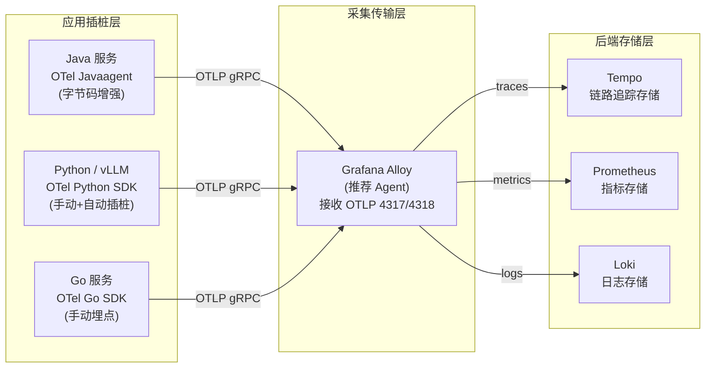

# OpenTelemetry — 遥测数据标准与采集框架

**更新日期：** 2026年06月04日
**信息来源：** 官方文档、GitHub 仓库、CNCF 资料、社区实践
**参考地址：**

1. GitHub：[open-telemetry/opentelemetry-collector](https://github.com/open-telemetry/opentelemetry-collector)（~4.5k stars）
2. 官方文档：[opentelemetry.io/docs](https://opentelemetry.io/docs/)
3. Java Agent：[OTel Java Agent](https://opentelemetry.io/docs/zero-code/java/agent/)
4. Python SDK：[OTel Python](https://opentelemetry.io/docs/languages/python/)
5. Collector 配置：[OTel Collector Configuration](https://opentelemetry.io/docs/collector/configuration/)
6. Semantic Conventions：[OTel Semantic Conventions](https://opentelemetry.io/docs/specs/semconv/)

---

## 1. 结论摘要

OpenTelemetry（OTel）是 CNCF 毕业项目，是 Metrics/Logs/Traces 三类遥测信号的**统一标准、SDK 和采集框架**。它的目标是：**一套 API/SDK 产生所有遥测数据，一个 Collector 处理所有数据路由**，彻底解决此前各厂商自有 SDK 互不兼容的碎片化问题。

在本项目的可观测性架构中，OpenTelemetry 处于**基础设施层**：

- Java 服务使用 OTel Java Agent（零代码侵入，字节码增强）
- Python/vLLM 服务使用 OTel Python SDK（手动或自动插桩）
- Grafana Alloy 作为 OTel Collector 的生产级替代，接收 OTLP 数据后分发到 Tempo（链路）、Prometheus（指标）、Loki（日志）

OTel 本身不存储数据——它定义协议标准（OTLP）和采集 SDK，存储由 Tempo/Prometheus/Loki 完成。

| 关键信息 | 值 |
| --- | --- |
| CNCF 状态 | CNCF 毕业项目（2024年毕业）|
| 开源协议 | Apache 2.0 |
| 核心协议 | OTLP（OpenTelemetry Protocol）|
| 信号类型 | Traces（链路）、Metrics（指标）、Logs（日志）、Profiles（分析，实验性）|
| 支持语言 | Java、Python、Go、JavaScript/Node.js、.NET、Ruby、PHP、Rust、C++、Swift 等 |
| 关键组件 | OTel SDK、OTel Collector、OTel Operator (K8s)、Grafana Alloy（推荐替代）|
| 前身 | OpenTracing + OpenCensus（2019年合并）|

---

## 2. 产品概况

| 项目 | 内容 |
| --- | --- |
| 产品名称 | OpenTelemetry |
| 产品定位 | 供应商中立的遥测数据标准与采集框架 |
| 开发者 | CNCF + Google、Microsoft、Splunk 等 60+ 公司联合贡献 |
| CNCF 状态 | ✅ CNCF 毕业（2024年）|
| 开源协议 | Apache 2.0 |
| 历史 | 2019年由 OpenTracing + OpenCensus 合并而来 |
| 核心目标 | 一次插桩，多后端导出（Vendor-neutral instrumentation）|
| 主要组件 | API + SDK + Collector + Instrumentation Libraries + Semantic Conventions |

---

## 3. OTel 信号类型与使用场景

| 信号类型 | 说明 | 本项目中的用途 |
| --- | --- | --- |
| **Traces（链路）** | 记录一次请求从发起到完成经过的所有服务调用 | → Tempo（分布式追踪存储）|
| **Metrics（指标）** | 数值型时序数据（Counter/Gauge/Histogram）| → Prometheus（监控告警）|
| **Logs（日志）** | 结构化日志事件，支持携带 TraceID 关联 | → Loki（日志存储）|
| **Profiles（分析）** | CPU/内存火焰图（实验性，Grafana Pyroscope 接收）| 暂未使用 |

---

## 4. 技术架构

### 4.1 在本项目中的整体定位



### 4.2 OTel Collector 管道模型

OTel Collector（及 Grafana Alloy）的数据处理模型是**三阶段管道**：

```
[Receivers]   →   [Processors]   →   [Exporters]
  (接收)            (处理/过滤)         (导出)
```

```yaml
# OTel Collector config.yaml 完整示例
receivers:
  otlp:
    protocols:
      grpc:
        endpoint: 0.0.0.0:4317
      http:
        endpoint: 0.0.0.0:4318
  # 也可接收 Jaeger 格式（兼容旧系统）
  jaeger:
    protocols:
      thrift_http:
        endpoint: 0.0.0.0:14268

processors:
  # 批处理（减少网络调用次数）
  batch:
    timeout: 1s
    send_batch_size: 1024
    send_batch_max_size: 2048

  # 内存限制（防止 OOM）
  memory_limiter:
    check_interval: 1s
    limit_mib: 512
    spike_limit_mib: 128

  # 添加 K8s 元数据（Pod名称、Namespace等）
  k8sattributes:
    auth_type: serviceAccount
    extract:
      metadata:
        - k8s.pod.name
        - k8s.namespace.name
        - k8s.node.name
        - k8s.deployment.name
    pod_association:
      - sources:
          - from: resource_attribute
            name: k8s.pod.ip

  # 资源属性过滤（脱敏：删除含密钥的属性）
  resource:
    attributes:
      - action: delete
        key: db.statement   # 删除 SQL 语句（可能含敏感数据）

exporters:
  # 导出到 Tempo（链路）
  otlp/tempo:
    endpoint: tempo.monitoring.svc.cluster.local:4317
    tls:
      insecure: true

  # 导出到 Prometheus（指标）
  prometheusremotewrite:
    endpoint: http://kube-prometheus-stack-prometheus.monitoring.svc.cluster.local:9090/api/v1/write

  # 导出到 Loki（日志）
  loki:
    endpoint: http://loki.monitoring.svc.cluster.local:3100/loki/api/v1/push

service:
  pipelines:
    traces:
      receivers: [otlp, jaeger]
      processors: [memory_limiter, k8sattributes, resource, batch]
      exporters: [otlp/tempo]
    metrics:
      receivers: [otlp]
      processors: [memory_limiter, batch]
      exporters: [prometheusremotewrite]
    logs:
      receivers: [otlp]
      processors: [memory_limiter, k8sattributes, batch]
      exporters: [loki]
```

---

## 5. 应用接入方式

### 5.1 Java 服务 — 零代码侵入（推荐）

OTel Java Agent 通过字节码增强，自动为 HTTP、gRPC、JDBC、Redis、Kafka 等 200+ 框架生成 Span，**无需修改业务代码**：

```bash
# 启动命令增加 -javaagent 参数
java \
  -javaagent:/app/opentelemetry-javaagent.jar \
  -Dotel.service.name=ai-backend \
  -Dotel.resource.attributes=service.version=1.2.3,deployment.environment=production,k8s.namespace.name=prod \
  -Dotel.traces.exporter=otlp \
  -Dotel.metrics.exporter=otlp \
  -Dotel.logs.exporter=otlp \
  -Dotel.exporter.otlp.endpoint=http://grafana-alloy.monitoring.svc.cluster.local:4317 \
  -Dotel.exporter.otlp.protocol=grpc \
  -Dotel.metric.export.interval=30000 \
  -jar ai-backend.jar
```

通过 Kubernetes Deployment 注入（ConfigMap + initContainer 方式）：

```yaml
apiVersion: apps/v1
kind: Deployment
metadata:
  name: ai-backend
spec:
  template:
    spec:
      initContainers:
        - name: otel-agent
          image: ghcr.io/open-telemetry/opentelemetry-operator/autoinstrumentation-java:latest
          command: ["cp", "/javaagent.jar", "/otel-agent/opentelemetry-javaagent.jar"]
          volumeMounts:
            - name: otel-agent
              mountPath: /otel-agent
      containers:
        - name: ai-backend
          env:
            - name: JAVA_TOOL_OPTIONS
              value: "-javaagent:/otel-agent/opentelemetry-javaagent.jar"
            - name: OTEL_SERVICE_NAME
              value: "ai-backend"
            - name: OTEL_EXPORTER_OTLP_ENDPOINT
              value: "http://grafana-alloy.monitoring.svc.cluster.local:4317"
            - name: OTEL_RESOURCE_ATTRIBUTES
              valueFrom:
                fieldRef:
                  fieldPath: metadata.namespace
          volumeMounts:
            - name: otel-agent
              mountPath: /otel-agent
      volumes:
        - name: otel-agent
          emptyDir: {}
```

### 5.2 Python / vLLM 服务

```python
# requirements.txt
# opentelemetry-sdk>=1.25.0
# opentelemetry-exporter-otlp-proto-grpc>=1.25.0
# opentelemetry-instrumentation-fastapi>=0.46b0
# opentelemetry-instrumentation-requests>=0.46b0
# opentelemetry-instrumentation-httpx>=0.46b0

import os
from opentelemetry import trace, metrics
from opentelemetry.sdk.trace import TracerProvider
from opentelemetry.sdk.trace.export import BatchSpanProcessor
from opentelemetry.sdk.metrics import MeterProvider
from opentelemetry.sdk.metrics.export import PeriodicExportingMetricReader
from opentelemetry.exporter.otlp.proto.grpc.trace_exporter import OTLPSpanExporter
from opentelemetry.exporter.otlp.proto.grpc.metric_exporter import OTLPMetricExporter
from opentelemetry.sdk.resources import Resource
from opentelemetry.instrumentation.fastapi import FastAPIInstrumentor
from opentelemetry.instrumentation.httpx import HTTPXClientInstrumentor

OTLP_ENDPOINT = os.getenv("OTEL_EXPORTER_OTLP_ENDPOINT", 
                           "http://grafana-alloy.monitoring.svc.cluster.local:4317")

# 定义 Resource（服务标识信息）
resource = Resource.create({
    "service.name": os.getenv("OTEL_SERVICE_NAME", "vllm-inference"),
    "service.version": os.getenv("APP_VERSION", "unknown"),
    "deployment.environment": os.getenv("DEPLOY_ENV", "production"),
})

# 初始化 Trace Provider
tracer_provider = TracerProvider(resource=resource)
tracer_provider.add_span_processor(
    BatchSpanProcessor(OTLPSpanExporter(endpoint=OTLP_ENDPOINT, insecure=True))
)
trace.set_tracer_provider(tracer_provider)

# 初始化 Metrics Provider
metric_reader = PeriodicExportingMetricReader(
    OTLPMetricExporter(endpoint=OTLP_ENDPOINT, insecure=True),
    export_interval_millis=30000
)
meter_provider = MeterProvider(resource=resource, metric_readers=[metric_reader])
metrics.set_meter_provider(meter_provider)

# 自动插桩
FastAPIInstrumentor.instrument_app(app)
HTTPXClientInstrumentor().instrument()

# 手动埋点示例（AI 推理接口）
tracer = trace.get_tracer(__name__)
meter = metrics.get_meter(__name__)

# 自定义指标
inference_histogram = meter.create_histogram(
    name="vllm.inference.duration",
    unit="s",
    description="vLLM inference request duration"
)

async def infer(request: InferRequest):
    with tracer.start_as_current_span("vllm.infer") as span:
        span.set_attribute("model.name", request.model)
        span.set_attribute("prompt.length", len(request.prompt))
        
        start = time.time()
        result = await vllm_engine.generate(request.prompt, request.model)
        duration = time.time() - start
        
        span.set_attribute("output.tokens", result.token_count)
        inference_histogram.record(duration, {"model": request.model})
        return result
```

### 5.3 OTel Operator（K8s 自动注入，进阶）

OTel Operator 可以通过 `Instrumentation` CRD 自动给 Pod 注入 OTel Agent，无需修改 Deployment：

```yaml
# 安装 OTel Operator
helm repo add open-telemetry https://open-telemetry.github.io/opentelemetry-helm-charts
helm install opentelemetry-operator open-telemetry/opentelemetry-operator \
  --namespace monitoring

---
# Instrumentation CRD：声明如何注入 Agent
apiVersion: opentelemetry.io/v1alpha1
kind: Instrumentation
metadata:
  name: smartvision-instrumentation
  namespace: production
spec:
  exporter:
    endpoint: http://grafana-alloy.monitoring.svc.cluster.local:4317
  propagators:
    - tracecontext
    - baggage
    - b3
  sampler:
    type: parentbased_traceidratio
    argument: "0.1"  # 10% 采样率（生产环境节省存储）
  java:
    image: ghcr.io/open-telemetry/opentelemetry-operator/autoinstrumentation-java:latest
  python:
    image: ghcr.io/open-telemetry/opentelemetry-operator/autoinstrumentation-python:latest
```

在 Pod/Deployment 上加 annotation 即可自动注入：

```yaml
metadata:
  annotations:
    instrumentation.opentelemetry.io/inject-java: "production/smartvision-instrumentation"
    # 或 Python:
    # instrumentation.opentelemetry.io/inject-python: "production/smartvision-instrumentation"
```

---

## 6. 核心概念详解

### 6.1 OTLP 协议

OTLP（OpenTelemetry Protocol）是 OTel 定义的标准传输协议：

| 特性 | gRPC (推荐) | HTTP/JSON |
| --- | --- | --- |
| 端口 | 4317 | 4318 |
| 性能 | 高（二进制 Protobuf）| 中（文本 JSON）|
| 防火墙友好 | 一般（需要 HTTP/2）| 好（标准 HTTP）|
| 使用场景 | 集群内部服务 → Collector | 浏览器端、外部发送 |

### 6.2 Span 属性命名规范（Semantic Conventions）

OTel 定义了属性命名规范，不同语言/框架生成的 Span 使用统一的属性名，便于跨服务查询：

| 属性名 | 类型 | 说明 | 示例 |
| --- | --- | --- | --- |
| `service.name` | Resource | 服务名称 | `"ai-backend"` |
| `service.version` | Resource | 服务版本 | `"1.2.3"` |
| `http.method` | Span | HTTP 方法 | `"POST"` |
| `http.status_code` | Span | HTTP 状态码 | `200` |
| `http.url` | Span | 完整 URL | `"/api/infer"` |
| `db.system` | Span | 数据库类型 | `"postgresql"` |
| `db.name` | Span | 数据库名 | `"smartvision"` |
| `messaging.system` | Span | 消息队列类型 | `"kafka"` |
| `rpc.grpc.status_code` | Span | gRPC 状态码 | `0` (OK) |
| `k8s.pod.name` | Resource | K8s Pod 名称 | `"ai-backend-7d8f9-xkz2p"` |
| `k8s.namespace.name` | Resource | K8s 命名空间 | `"production"` |

### 6.3 TraceContext 传播

分布式追踪的核心是 **Trace Context 在服务间传播**。OTel 支持多种传播格式：

| 格式 | Header 名称 | 说明 |
| --- | --- | --- |
| W3C TraceContext（推荐）| `traceparent`, `tracestate` | 标准格式，所有现代框架支持 |
| B3（Zipkin 兼容）| `X-B3-TraceId`, `X-B3-SpanId` | 与 Zipkin/老 Jaeger 兼容 |
| Jaeger | `uber-trace-id` | Jaeger v1 专用 |

HTTP 请求携带 TraceContext 示例：
```
traceparent: 00-4bf92f3577b34da6a3ce929d0e0e4736-00f067aa0ba902b7-01
              版本-TraceID(16字节)-ParentSpanID(8字节)-采样标志
```

---

## 7. 与 Grafana Alloy 的关系

Grafana Alloy 是 Grafana Labs 推出的**下一代 OTel Collector**，完全兼容 OTel Collector 的功能，并在以下方面有所扩展：

| 对比项 | OTel Collector | Grafana Alloy |
| --- | --- | --- |
| 配置语言 | YAML | River（声明式 HCL 语法）|
| 内置 Prometheus 抓取 | 插件方式 | 原生内置 |
| Loki 日志采集 | 需要额外配置 | 原生内置 |
| Grafana 生态集成 | 需要插件 | 深度集成 |
| 热重载配置 | 支持 | 支持 + Web UI |
| K8s 自动发现 | 有 | 有（原生 `discovery.kubernetes`）|
| 推荐场景 | 通用 OTel 场景 | Grafana 全套（Tempo+Loki+Prometheus）|

在本项目中推荐使用 Grafana Alloy 代替 OTel Collector，原因是已采用 Grafana 技术栈，Alloy 的 River 配置更简洁，且与 Loki/Prometheus 的集成更自然。

---

## 8. 常见问题 FAQ

**Q1：OTel 和 Prometheus 有什么关系？能替代 Prometheus 吗？**
A：不能替代。OTel 是"采集和传输"标准，Prometheus 是"存储和查询"引擎。OTel 可以把指标收集后通过 `prometheusremotewrite` exporter 推到 Prometheus，两者是互补关系。很多项目会同时使用：Prometheus 抓取基础设施指标（node-exporter、kube-state-metrics），OTel SDK 产生业务指标。

**Q2：Java Agent 对应用性能有多大影响？**
A：在 10% 采样率下，性能开销约为 1-3%（CPU 和内存）。在全量采样（100%）时，对 CPU 密集型服务影响约 5-10%。建议生产环境使用 `parentbased_traceidratio` 采样器，配合 10%-20% 采样率，核心接口（AI 推理、支付）可以配置更高采样率。

**Q3：如何排查 Span 没有出现在 Tempo 中的问题？**
A：按以下顺序排查：
1. 检查 OTel Collector/Alloy 的 `receivers` 端口是否可达（`curl http://collector:4318/v1/traces -d '{}'`）
2. 检查 Collector 日志：`kubectl logs -n monitoring deployment/grafana-alloy | grep error`
3. 确认 exporter 配置中 Tempo 地址正确且可访问
4. 确认 Java Agent JAR 版本与 OTel SDK 版本兼容

**Q4：OTel 能采集数据库的慢查询 Span 吗？**
A：Java Agent 可以自动采集 JDBC 操作的 Span，包含 `db.statement`（SQL 语句）属性。注意：生产环境建议在 Processor 层删除 `db.statement` 属性（防止 SQL 中含有敏感数据泄露到链路追踪系统）：
```yaml
processors:
  resource:
    attributes:
      - action: delete
        key: db.statement
```

**Q5：一个 TraceID 是如何在跨服务调用中传播的？**
A：调用方服务在发出 HTTP/gRPC 请求时，OTel SDK 自动在 Header 中注入 `traceparent`；被调方服务的 OTel SDK 自动从 Header 中提取，并将新创建的 Span 关联到同一 TraceID。整个过程对业务代码透明。

---

## 9. 参考文档

1. [OpenTelemetry 官方文档](https://opentelemetry.io/docs/)
2. [OTel Java Agent 零代码接入](https://opentelemetry.io/docs/zero-code/java/agent/)
3. [OTel Python SDK](https://opentelemetry.io/docs/languages/python/)
4. [OTel Collector 配置参考](https://opentelemetry.io/docs/collector/configuration/)
5. [OTel Semantic Conventions](https://opentelemetry.io/docs/specs/semconv/)
6. [OTel Operator for Kubernetes](https://opentelemetry.io/docs/kubernetes/operator/)
7. [Grafana Alloy 文档](https://grafana.com/docs/alloy/latest/)
8. [W3C TraceContext 规范](https://www.w3.org/TR/trace-context/)

