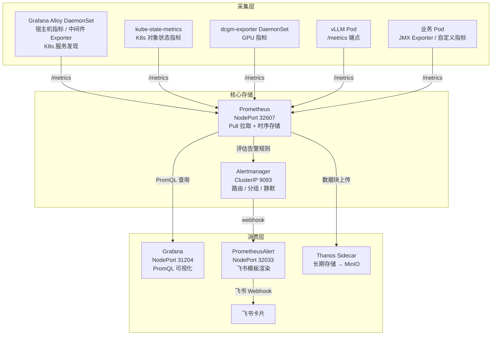

# Prometheus — 核心指标采集与存储

**更新日期：** 2026年06月04日
**信息来源：** 官方文档、GitHub 仓库、用户实测记录、社区实践
**参考地址：**

1. GitHub：[prometheus/prometheus](https://github.com/prometheus/prometheus)（64.3k stars）
2. 官方文档：[Prometheus Docs](https://prometheus.io/docs/introduction/overview/)
3. Helm Chart（kube-prometheus-stack）：[prometheus-community/helm-charts](https://github.com/prometheus-community/helm-charts/tree/main/charts/kube-prometheus-stack)
4. PromQL 查询指南：[Querying Prometheus](https://prometheus.io/docs/prometheus/latest/querying/basics/)
5. Alertmanager 文档：[Alertmanager](https://prometheus.io/docs/alerting/latest/alertmanager/)
6. Exporter 汇总：[Exporters and integrations](https://prometheus.io/docs/instrumenting/exporters/)

> Star 数会持续变化。正式对外汇报前建议以 GitHub 实时数据复核。

---

## 1. 结论摘要

Prometheus 是 CNCF 毕业项目，是云原生可观测性领域指标采集与存储的事实标准。它以 **Pull 模型**周期性抓取各目标暴露的 `/metrics` 端点，将数据存为带标签的时间序列，并提供 PromQL 查询语言和内置 Alertmanager 路由告警。

Prometheus 在本项目中通过 kube-prometheus-stack Helm Chart 部署，是整个可观测性体系的**指标数据中心**。所有 K8s 节点、Pod、vLLM 推理服务、GPU、中间件的指标都汇入 Prometheus，再由 Grafana 查询展示。

**对本项目的核心价值：** Prometheus 是指标链路的起点，上接 Alloy（Exporter 代理采集）、kube-state-metrics（K8s 状态），下接 Grafana（可视化）和 Alertmanager → PrometheusAlert → 飞书（告警推送），整条告警闭环依赖 Prometheus 的持续正确运行。

| 关键信息 | 值 |
| --- | --- |
| 访问地址 | `http://<NodeIP>:32607` |
| Alertmanager | ClusterIP 内网 `9093`（`kubectl port-forward` 临时暴露） |
| 部署方式 | kube-prometheus-stack v86.0.0 |
| 命名空间 | `monitoring` |
| 数据保留 | 默认 15 天（可配置 Thanos 扩展至长期存储） |
| 存储 | local-path PVC，10 Gi |
| 告警路由 | Alertmanager → PrometheusAlert → 飞书 |

---

## 2. 产品概况

| 项目 | 内容 |
| --- | --- |
| 产品名称 | Prometheus |
| 产品定位 | 开源云原生指标采集、存储与告警系统 |
| 主要形态 | 独立二进制 / Docker / Kubernetes Operator |
| 开源协议 | Apache-2.0 |
| 目标用户 | 平台工程师、SRE、运维团队 |
| 典型场景 | 基础设施监控、应用指标采集、SLO 告警、容量规划 |
| 部署方式 | 二进制、Docker、Kubernetes（kube-prometheus-stack Operator） |
| 当前版本 | 随 kube-prometheus-stack v86.0.0 部署 |
| 竞品 | VictoriaMetrics（更省内存）、InfluxDB（推模型）、Datadog（SaaS 商业）|

---

## 3. 产品定位与典型场景

| 场景 | Prometheus 解决的问题 | 价值 |
| --- | --- | --- |
| K8s 基础设施监控 | Pod / 节点 / Deployment 状态指标分散，难以汇总 | kube-state-metrics + node-exporter 开箱即用，配合 Grafana Dashboard 1860/15760 |
| AI 推理服务监控 | vLLM TTFT / TPOT / KV Cache 等 GPU 推理指标需自定义 | vLLM 内置 `/metrics` 端点，启动时加 `--enable-metrics` 即可接入 |
| GPU 资源监控 | DCGM 指标复杂，原始指标难以解读 | dcgm-exporter 暴露标准 Prometheus 格式，配合 Dashboard 12239 |
| 中间件健康监控 | PostgreSQL / Redis / Kafka 没有统一监控入口 | Alloy 内置对应 exporter，无需单独部署 |
| 告警驱动运维 | 告警条件分散、通知渠道不统一 | PrometheusRule CRD 管理规则，Alertmanager 路由到飞书 |
| SLO 误差预算 | 需要基于真实请求量计算可用性 | 通过 PromQL 计算 error_rate / latency P99 作为 SLO 指标 |
| 容量规划 | 预测节点资源趋势需要历史数据 | Thanos Sidecar 上传 MinIO 实现无限期历史查询 |

---

## 4. 技术架构



| 层级 | 说明 |
| --- | --- |
| 采集层 | 各目标暴露 `/metrics` HTTP 端点，Prometheus 周期性 Pull（默认 15s） |
| 核心存储层 | Prometheus 本地时序数据库（TSDB），默认保留 15 天；Alertmanager 负责告警路由 |
| 消费层 | Grafana 查询展示、Alertmanager 路由告警、Thanos 归档历史数据 |

---

## 5. 部署

### 5.1 Helm 安装 kube-prometheus-stack

Prometheus、Alertmanager、Grafana、kube-state-metrics 均由 kube-prometheus-stack 一次性部署，通过 Prometheus Operator 进行 CRD 管理。

```bash
# 在线安装
helm repo add prometheus-community https://prometheus-community.github.io/helm-charts
helm repo update
helm install prometheus kube-prometheus-stack-86.0.0.tgz \
  -f prom-values.yaml \
  --namespace monitoring \
  --create-namespace

# 离线安装（本项目实际方式）
# 1. 从 https://github.com/prometheus-community/helm-charts/pkgs/container/charts%2Fkube-prometheus-stack 下载
# 2. 得到 kube-prometheus-stack-86.0.0.tgz
helm install prometheus kube-prometheus-stack-86.0.0.tgz \
  -f prom-values.yaml \
  --namespace monitoring \
  --create-namespace

# 升级（修改 values 后执行）
helm upgrade prometheus kube-prometheus-stack-86.0.0.tgz \
  -f prom-values.yaml \
  --namespace monitoring
```

### 5.2 配置 prom-values.yaml

```yaml
# ── Prometheus 核心配置 ──────────────────────────────────
prometheus:
  prometheusSpec:
    # 数据保留时间（默认 15 天）
    retention: 15d
    # 持久化存储（绑定 local-path StorageClass）
    storageSpec:
      volumeClaimTemplate:
        spec:
          storageClassName: "local-path"
          accessModes: ["ReadWriteOnce"]
          resources:
            requests:
              storage: 10Gi
  service:
    type: NodePort
    nodePort: 32607

# ── 关闭被 Alloy 接管的内置组件 ──────────────────────────
# Alloy DaemonSet 已内置 prometheus.exporter.unix，替代 node-exporter
nodeExporter:
  enabled: false
# Alloy 内置 K8s 状态采集，但 kube-state-metrics 提供更完整的 CRD 指标，建议保留
kubeStateMetrics:
  enabled: true   # 如果 Alloy 已完整覆盖则改 false

# ── Alertmanager 配置 ────────────────────────────────────
alertmanager:
  enabled: true
  alertmanagerSpec:
    volumeClaimTemplate:
      spec:
        storageClassName: "local-path"
        accessModes: ["ReadWriteOnce"]
        resources:
          requests:
            storage: 2Gi
  config:
    global:
      resolve_timeout: 5m
    route:
      group_by: ['alertname', 'namespace']
      group_wait: 10m
      group_interval: 5s
      repeat_interval: 10m   # 不能太短，否则飞书会被刷屏
      receiver: 'web.hook.prometheusalert'
      routes:
        - matchers:
            - alertname = "Watchdog"
          receiver: 'web.hook.prometheusalert'
    receivers:
      - name: 'web.hook.prometheusalert'
        webhook_configs:
          - url: 'http://prometheus-alert-center.default.svc.cluster.local:8080/prometheusalert?type=fs&tpl=prometheus-fs&fsurl=https://open.feishu.cn/open-apis/bot/v2/hook/<your-webhook-id>'
    inhibit_rules:
      - equal: [namespace, alertname]
        source_matchers: [severity = critical]
        target_matchers: [severity =~ "warning|info"]
      - equal: [namespace, alertname]
        source_matchers: [severity = warning]
        target_matchers: [severity = info]
      - equal: [namespace]
        source_matchers: [alertname = InfoInhibitor]
        target_matchers: [severity = info]
      - target_matchers: [alertname = InfoInhibitor]

# ── Grafana（随 kube-prometheus-stack 一起部署）──────────
grafana:
  persistence:
    enabled: true
    storageClassName: "local-path"
    size: 5Gi
  initChownData:
    enabled: false   # 关闭会导致卡死的 initContainer
  securityContext: {}
  podSecurityContext: {}
  service:
    type: NodePort
    nodePort: 31204

# ── 关闭 etcd 监控抓取（托管 K8s 环境下 etcd 不可直接访问）──
kubeEtcd:
  enabled: false
```

### 5.3 镜像拉取（国内加速）

```bash
# kube-state-metrics（K8s 对象状态指标，Alloy 未接管时保留）
crictl pull k8s-gcr.m.daocloud.io/kube-state-metrics/kube-state-metrics:v2.19.0
ctr -n=k8s.io images tag \
  k8s-gcr.m.daocloud.io/kube-state-metrics/kube-state-metrics:v2.19.0 \
  registry.k8s.io/kube-state-metrics/kube-state-metrics:v2.19.0

# 辅助镜像
crictl pull docker.m.daocloud.io/library/busybox:1.38.0
ctr -n=k8s.io images tag \
  docker.m.daocloud.io/library/busybox:1.38.0 \
  docker.io/library/busybox:1.38.0

# Prometheus Alert 告警渲染组件
crictl pull docker.m.daocloud.io/feiyu563/prometheus-alert:v4.9.2
ctr -n=k8s.io images tag \
  docker.m.daocloud.io/feiyu563/prometheus-alert:v4.9.2 \
  docker.io/feiyu563/prometheus-alert:v4.9.2
```

---

## 6. 访问与验证

### 6.1 访问地址

| 服务 | 地址 | 说明 |
| --- | --- | --- |
| Prometheus UI | `http://<NodeIP>:32607` | NodePort，集群外访问；`/targets` 查看所有采集目标状态 |
| Prometheus API | `http://<NodeIP>:32607/api/v1/query` | HTTP API，Grafana 数据源使用此地址 |
| Alertmanager UI | ClusterIP 内网 `9093` | 需 `kubectl port-forward` 临时暴露，或配置 NodePort |

```bash
# 临时暴露 Alertmanager UI
kubectl port-forward -n monitoring svc/prometheus-kube-prometheus-alertmanager 9093:9093
# 浏览器访问 http://localhost:9093
```

### 6.2 已部署组件状态

```bash
kubectl get all -n monitoring
```

```
NAME                                                         READY   STATUS    RESTARTS   AGE
pod/alertmanager-prometheus-kube-prometheus-alertmanager-0   2/2     Running   0          24h
pod/prometheus-grafana-5f464d9594-4zs5r                      3/3     Running   0          27h
pod/prometheus-kube-prometheus-operator-658bf76d5-gb8n6      1/1     Running   0          29h
pod/prometheus-kube-state-metrics-f56f99797-tmqpl            1/1     Running   0          29h
pod/prometheus-prometheus-kube-prometheus-prometheus-0       2/2     Running   0          24h
pod/prometheus-prometheus-node-exporter-5gzzn                1/1     Running   0          29h

NAME                                                  TYPE        CLUSTER-IP     PORT(S)
service/prometheus-grafana                            NodePort    10.1.234.83    80:31204/TCP
service/prometheus-kube-prometheus-alertmanager       ClusterIP   10.1.222.115   9093/TCP,8080/TCP
service/prometheus-kube-prometheus-prometheus         NodePort    10.1.125.186   9090:32607/TCP,8080:32481/TCP
service/prometheus-kube-state-metrics                 ClusterIP   10.1.89.173    8080/TCP

NAME                                                                    READY   AGE
statefulset.apps/alertmanager-prometheus-kube-prometheus-alertmanager   1/1     24h
statefulset.apps/prometheus-prometheus-kube-prometheus-prometheus       1/1     29h
```

### 6.3 验证数据采集

```bash
# 检查所有采集目标状态（期望全为 UP）
# 浏览器访问：http://<NodeIP>:32607/targets

# 或用 API 查询
curl -s http://<NodeIP>:32607/api/v1/targets | \
  python3 -c "import sys,json; targets=json.load(sys.stdin)['data']['activeTargets']; \
  [print(t['labels'].get('job','?'), t['health']) for t in targets]"
```

Prometheus Targets 页面所有目标应显示为绿色 **UP**；若有 **DOWN**，点击对应行查看错误信息。

---

## 7. 指标采集配置

### 7.1 本项目采集目标清单

| 目标 | Exporter | 端口 / 路径 | 备注 |
| --- | --- | --- | --- |
| vLLM 推理服务 | vLLM 内置 metrics | `8000/metrics` | 启动时加 `--enable-metrics` |
| Java 应用 | JMX Exporter (javaagent) | `9779/metrics` | 端口可配置，勿与 node-exporter 9100 冲突 |
| K8s 节点 | Alloy 内置 `prometheus.exporter.unix` | `9100/metrics`（Alloy 暴露） | 无需单独部署 node-exporter；`prom-values.yaml` 中关闭 `nodeExporter.enabled` |
| K8s 集群状态 | kube-state-metrics | `8080/metrics` | 提供 `kube_pod_*`、`kube_deployment_*` 等 100+ 对象状态指标，Alloy 无法完整替代 |
| PostgreSQL | Alloy 内置 `prometheus.exporter.postgres` | `9187/metrics`（Alloy 暴露） | 无需单独部署 postgres_exporter |
| Redis | Alloy 内置 `prometheus.exporter.redis` | `9121/metrics`（Alloy 暴露） | 无需单独部署 redis_exporter |
| Nginx | nginx-prometheus-exporter | `9113/metrics` | 需开启 `stub_status` 模块 |
| Kafka | JMX Exporter (javaagent) | `9999/metrics` | 需在 Kafka 启动参数加 `-javaagent` |
| GPU | dcgm-exporter DaemonSet | `9400/metrics` | NVIDIA GPU 节点专属 DaemonSet |
| MinIO | MinIO 内置 metrics | `9000/minio/v2/metrics/cluster` | 需配置 Bearer Token 认证 |
| Harbor | Harbor 内置 metrics | `9090/metrics` | 需在 Harbor 配置中开启 `metric_enable: true` |
| Alloy 自身 | Alloy 内置 | `12345/metrics` | Grafana Alloy 自监控 |

### 7.2 通过 ServiceMonitor 添加自定义采集目标

kube-prometheus-stack 使用 Prometheus Operator，推荐用 `ServiceMonitor` CRD 声明采集目标，而非修改 `additionalScrapeConfigs`。

```yaml
# 示例：为 vLLM 创建 ServiceMonitor
apiVersion: monitoring.coreos.com/v1
kind: ServiceMonitor
metadata:
  name: vllm-metrics
  namespace: monitoring
  labels:
    release: prometheus   # 必须与 Prometheus CR 的 serviceMonitorSelector 匹配
spec:
  namespaceSelector:
    matchNames: [prod]
  selector:
    matchLabels:
      app: vllm
  endpoints:
    - port: metrics         # Service 中对应端口的 name
      path: /metrics
      interval: 15s
```

### 7.3 通过 additionalScrapeConfigs 添加静态目标

对于没有 K8s Service 的裸目标（如节点上直接暴露的 exporter），可用 `additionalScrapeConfigs`：

```yaml
# prom-values.yaml
prometheus:
  prometheusSpec:
    additionalScrapeConfigs:
      - job_name: 'dcgm-exporter'
        static_configs:
          - targets: ['<node-ip>:9400']
        relabel_configs:
          - source_labels: [__address__]
            target_label: instance
```

---

## 8. 常用 PromQL 查询示例

```promql
# ── 节点资源 ──────────────────────────────────────────────

# 各节点 CPU 使用率（%）
100 - (avg by (instance) (rate(node_cpu_seconds_total{mode="idle"}[5m])) * 100)

# 各节点内存使用率（%）
(1 - node_memory_MemAvailable_bytes / node_memory_MemTotal_bytes) * 100

# ── Pod / 容器 ────────────────────────────────────────────

# 指定 namespace 下各 Pod 的 CPU 使用量（核数）
sum by (pod) (rate(container_cpu_usage_seconds_total{namespace="prod", container!=""}[5m]))

# 各 Pod 内存使用量（MB）
sum by (pod) (container_memory_working_set_bytes{namespace="prod", container!=""}) / 1024 / 1024

# ── vLLM AI 推理 ──────────────────────────────────────────

# vLLM P99 请求延迟（秒）
histogram_quantile(0.99,
  sum by (le) (rate(vllm:e2e_request_latency_seconds_bucket[5m]))
)

# vLLM GPU KV Cache 使用率（%）
avg by (model_name) (vllm:gpu_cache_usage_perc) * 100

# vLLM 每秒生成 Token 数（Throughput）
sum(rate(vllm:generation_tokens_total[1m]))

# ── GPU ───────────────────────────────────────────────────

# GPU 利用率（%）
DCGM_FI_DEV_GPU_UTIL

# GPU 显存使用量（MB）
DCGM_FI_DEV_FB_USED

# ── 告警相关 ──────────────────────────────────────────────

# 当前 firing 中的告警列表
ALERTS{alertstate="firing"}

# 各 namespace 下 CrashLooping 的 Pod 数
count by (namespace) (kube_pod_container_status_waiting_reason{reason="CrashLoopBackOff"})
```

---

## 9. Alertmanager 告警配置

### 9.1 告警链路架构

```
Prometheus 评估 PrometheusRule CRD 中的 Alerting Rules
       ↓ 触发告警（firing）
Alertmanager（路由 / 分组 / 静默 / 抑制）
       ↓ webhook 推送
PrometheusAlert（NodePort 32033）
       ↓ 渲染飞书卡片模板
飞书 Webhook → 飞书群消息
```

### 9.2 PrometheusRule 告警规则示例

```yaml
apiVersion: monitoring.coreos.com/v1
kind: PrometheusRule
metadata:
  name: smartvision-alerts
  namespace: monitoring
  labels:
    release: prometheus   # 必须与 Prometheus CR 的 ruleSelector 匹配
spec:
  groups:
    - name: vllm.rules
      rules:
        - alert: vLLMHighLatency
          expr: |
            histogram_quantile(0.99,
              sum by (le) (rate(vllm:e2e_request_latency_seconds_bucket[5m]))
            ) > 5
          for: 5m
          labels:
            severity: warning
          annotations:
            summary: "vLLM P99 延迟超过 5 秒"
            description: "当前 P99 延迟 {{ $value | humanizeDuration }}，超过阈值 5s"

    - name: node.rules
      rules:
        - alert: NodeHighMemory
          expr: |
            (1 - node_memory_MemAvailable_bytes / node_memory_MemTotal_bytes) * 100 > 90
          for: 10m
          labels:
            severity: critical
          annotations:
            summary: "节点 {{ $labels.instance }} 内存使用率超过 90%"
```

### 9.3 Alertmanager 抑制规则说明

`prom-values.yaml` 中配置的 `inhibit_rules` 防止同一问题触发大量重复告警：

| 规则 | 含义 |
| --- | --- |
| critical 抑制 warning/info | 已触发严重告警时，不再重复发送同组的中低级告警 |
| warning 抑制 info | 中级告警触发时，静默同组信息级告警 |
| InfoInhibitor 抑制 info | 特殊标记的告警可作为全局 info 抑制开关 |

---

## 10. 高级配置

### 10.1 Recording Rules（预计算降低查询延迟）

Recording Rules 将高频复杂表达式预先汇聚成低频时序，显著降低 Grafana 仪表盘查询延迟。

```yaml
# prom-values.yaml
additionalPrometheusRulesMap:
  smartvision-recording:
    groups:
      - name: vllm_recording
        interval: 1m
        rules:
          # vLLM P99 请求延迟（预计算，Grafana 直接查 record 名称）
          - record: job:vllm_request_latency_p99:1m
            expr: |
              histogram_quantile(0.99,
                sum by (job, le) (
                  rate(vllm:e2e_request_latency_seconds_bucket[5m])
                )
              )
          # 各模型 KV Cache 平均使用率
          - record: job:vllm_kv_cache_usage:1m
            expr: avg by (model_name) (vllm:gpu_cache_usage_perc)

      - name: node_recording
        interval: 1m
        rules:
          # 各节点 CPU 使用率（消除 Grafana 内联子查询）
          - record: instance:node_cpu_utilisation:rate1m
            expr: |
              1 - avg without (cpu, mode) (
                rate(node_cpu_seconds_total{mode="idle"}[1m])
              )
          # 各节点内存使用率
          - record: instance:node_memory_utilisation:ratio
            expr: |
              1 - (node_memory_MemAvailable_bytes / node_memory_MemTotal_bytes)
```

### 10.2 长期存储（Thanos Sidecar）

Prometheus 默认保留 15 天指标，历史趋势分析需要接入 Thanos。详见 [Thanos.md](./Thanos.md)。

```yaml
# prom-values.yaml 添加 Thanos Sidecar
prometheus:
  prometheusSpec:
    retention: 2d          # 本地只保留 2 天，历史数据全部上传 MinIO
    retentionSize: "30GB"
    thanos:
      image: quay.io/thanos/thanos:v0.35.0
      objectStorageConfig:
        existingSecret:
          name: thanos-objstore-secret
          key: objstore.yml
```

```yaml
# thanos-objstore-secret（MinIO 对象存储配置）
type: S3
config:
  bucket: thanos-metrics
  endpoint: minio.middleware.svc:9000
  access_key: ${MINIO_ACCESS_KEY}   # 通过 K8s Secret 注入，不写明文
  secret_key: ${MINIO_SECRET_KEY}
  insecure: true
```

### 10.3 Remote Write 到 VictoriaMetrics（规模扩展路径）

当集群规模超过 200 节点或 Prometheus 内存压力持续过大时，可将写入路径切换到 VictoriaMetrics，全部 PromQL 查询无需修改。

```yaml
# prom-values.yaml 添加 Remote Write
prometheus:
  prometheusSpec:
    remoteWrite:
      - url: "http://victoriametrics.monitoring.svc:8428/api/v1/write"
        # 只转发重要指标，降低带宽消耗
        writeRelabelConfigs:
          - sourceLabels: [__name__]
            regex: "vllm:.*|dcgm_.*|pg_.*|redis_.*"
            action: keep
        queueConfig:
          capacity: 10000
          maxSamplesPerSend: 5000
```

---

## 11. 常见问题

### etcd TargetDown 告警（托管 K8s 环境）

**现象：** 所有 Pod 均 Running，但 Alertmanager 持续触发 `TargetDown` 告警：

```
事件: TargetDown
事件详情: 100% of the kube-etcd/prometheus-kube-prometheus-kube-etcd targets in kube-system namespace are down.
```

**原因：** 托管 K8s 环境（如阿里云 ACK、腾讯云 TKE）的 etcd 不暴露给用户访问，Prometheus 无法抓取。

**解决方案（二选一）：**

方案 A（推荐）：直接关闭 etcd 监控：
```yaml
# prom-values.yaml
kubeEtcd:
  enabled: false
```

方案 B：挂载 etcd 客户端证书（自建 K8s 生产多 Master 场景）：
```yaml
kubeEtcd:
  enabled: true
  endpoints: [<master-node-ip>]
  serviceMonitor:
    scheme: https
    insecureSkipVerify: true
    caFile: /etc/prometheus/secrets/etcd-certs/ca.crt
    certFile: /etc/prometheus/secrets/etcd-certs/client.crt
    keyFile: /etc/prometheus/secrets/etcd-certs/client.key
```
详见：https://github.com/helm/charts/issues/13605

---

### 引入 Alloy 后出现重复采集

**现象：** Grafana 中节点 CPU / 内存指标出现双份数据，曲线异常翻倍。

**原因：** Alloy 已接管 node-exporter 功能，但 kube-prometheus-stack 内置的 node-exporter DaemonSet 未关闭，导致同一指标被采集两次。

**解决方案：** 在 `prom-values.yaml` 关闭内置组件：

```yaml
nodeExporter:
  enabled: false   # Alloy DaemonSet 已内置 prometheus.exporter.unix

# 如果 Alloy 已完整覆盖 K8s 状态指标，也可关闭（否则保留）
kubeStateMetrics:
  enabled: false
```

---

### Watchdog 告警持续触发

**现象：** 飞书持续收到 `Watchdog` 告警消息，但集群一切正常。

**原因：** `Watchdog` 是 Prometheus 健康检查的"心跳"告警，设计上就是永久 firing，用于验证告警链路畅通。不应该让它真正推送到飞书。

**解决方案：** 在 `alertmanager.config.route.routes` 中为 Watchdog 指定静默 receiver，或直接路由到 `null`：

```yaml
routes:
  - matchers:
      - alertname = "Watchdog"
    receiver: 'null'   # 静默，不推送到飞书
receivers:
  - name: 'null'       # 空 receiver，不发任何通知
```

---

## 12. 参考文档

1. [Prometheus 官方文档](https://prometheus.io/docs/)
2. [kube-prometheus-stack Chart](https://github.com/prometheus-community/helm-charts/tree/main/charts/kube-prometheus-stack)
3. [Prometheus Operator CRD 参考](https://prometheus-operator.dev/docs/api-reference/api/)
4. [PromQL 函数手册](https://prometheus.io/docs/prometheus/latest/querying/functions/)
5. [Alertmanager 配置参考](https://prometheus.io/docs/alerting/latest/configuration/)
6. [Thanos 文档](https://thanos.io/tip/thanos/getting-started.md/)
7. [dcgm-exporter GitHub](https://github.com/NVIDIA/dcgm-exporter)