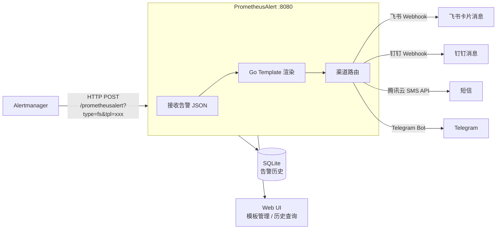
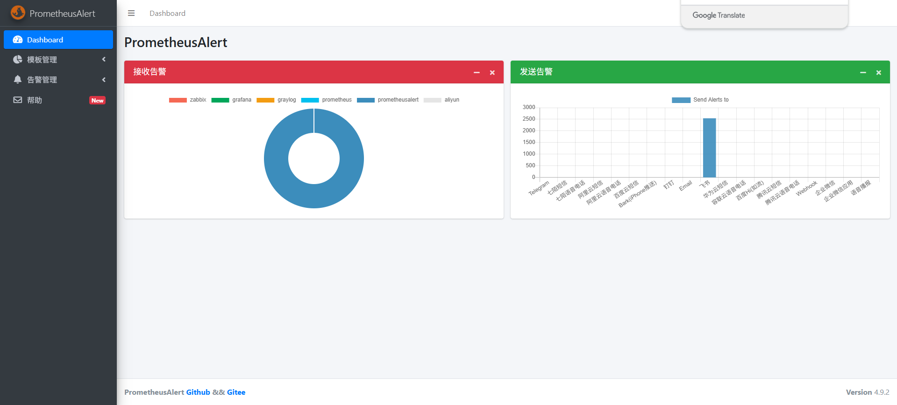
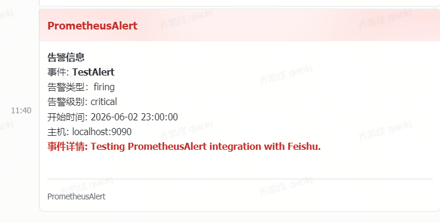
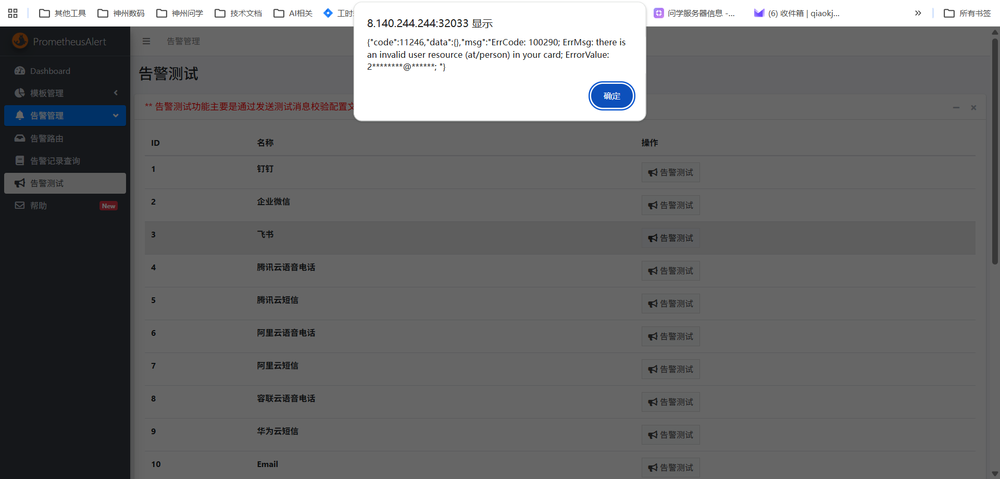

# PrometheusAlert — 告警通知渲染与多渠道分发

**更新日期：** 2026年06月04日
**信息来源：** 官方文档、GitHub 仓库、用户实测记录
**参考地址：**

1. GitHub：[feiyu563/PrometheusAlert](https://github.com/feiyu563/prometheusalert)（~3.3k stars）
2. 官方文档：[PrometheusAlert Wiki](https://github.com/feiyu563/PrometheusAlert/wiki)
3. 模板语法：[Go Template 文档](https://pkg.go.dev/text/template)

> Star 数会持续变化。正式对外汇报前建议以 GitHub 实时数据复核。

---

## 1. 结论摘要

PrometheusAlert 是国内开源的告警通知中转组件，专为中国 IM 渠道（飞书、钉钉、企业微信）设计。它接收来自 Alertmanager 的 Webhook 调用，使用 Go Template 将原始告警 JSON 渲染成富文本卡片消息后推送到目标渠道，是整条 `Prometheus → Alertmanager → 飞书` 告警链路中的**最后一跳**。

Alertmanager 原生的 webhook receiver 只能发送原始 JSON，无法生成飞书卡片、无法 @人、无法记录历史——PrometheusAlert 正是为弥补这些缺口而存在。

**对本项目的核心价值：** 已部署在 `default` 命名空间，NodePort `32033` 对外暴露，飞书通知渠道运行正常。后续如需增加通知渠道（短信、电话）或自定义卡片样式，只需修改 ConfigMap 中的模板，无需重新部署。

| 关键信息 | 值 |
| --- | --- |
| 访问地址（外部） | `http://<NodeIP>:32033` |
| 集群内 Service 地址 | `prometheus-alert-center.default.svc.cluster.local:8080` |
| 命名空间 | `default` |
| 镜像 | `feiyu563/prometheus-alert:v4.9.2` |
| 当前开启渠道 | 飞书（open-feishu=1） |
| 存储 | SQLite（内置，历史记录功能关闭） |

---

## 2. 产品概况

| 项目 | 内容 |
| --- | --- |
| 产品名称 | PrometheusAlert |
| 产品定位 | 告警通知渲染与多渠道分发组件 |
| 主要形态 | Go 单二进制 / Docker / K8s Deployment |
| 开源协议 | MIT |
| CNCF 状态 | 非 CNCF（国内开源） |
| 目标用户 | 需要接入飞书 / 钉钉 / 企业微信的运维团队 |
| 部署方式 | K8s Deployment + ConfigMap（本项目） |
| 当前版本 | v4.9.2 |
| 竞品 | Alertmanager 原生 Webhook（无卡片）、Grafana OnCall（重）|

---

## 3. 产品定位与典型场景

| 场景 | PrometheusAlert 解决的问题 | 价值 |
| --- | --- | --- |
| 飞书富文本告警卡片 | Alertmanager 原生只发 JSON，飞书显示为纯文本 | 渲染带颜色标题、告警详情、跳转按钮的卡片 |
| @OnCall 负责人 | Alertmanager 不支持 @ 特定用户 | URL 参数传入 `at_user_id`，自动 @ 值班人 |
| 多渠道同时通知 | P0 级需要同时飞书+短信 | URL 参数 `type=fs,txdx` 一次请求多渠道分发 |
| 告警历史记录 | Alertmanager 无持久化历史 | 内置 SQLite 记录全部告警，Web UI 可查询 |
| 模板热更新 | Alertmanager 改 Webhook 格式需重启 | Web UI 在线编辑模板，实时生效，无需重启 |
| 值班轮转 | 夜间告警通知不同的人 | 内置 `user.csv` 值班日历，自动轮转接收人 |

---

## 4. 技术架构



| 组件 | 说明 |
| --- | --- |
| 告警接收 | 监听 `/prometheusalert` 路由，接受 Alertmanager `webhook_configs` 推送 |
| Go Template 渲染 | 将 Alertmanager 告警 JSON 按指定模板名渲染为目标渠道格式 |
| 渠道路由 | URL 参数 `type=fs` 决定推送飞书；`type=fs,txdx` 同时推飞书+腾讯云短信 |
| Web UI | `http://<NodeIP>:32033` 登录后可管理模板、查看历史、测试推送 |
| SQLite | 存储告警历史记录（本项目默认关闭，可通过 `AlertRecord=1` 开启） |

---

## 5. 部署

### 5.1 镜像拉取（国内加速）

```bash
crictl pull docker.m.daocloud.io/feiyu563/prometheus-alert:v4.9.2
ctr -n=k8s.io images tag \
  docker.m.daocloud.io/feiyu563/prometheus-alert:v4.9.2 \
  docker.io/feiyu563/prometheus-alert:v4.9.2
```

### 5.2 K8s 部署清单

```yaml
# prometheus-alert-deployment.yaml
apiVersion: v1
kind: ConfigMap
metadata:
  name: prometheus-alert-center-conf
  # namespace: monitoring
data:
  app.conf: |
    appname = PrometheusAlert
    login_user=prometheusalert
    login_password=prometheusalert
    httpaddr = "0.0.0.0"
    httpport = 8080
    runmode = dev
    copyrequestbody = true
    title=PrometheusAlert
    db_driver=sqlite3
    AlertRecord=0
    RecordLive=0
    RecordLiveDay=7

    # 飞书通道（已开启）
    open-feishu=1
    fsmobile=0
    fsurl=https://open.feishu.cn/open-apis/bot/v2/hook/<your-webhook-id>

    # 其他通道（按需开启）
    open-dingding=0
    open-weixin=0
    open-txdx=0    # 腾讯云短信
    open-txdh=0    # 腾讯云语音电话
    open-email=0
  user.csv: |
    2019年4月10日,15888888881,小张,15999999999,备用联系人小陈,15999999998,备用联系人小赵
    2019年4月11日,15888888882,小李,15999999999,备用联系人小陈,15999999998,备用联系人小赵
---
apiVersion: apps/v1
kind: Deployment
metadata:
  name: prometheus-alert-center
  labels:
    app: prometheus-alert-center
spec:
  replicas: 1
  selector:
    matchLabels:
      app: prometheus-alert-center
  template:
    metadata:
      labels:
        app: prometheus-alert-center
    spec:
      containers:
        - name: prometheus-alert-center
          image: feiyu563/prometheus-alert:v4.9.2
          env:
            - name: TZ
              value: "Asia/Shanghai"
          ports:
            - containerPort: 8080
              name: http
          resources:
            limits:
              cpu: 200m
              memory: 200Mi
            requests:
              cpu: 100m
              memory: 100Mi
          volumeMounts:
            - name: conf
              mountPath: /app/conf/app.conf
              subPath: app.conf
            - name: conf
              mountPath: /app/user.csv
              subPath: user.csv
      volumes:
        - name: conf
          configMap:
            name: prometheus-alert-center-conf
---
apiVersion: v1
kind: Service
metadata:
  name: prometheus-alert-center
  annotations:
    prometheus.io/scrape: 'true'
    prometheus.io/port: '8080'
spec:
  type: NodePort
  ports:
    - name: http
      port: 8080
      targetPort: http
      nodePort: 32033
  selector:
    app: prometheus-alert-center
```

## 配置文件
```ini
# app.conf 关键配置项速查
  app.conf: |
    #---------------------↓全局配置-----------------------
    appname = PrometheusAlert
    #登录用户名
    login_user=prometheusalert
    #登录密码
    login_password=prometheusalert
    #监听地址
    httpaddr = "0.0.0.0"
    #监听端口
    httpport = 8080
    runmode = dev
    #设置代理 proxy = http://123.123.123.123:8080
    proxy =
    #开启JSON请求
    copyrequestbody = true
    #告警消息标题
    title=PrometheusAlert
    #链接到告警平台地址
    GraylogAlerturl=http://graylog.org
    #钉钉告警 告警logo图标地址
    logourl=https://raw.githubusercontent.com/feiyu563/PrometheusAlert/master/doc/alert-center.png
    #钉钉告警 恢复logo图标地址
    rlogourl=https://raw.githubusercontent.com/feiyu563/PrometheusAlert/master/doc/alert-center.png
    #短信告警级别(等于3就进行短信告警) 告警级别定义 0 信息,1 警告,2 一般严重,3 严重,4 灾难
    messagelevel=3
    #电话告警级别(等于4就进行语音告警) 告警级别定义 0 信息,1 警告,2 一般严重,3 严重,4 灾难
    phonecalllevel=4
    #默认拨打号码(页面测试短信和电话功能需要配置此项)
    defaultphone=xxxxxxxx
    #故障恢复是否启用电话通知0为关闭,1为开启
    phonecallresolved=0
    #是否前台输\出file or console
    logtype=file
    #日志文件路径
    logpath=logs/prometheusalertcenter.log
    #转换Prometheus,graylog告警消息的时区为CST时区(如默认已经是CST时区，请勿开启)
    prometheus_cst_time=0
    #数据库驱动，支持sqlite3，mysql,postgres如使用mysql或postgres，请开启db_host,db_port,db_user,db_password,db_name的注释
    db_driver=sqlite3
    #db_host=127.0.0.1
    #db_port=3306
    #db_user=root
    #db_password=root
    #db_name=prometheusalert
    #是否开启告警记录 0为关闭,1为开启
    AlertRecord=0
    #是否开启告警记录定时删除 0为关闭,1为开启
    RecordLive=0
    #告警记录定时删除周期，单位天
    RecordLiveDay=7
    # 是否将告警记录写入es7，0为关闭，1为开启
    alert_to_es=0
    # es地址，是[]string
    # beego.Appconfig.Strings读取配置为[]string，使用";"而不是","
    to_es_url=http://localhost:9200
    # to_es_url=http://es1:9200;http://es2:9200;http://es3:9200
    # es用户和密码
    # to_es_user=username
    # to_es_pwd=password
    # 长连接最大空闲数
    maxIdleConns=100
    # 热更新配置文件
    open-hotreload=0
    
    #---------------------↓webhook-----------------------
    #是否开启钉钉告警通道,可同时开始多个通道0为关闭,1为开启
    open-dingding=0
    #默认钉钉机器人地址
    ddurl=https://oapi.dingtalk.com/robot/send?access_token=xxxxx
    #是否开启 @所有人(0为关闭,1为开启)
    dd_isatall=1
    #是否开启钉钉机器人加签，0为关闭,1为开启
    # 使用方法：https://oapi.dingtalk.com/robot/send?access_token=XXXXXX&secret=mysecret
    open-dingding-secret=0
    
    #是否开启微信告警通道,可同时开始多个通道0为关闭,1为开启
    open-weixin=0
    #默认企业微信机器人地址
    wxurl=https://qyapi.weixin.qq.com/cgi-bin/webhook/send?key=xxxxx
    
    #是否开启飞书告警通道,可同时开始多个通道0为关闭,1为开启
    open-feishu=1
    fsmobile=0
    #默认飞书机器人地址
    fsurl=https://open.feishu.cn/open-apis/bot/v2/hook/90f43268-45ff-4016-8a0f-8ab52898b89c
    # webhook 发送 http 请求的 contentType, 如 application/json, application/x-www-form-urlencoded，不配置默认 application/json
    wh_contenttype=application/json
    
    #---------------------↓腾讯云接口-----------------------
    #是否开启腾讯云短信告警通道,可同时开始多个通道0为关闭,1为开启
    open-txdx=0
    #腾讯云短信接口key
    TXY_DX_appkey=xxxxx
    #腾讯云短信模版ID 腾讯云短信模版配置可参考 prometheus告警:{1}
    TXY_DX_tpl_id=xxxxx
    #腾讯云短信sdk app id
    TXY_DX_sdkappid=xxxxx
    #腾讯云短信签名 根据自己审核通过的签名来填写
    TXY_DX_sign=腾讯云
    
    #是否开启腾讯云电话告警通道,可同时开始多个通道0为关闭,1为开启
    open-txdh=0
    #腾讯云电话接口key
    TXY_DH_phonecallappkey=xxxxx
    #腾讯云电话模版ID
    TXY_DH_phonecalltpl_id=xxxxx
    #腾讯云电话sdk app id
    TXY_DH_phonecallsdkappid=xxxxx
    
    #---------------------↓华为云接口-----------------------
    #是否开启华为云短信告警通道,可同时开始多个通道0为关闭,1为开启
    open-hwdx=0
    #华为云短信接口key
    HWY_DX_APP_Key=xxxxxxxxxxxxxxxxxxxxxx
    #华为云短信接口Secret
    HWY_DX_APP_Secret=xxxxxxxxxxxxxxxxxxxxxx
    #华为云APP接入地址(端口接口地址)
    HWY_DX_APP_Url=https://rtcsms.cn-north-1.myhuaweicloud.com:10743
    #华为云短信模板ID
    HWY_DX_Templateid=xxxxxxxxxxxxxxxxxxxxxx
    #华为云签名名称，必须是已审核通过的，与模板类型一致的签名名称,按照自己的实际签名填写
    HWY_DX_Signature=华为云
    #华为云签名通道号
    HWY_DX_Sender=xxxxxxxxxx
    
    #---------------------↓阿里云接口-----------------------
    #是否开启阿里云短信告警通道,可同时开始多个通道0为关闭,1为开启
    open-alydx=0
    #阿里云短信主账号AccessKey的ID
    ALY_DX_AccessKeyId=xxxxxxxxxxxxxxxxxxxxxx
    #阿里云短信接口密钥
    ALY_DX_AccessSecret=xxxxxxxxxxxxxxxxxxxxxx
    #阿里云短信签名名称
    ALY_DX_SignName=阿里云
    #阿里云短信模板ID
    ALY_DX_Template=xxxxxxxxxxxxxxxxxxxxxx
    
    #是否开启阿里云电话告警通道,可同时开始多个通道0为关闭,1为开启
    open-alydh=0
    #阿里云电话主账号AccessKey的ID
    ALY_DH_AccessKeyId=xxxxxxxxxxxxxxxxxxxxxx
    #阿里云电话接口密钥
    ALY_DH_AccessSecret=xxxxxxxxxxxxxxxxxxxxxx
    #阿里云电话被叫显号，必须是已购买的号码
    ALY_DX_CalledShowNumber=xxxxxxxxx
    #阿里云电话文本转语音（TTS）模板ID
    ALY_DH_TtsCode=xxxxxxxx
    
    #---------------------↓容联云接口-----------------------
    #是否开启容联云电话告警通道,可同时开始多个通道0为关闭,1为开启
    open-rlydh=0
    #容联云基础接口地址
    RLY_URL=https://app.cloopen.com:8883/2013-12-26/Accounts/
    #容联云后台SID
    RLY_ACCOUNT_SID=xxxxxxxxxxx
    #容联云api-token
    RLY_ACCOUNT_TOKEN=xxxxxxxxxx
    #容联云app_id
    RLY_APP_ID=xxxxxxxxxxxxx
    
    #---------------------↓邮件配置-----------------------
    #是否开启邮件
    open-email=0
    #邮件发件服务器地址
    Email_host=smtp.qq.com
    #邮件发件服务器端口
    Email_port=465
    #邮件帐号
    Email_user=xxxxxxx@qq.com
    #邮件密码
    Email_password=xxxxxx
    #邮件标题
    Email_title=运维告警
    #默认发送邮箱
    Default_emails=xxxxx@qq.com,xxxxx@qq.com
    
    #---------------------↓七陌云接口-----------------------
    #是否开启七陌短信告警通道,可同时开始多个通道0为关闭,1为开启
    open-7moordx=0
    #七陌账户ID
    7MOOR_ACCOUNT_ID=Nxxx
    #七陌账户APISecret
    7MOOR_ACCOUNT_APISECRET=xxx
    #七陌账户短信模板编号
    7MOOR_DX_TEMPLATENUM=n
    #注意：七陌短信变量这里只用一个var1，在代码里写死了。
    #-----------
    #是否开启七陌webcall语音通知告警通道,可同时开始多个通道0为关闭,1为开启
    open-7moordh=0
    #请在七陌平台添加虚拟服务号、文本节点
    #七陌账户webcall的虚拟服务号
    7MOOR_WEBCALL_SERVICENO=xxx
    # 文本节点里被替换的变量，我配置的是text。如果被替换的变量不是text，请修改此配置
    7MOOR_WEBCALL_VOICE_VAR=text
    
    #---------------------↓telegram接口-----------------------
    #是否开启telegram告警通道,可同时开始多个通道0为关闭,1为开启
    open-tg=0
    #tg机器人token
    TG_TOKEN=xxxxx
    #tg消息模式 个人消息或者频道消息 0为关闭(推送给个人)，1为开启(推送给频道)
    TG_MODE_CHAN=0
    #tg用户ID
    TG_USERID=xxxxx
    #tg频道name或者id, 频道name需要以@开始
    TG_CHANNAME=xxxxx
    #tg api地址, 可以配置为代理地址
    #TG_API_PROXY="https://api.telegram.org/bot%s/%s"
    
    #---------------------↓workwechat接口-----------------------
    #是否开启workwechat告警通道,可同时开始多个通道0为关闭,1为开启
    open-workwechat=0
    # 企业ID
    WorkWechat_CropID=xxxxx
    # 应用ID
    WorkWechat_AgentID=xxxx
    # 应用secret
    WorkWechat_AgentSecret=xxxx
    # 接受用户
    WorkWechat_ToUser="zhangsan|lisi"
    # 接受部门
    WorkWechat_ToParty="ops|dev"
    # 接受标签
    WorkWechat_ToTag=""
    # 消息类型, 暂时只支持markdown
    # WorkWechat_Msgtype = "markdown"
    
    #---------------------↓百度云接口-----------------------
    #是否开启百度云短信告警通道,可同时开始多个通道0为关闭,1为开启
    open-baidudx=0
    #百度云短信接口AK(ACCESS_KEY_ID)
    BDY_DX_AK=xxxxx
    #百度云短信接口SK(SECRET_ACCESS_KEY)
    BDY_DX_SK=xxxxx
    #百度云短信ENDPOINT（ENDPOINT参数需要用指定区域的域名来进行定义，如服务所在区域为北京，则为）
    BDY_DX_ENDPOINT=http://smsv3.bj.baidubce.com
    #百度云短信模版ID,根据自己审核通过的模版来填写(模版支持一个参数code：如prometheus告警:{code})
    BDY_DX_TEMPLATE_ID=xxxxx
    #百度云短信签名ID，根据自己审核通过的签名来填写
    TXY_DX_SIGNATURE_ID=xxxxx
    
    #---------------------↓百度Hi(如流)-----------------------
    #是否开启百度Hi(如流)告警通道,可同时开始多个通道0为关闭,1为开启
    open-ruliu=0
    #默认百度Hi(如流)机器人地址
    BDRL_URL=https://api.im.baidu.com/api/msg/groupmsgsend?access_token=xxxxxxxxxxxxxx
    #百度Hi(如流)群ID
    BDRL_ID=123456
    #---------------------↓bark接口-----------------------
    #是否开启telegram告警通道,可同时开始多个通道0为关闭,1为开启
    open-bark=0
    #bark默认地址, 建议自行部署bark-server
    BARK_URL=https://api.day.app
    #bark key, 多个key使用分割
    BARK_KEYS=xxxxx
    # 复制, 推荐开启
    BARK_COPY=1
    # 历史记录保存,推荐开启
    BARK_ARCHIVE=1
    # 消息分组
    BARK_GROUP=PrometheusAlert
    
    #---------------------↓语音播报-----------------------
    #语音播报需要配合语音播报插件才能使用
    #是否开启语音播报通道,0为关闭,1为开启
    open-voice=0
    VOICE_IP=127.0.0.1
    VOICE_PORT=9999
    
    #---------------------↓飞书机器人应用-----------------------
    #是否开启feishuapp告警通道,可同时开始多个通道0为关闭,1为开启
    open-feishuapp=0
    # APPID
    FEISHU_APPID=cli_xxxxxxxxxxxxx
    # APPSECRET
    FEISHU_APPSECRET=xxxxxxxxxxxxxxxxxxxxxx
    # 可填飞书 用户open_id、user_id、union_ids、部门open_department_id
    AT_USER_ID="xxxxxxxx"
    
    
    #---------------------↓告警组-----------------------
    # 有其他新增的配置段，请放在告警组的上面
    # 暂时仅针对 PrometheusContronller 中的 /prometheus/alert 路由
    # 告警组如果放在了 wx, dd... 那部分的上分，beego section 取 url 值不太对。
    # 所以这里使用 include 来包含另告警组配置
    
    # 是否启用告警组功能
    open-alertgroup=0
    
    # 自定义的告警组既可以写在这里，也可以写在单独的文件里。
    # 写在单独的告警组配置里更便于修改。
    # include "alertgroup.conf"
    
    #---------------------↓kafka地址-----------------------
    # kafka服务器的地址
    open-kafka=0
    kafka_server = 127.0.0.1:9092
    # 写入消息的kafka topic
    kafka_topic = devops
    # 用户标记该消息是来自PrometheusAlert,一般无需修改
    kafka_key = PrometheusAlert
  user.csv: |
    2019年4月10日,15888888881,小张,15999999999,备用联系人小陈,15999999998,备用联系人小赵
    2019年4月11日,15888888882,小李,15999999999,备用联系人小陈,15999999998,备用联系人小赵
    2019年4月12日,15888888883,小王,15999999999,备用联系人小陈,15999999998,备用联系人小赵
    2019年4月13日,15888888884,小宋,15999999999,备用联系人小陈,15999999998,备用联系人小赵
```

---

## 6. 访问与验证

### 6.1 访问地址

| 服务 | 地址 | 说明 |
| --- | --- | --- |
| Web UI（外部） | `http://<NodeIP>:32033` | 模板管理、历史查询、测试推送 |
| Service（集群内） | `prometheus-alert-center.default.svc.cluster.local:8080` | Alertmanager Webhook 目标地址 |

WebUI
登录默认用户名/密码为 `prometheusalert/prometheusalert`，登录后可在**告警模板**页面查看和编辑内置的 `prometheus-fs` 飞书模板，修改后无需重启，立即生效。


### 6.2 已部署状态

```bash
kubectl get svc prometheus-alert-center
# service/prometheus-alert-center   NodePort    10.1.193.64   <none>   8080:32033/TCP   26h
```

### 6.3 手动测试推送

```bash
# 测试飞书告警推送（模拟一条 firing 告警）
curl -X POST \
  "http://<NodeIP>:32033/prometheusalert?type=fs&tpl=prometheus-fs&fsurl=https://open.feishu.cn/open-apis/bot/v2/hook/<your-webhook-id>" \
  -H 'Content-Type: application/json' \
  -d '{
    "status": "firing",
    "alerts": [{
      "labels": {"alertname": "TestAlert", "severity": "warning", "namespace": "prod"},
      "annotations": {"summary": "测试告警", "description": "这是一条测试消息"},
      "startsAt": "2026-06-04T10:00:00Z"
    }]
  }'
```

eg:
```bash
curl -X POST 'http://8.140.244.244:32033/prometheusalert?type=fs&tpl=prometheus-fs&fsurl=https://open.feishu.cn/open-apis/bot/v2/hook/90f43268-45ff-4016-8a0f-8ab52898b89c' \
  -H 'Content-Type: application/json' \
  -d '{
  "version": "4",
  "groupKey": "test-group",
  "status": "firing",
  "receiver": "test",
  "groupLabels": {},
  "commonLabels": {
    "alertname": "TestAlert",
    "severity": "critical",
    "level": "critical"
  },
  "commonAnnotations": {},
  "externalURL": "http://prometheus.example.com",
  "alerts": [
    {
      "status": "firing",
      "labels": {
        "alertname": "TestAlert",
        "instance": "localhost:9090",
        "severity": "critical",
        "level": "critical"
      },
      "annotations": {
        "summary": "This is a test alert",
        "description": "Testing PrometheusAlert integration with Feishu."
      },
      "startsAt": "2026-06-02T15:00:00Z",
      "endsAt": "0001-01-01T00:00:00Z",
      "generatorURL": ""
    }
  ]
}'
"{\"StatusCode\":0,\"StatusMessage\":\"success\",\"code\":0,\"data\":{},\"msg\":\"success\"}"
```

飞书群收到卡片消息则验证通过，如下图：



---

## 7. 告警模板配置

### 7.1 Alertmanager Webhook URL 格式

PrometheusAlert 的调用入口统一为 `/prometheusalert`，通过 URL 参数控制渠道和模板：

```
# 基础格式
http://prometheus-alert-center.default.svc.cluster.local:8080/prometheusalert
  ?type=fs                          # 渠道：fs=飞书, dd=钉钉, wx=企业微信, txdx=腾讯云短信
  &tpl=prometheus-fs                # 模板名（在 Web UI 中创建/编辑）
  &fsurl=https://open.feishu.cn/open-apis/bot/v2/hook/<token>   # 飞书 Webhook URL

# 同时发飞书 + 短信（P0 级告警）
?type=fs,txdx&tpl=prometheus-fs&fsurl=<飞书token>&txdx_tpl_id=<短信模板ID>

# @ 指定用户（OnCall 值班人）
?type=fs&tpl=prometheus-fs&fsurl=<token>&at_user_id=<飞书用户open_id>
```

### 7.2 飞书卡片模板示例

```
{{/* 模板名：prometheus-fs（内置默认模板，可在 Web UI 中查看和修改）*/}}
{{$status := .Status}}

**【SmartVision 告警】** {{if eq $status "firing"}}🔴 触发{{else}}✅ 恢复{{end}}

{{range .Alerts}}
- **名称**: {{.Labels.alertname}}
- **环境**: {{.Labels.namespace}}
- **级别**: {{.Labels.severity}}
- **摘要**: {{.Annotations.summary}}
- **详情**: {{.Annotations.description}}
- **时间**: {{.StartsAt.Format "2006-01-02 15:04:05"}}
{{if .Labels.runbook_url}}- **运维手册**: [点击查看]({{.Labels.runbook_url}}){{end}}
{{end}}
```

模板通过 Web UI（**告警模板 → 新增模板**）创建后，在 Alertmanager 的 Webhook URL 中通过 `tpl=<模板名>` 引用。

### 7.3 app.conf 关键配置项速查

| 配置项 | 说明 | 本项目当前值 |
| --- | --- | --- |
| `open-feishu` | 是否开启飞书通道 | `1`（已开启） |
| `fsurl` | 默认飞书 Webhook 地址 | 已配置 |
| `AlertRecord` | 是否记录告警历史到 SQLite | `0`（关闭） |
| `RecordLive` | 是否定时清理历史记录 | `0`（关闭） |
| `open-txdx` | 腾讯云短信 | `0`（按需开启） |
| `open-email` | 邮件通道 | `0`（按需开启） |
| `prometheus_cst_time` | 是否将时间转为 CST 时区 | `0`（Prometheus 时间已为 CST 则无需开启） |

---

## 8. PrometheusAlert vs Alertmanager 原生 Webhook

| 维度 | PrometheusAlert | Alertmanager 直接 Webhook |
| --- | --- | --- |
| 飞书富文本卡片 | ✅ 完整卡片样式 | ⚠️ 仅原始 JSON 文本 |
| 模板可视化编辑 | ✅ Web UI 热更新 | ❌ 改 YAML 需重启 |
| @ 指定人员 | ✅ URL 参数传入 | ❌ 不支持 |
| 告警历史记录 | ✅ 内置 SQLite | ❌ 无持久化 |
| 多渠道同时分发 | ✅ `type=fs,txdx` | ❌ 每个渠道独立 receiver |
| 值班轮转 | ✅ user.csv 日历 | ❌ 不支持 |
| 维护复杂度 | 额外一个组件 | 更简单 |
| 推荐场景 | **国内飞书 / 钉钉 / 企业微信** | 纯英文场景（PagerDuty / Slack） |

---

## 9. 常见问题

### 飞书收不到告警消息

1. 检查 Alertmanager 是否正常推送到 PrometheusAlert：
   ```bash
   # 查看 PrometheusAlert Pod 日志
   kubectl logs -l app=prometheus-alert-center --tail=50
   ```
2. 检查 Webhook URL 中的飞书 Token 是否有效
3. 检查飞书机器人是否被添加到群，且群内机器人权限正常
4. 用上面的 `curl` 命令手动测试推送，排查是 Alertmanager 侧还是 PrometheusAlert 侧的问题

---

### 模板渲染报错

**现象：** 飞书收到消息但内容为空或格式异常。

**排查：** 在 Web UI → **告警模板 → 测试** 中粘贴一段真实的 Alertmanager 告警 JSON，直接预览渲染结果，定位模板语法问题。

---

### 告警时间显示为 UTC

**原因：** Prometheus 默认输出 UTC 时间，PrometheusAlert 不会自动转换。

**解决：** 在 `app.conf` 中设置 `prometheus_cst_time=1`，PrometheusAlert 会将时间自动转为 CST（+8）。

### 页面配置模板后无法生效
未知原因，待调查

### 页面点击测试连接失败，但是用curl命令测试却成功了
bug清单里有该报错，但无人解决:
```bash
"{\"code\":11246,\"data\":{},\"msg\":\"ErrCode: 100290; ErrMsg: there is an invalid user resource (at/person) in your card; ErrorValue: 2********@******; \"}"
```


### 用 SQLite 的缺陷是什么，页面查不到告警历史

**根本原因：** PrometheusAlert 默认将 SQLite 数据库文件存储在容器内的 `/app/db/` 路径下，未挂载持久化存储。K8s Pod 重启后，数据库文件随容器销毁，历史记录全部丢失。

此外，本项目当前配置中 `AlertRecord=0`，即**告警记录功能本身处于关闭状态**，PrometheusAlert 不会将任何告警写入 SQLite，因此 Web UI 历史页面永远为空。

**SQLite 在容器化环境中的固有缺陷：**

| 缺陷 | 说明 |
| --- | --- |
| 无持久化 | 默认存储在容器内，Pod 重启即丢失 |
| 不支持多副本 | SQLite 是文件锁实现，`replicas > 1` 会写冲突 |
| 无远程访问 | 不能直接从外部查询数据库 |
| 容量有限 | 大量告警写入时性能劣化，无自动分片 |

**解决方案对比：**

| 方案 | 操作 | 适合场景 |
| --- | --- | --- |
| 开启 SQLite + PVC 持久化 | 挂载 PVC 到 `/app/db/`，设置 `AlertRecord=1` | 告警量小、不需要多副本 |
| 切换到 MySQL/PostgreSQL | `db_driver=mysql` + 配置外部数据库连接 | 生产环境、需要持久化和多副本 |
| 不依赖 PrometheusAlert 历史 | 用 Alertmanager 的 `/api/v1/alerts` + Loki 存日志 | 历史查询已有其他手段 |

**快速开启（SQLite + PVC）：**

1. 在 ConfigMap 中将 `AlertRecord=0` 改为 `AlertRecord=1`
2. 为 Deployment 增加 PVC 挂载：
   ```yaml
   # Deployment volumeMounts 新增
   - name: db
     mountPath: /app/db
   # volumes 新增
   - name: db
     persistentVolumeClaim:
       claimName: prometheus-alert-db
   ```
3. 创建对应 PVC（`storageClassName: local-path`，1Gi 足够）

> **当前建议：** 本项目告警历史已可通过 Loki（`{app="alertmanager"}` 日志）追溯，PrometheusAlert 的 SQLite 历史功能暂无必要开启。

---

## 10. 参考文档

1. [PrometheusAlert GitHub](https://github.com/feiyu563/PrometheusAlert)
2. [PrometheusAlert Wiki — 模板写法](https://github.com/feiyu563/PrometheusAlert/wiki)
3. [Go Template 语法参考](https://pkg.go.dev/text/template)
4. [飞书自定义机器人文档](https://open.feishu.cn/document/client-docs/bot-v3/add-custom-bot)

