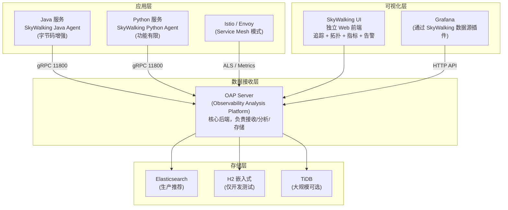
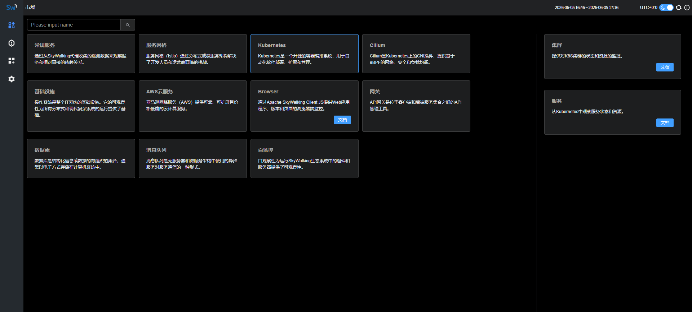

# SkyWalking — APM 一体化平台（对比参考）

**更新日期：** 2026年06月04日
**信息来源：** 官方文档、GitHub 仓库、Apache 资料、社区实践
**参考地址：**

1. GitHub：[apache/skywalking](https://github.com/apache/skywalking)（~23k stars）
2. 官方文档：[skywalking.apache.org/docs](https://skywalking.apache.org/docs/)
3. Helm Chart：[apache/skywalking-kubernetes](https://github.com/apache/skywalking-kubernetes)
4. SkyWalking vs OTel：[官方对比博客](https://skywalking.apache.org/blog/)
5. Java Agent：[SkyWalking Java Agent](https://skywalking.apache.org/docs/skywalking-java/next/en/setup/service-agent/java-agent/readme/)

> SkyWalking 是国内 Java 微服务生态使用最广泛的 APM 工具之一。本项目选用 OTel + Tempo 方案，但 SkyWalking 在纯 Java 微服务项目中依然是有竞争力的选择。

---

## 1. 结论摘要

Apache SkyWalking 是 Apache 顶级项目，发源于华为，是国内 Java 微服务领域使用最为广泛的 APM（Application Performance Monitoring）一体化平台。它将分布式追踪、服务拓扑分析、指标聚合、日志关联、告警规则集成在一个系统中，是"All-in-One APM"的代表。

SkyWalking 的核心优势在于：
1. **Java Agent 极其成熟**：自动插桩支持 Spring Boot、Dubbo、MyBatis、gRPC 等 200+ 框架
2. **SkyWalking UI 功能丰富**：服务拓扑、依赖分析、慢端点排查等开箱即用
3. **国内社区活跃**：中文文档完善，国内大量企业生产实践案例

**本项目未采用 SkyWalking 的核心原因**：
1. 项目有大量 Python/AI 服务（vLLM），SkyWalking Python Agent 功能弱于 OTel Python SDK
2. 已选定 Grafana 作为统一可视化平台，引入 SkyWalking UI 会导致工具割裂
3. SkyWalking OAP Server + ES 的运维成本高于 OTel Collector + Tempo（对象存储）
4. 标准统一性：SkyWalking 自有协议与 OTel/OTLP 标准不完全兼容（虽然有 OTel 兼容模式）

| 关键信息 | 值 |
| --- | --- |
| Apache 状态 | Apache 顶级项目（TLP，2019年毕业）|
| 开源协议 | Apache 2.0 |
| 实现语言 | Java（OAP Server）+ 各语言 Agent |
| 存储后端 | H2（嵌入式）、Elasticsearch、MySQL、TiDB、InfluxDB |
| 定位 | All-in-One APM（追踪 + 指标 + 日志 + 告警 + 拓扑）|
| Stars | ~23k（GitHub）|
| 当前版本 | 10.x |

---

## 2. 产品概况

| 项目 | 内容 |
| --- | --- |
| 产品名称 | Apache SkyWalking |
| 产品定位 | All-in-One APM 平台（分布式追踪 + 服务网格遥测 + 指标聚合 + 告警）|
| 开发者 | 吴晟（Sheng Wu）发起，华为贡献，现 Apache 社区维护 |
| Apache 状态 | ✅ Apache 顶级项目（2019年）|
| 历史 | 2015年发起，2017年进入 Apache 孵化，2019年毕业 |
| 主要形态 | OAP Server（后端）+ UI + 各语言 Agent |
| 存储依赖 | Elasticsearch（生产推荐）或 H2（测试）|
| 目标用户 | Java 微服务团队，希望开箱即用的一体化 APM，不需要自行组合工具链 |

---

## 3. 核心架构

### 3.1 整体架构



### 3.2 核心组件

| 组件 | 说明 |
| --- | --- |
| OAP Server | 核心后端，接收 Agent 数据，执行分析流式计算，写入存储 |
| SkyWalking UI | 独立前端，提供追踪/拓扑/指标/告警可视化 |
| Java Agent | 字节码增强，支持 200+ 框架，零代码接入 |
| Python Agent | 支持 Django/Flask/FastAPI，功能弱于 Java Agent |
| 存储层 | 默认 H2（开发），生产使用 ES 8.x |
| OTel Receiver | OAP 可接收 OTLP 数据（兼容 OTel SDK）|

---

## 4. 核心能力

### 4.1 分布式追踪

SkyWalking 链路追踪与 Jaeger/Tempo 功能对等，但 UI 在某些维度更丰富：

- **Trace 列表视图**：按服务/端点/状态/延迟过滤，支持模糊搜索
- **Span 瀑布图**：可视化每个 Span 的执行时间
- **Topology 关联**：从链路直接跳转到服务拓扑
- **Profile 分析（高级）**：对慢链路做方法级 CPU Profiling（Java only）

### 4.2 服务拓扑自动发现

SkyWalking 最受用户好评的功能之一：OAP Server 自动从链路数据中提取服务调用关系，绘制实时服务依赖拓扑图：

- 节点 = 服务，边 = 调用关系
- 边上显示 SLA（成功率）、吞吐量、平均延迟
- 支持下钻到某条边查看该调用的详细指标和链路

### 4.3 性能指标聚合（MAL — Metrics Analysis Language）

SkyWalking 使用 MAL（类 PromQL 语法）定义指标聚合规则，自动从链路数据计算 RED 指标并存储：

```yaml
# skywalking-oap-server/config/oap-application.yaml 中的 MAL 规则示例
metrics:
  service_sla:
    expression: "sum(endpoint_sla) / count(endpoint_sla)"
    # 自动计算每个服务的 SLA
```

### 4.4 多维度告警

SkyWalking 内置告警规则引擎，直接对接 OAP 内的指标触发告警：

```yaml
# alarm-settings.yml
rules:
  service_resp_time_rule:
    metrics-name: service_resp_time
    op: ">"
    threshold: 1000  # ms
    period: 10  # 分钟
    count: 3    # 10分钟内超过3次
    message: "服务 ${name} 响应时间超过 1s"
    hooks:
      - name: feishu-hook  # 飞书 Webhook
```

---

## 5. 部署方式

### 5.1 Helm 部署（K8s 生产）

```bash
helm repo add skywalking https://apache.jfrog.io/artifactory/skywalking-helm
helm repo update

cat <<EOF > sw-values.yaml
oap:
  replicas: 2
  javaOpts: "-Xms2g -Xmx4g"
  storageType: elasticsearch
  env:
    SW_STORAGE_ES_CLUSTER_NODES: "elasticsearch-master.elastic.svc.cluster.local:9200"
    SW_STORAGE_ES_USER: elastic
    SW_STORAGE_ES_PASSWORD: changeme
    # OTel 兼容模式（接收 OTLP 数据）
    SW_OTEL_RECEIVER: default
    SW_OTEL_RECEIVER_OTLP_ENABLED: "true"

ui:
  replicas: 1
  ingress:
    enabled: true
    hosts:
      - host: skywalking.example.com
        paths:
          - path: /
            pathType: Prefix

elasticsearch:
  enabled: false  # 假设已有 ES 集群
EOF

helm upgrade --install skywalking skywalking/skywalking \
  --namespace monitoring \
  --values sw-values.yaml
```

页面：


### 5.2 Java Agent 注入（K8s Sidecar 方式）

```yaml
# 通过 initContainer 分发 Java Agent
apiVersion: apps/v1
kind: Deployment
metadata:
  name: ai-backend
spec:
  template:
    spec:
      initContainers:
        - name: sw-agent
          image: apache/skywalking-java-agent:9.3.0
          command: ["cp", "-r", "/skywalking/agent", "/sw-agent/"]
          volumeMounts:
            - name: sw-agent
              mountPath: /sw-agent
      containers:
        - name: ai-backend
          env:
            - name: JAVA_TOOL_OPTIONS
              value: "-javaagent:/sw-agent/agent/skywalking-agent.jar"
            - name: SW_AGENT_NAME
              value: "ai-backend"
            - name: SW_AGENT_COLLECTOR_BACKEND_SERVICES
              value: "skywalking-oap.monitoring.svc.cluster.local:11800"
            - name: SW_AGENT_SAMPLE_N_PER_3_SECS
              value: "100"  # 每 3 秒采样 100 条链路
          volumeMounts:
            - name: sw-agent
              mountPath: /sw-agent
      volumes:
        - name: sw-agent
          emptyDir: {}
```

---

## 6. 与 OTel + Tempo 方案的详细对比

| 对比维度 | SkyWalking | OTel + Tempo + Grafana | 说明 |
| --- | --- | --- | --- |
| **定位** | All-in-One APM | 分层工具链（各司其职）| SkyWalking 一站式，OTel 生态更灵活 |
| **存储成本** | 高（ES 必须）| 低（Tempo 用 S3）| |
| **Java 支持** | ★★★★★（自有 Agent 极成熟）| ★★★★（OTel Java Agent 成熟）| 差距不大 |
| **Python/AI 支持** | ★★（Agent 功能有限）| ★★★★（OTel Python SDK 完善）| vLLM 项目中 OTel 更合适 |
| **UI 丰富度** | ★★★★★（一体化 UI）| ★★★（Grafana 灵活但需配置）| SkyWalking UI 开箱即用更好 |
| **Grafana 集成** | 需插件，功能受限 | 原生 | 已选定 Grafana 则 OTel 更优 |
| **告警系统** | 内置，简单配置 | 需 Alertmanager（更强大）| |
| **标准协议** | 自有协议（支持 OTel 接收模式）| OTLP 标准 | 长期来看 OTLP 生态更广 |
| **运维复杂度** | OAP + ES（中）| Alloy + Tempo + Prometheus + Loki（中）| 相当 |
| **国内社区** | ★★★★★（文档/案例多）| ★★★（英文为主）| |
| **服务网格支持** | ✅ Istio/Envoy 原生 | ✅（需 OTel + Istio 集成）| |
| **本项目适配** | 未采用 | **✅ 已选用** | |

---

## 7. 何时考虑引入 SkyWalking

以下场景下 SkyWalking 比 OTel + Tempo 更有优势：

1. **纯 Java 微服务项目**：如果 90% 以上是 Java 服务，SkyWalking Java Agent 的稳定性和框架覆盖度可能略优
2. **已有 ES 集群可复用**：如果 ELK 日志系统已有 ES，SkyWalking 可以复用存储，不增加运维成本
3. **小团队、希望开箱即用**：SkyWalking 的 All-in-One 模式减少了组件配置工作，适合没有专职可观测性工程师的团队
4. **需要 Profile（方法级分析）**：SkyWalking 支持对慢链路进行方法调用栈采样，这是 Tempo 目前不具备的功能
5. **强调国内生态和中文支持**：SkyWalking 社区有大量中文文档、博客和技术分享

---

## 8. SkyWalking OTel 兼容模式

SkyWalking 10.x 支持接收 OTLP 格式数据，可以作为 OTel 的存储后端使用：

```yaml
# OTel Collector 将 Span 发到 SkyWalking OAP
exporters:
  otlp/skywalking:
    endpoint: skywalking-oap.monitoring.svc.cluster.local:11800
    tls:
      insecure: true
```

这使得在 SkyWalking 和 Tempo 之间迁移时，可以先双写验证，再切换。

---

## 9. 常见问题 FAQ

**Q1：SkyWalking 和 Jaeger/Zipkin 有什么本质不同？**
A：Jaeger/Zipkin 是纯链路追踪工具，只做 Trace 的采集和查询。SkyWalking 是 APM 平台，在链路追踪的基础上还包含服务指标聚合、告警规则引擎、日志关联、服务网格分析等功能，是"All-in-One"而非"专一工具"。

**Q2：SkyWalking 能和 Grafana 集成吗？**
A：可以，但功能受限。Grafana 有 SkyWalking 数据源插件，可以在 Grafana 面板中查询 SkyWalking 的服务指标。但链路追踪的 Trace 可视化和拓扑图需要在 SkyWalking UI 中查看，无法完全迁移到 Grafana。

**Q3：SkyWalking 与 Prometheus 如何共存？**
A：OAP Server 可以暴露 Prometheus 格式的指标端点（`/metrics`），让 Prometheus 抓取 SkyWalking 内部指标（如 OAP 处理延迟）。但业务服务的 RED 指标存在 SkyWalking 存储中（ES），而非 Prometheus，两套系统互不干扰。

---

## 10. 参考文档

1. [Apache SkyWalking 官方文档](https://skywalking.apache.org/docs/)
2. [SkyWalking Java Agent 配置](https://skywalking.apache.org/docs/skywalking-java/next/en/setup/service-agent/java-agent/readme/)
3. [SkyWalking Helm Chart](https://github.com/apache/skywalking-kubernetes)
4. [SkyWalking 告警配置](https://skywalking.apache.org/docs/main/next/en/setup/backend/backend-alarm/)
5. [SkyWalking OTel 兼容模式](https://skywalking.apache.org/docs/main/next/en/setup/receiver/otel-traces-receiver/)
6. [SkyWalking vs OpenTelemetry（官方博客）](https://skywalking.apache.org/blog/2021-11-05-skywalking-otel/)

