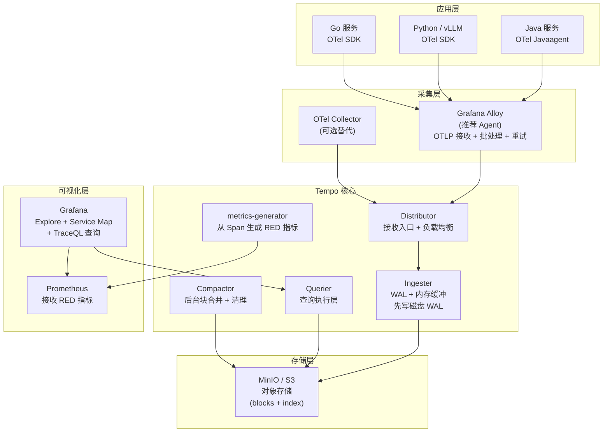

# Tempo — 分布式链路追踪后端

**更新日期：** 2026年06月04日
**信息来源：** 官方文档、GitHub 仓库、Grafana Labs 博客、社区实践
**参考地址：**

1. GitHub：[grafana/tempo](https://github.com/grafana/tempo)（~5.3k stars）
2. 官方文档：[grafana.com/docs/tempo](https://grafana.com/docs/tempo/latest/)
3. TraceQL 查询语言：[TraceQL Docs](https://grafana.com/docs/tempo/latest/traceql/)
4. Helm Chart：[grafana/tempo-distributed](https://github.com/grafana/helm-charts/tree/main/charts/tempo-distributed)
5. metrics-generator：[Metrics from Traces](https://grafana.com/docs/tempo/latest/metrics-from-traces/)

> Star 数会持续变化。正式对外汇报前建议以 GitHub 实时数据复核。

---

## 1. 结论摘要

Tempo 是 Grafana Labs 开源的分布式链路追踪后端，设计目标是**极低运维成本的大规模链路追踪存储**。它的核心特点是只使用对象存储（S3/MinIO/GCS）作为后端，不依赖 Elasticsearch 或 Cassandra，大幅降低运维复杂度和存储成本。

与 Grafana 生态深度集成：Loki 日志可通过 TraceID 一键跳转到 Tempo 链路，Prometheus 指标可通过 Exemplar 跳转，Grafana Explore 原生支持 Tempo 数据源。这使得指标→日志→链路的"三维联动"排查成为现实。

Tempo 还内置 `metrics-generator` 组件，可从链路数据生成 RED 指标（请求率/错误率/延迟）并推送到 Prometheus，实现无需改造应用即可获得服务级别 SLO 指标。

在本项目中，Tempo 是链路追踪存储的选型，配合 OpenTelemetry SDK + Grafana Alloy 构建完整的链路追踪管道。

| 关键信息 | 值 |
| --- | --- |
| CNCF 状态 | CNCF 毕业项目（2024年毕业）|
| 开源协议 | AGPLv3 |
| 实现语言 | Go |
| 存储后端 | 对象存储（S3/MinIO/GCS/Azure Blob）|
| 接受协议 | OTLP（gRPC/HTTP）、Jaeger、Zipkin、OpenCensus |
| 核心特性 | TraceQL 查询、metrics-generator、Service Graph、Loki 联动 |
| 部署方式 | 单体模式（Helm: grafana/tempo）或微服务模式（grafana/tempo-distributed）|
| 当前版本 | v3.x |

---

## 2. 产品概况

| 项目 | 内容 |
| --- | --- |
| 产品名称 | Grafana Tempo |
| 产品定位 | 高规模、低成本的分布式链路追踪后端 |
| 开发者 | Grafana Labs（CNCF 毕业项目）|
| 开源协议 | AGPLv3 |
| 首次发布 | 2020年 |
| 存储依赖 | 仅需对象存储（S3/MinIO/GCS/Azure Blob）|
| 查询语言 | TraceQL（专为链路追踪设计）|
| 接受的协议 | OTLP、Jaeger Thrift、Zipkin、OpenCensus |
| 竞争对手 | Jaeger、SkyWalking、Zipkin、Datadog APM |
| 目标用户 | 已使用 Grafana/Loki/Prometheus 的团队，希望补全"链路追踪"维度 |

---

## 3. 产品定位与典型场景

| 场景 | Tempo 如何解决 | 价值 |
| --- | --- | --- |
| 微服务调用链排查 | 通过 TraceID 查询完整调用链，定位慢调用或失败环节 | 无需逐个查日志，分钟内定位根因 |
| 日志→链路联动 | Loki 日志中的 TraceID 字段直接跳转 Tempo 链路详情 | 排查上下文不中断 |
| 指标→链路联动 | Prometheus Exemplar 嵌入 TraceID，点击 P99 延迟数据点跳链路 | 从症状（指标）到根因（链路）的桥梁 |
| SLO RED 指标自动生成 | metrics-generator 从链路数据提取请求率/错误率/延迟 | 无需手动在代码里埋 Prometheus counter |
| 服务依赖拓扑发现 | Service Graph 自动绘制服务调用关系图 | 了解哪些服务之间有强依赖，评估变更影响 |
| AI 服务延迟分析 | vLLM 接入 OTel SDK 后，可追踪每次推理请求的完整路径 | GPU 推理耗时与业务逻辑耗时分离可见 |

---

## 4. 技术架构

### 4.1 整体架构



### 4.2 内部组件说明

| 组件 | 职责 |
| --- | --- |
| Distributor | 接收 OTLP/Jaeger/Zipkin Spans，按 TraceID 哈希分片路由到 Ingester |
| Ingester | 缓冲最近几分钟的 Span 在内存+WAL；按时间块 flush 到对象存储 |
| Compactor | 后台合并小 block、删除超期数据、维护索引 |
| Querier | 接收查询请求，在对象存储中定位并读取相关 blocks |
| metrics-generator | 订阅所有 Span，生成服务级别 RED 指标和 Service Graph 指标 |
| Query Frontend | 对外暴露查询 API，负责请求拆分和缓存 |

### 4.3 存储格式

Tempo 使用 **Parquet** 格式存储 spans（v2+ 默认），支持列裁剪和高效 TraceQL 过滤。块结构：

```
bucket/
  <tenant-id>/
    blocks/
      <block-uuid>/
        meta.json          # block 元数据（时间范围、span 数、大小）
        data/              # Parquet 文件
        bloom-*.filter     # Bloom Filter（加速 TraceID 查找）
```

---

## 5. 部署方式

### 5.1 单体模式（适合中小规模，日 Span < 5000 万）

```bash
helm repo add grafana https://grafana.github.io/helm-charts
helm repo update

# values.yaml 覆盖配置
cat <<EOF > tempo-values.yaml
tempo:
  storage:
    trace:
      backend: s3
      s3:
        bucket: tempo-traces
        endpoint: minio.minio.svc.cluster.local:9000
        access_key: minio
        secret_key: minio123
        insecure: true
  retention: 168h  # 7 天
  receivers:
    otlp:
      protocols:
        grpc:
          endpoint: 0.0.0.0:4317
        http:
          endpoint: 0.0.0.0:4318
  metricsGenerator:
    enabled: true
    remoteWriteUrl: http://kube-prometheus-stack-prometheus.monitoring.svc.cluster.local:9090/api/v1/write
EOF

helm upgrade --install tempo grafana/tempo \
  --namespace monitoring \
  --create-namespace \
  --values tempo-values.yaml
```

### 5.2 分布式模式（适合大规模，日 Span > 1 亿）

```bash
helm upgrade --install tempo grafana/tempo-distributed \
  --namespace monitoring \
  --set storage.trace.backend=s3 \
  --set storage.trace.s3.bucket=tempo-traces \
  --set ingester.replicas=3 \
  --set querier.replicas=2 \
  --set compactor.replicas=1 \
  --set metricsGenerator.enabled=true
```

### 5.3 关键 values.yaml 配置项

```yaml
# tempo-values.yaml 完整参考
tempo:
  # 数据保留时间
  retention: 168h

  # 存储后端（S3/MinIO）
  storage:
    trace:
      backend: s3
      s3:
        bucket: tempo-traces
        endpoint: minio.minio.svc.cluster.local:9000
        access_key: ${MINIO_ACCESS_KEY}
        secret_key: ${MINIO_SECRET_KEY}
        insecure: true
        forcepathstyle: true  # MinIO 必须设置

  # 接收协议
  receivers:
    otlp:
      protocols:
        grpc:
          endpoint: 0.0.0.0:4317
        http:
          endpoint: 0.0.0.0:4318
    jaeger:  # 可选：兼容旧 Jaeger 客户端
      protocols:
        thrift_http:
          endpoint: 0.0.0.0:14268
        grpc:
          endpoint: 0.0.0.0:14250

  # 指标生成器
  metricsGenerator:
    enabled: true
    remoteWriteUrl: "http://kube-prometheus-stack-prometheus.monitoring.svc.cluster.local:9090/api/v1/write"
    processor:
      serviceGraphs:
        enabled: true
        dimensions: [http.method, http.status_code]
      spanMetrics:
        enabled: true
        dimensions: [service.name, span.name, http.method, http.status_code]

  # 查询配置
  querier:
    frontend_worker:
      frontend_address: tempo-query-frontend:9095

  # 资源限制（调整根据实际规模）
resources:
  requests:
    memory: 2Gi
    cpu: 500m
  limits:
    memory: 4Gi
    cpu: 2000m
```

### 5.4 Grafana 数据源配置

```yaml
# Grafana 数据源 ConfigMap（kube-prometheus-stack values.yaml 中的 additionalDataSources）
- name: Tempo
  type: tempo
  uid: tempo
  url: http://tempo.monitoring.svc.cluster.local:3100
  jsonData:
    httpMethod: GET
    tracesToLogsV2:
      datasourceUid: loki                  # 关联 Loki 数据源 UID
      filterByTraceID: true
      filterBySpanID: false
      customQuery: false
    tracesToMetrics:
      datasourceUid: prometheus             # 关联 Prometheus 数据源 UID
      queries:
        - name: Request Rate
          query: 'rate(traces_spanmetrics_calls_total{$$__tags}[5m])'
    serviceMap:
      datasourceUid: prometheus
    nodeGraph:
      enabled: true
    search:
      hide: false
    lokiSearch:
      datasourceUid: loki
```

---

## 6. 核心能力详解

### 6.1 TraceQL — 链路查询语言

TraceQL 是专为链路追踪设计的查询语言（类似 PromQL 之于指标、LogQL 之于日志）：

```
# 查询所有延迟超过 1 秒的 http 请求
{ span.http.url =~ "/api/.*" && duration > 1s }

# 查询 ai-backend 服务中状态码为 500 的链路
{ resource.service.name = "ai-backend" && span.http.status_code = 500 }

# 查询调用了 MySQL 且总耗时超过 2s 的链路
{ span.db.system = "mysql" } | duration > 2s

# 查询包含 ERROR 级别 span 的链路
{ status = error }

# 聚合查询：按服务统计 P99 延迟（TraceQL Metrics，v2.4+）
{ resource.service.name =~ ".*" } | histogram_over_time(duration, 1m)
```

**TraceQL 核心语法：**

| 语法元素 | 说明 | 示例 |
| --- | --- | --- |
| `{ span.xxx = yyy }` | 过滤 Span 属性 | `{ span.http.method = "POST" }` |
| `{ resource.xxx }` | 过滤 Resource 属性（服务名、实例等）| `{ resource.service.name = "vllm" }` |
| `duration > 1s` | 链路总耗时过滤 | `{ } \| duration > 500ms` |
| `status = error` | Span 状态过滤 | `{ status = error }` |
| `\| select(...)` | 选择返回字段 | `{ } \| select(span.http.url, duration)` |
| `\| rate()` | 速率聚合（TraceQL Metrics）| `{ } \| rate()` |

### 6.2 metrics-generator — 从链路生成指标

metrics-generator 监听所有 ingested Span，自动生成两类指标并 Remote Write 到 Prometheus：

**Service Graph 指标（服务间调用关系）：**

```
# 服务调用成功率
traces_service_graph_request_total{client="frontend", server="ai-backend"}
traces_service_graph_request_failed_total{client="frontend", server="ai-backend"}

# 服务调用延迟（histogram）
traces_service_graph_request_server_seconds_bucket{...}
```

**Span Metrics（每个 Span 维度的 RED 指标）：**

```
# 请求数量
traces_spanmetrics_calls_total{service_name="ai-backend", span_name="POST /api/infer", http_status_code="200"}

# 延迟 histogram（用于计算 P50/P99）
traces_spanmetrics_latency_bucket{service_name="ai-backend", ...}
```

这些指标推送到 Prometheus 后，可以直接在 Grafana 面板用 PromQL 构建 SLO 面板，**无需修改业务代码**。

### 6.3 三维联动：指标 → 日志 → 链路

```
Prometheus 面板（CPU飙升/P99升高）
    ↓ [点击 Exemplar 跳转]
Tempo 链路详情（查看具体 TraceID 的完整调用链）
    ↓ [点击 Logs 关联]
Loki 日志（同一 TraceID 的所有服务日志）
```

实现联动的前提：
1. **Loki → Tempo**：Loki 日志中携带 `traceID` 字段，Grafana Loki 数据源配置 `derivedFields`
2. **Prometheus → Tempo**：Prometheus 采集配置开启 `exemplar_relabeling`，应用 SDK 在 Counter/Histogram 中附加 TraceID
3. **Tempo → Loki**：Grafana Tempo 数据源配置 `tracesToLogsV2`，按 TraceID 在 Loki 中查询

### 6.4 Service Graph 服务拓扑

Tempo 的 metrics-generator 在处理 Span 时，识别 `span.kind = SERVER` 和 `span.kind = CLIENT` 对，构建服务调用关系图，并生成对应指标。Grafana 的 Service Map 面板直接可视化此图，气泡大小=QPS，颜色=错误率。

---

## 7. 与同类工具对比

### 7.1 Tempo vs Jaeger vs SkyWalking

| 对比项 | Tempo | Jaeger | SkyWalking |
| --- | --- | --- | --- |
| CNCF 状态 | 毕业 | 毕业 | Apache 顶级项目 |
| 存储后端 | 仅对象存储（S3/MinIO）| ES / Cassandra / BadgerDB | H2 / ES / MySQL / TiDB |
| 存储成本 | ★★★★★（S3 最便宜）| ★★★（ES 贵）| ★★★（ES 贵）|
| Grafana 集成 | ★★★★★（原生）| ★★★（需插件）| ★★（独立 UI）|
| Loki 日志联动 | ★★★★★（原生）| ★★（需手动）| ✗ |
| 查询语言 | TraceQL（功能强）| Jaeger UI（图形化）| SkyWalking QL |
| Python/AI 支持 | ★★★★（OTel Python SDK）| ★★★★（OTel）| ★★（官方 Agent 弱）|
| 自动埋点 | OTel Java Agent | OTel Java Agent | SkyWalking Java Agent |
| 服务拓扑图 | ✅ Service Graph | ✅ | ✅ APM Dashboard |
| RED 指标生成 | ✅ metrics-generator | ✗（需手动）| ✅ 内置 |
| 多租户 | ✅（tenantID header）| ✅ | ✅ |
| 运维复杂度 | ★★（极简）| ★★★★（ES + 多组件）| ★★★★（OAP + ES）|
| **本项目适配** | **✅ 已选用** | 未采用 | 未采用 |

### 7.2 Tempo 部署模式对比

| 模式 | 组件数 | 适用规模 | 高可用 |
| --- | --- | --- | --- |
| 单体（monolithic）| 1 个 Pod | < 5000 万 Span/天 | 多副本 |
| 微服务（distributed）| 6+ 个 Deployment | > 1 亿 Span/天 | 各组件独立扩缩容 |
| Grafana Cloud（SaaS）| 0（托管）| 无限 | SLA 99.9% |

---

## 8. 在本项目中的接入方式

### 8.1 Java 服务接入（零代码侵入）

```bash
# 在 Deployment 启动命令中加入 Java Agent
java -javaagent:/app/opentelemetry-javaagent.jar \
  -Dotel.service.name=ai-backend \
  -Dotel.resource.attributes=service.version=v1.2.3,deployment.environment=production \
  -Dotel.traces.exporter=otlp \
  -Dotel.metrics.exporter=otlp \
  -Dotel.logs.exporter=otlp \
  -Dotel.exporter.otlp.endpoint=http://grafana-alloy.monitoring.svc.cluster.local:4317 \
  -jar ai-backend.jar
```

对应 Kubernetes Deployment 的注入方式（通过 initContainer 下载 agent）：

```yaml
initContainers:
  - name: otel-agent-injector
    image: busybox
    command: ["cp", "/otel-javaagent.jar", "/otel-agent/opentelemetry-javaagent.jar"]
    volumeMounts:
      - name: otel-agent
        mountPath: /otel-agent
```

### 8.2 Python / vLLM 服务接入

```python
# requirements.txt 添加
# opentelemetry-sdk>=1.25.0
# opentelemetry-exporter-otlp-proto-grpc>=1.25.0
# opentelemetry-instrumentation-fastapi>=0.46b0

from opentelemetry import trace
from opentelemetry.sdk.trace import TracerProvider
from opentelemetry.sdk.trace.export import BatchSpanProcessor
from opentelemetry.exporter.otlp.proto.grpc.trace_exporter import OTLPSpanExporter
from opentelemetry.sdk.resources import Resource
from opentelemetry.instrumentation.fastapi import FastAPIInstrumentor

# 初始化 Tracer Provider
resource = Resource.create({
    "service.name": "vllm-inference",
    "service.version": "0.4.2",
    "deployment.environment": "production",
})

provider = TracerProvider(resource=resource)
exporter = OTLPSpanExporter(
    endpoint="http://grafana-alloy.monitoring.svc.cluster.local:4317",
    insecure=True
)
provider.add_span_processor(BatchSpanProcessor(exporter))
trace.set_tracer_provider(provider)

# FastAPI 自动埋点
FastAPIInstrumentor.instrument_app(app)
```

### 8.3 Grafana Alloy 配置（采集层）

```hcl
// alloy-config.river
// 接收来自应用的 OTLP 数据
otelcol.receiver.otlp "default" {
  grpc {
    endpoint = "0.0.0.0:4317"
  }
  http {
    endpoint = "0.0.0.0:4318"
  }
  output {
    traces  = [otelcol.processor.batch.default.input]
    metrics = [otelcol.processor.batch.default.input]
    logs    = [otelcol.processor.batch.default.input]
  }
}

// 批处理（减少网络调用）
otelcol.processor.batch "default" {
  timeout          = "1s"
  send_batch_size  = 1024
  output {
    traces  = [otelcol.exporter.otlp.tempo.input]
    metrics = [otelcol.exporter.prometheus.default.input]
    logs    = [otelcol.exporter.loki.default.input]
  }
}

// 导出到 Tempo
otelcol.exporter.otlp "tempo" {
  client {
    endpoint = "tempo.monitoring.svc.cluster.local:4317"
    tls {
      insecure = true
    }
  }
}
```

---

## 9. 常见问题 FAQ

**Q1：Tempo 和 Jaeger 能同时部署吗？**
A：可以。OTel Collector / Grafana Alloy 可以通过配置多个 exporter，同时将 Span 发到 Tempo 和 Jaeger。迁移期间可以双写，验证 Tempo 功能后再停 Jaeger。

**Q2：Tempo 没有 Elasticsearch，怎么全文搜索？**
A：Tempo 通过 TraceQL 支持按 Span 属性精确过滤，不支持全文搜索。通常的排查方式是：先通过 Loki 全文搜索日志找到 TraceID，再跳转 Tempo 查看完整链路。两者互补，无需 Tempo 自己做全文搜索。

**Q3：如何控制 Trace 采样率？避免数据量太大？**
A：推荐在 Grafana Alloy 层面配置 **尾部采样（tail-based sampling）**，即等链路完成后根据是否有 error/高延迟再决定是否保留：

```hcl
otelcol.processor.tail_sampling "default" {
  policies = [
    {
      name = "error-traces"
      type = "status_code"
      status_code = { status_codes = ["ERROR"] }
    },
    {
      name = "slow-traces"
      type = "latency"
      latency = { threshold_ms = 1000 }
    },
    {
      name = "random-10pct"
      type = "probabilistic"
      probabilistic = { sampling_percentage = 10 }
    },
  ]
}
```

**Q4：metrics-generator 生成的指标和业务自己埋的指标有什么区别？**
A：metrics-generator 从链路自动推导，粒度是 `service.name + span.name`，反映接口级别的 RED 指标。业务自己埋的指标可以携带更多业务语义维度（如 user_tier、model_id 等）。两者互补，metrics-generator 提供"零成本的基础 SLO 指标"。

**Q5：Tempo 的多租户怎么用？**
A：发送 Span 时在 HTTP header 中加 `X-Scope-OrgID: <tenant-id>`，查询时同样带此 header。Grafana 数据源可以通过 `X-Scope-OrgID` 变量实现不同团队看自己的链路数据，存储隔离。

**Q6：单体模式和分布式模式如何选择？**
A：初期用单体模式，3~4 副本配 HPA，满足大多数中型项目（< 5000 万 Span/天）。当查询延迟持续超过 5s，或 Ingester 内存压力大，再迁移到微服务模式。迁移时只需更换 Helm Chart（grafana/tempo → grafana/tempo-distributed），存储数据格式兼容。

**Q7：Tempo 的 WAL 是什么？Pod 重启会丢数据吗？**
A：Ingester 在接收 Span 后先写本地 WAL（Write-Ahead Log），WAL 满后 flush 到对象存储。如果 Pod 重启，WAL 中的未 flush 数据会重放。WAL 存储在 PVC 上（emptyDir 会丢失，**生产环境必须配置 PVC**）。

---

## 10. 参考文档

1. [Grafana Tempo 官方文档](https://grafana.com/docs/tempo/latest/)
2. [TraceQL 查询语言参考](https://grafana.com/docs/tempo/latest/traceql/)
3. [metrics-generator 配置指南](https://grafana.com/docs/tempo/latest/metrics-from-traces/)
4. [Grafana Alloy + Tempo 集成](https://grafana.com/docs/tempo/latest/set-up-for-tracing/instrument-send/set-up-collector/grafana-alloy/)
5. [Tempo Helm Chart 文档](https://github.com/grafana/helm-charts/tree/main/charts/tempo)
6. [Tempo 分布式部署指南](https://grafana.com/docs/tempo/latest/set-up-for-tracing/setup-tempo/deploy/)
7. [Loki + Tempo 联动配置](https://grafana.com/docs/grafana/latest/datasources/tempo/#configure-the-data-source-with-provisioning)
8. [OTel Java Agent 文档](https://opentelemetry.io/docs/zero-code/java/agent/)
9. [OTel Python SDK 文档](https://opentelemetry.io/docs/languages/python/)
