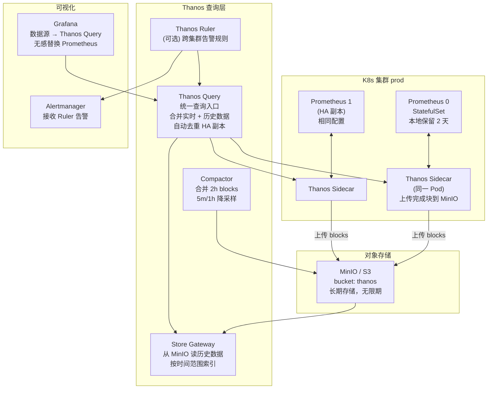

# Thanos — Prometheus 高可用与长期存储

**更新日期：** 2026年06月04日
**信息来源：** 官方文档、GitHub 仓库、CNCF 资料、社区实践
**参考地址：**

1. GitHub：[thanos-io/thanos](https://github.com/thanos-io/thanos)（~13k stars）
2. 官方文档：[thanos.io/docs](https://thanos.io/tip/thanos/getting-started.md/)
3. Helm Chart：[bitnami/thanos](https://github.com/bitnami/charts/tree/main/bitnami/thanos)
4. CNCF 项目页：[Thanos at CNCF](https://www.cncf.io/projects/thanos/)
5. 对象存储配置：[Object Storage Config](https://thanos.io/tip/thanos/storage.md/)

---

## 1. 结论摘要

Thanos 是 CNCF 孵化项目，由 Improbable 开源，解决 Prometheus 两个核心痛点：**有限的本地存储（无法保留超过数周的历史数据）** 和 **多 Prometheus 实例无法统一查询**。

Thanos 通过"侵入性最小"的方式扩展 Prometheus：在每个 Prometheus 实例旁加一个 Sidecar 容器，Sidecar 负责将已完成的数据块（2 小时一个 block）异步上传到对象存储（MinIO/S3）。Store Gateway 组件从对象存储中按需读取历史数据，Query 组件统一合并实时数据和历史数据。

**本项目推荐在以下情况引入 Thanos：**
- Prometheus 数据保留超过 15 天的查询需求（合规/历史趋势分析）
- 未来多集群部署（dev/pre/prod 三集群统一查询）
- 需要 Prometheus 高可用（多副本自动去重）

在规模不大的情况下，VictoriaMetrics 是更简单的替代方案。Thanos 的优势在于 CNCF 生态成熟度和原生 Sidecar 模式（对 Prometheus 零侵入）。

| 关键信息 | 值 |
| --- | --- |
| CNCF 状态 | CNCF 孵化项目（Incubating）|
| 开源协议 | Apache 2.0 |
| 实现语言 | Go |
| 核心机制 | Prometheus Sidecar + 对象存储 + 分布式查询 |
| 支持对象存储 | MinIO / S3 / GCS / Azure Blob / OSS |
| 核心端口 | 10901（gRPC）、10902（HTTP）|
| Stars | ~13k（GitHub）|

---

## 2. 产品概况

| 项目 | 内容 |
| --- | --- |
| 产品名称 | Thanos |
| 产品定位 | Prometheus 高可用扩展 + 无限期历史存储 + 多集群聚合查询 |
| 开发者 | Improbable 开源 → CNCF 社区维护 |
| CNCF 状态 | ✅ CNCF 孵化（Incubating）|
| 开源协议 | Apache 2.0 |
| 首次发布 | 2017年 |
| 主要形态 | 多组件（Sidecar + Store + Compactor + Query + Ruler + Receive）|
| 对象存储 | MinIO / S3 / GCS / Azure Blob / Aliyun OSS |
| 目标用户 | 已运行 Prometheus，需要长期存储或多集群查询的团队 |

---

## 3. 产品定位与典型场景

| 场景 | Thanos 如何解决 | 价值 |
| --- | --- | --- |
| 历史数据超过 15 天 | Sidecar 上传 blocks 到 MinIO，Store Gateway 从 MinIO 查询 | 实现 6~12 个月历史查询 |
| 合规要求数据保留 180 天 | 对象存储成本远低于本地 SSD | 合规低成本 |
| 多集群 dev/pre/prod | 一个 Query 入口，Store 指向所有集群的 Sidecar | 统一查询，无需切换集群 |
| Prometheus 高可用 | 两副本 Prometheus 同时运行，Sidecar 带 `replica` 标签，Query 自动去重 | 消除单点故障 |
| 大盘面板查询历史趋势 | Compactor 对历史数据做 5m/1h 降采样，加速长时间范围查询 | 1 年趋势图 5 秒内加载 |

---

## 4. 技术架构

### 4.1 Sidecar 模式（推荐）



### 4.2 Receive 模式（推荐用于无法运行 Sidecar 的场景）

某些场景下（如 Prometheus 实例在网络隔离区），无法让 Sidecar 访问对象存储，可以使用 Receive 模式：

```
Prometheus --remote_write--> Thanos Receive --存储--> 对象存储
                                              |
                              Thanos Query <--+（查询 Receive 实例）
```

### 4.3 核心组件说明

| 组件 | 职责 | 内存需求 | 是否必须 |
| --- | --- | --- | --- |
| **Sidecar** | 伴随 Prometheus 运行，上传完成的数据块到对象存储 | ~50 MB | ✅（Sidecar 模式）|
| **Store Gateway** | 从对象存储按需读取历史数据（类似"历史数据虚拟 Prometheus"）| ~500 MB | ✅ |
| **Compactor** | 后台合并小 blocks，执行 5m/1h 降采样，删除过期数据 | ~500 MB | ✅（长期存储必须）|
| **Query** | 统一 PromQL 入口，合并多 Store 结果，自动去重 | ~300 MB | ✅ |
| **Query Frontend** | Query 的前端代理，负责请求拆分和结果缓存（大查询优化）| ~200 MB | 可选（大规模推荐）|
| **Ruler** | 在 Thanos 层执行 Prometheus 告警规则（可访问历史数据）| ~200 MB | 可选 |
| **Receive** | 接收 Prometheus Remote Write，作为 Sidecar 替代 | ~500 MB | 仅 Receive 模式 |

---

## 5. 部署方式

### 5.1 在 kube-prometheus-stack 中开启 Sidecar（最简接入）

```yaml
# kube-prometheus-stack values.yaml 片段
prometheus:
  prometheusSpec:
    # 本地只保留 2 天（大部分数据卸载到 MinIO）
    retention: 2d
    retentionSize: "50GB"

    # 开启 Thanos Sidecar
    thanos:
      image: quay.io/thanos/thanos:v0.35.0
      objectStorageConfig:
        existingSecret:
          name: thanos-objstore-secret
          key: objstore.yml
      # Sidecar 开放 gRPC 端口给 Query 访问
      listenLocal: false

  # 对外暴露 Sidecar gRPC 端口（Query 需要连接）
  service:
    additionalPorts:
      - name: thanos-sidecar-grpc
        port: 10901
        targetPort: 10901
```

### 5.2 对象存储 Secret

```yaml
# 创建 MinIO 连接配置 Secret
apiVersion: v1
kind: Secret
metadata:
  name: thanos-objstore-secret
  namespace: monitoring
stringData:
  objstore.yml: |
    type: S3
    config:
      bucket: thanos
      endpoint: minio.minio.svc.cluster.local:9000
      access_key: "${MINIO_ACCESS_KEY}"
      secret_key: "${MINIO_SECRET_KEY}"
      insecure: true          # 内网 MinIO 无 TLS
      signature_version2: false
```

### 5.3 Thanos Store Gateway 部署

```yaml
apiVersion: apps/v1
kind: Deployment
metadata:
  name: thanos-store
  namespace: monitoring
spec:
  replicas: 1
  template:
    spec:
      containers:
        - name: thanos-store
          image: quay.io/thanos/thanos:v0.35.0
          args:
            - store
            - --log.level=info
            - --objstore.config-file=/etc/thanos/objstore.yml
            - --data-dir=/var/thanos/store  # 本地缓存索引（加速查询）
            # 只加载最近 90 天的数据（节省内存）
            - --min-time=-90d
          volumeMounts:
            - name: objstore
              mountPath: /etc/thanos
            - name: store-data
              mountPath: /var/thanos/store
          ports:
            - name: grpc
              containerPort: 10901
            - name: http
              containerPort: 10902
      volumes:
        - name: objstore
          secret:
            secretName: thanos-objstore-secret
        - name: store-data
          persistentVolumeClaim:
            claimName: thanos-store-pvc
```

### 5.4 Thanos Query 部署

```yaml
apiVersion: apps/v1
kind: Deployment
metadata:
  name: thanos-query
  namespace: monitoring
spec:
  replicas: 2
  template:
    spec:
      containers:
        - name: thanos-query
          image: quay.io/thanos/thanos:v0.35.0
          args:
            - query
            - --log.level=info
            # HA 副本去重标签（Prometheus StatefulSet 副本标签）
            - --query.replica-label=prometheus_replica
            # 实时数据：连接 Prometheus Sidecar
            - --store=dnssrv+_grpc._tcp.prometheus-operated.monitoring.svc.cluster.local
            # 历史数据：连接 Store Gateway
            - --store=thanos-store.monitoring.svc.cluster.local:10901
          ports:
            - name: http
              containerPort: 10902
            - name: grpc
              containerPort: 10901
---
# 暴露 HTTP 服务给 Grafana
apiVersion: v1
kind: Service
metadata:
  name: thanos-query
  namespace: monitoring
spec:
  ports:
    - name: http
      port: 9090
      targetPort: 10902
  selector:
    app: thanos-query
```

### 5.5 Thanos Compactor 部署（单副本，不能并行）

```yaml
apiVersion: apps/v1
kind: StatefulSet
metadata:
  name: thanos-compactor
  namespace: monitoring
spec:
  replicas: 1  # 必须是 1，不能多副本
  template:
    spec:
      containers:
        - name: thanos-compactor
          image: quay.io/thanos/thanos:v0.35.0
          args:
            - compact
            - --log.level=info
            - --objstore.config-file=/etc/thanos/objstore.yml
            - --data-dir=/var/thanos/compact
            - --wait  # 持续运行模式（而不是运行一次退出）
            # 降采样规则：5分钟 和 1小时 降采样
            - --retention.resolution-raw=30d   # 原始精度保留 30 天
            - --retention.resolution-5m=90d    # 5分钟精度保留 90 天
            - --retention.resolution-1h=365d   # 1小时精度保留 1 年
```

### 5.6 Grafana 数据源配置（指向 Thanos Query）

```yaml
# kube-prometheus-stack additionalDataSources 或独立 ConfigMap
- name: Prometheus (via Thanos)
  type: prometheus
  uid: prometheus
  url: http://thanos-query.monitoring.svc.cluster.local:9090
  isDefault: true
  jsonData:
    httpMethod: POST
    queryTimeout: "120s"
    timeInterval: "15s"
    incrementalQuerying: true   # 增量查询，加速长时间范围查询
    incrementalQueryOverlapWindow: "10m"
```

---

## 6. 存储成本估算

假设本项目指标规模：约 50 万活跃时间序列，15 秒采集间隔：

| 存储类型 | 保留时间 | 原始大小 | Thanos 压缩后 |
| --- | --- | --- | --- |
| Prometheus 本地 | 2 天 | ~3 GB | — |
| 对象存储（原始精度）| 30 天 | ~45 GB | ~12 GB |
| 对象存储（5m 降采样）| 90 天 | 原始 1/20 | ~2 GB |
| 对象存储（1h 降采样）| 1 年 | 原始 1/240 | ~1 GB |
| **对象存储总计** | **1 年** | — | **~15 GB** |

MinIO 本地存储 15 GB，成本极低（S3 约 $0.35/月）。

---

## 7. 与 VictoriaMetrics 的详细对比

| 对比维度 | Thanos | VictoriaMetrics |
| --- | --- | --- |
| CNCF 状态 | ✅ CNCF 孵化 | ❌（商业公司开源）|
| **对象存储** | ✅ 原生设计，MinIO/S3 均可 | 本地 PVC（可挂载 S3，但非原生）|
| **存储压缩** | 好（3-5x）| **更好（10-20x）**|
| **写入方式** | Sidecar 异步上传（零 Prometheus 侵入）| Remote Write（Prometheus 推送）|
| **组件数量** | 5-6 个组件 | 1-3 个组件 |
| **运维复杂度** | ★★★★（较高）| ★★（较低）|
| **查询性能** | 中（跨 Store 合并有延迟）| 高（vmselect 快速合并）|
| **HA 去重** | ✅ 原生（Query 层 replica-label 去重）| ✅（需配置）|
| **多集群聚合** | ✅ 原生（Query 指向多个 Sidecar）| ✅（VM 集群版）|
| **长期存储容量** | 无限（对象存储）| 受 PVC 大小限制（可大 PVC）|
| **Prometheus 兼容** | 完全兼容 | 完全兼容 |
| **告警规则** | Thanos Ruler（可访问历史数据）| vmalert（功能等同）|
| **适用规模** | 大规模、多集群 | 中小规模、单集群 |
| **本项目推荐** | 长期目标（多集群时）| ✅ 近期推荐（简单可靠）|

**决策建议：**
- 当前阶段：用 **VictoriaMetrics** 作为长期存储（简单、低运维）
- 当规模扩大到多集群或需要精细的 HA 去重时：迁移到 **Thanos**
- 两者均支持 Prometheus Remote Write，迁移时切换数据源即可，无需改 Grafana 面板

---

## 8. 常见问题 FAQ

**Q1：Thanos Sidecar 和 Prometheus 如何共存在同一 Pod？**
A：kube-prometheus-stack 的 `thanos:` 配置会自动将 Sidecar 注入到 Prometheus StatefulSet Pod 中，以 init container 或 sidecar container 形式运行。Sidecar 通过共享卷（`/prometheus/data`）读取 Prometheus 的数据目录，上传已完成的 2 小时 blocks。

**Q2：Thanos 开启后 Prometheus 本地可以少保留多久的数据？**
A：理论上可以设为 `retention: 0` 让 Prometheus 只保留内存中的数据（约 2 小时）。但建议设为 `2d` 或 `7d`，原因是 Sidecar 异步上传有延迟，且需要缓冲网络故障时的数据。实践中 `retention: 2d + Thanos` 是最常见配置。

**Q3：Compactor 能多副本运行吗？**
A：不能，Compactor 必须单副本运行。多副本 Compactor 会导致并发压缩同一 block 导致数据损坏。Thanos Compactor 内置了 lock 机制防止此类情况，但最佳实践仍是只运行一个 Compactor 实例。

**Q4：如果 MinIO/S3 暂时不可用，Sidecar 会丢数据吗？**
A：不会丢失。Sidecar 只上传 Prometheus 已完成的 2 小时 blocks（文件形式存在本地磁盘）。如果对象存储暂时不可用，Sidecar 会持续重试，直到上传成功。只要 Prometheus 本地磁盘还有空间（至少能保留 2 天），数据就不会丢失。

**Q5：多集群场景，如何配置 Thanos Query 查询所有集群？**
A：为每个集群的 Sidecar 创建跨集群可访问的 Service（或使用服务网格），然后在 Query 中添加多个 `--store` 参数：
```
--store=sidecar-prod.svc.cluster.prod:10901
--store=sidecar-pre.svc.cluster.pre:10901
--store=store-gateway.svc.cluster.local:10901
```
同时为不同集群的 Prometheus 设置不同的 `external_labels`（如 `cluster: prod`），Query 会自动在结果中带上这些标签，方便在 Grafana 中按集群过滤。

**Q6：Thanos Query 和 Prometheus 本身的 API 有什么区别？**
A：Thanos Query 的 HTTP API 完全兼容 Prometheus API（包括 `/api/v1/query`、`/api/v1/query_range`），Grafana 配置它的方式与配置 Prometheus 相同（type: prometheus）。区别在于查询范围：Prometheus 只能查本地数据，Thanos Query 可以合并所有 Store 的数据（包括历史）。

---

## 9. 参考文档

1. [Thanos 官方文档](https://thanos.io/tip/thanos/getting-started.md/)
2. [Thanos 对象存储配置](https://thanos.io/tip/thanos/storage.md/)
3. [kube-prometheus-stack + Thanos 集成](https://github.com/prometheus-community/helm-charts/blob/main/charts/kube-prometheus-stack/README.md#thanos)
4. [Thanos Compactor 文档](https://thanos.io/tip/components/compact.md/)
5. [Thanos HA 去重配置](https://thanos.io/tip/thanos/query.md/)
6. [CNCF Thanos 项目](https://www.cncf.io/projects/thanos/)
7. [Thanos vs VictoriaMetrics 选型对比（社区讨论）](https://github.com/thanos-io/thanos/discussions)


## 概述

Thanos 是 Improbable 开源并捐赠给 CNCF 的 Prometheus 高可用扩展方案，通过在 Prometheus 旁边附加 Sidecar 组件，将时序数据上传到对象存储（MinIO/S3/OSS），实现**无限期历史查询**和**多 Prometheus 实例全局统一查询**。

- GitHub: [thanos-io/thanos](https://github.com/thanos-io/thanos) ⭐ ~13k
- CNCF 状态: ✅ CNCF Incubating
- 核心端口: `10901`（gRPC）、`10902`（HTTP）
- 对象存储支持: MinIO / S3 / GCS / Azure Blob / OSS

---

## 核心组件

```
┌─────────────────────────────────────────────────────┐
│                    Thanos 架构                        │
│                                                      │
│  Prometheus + Sidecar ──┐                           │
│                          ├──→ MinIO/S3 (对象存储)    │
│  Prometheus + Sidecar ──┘         ↑                 │
│                                   │                  │
│  Thanos Store ──────────────────→ Store Gateway      │
│  Thanos Compact ──────────────→ 数据压缩/降采样      │
│  Thanos Query ─────────────────→ 全局统一查询         │
│  Thanos Ruler ─────────────────→ 跨集群告警规则       │
└─────────────────────────────────────────────────────┘
```

| 组件 | 职责 | 资源需求 |
|------|------|---------|
| **Sidecar** | 伴随每个 Prometheus 实例，上传数据块到对象存储 | ~50 MB |
| **Store Gateway** | 从对象存储中查询历史数据（无需全量加载）| ~500 MB |
| **Compactor** | 压缩/降采样历史数据（减少存储成本）| ~500 MB |
| **Query** | 统一 PromQL 入口，合并多 Prometheus + Store 数据 | ~300 MB |
| **Ruler** | 在 Thanos 层执行告警规则（跨集群）| ~200 MB |
| **Receive** | 接收远程写入（替代 Sidecar 模式）| ~500 MB |

---

## 核心能力

| 能力 | 说明 |
|------|------|
| **无限期历史存储** | 突破 Prometheus 本地磁盘限制，数据存入 MinIO/S3 |
| **多集群全局查询** | 一个 Query 入口查询多个 Prometheus 实例 |
| **数据降采样** | 5m/1h 降采样，历史数据查询加速 |
| **Prometheus 高可用** | 多副本 Prometheus + Sidecar 去重，Query 自动去重 |
| **与 Grafana 集成** | Grafana 数据源配置 Thanos Query 替代 Prometheus |

---

## 在本项目中的使用

### 当前状态

> 🟡 方案一**推荐引入 Thanos**，尤其是以下场景：
> - Prometheus 数据默认只保留 **15 天**，超出后无法查询历史趋势
> - 合规要求日志/指标保留 **6 个月以上**
> - 未来多集群部署（dev/pre/prod）需要统一查询入口

### Sidecar 模式部署（最小化引入 Thanos）

```yaml
# values.yaml — kube-prometheus-stack 开启 Thanos Sidecar
prometheus:
  prometheusSpec:
    # 本地只保留 2 天，历史数据上传到 MinIO
    retention: 2d
    retentionSize: "50GB"
    thanos:
      image: quay.io/thanos/thanos:v0.35.0
      objectStorageConfig:
        existingSecret:
          name: thanos-objstore-secret
          key: objstore.yml
```

```yaml
# thanos-objstore-secret（MinIO）
type: S3
config:
  bucket: thanos
  endpoint: minio.middleware.svc:9000
  access_key: ${MINIO_ACCESS_KEY}
  secret_key: ${MINIO_SECRET_KEY}
  insecure: true  # 内网 MinIO 无 TLS
```

### Thanos Query 部署

```yaml
# thanos-query-deployment.yaml
apiVersion: apps/v1
kind: Deployment
metadata:
  name: thanos-query
  namespace: observability
spec:
  replicas: 1
  template:
    spec:
      containers:
        - name: thanos-query
          image: quay.io/thanos/thanos:v0.35.0
          args:
            - query
            - --log.level=info
            - --query.replica-label=prometheus_replica
            # 连接 Prometheus Sidecar（实时数据）
            - --store=prometheus-prometheus-kube-prom-prometheus-0.prometheus-operated.observability.svc:10901
            # 连接 Store Gateway（历史数据）
            - --store=thanos-store.observability.svc:10901
          ports:
            - name: http
              containerPort: 10902
            - name: grpc
              containerPort: 10901
```

### Grafana 数据源配置（使用 Thanos Query 替代 Prometheus）

```yaml
# grafana 数据源改为 Thanos Query（支持查询历史数据）
datasources:
  - name: Prometheus (Thanos)
    type: prometheus
    url: http://thanos-query.observability.svc:10902
    isDefault: true
    jsonData:
      queryTimeout: "120s"
      incrementalQuerying: true
```

---

## 存储成本估算

| 指标 | 保留时间 | 原始大小 | Thanos 压缩后（估算）|
|------|---------|---------|---------------------|
| 15 天本地 | 15 天 | 20 GB | — |
| 对象存储 6 个月 | 180 天 | 240 GB | ~80 GB（含 5m/1h 降采样）|
| 对象存储 1 年 | 365 天 | 480 GB | ~150 GB |

---

## Thanos vs VictoriaMetrics 长期存储对比

| 维度 | Thanos | VictoriaMetrics（VM Cluster）|
|------|--------|------------------------------|
| Prometheus 兼容性 | ✅ Sidecar 无感接入 | ✅ Remote Write |
| 运维复杂度 | 中（多个组件）| 低（单二进制可启动）|
| 压缩率 | 好 | **更好（VM 自研压缩）** |
| CNCF | ✅ Incubating | ❌ |
| 对象存储支持 | ✅ 成熟 | ✅ |
| 多集群聚合查询 | ✅ | ✅（VM Cluster）|
| **SmartVision 推荐** | **当前首选**（生态成熟）| 长期可迁移 |
