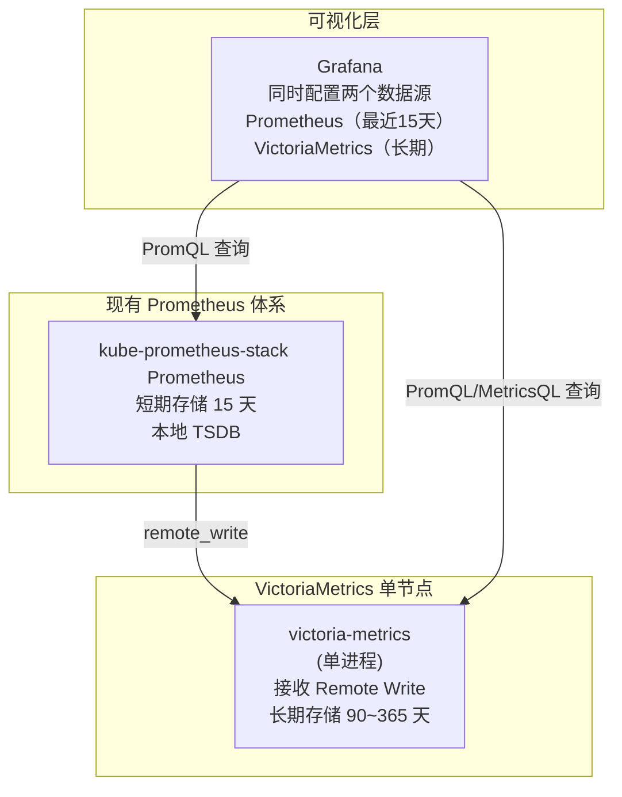
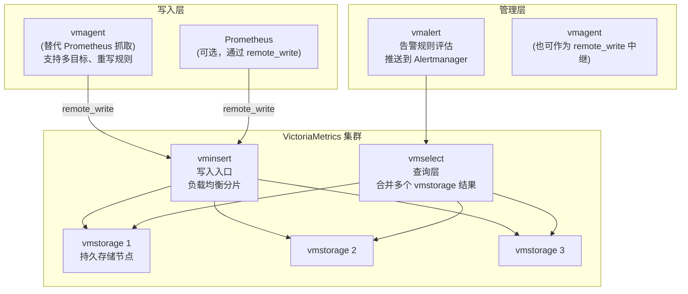

# VictoriaMetrics — 高性能长期指标存储

**更新日期：** 2026年06月04日
**信息来源：** 官方文档、GitHub 仓库、性能基准测试、社区实践
**参考地址：**

1. GitHub：[VictoriaMetrics/VictoriaMetrics](https://github.com/VictoriaMetrics/VictoriaMetrics)（~13k stars）
2. 官方文档：[docs.victoriametrics.com](https://docs.victoriametrics.com/)
3. Helm Chart：[VictoriaMetrics/helm-charts](https://github.com/VictoriaMetrics/helm-charts)
4. MetricsQL 文档：[MetricsQL](https://docs.victoriametrics.com/metricsql/)
5. 集群版文档：[Cluster Version](https://docs.victoriametrics.com/cluster-victoriametrics/)
6. 性能对比：[VictoriaMetrics vs Thanos vs Cortex](https://valyala.medium.com/measuring-vertical-scalability-for-time-series-databases-in-google-cloud-92550d78d8ae)

---

## 1. 结论摘要

VictoriaMetrics（VM）是完全兼容 Prometheus 查询协议的高性能长期指标存储后端。其核心优势：

- **存储压缩率极高**：数据压缩比达 10-20x（Prometheus 约 3-5x），相同数据量磁盘占用减少 70%+
- **写入性能卓越**：单节点可处理每秒 100 万+ 活跃时间序列，内存占用比 Prometheus 低 5-10x
- **架构极简**：单节点模式只需一个 `victoria-metrics` 进程，集群模式只需 3 个组件
- **完全兼容 Prometheus**：PromQL 查询兼容，现有 Grafana 面板无需修改，支持 Prometheus Remote Write

在本项目中，VictoriaMetrics 定位为 **Prometheus 的长期存储扩展**：Prometheus 保留 15 天数据，超过 15 天的数据通过 Remote Write 推到 VictoriaMetrics，实现 90~365 天历史数据查询。

| 关键信息 | 值 |
| --- | --- |
| 开源协议 | Apache 2.0 |
| 实现语言 | Go |
| 查询协议 | PromQL + MetricsQL（扩展超集）|
| 写入协议 | Prometheus Remote Write、InfluxDB Line Protocol、OpenTSDB |
| 单节点并发能力 | 100 万+ 活跃时间序列 |
| 存储压缩比 | 10-20x（vs Prometheus 3-5x）|
| Stars | ~13k（GitHub）|

---

## 2. 产品概况

| 项目 | 内容 |
| --- | --- |
| 产品名称 | VictoriaMetrics |
| 产品定位 | Prometheus 兼容的高性能长期指标存储 |
| 开发者 | Valyala（个人开源）→ VictoriaMetrics Inc. |
| 开源协议 | Apache 2.0 |
| 发布年份 | 2018年 |
| 部署模式 | 单节点（victoria-metrics-single）或集群（victoria-metrics-cluster）|
| 主要形态 | 单二进制（单节点）或 vminsert + vmstorage + vmselect（集群）|
| 目标用户 | 已有 Prometheus 但需要更低存储成本、更长保留周期的团队 |

---

## 3. 产品定位与典型场景

| 场景 | VictoriaMetrics 的价值 |
| --- | --- |
| Prometheus 数据量大，磁盘快满 | VM 压缩率 10-20x，同等磁盘存放 3-5 倍时间跨度 |
| 需要查询 3 个月前的历史指标 | Prometheus 默认 15 天，VM 可以保留 1 年甚至更长 |
| Prometheus 内存压力大 | VM 内存占用比 Prometheus 低 5-10x（相同时间序列数量下）|
| 多 Prometheus 实例聚合查询 | VM 集群版支持联邦查询，多个 Prometheus 数据合并 |
| 需要多租户隔离 | VM 集群版内置 accountID 多租户支持 |
| 想替换 Prometheus 抓取层 | vmagent 比 Prometheus 内存更低，功能更丰富 |

---

## 4. 技术架构

### 4.1 单节点模式（推荐初期接入方式）



### 4.2 集群模式（大规模生产，时间序列 > 1000 万）



### 4.3 核心组件说明

| 组件 | 职责 | 单节点中 |
| --- | --- | --- |
| `victoria-metrics` | 单节点全功能进程（写入 + 存储 + 查询）| 唯一进程 |
| `vminsert` | 集群写入入口，按时间序列哈希路由到 vmstorage | N/A |
| `vmstorage` | 持久化存储节点，负责数据写入和查询 | N/A |
| `vmselect` | 查询层，向所有 vmstorage 发查询并合并结果 | N/A |
| `vmagent` | 轻量级 Prometheus 抓取替代品，支持 Remote Write 中继 | 可选 |
| `vmalert` | 告警规则评估（类 Prometheus Alerting Rules），推送 Alertmanager | 可选 |
| `vmauth` | 认证代理，支持多租户路由 | 可选 |

---

## 5. 部署方式

### 5.1 单节点 Helm 部署（推荐初期接入）

```bash
helm repo add vm https://victoriametrics.github.io/helm-charts
helm repo update

cat <<EOF > vm-values.yaml
server:
  # 数据保留时间（90天）
  retentionPeriod: "3"  # 单位是月，3 = 90 天

  # 持久化存储
  persistentVolume:
    enabled: true
    size: 200Gi
    storageClass: "local-path"

  # 资源配置
  resources:
    requests:
      memory: 1Gi
      cpu: 500m
    limits:
      memory: 4Gi
      cpu: 2000m

  # 额外启动参数
  extraArgs:
    # 启用 Prometheus Remote Write 接收（默认开启，端口 8428）
    httpListenAddr: ":8428"
    # 最大时间序列数量限制（防止意外写入过多）
    maxLabelsPerTimeseries: "30"
    # 停止接受超出保留时间范围的数据
    rejectOldData: "true"
EOF

helm upgrade --install victoria-metrics vm/victoria-metrics-single \
  --namespace monitoring \
  --values vm-values.yaml
```

### 5.2 配置 Prometheus Remote Write 到 VM

在 `kube-prometheus-stack` 的 `values.yaml` 中添加：

```yaml
# kube-prometheus-stack values.yaml 片段
prometheus:
  prometheusSpec:
    # 保留本地 15 天数据
    retention: 15d

    # Remote Write 到 VictoriaMetrics
    remoteWrite:
      - url: http://victoria-metrics.monitoring.svc.cluster.local:8428/api/v1/write
        # 写入队列配置（避免网络抖动丢数据）
        queueConfig:
          maxSamplesPerSend: 10000
          capacity: 50000
          batchSendDeadline: 5s
        # 可选：添加标签区分来源
        writeRelabelConfigs:
          - targetLabel: cluster
            replacement: "smartvision-prod"
```

### 5.3 Grafana 配置 VictoriaMetrics 数据源

```yaml
# Grafana 数据源（kube-prometheus-stack additionalDataSources 中添加）
- name: VictoriaMetrics
  type: prometheus  # VM 兼容 Prometheus 协议
  uid: victoriametrics
  url: http://victoria-metrics.monitoring.svc.cluster.local:8428
  jsonData:
    httpMethod: POST
    timeInterval: "15s"
  # 注意：不要设为 default，避免影响现有面板（现有面板用 Prometheus 数据源）
```

### 5.4 vmagent 替代 Prometheus 抓取（进阶，可选）

如果 Prometheus 内存压力大，可用 vmagent 接管抓取工作，将 Prometheus 降级为纯存储：

```yaml
# vmagent 配置片段（scrape_configs 与 Prometheus 格式完全兼容）
global:
  scrape_interval: 15s

scrape_configs:
  - job_name: kubernetes-pods
    kubernetes_sd_configs:
      - role: pod
    relabel_configs:
      - action: keep
        source_labels: [__meta_kubernetes_pod_annotation_prometheus_io_scrape]
        regex: "true"

remote_write:
  - url: http://victoria-metrics.monitoring.svc.cluster.local:8428/api/v1/write
```

---

## 6. 核心能力详解

### 6.1 MetricsQL — PromQL 的扩展超集

VictoriaMetrics 完全兼容 PromQL，同时提供 MetricsQL 扩展：

```
# PromQL（VM 完全支持）
rate(http_requests_total[5m])

# MetricsQL 扩展函数（更方便）
# 增量计算（不用 increase()，更精准）
increases_over_time(http_requests_total[24h])

# 与上周同期对比
http_requests_total offset 1w

# 异常值检测
outlierIQR(rate(http_requests_total[5m]))

# 保留最大标签基数的 Top N 时间序列
topk(10, rate(http_requests_total[5m]))
```

### 6.2 存储压缩原理

VM 使用了比 Prometheus TSDB 更激进的压缩算法：

| 特性 | Prometheus | VictoriaMetrics |
| --- | --- | --- |
| 压缩算法 | Gorilla + Snappy | 自研 Zstd + 特殊 delta-of-delta |
| 典型压缩比 | 3-5x | 10-20x |
| 100 万时间序列内存 | 约 8-10 GB | 约 1-2 GB |
| 磁盘写放大 | 高（Head Block + WAL）| 低（直接追加）|

### 6.3 下采样（Downsampling）

VM 支持自动下采样：

```yaml
# 启动参数
-downsampling.period=30d:5m,180d:1h
# 超过 30 天的数据：精度降到 5 分钟
# 超过 180 天的数据：精度降到 1 小时
```

这使得即使保留 1 年数据，磁盘占用也不会线性增长。

---

## 7. 与 Thanos 的对比

| 对比维度 | VictoriaMetrics | Thanos |
| --- | --- | --- |
| **架构复杂度** | 低（单节点 1 进程；集群 3 进程）| 高（6+ 组件）|
| **存储后端** | 本地磁盘（支持 S3 挂载）| 对象存储 S3（原生）|
| **HA 方案** | 多副本写入（vminsert 自动路由）| Sidecar + Querier |
| **存储成本** | 中（本地 PVC，压缩率高）| 低（S3 对象存储）|
| **查询性能** | 极高（单 vmselect 快速合并）| 中（Querier 跨 Store 合并慢）|
| **数据去重** | 内置（自动合并重复写入）| 需要 Querier 配置 |
| **长期存储** | 支持（但需要足够大 PVC）| 原生设计为无限长期存储 |
| **运维难度** | ★★（简单）| ★★★★（复杂）|
| **Prometheus 兼容** | 完全兼容（含 Remote Write）| 完全兼容 |
| **告警规则** | vmalert（功能等同 Prometheus Rules）| Thanos Ruler |
| **适用规模** | 中小规模（< 2000 万时间序列）| 超大规模（无限）|
| **本项目推荐** | ✅ 推荐（中期引入）| 备选（规模增长后）|

---

## 8. 引入时机与决策矩阵

**当以下任一情况出现时，引入 VictoriaMetrics：**

| 触发条件 | 指标阈值 |
| --- | --- |
| Prometheus 磁盘使用率 | > 70%（当前 PVC 的 70%）|
| 需要查询 15 天前的历史数据 | 任何时候 |
| 活跃时间序列数量 | > 50 万 |
| Prometheus Pod 内存 | 持续 > 8 GB |
| 需要多个 Prometheus 联邦查询 | 部署 VM 集群版 |

**不需要引入 VM 的情况：**
- Prometheus 磁盘和内存都有余量，15 天保留周期够用
- 没有历史数据查询需求
- 时间序列数量 < 20 万

---

## 9. 常见问题 FAQ

**Q1：VictoriaMetrics 能直接替换 Prometheus 吗？**
A：可以完全替换。VM 实现了 Prometheus 的所有核心 API（`/api/v1/query`、`/api/v1/query_range`、`/api/v1/series`、`/metrics`），Grafana 面板、alerting rules 无需修改。但通常推荐先作为 Remote Write 目标引入，稳定后再考虑是否完全替换 Prometheus 抓取层。

**Q2：现有 Grafana 面板需要修改吗？**
A：不需要。只需在 Grafana 中添加一个新数据源（URL 指向 VM），现有面板指向 Prometheus 数据源，新建的长期历史面板指向 VM 数据源。两者可以共存。

**Q3：VictoriaMetrics 有告警功能吗？需要 Alertmanager 吗？**
A：VM 本身不做告警评估，需要 `vmalert` 组件读取 VM 数据并评估告警规则，然后推送到 Alertmanager。vmalert 的规则格式与 Prometheus Alerting Rules 完全兼容（YAML 格式相同）。

**Q4：VictoriaMetrics 数据迁移：如何把 Prometheus 历史数据迁移过去？**
A：使用官方工具 `vmctl`：
```bash
# 从 Prometheus 导出数据到 VictoriaMetrics
./vmctl prometheus \
  --prom-snapshot=/path/to/prometheus/data \
  --vm-addr=http://victoria-metrics:8428
```

**Q5：VM 单节点可以支撑多少时间序列？**
A：官方测试数据：4 核 16GB 内存的机器上，VM 单节点可以稳定处理 **500 万活跃时间序列**，写入速度约 50 万 samples/秒。本项目初期估计时间序列数量 < 50 万，单节点绰绰有余。

---

## 10. 参考文档

1. [VictoriaMetrics 官方文档](https://docs.victoriametrics.com/)
2. [MetricsQL 查询语言](https://docs.victoriametrics.com/metricsql/)
3. [VictoriaMetrics Helm Charts](https://github.com/VictoriaMetrics/helm-charts)
4. [VictoriaMetrics vs Thanos vs Cortex 性能对比](https://valyala.medium.com/measuring-vertical-scalability-for-time-series-databases-in-google-cloud-92550d78d8ae)
5. [vmagent 文档](https://docs.victoriametrics.com/vmagent/)
6. [vmalert 文档](https://docs.victoriametrics.com/vmalert/)
7. [Prometheus Remote Write 到 VM 配置](https://docs.victoriametrics.com/#prometheus-setup)

