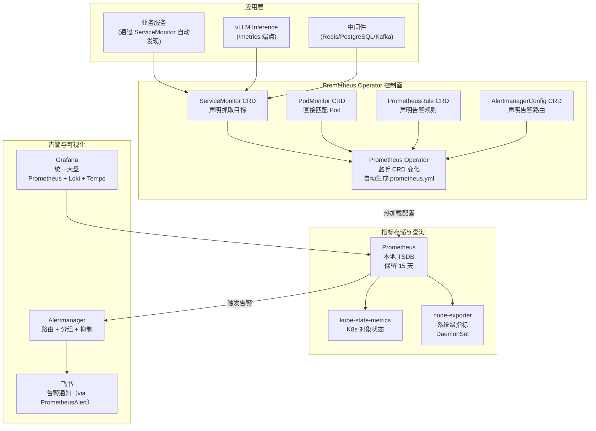

# kube-prometheus-stack — Prometheus 监控全家桶 Helm Chart

**更新日期：** 2026年06月04日
**信息来源：** 官方文档、GitHub 仓库、Helm Chart 配置参考
**参考地址：**

1. GitHub：[prometheus-community/helm-charts](https://github.com/prometheus-community/helm-charts/tree/main/charts/kube-prometheus-stack)（~16k stars）
2. Helm Chart 文档：[ArtifactHub - kube-prometheus-stack](https://artifacthub.io/packages/helm/prometheus-community/kube-prometheus-stack)
3. Prometheus Operator CRD：[Prometheus Operator API](https://prometheus-operator.dev/docs/api-reference/api/)
4. Grafana 默认面板：[Grafana Dashboard Templates](https://grafana.com/grafana/dashboards/)
5. 配置示例：[values.yaml 完整参考](https://github.com/prometheus-community/helm-charts/blob/main/charts/kube-prometheus-stack/values.yaml)

---

## 1. 结论摘要

`kube-prometheus-stack` 是目前 K8s 可观测性领域事实标准的 Helm Chart，一条命令部署 Prometheus Operator + Prometheus + Grafana + Alertmanager + node-exporter + kube-state-metrics 完整监控栈。

它的核心价值是 **Operator 模式**：通过 Kubernetes CRD（ServiceMonitor、PrometheusRule 等）声明式管理监控配置，消除了手动管理 `prometheus.yml` 的繁琐，与 GitOps 流程无缝集成——新增监控目标只需提交一个 `ServiceMonitor` YAML，Prometheus Operator 自动热加载配置，无需重启。

本项目已使用 kube-prometheus-stack 作为指标监控基础设施底座，当前状态：已部署，Prometheus 保留 15 天数据，Grafana 对接 Prometheus + Loki + Tempo，Alertmanager 路由告警至飞书（通过 PrometheusAlert 中转）。

| 关键信息 | 值 |
| --- | --- |
| Chart 版本 | 65.x（含 Prometheus v2.x、Grafana 10.x）|
| 开源协议 | Apache 2.0 |
| 包含组件 | Prometheus Operator、Prometheus、Grafana、Alertmanager、node-exporter、kube-state-metrics |
| 核心 CRD | ServiceMonitor、PodMonitor、PrometheusRule、AlertmanagerConfig、Probe |
| 安装命名空间 | monitoring（本项目）|
| Stars | ~16k（GitHub）|

---

## 2. 包含组件说明

| 组件 | 版本 | 职责 | 本项目状态 |
| --- | --- | --- | --- |
| **Prometheus Operator** | v0.75+ | 管理 CRD，自动配置 Prometheus | ✅ 运行中 |
| **Prometheus** | v2.53+ | 指标采集与存储，保留 15 天 | ✅ 运行中 |
| **Grafana** | v10.x+ | 统一可视化（指标 + 日志 + 链路）| ✅ 运行中 |
| **Alertmanager** | v0.27+ | 告警路由与抑制，推送飞书 | ✅ 运行中 |
| **node-exporter** | v1.8+ | 每个节点系统指标（CPU/内存/磁盘/网络）| ✅ DaemonSet |
| **kube-state-metrics** | v2.12+ | K8s 资源对象状态指标 | ✅ 运行中 |

---

## 3. 技术架构

### 3.1 整体架构图



### 3.2 Operator 模式的核心价值

传统方式：手动编辑 `prometheus.yml`，添加一个新服务需要修改配置文件并 reload。

Operator 方式：提交 ServiceMonitor CRD，Operator 自动更新 Prometheus 配置：

```yaml
# GitOps 友好：一次定义，Operator 自动处理
apiVersion: monitoring.coreos.com/v1
kind: ServiceMonitor
metadata:
  name: my-service
  namespace: production
  labels:
    release: kube-prometheus-stack  # 必须匹配 Prometheus selector
spec:
  selector:
    matchLabels:
      app: my-service
  endpoints:
    - port: metrics
      interval: 15s
```

---

## 4. 部署与配置

### 4.1 安装命令

```bash
helm repo add prometheus-community https://prometheus-community.github.io/helm-charts
helm repo update

helm upgrade --install kube-prometheus-stack prometheus-community/kube-prometheus-stack \
  --namespace monitoring \
  --create-namespace \
  --values kube-prometheus-stack-values.yaml \
  --timeout 10m
```

### 4.2 本项目 values.yaml 关键配置

```yaml
# kube-prometheus-stack-values.yaml

# ========= Prometheus 配置 =========
prometheus:
  prometheusSpec:
    # 数据保留时间
    retention: 15d
    retentionSize: "80GB"

    # 资源配置
    resources:
      requests:
        memory: 4Gi
        cpu: "1"
      limits:
        memory: 8Gi
        cpu: "4"

    # 持久化存储
    storageSpec:
      volumeClaimTemplate:
        spec:
          storageClassName: local-path
          accessModes: ["ReadWriteOnce"]
          resources:
            requests:
              storage: 100Gi

    # ServiceMonitor 选择器（选择所有命名空间的 ServiceMonitor）
    serviceMonitorSelectorNilUsesHelmValues: false
    serviceMonitorSelector: {}
    serviceMonitorNamespaceSelector: {}

    # PodMonitor 选择器
    podMonitorSelectorNilUsesHelmValues: false
    podMonitorSelector: {}

    # 开启 Exemplar 存储（用于 Prometheus → Tempo 三维联动）
    enableFeatures:
      - exemplar-storage

# ========= Grafana 配置 =========
grafana:
  enabled: true

  adminPassword: "changeme"  # 生产建议用 Secret

  persistence:
    enabled: true
    size: 10Gi
    storageClassName: local-path

  ingress:
    enabled: true
    hosts:
      - grafana.example.com

  # 额外数据源（Loki + Tempo）
  additionalDataSources:
    - name: Loki
      type: loki
      uid: loki
      url: http://loki.monitoring.svc.cluster.local:3100
      jsonData:
        derivedFields:
          - datasourceName: Tempo
            matcherRegex: '"traceId":"([^"]+)"'
            name: TraceID
            url: '${__value.raw}'
            datasourceUid: tempo

    - name: Tempo
      type: tempo
      uid: tempo
      url: http://tempo.monitoring.svc.cluster.local:3100
      jsonData:
        httpMethod: GET
        tracesToLogsV2:
          datasourceUid: loki
          filterByTraceID: true
        tracesToMetrics:
          datasourceUid: prometheus
        serviceMap:
          datasourceUid: prometheus
        nodeGraph:
          enabled: true

  sidecar:
    dashboards:
      enabled: true
      label: grafana_dashboard
      searchNamespace: ALL

# ========= Alertmanager 配置 =========
alertmanager:
  alertmanagerSpec:
    resources:
      requests:
        memory: 256Mi
        cpu: 100m

  config:
    global:
      resolve_timeout: 5m

    route:
      group_by: ['alertname', 'namespace', 'severity']
      group_wait: 30s
      group_interval: 5m
      repeat_interval: 4h
      receiver: 'feishu-warning'
      routes:
        - matchers:
            - severity = critical
          receiver: feishu-critical
          continue: true
        - matchers:
            - severity = warning
          receiver: feishu-warning

    receivers:
      - name: feishu-critical
        webhook_configs:
          - url: http://prometheus-alert.monitoring.svc.cluster.local:8080/prometheusalert?type=fs&tpl=feishu-critical
            send_resolved: true
      - name: feishu-warning
        webhook_configs:
          - url: http://prometheus-alert.monitoring.svc.cluster.local:8080/prometheusalert?type=fs&tpl=feishu-warning
            send_resolved: true

    inhibit_rules:
      - source_matchers: [severity = critical]
        target_matchers: [severity = warning]
        equal: [namespace, alertname]

# ========= node-exporter =========
nodeExporter:
  enabled: true

# ========= kube-state-metrics =========
kubeStateMetrics:
  enabled: true
```

### 4.3 升级 Chart 版本

```bash
# 查看当前版本
helm list -n monitoring

# 升级（--reuse-values 保留现有配置）
helm upgrade kube-prometheus-stack prometheus-community/kube-prometheus-stack \
  --namespace monitoring \
  --reuse-values \
  --version 65.x.x
```

---

## 5. CRD 使用详解

### 5.1 ServiceMonitor — 为服务配置采集

```yaml
# 为 vLLM 服务配置 ServiceMonitor
apiVersion: monitoring.coreos.com/v1
kind: ServiceMonitor
metadata:
  name: vllm-inference
  namespace: monitoring
  labels:
    release: kube-prometheus-stack  # 必须与 Prometheus Operator 的 selector 匹配
spec:
  namespaceSelector:
    matchNames:
      - ai-infra
  selector:
    matchLabels:
      app: vllm-inference
  endpoints:
    - port: metrics
      path: /metrics
      interval: 15s
      relabelings:
        - sourceLabels: [__meta_kubernetes_pod_name]
          targetLabel: pod
        - sourceLabels: [__meta_kubernetes_namespace]
          targetLabel: namespace
```

### 5.2 PrometheusRule — 声明告警规则

```yaml
# vLLM 推理服务 SLO 告警规则
apiVersion: monitoring.coreos.com/v1
kind: PrometheusRule
metadata:
  name: vllm-slo-alerts
  namespace: monitoring
  labels:
    release: kube-prometheus-stack
spec:
  groups:
    - name: vllm.slo
      interval: 1m
      rules:
        - alert: VLLMHighP99Latency
          expr: |
            histogram_quantile(0.99,
              rate(vllm:e2e_request_latency_seconds_bucket[5m])
            ) > 10
          for: 5m
          labels:
            severity: warning
            service: vllm
          annotations:
            summary: "vLLM P99 延迟超过 10 秒"
            description: "{{ $labels.namespace }} 的 vLLM P99 延迟为 {{ $value | humanizeDuration }}"

        - alert: VLLMQueueFull
          expr: vllm:num_waiting_requests > 50
          for: 2m
          labels:
            severity: critical
            service: vllm
          annotations:
            summary: "vLLM 请求队列积压超过 50"

    # 记录规则（预计算，加速 Grafana 查询）
    - name: vllm.recording
      rules:
        - record: vllm:request_rate5m
          expr: rate(vllm:e2e_request_total[5m])
```

### 5.3 PodMonitor — 直接匹配 Pod

```yaml
apiVersion: monitoring.coreos.com/v1
kind: PodMonitor
metadata:
  name: fluentbit-metrics
  namespace: monitoring
  labels:
    release: kube-prometheus-stack
spec:
  selector:
    matchLabels:
      app: fluent-bit
  podMetricsEndpoints:
    - port: http
      path: /api/v1/metrics/prometheus
```

### 5.4 Probe — 黑盒探测

```yaml
apiVersion: monitoring.coreos.com/v1
kind: Probe
metadata:
  name: external-endpoints
  namespace: monitoring
  labels:
    release: kube-prometheus-stack
spec:
  jobName: blackbox-external
  prober:
    url: blackbox-exporter.monitoring.svc.cluster.local:9115
  targets:
    staticConfig:
      static:
        - https://api.smartvision.example.com/health
        - https://console.smartvision.example.com
  module: http_2xx
  interval: 30s
```

---

## 6. 常用运维操作

### 6.1 查看 Prometheus 抓取目标状态

```bash
# 通过 kubectl port-forward 访问 Prometheus UI
kubectl port-forward -n monitoring svc/kube-prometheus-stack-prometheus 9090:9090
# 访问 http://localhost:9090/targets 查看所有抓取目标
```

### 6.2 查看 Alertmanager 告警路由

```bash
kubectl port-forward -n monitoring svc/kube-prometheus-stack-alertmanager 9093:9093
# 访问 http://localhost:9093
```

### 6.3 添加自定义 Grafana 面板

```bash
# 在 Grafana UI 设计面板 → 导出 JSON → 创建 ConfigMap
kubectl create configmap grafana-dashboard-vllm \
  --from-file=vllm-dashboard.json \
  -n monitoring
kubectl label configmap grafana-dashboard-vllm grafana_dashboard=1 -n monitoring
# Grafana sidecar 自动加载，无需重启
```

---

## 7. 常见问题 FAQ

**Q1：ServiceMonitor 提交了但 Prometheus 没有抓取目标，怎么排查？**
A：最常见原因是标签不匹配。检查 ServiceMonitor 是否有 `release: kube-prometheus-stack` 标签；查看 Prometheus Operator 日志：`kubectl logs -n monitoring deployment/kube-prometheus-stack-operator`。

**Q2：告警触发了但没有收到飞书通知，怎么排查？**
A：
1. 访问 Alertmanager UI（port-forward 9093），确认告警到达 Alertmanager
2. 查看 Alertmanager 日志：`kubectl logs -n monitoring alertmanager-xxx`
3. 检查 PrometheusAlert 服务：`kubectl logs -n monitoring deployment/prometheus-alert`
4. 手动测试 Webhook：`curl -X POST "http://prometheus-alert:8080/prometheusalert?type=fs&tpl=feishu-critical"`

**Q3：Grafana 面板修改后如何持久化？**
A：UI 手动修改会被 Pod 重建覆盖。正确方式：导出面板 JSON → 存入 ConfigMap（加 `grafana_dashboard: "1"` 标签）→ Grafana sidecar 自动加载。

**Q4：kube-state-metrics 和 node-exporter 有什么区别？**
A：
- **node-exporter**：节点硬件指标（CPU 使用率、内存、磁盘 IO、网络流量）——关于"这台机器"
- **kube-state-metrics**：K8s API 对象状态（Deployment 副本数、Pod 状态、PVC 绑定）——关于"K8s 对象健康"

**Q5：如何在不重装的情况下修改 values.yaml 配置？**
A：
```bash
# 方式一：修改 values.yaml 后 upgrade
helm upgrade kube-prometheus-stack prometheus-community/kube-prometheus-stack \
  -n monitoring --values kube-prometheus-stack-values.yaml

# 方式二：用 --set 临时覆盖单个参数
helm upgrade kube-prometheus-stack prometheus-community/kube-prometheus-stack \
  -n monitoring --reuse-values \
  --set prometheus.prometheusSpec.retention=30d
```

---

## 8. 参考文档

1. [kube-prometheus-stack Helm Chart 文档](https://github.com/prometheus-community/helm-charts/tree/main/charts/kube-prometheus-stack)
2. [Prometheus Operator CRD API 参考](https://prometheus-operator.dev/docs/api-reference/api/)
3. [Grafana sidecar 面板管理](https://github.com/grafana/helm-charts/tree/main/charts/grafana#sidecar-for-dashboards)
4. [kube-state-metrics 指标列表](https://github.com/kubernetes/kube-state-metrics/blob/main/docs/metrics/workload/pod-metrics.md)
5. [node-exporter 指标说明](https://github.com/prometheus/node_exporter#enabled-by-default)
6. [Prometheus Operator 设计文档](https://prometheus-operator.dev/docs/operator/design/)
