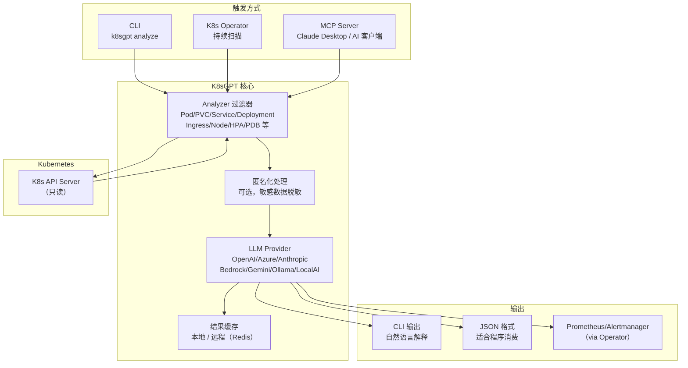
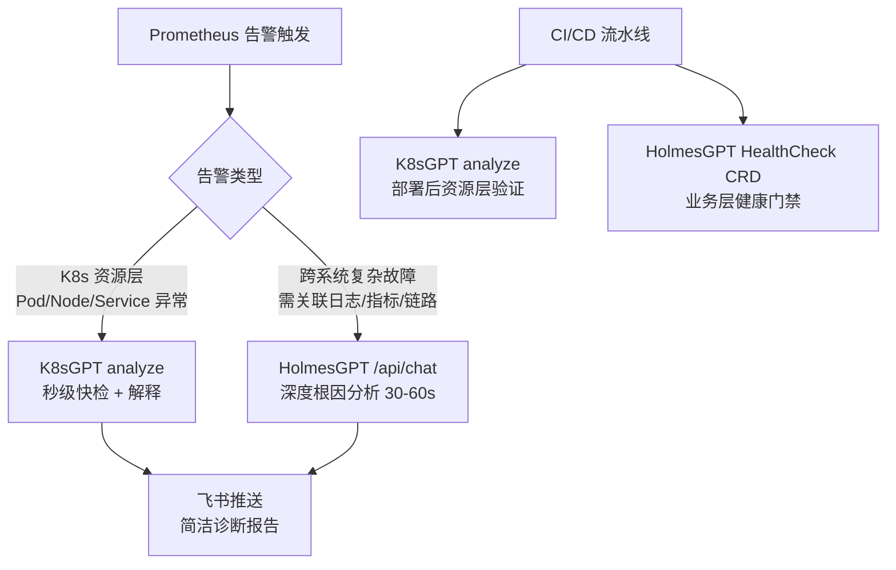

# K8sGPT — Kubernetes 集群智能诊断工具

**更新日期：** 2026年06月04日
**信息来源：** 官方文档、GitHub 仓库、社区实践
**参考地址：**

1. GitHub：[k8sgpt-ai/k8sgpt](https://github.com/k8sgpt-ai/k8sgpt)（~7.8k stars，v0.4.33，CNCF Incubating）
2. 官方文档：[docs.k8sgpt.ai](https://docs.k8sgpt.ai/)
3. 官网：[k8sgpt.ai](https://k8sgpt.ai/)
4. K8sGPT Operator：[k8sgpt-operator](https://github.com/k8sgpt-ai/k8sgpt-operator)
5. 支持的模型：[SUPPORTED_MODELS.md](https://github.com/k8sgpt-ai/k8sgpt/blob/main/SUPPORTED_MODELS.md)
6. MCP Server 文档：[MCP.md](https://github.com/k8sgpt-ai/k8sgpt/blob/main/MCP.md)

> Star 数会持续变化。正式对外汇报前建议以 GitHub 实时数据复核。

---

## 1. 结论摘要

K8sGPT 是 CNCF Incubating 级别的开源 Kubernetes 集群诊断工具，核心功能是**扫描集群资源 → 发现异常 → 通过 LLM 用自然语言解释问题和修复方法**。它的设计非常聚焦：一个 Go 单二进制，覆盖 14 类内置分析器（Pod / PVC / Service / Deployment / Ingress / Node 等），把 SRE 的诊断经验固化成分析逻辑，再用 LLM 把技术诊断结果翻译成人类可读的解释。

K8sGPT 不是一个"对话式 AI Agent"，而是更像"AI 增强的 kubectl describe + 人工建议"。它适合快速扫描集群健康、CI/CD 流水线中的集群验证，以及学习 Kubernetes 故障排查知识。对于需要跨系统关联分析（日志 + 指标 + 链路）的复杂根因分析，需要结合 HolmesGPT 等工具使用。

K8sGPT 还支持 **MCP Server 模式**（`k8sgpt serve --mcp`），可接入 Claude Desktop 等 AI 应用，让 LLM 通过 K8sGPT 提供的工具直接操作 K8s 集群。

| 关键信息 | 值 |
| --- | --- |
| 当前版本 | v0.4.33（2025年6月）|
| CNCF 状态 | Incubating（已进入，正在准备毕业）|
| 开源协议 | Apache 2.0 |
| 实现语言 | Go（单二进制，约 14MB）|
| 部署方式 | CLI 二进制 / kubectl 插件 / K8s Operator / MCP Server |
| 支持 LLM | OpenAI、Azure OpenAI、Anthropic Claude（v0.4.33 新增）、Amazon Bedrock/Bedrock Converse、Google Gemini/VertexAI、Ollama、LocalAI、IBM WatsonX 等 |
| 内置分析器 | 14 类默认启用 + 9+ 可选分析器 |
| 可扩展性 | 支持自定义 Analyzer（gRPC）、远程缓存（Redis）|
| MCP 支持 | ✅ 内置 12 工具 + 3 资源 + 3 交互 Prompt |

---

## 2. 产品概况

| 项目 | 内容 |
| --- | --- |
| 产品名称 | K8sGPT |
| 产品定位 | K8s 集群扫描与智能诊断工具 |
| 开发者 | Alex Jones 发起，CNCF 社区维护（118 贡献者，1k forks）|
| CNCF 状态 | ✅ CNCF Incubating（已进入孵化，正在准备毕业）|
| 开源协议 | Apache 2.0 |
| 主要形态 | Go 单二进制 CLI + K8s Operator + MCP Server + kubectl 插件 |
| 目标用户 | SRE / DevOps 工程师、K8s 平台团队、希望快速理解集群状态的开发者 |
| 典型场景 | 集群健康扫描、CI/CD 流水线验证、K8s 问题学习与诊断、Claude Desktop 集成 |
| 竞争定位 | 专注 K8s 诊断，比 HolmesGPT 更轻量，比人工 kubectl describe 更智能 |

---

## 3. 产品定位与典型场景

| 场景 | K8sGPT 解决的问题 | 价值 |
| --- | --- | --- |
| 快速集群健康扫描 | kubectl get pods 显示异常但不知道原因 | `k8sgpt analyze --explain` 扫描全集群，输出每个问题的中文解释和修复建议 |
| CI/CD 集群验证 | 部署后不知道新版本是否健康 | 流水线中执行 `k8sgpt analyze --filter=Deployment --namespace=prod` 自动验证 |
| 新人 K8s 学习 | 初级工程师看不懂 kubectl describe 输出 | K8sGPT 把 K8s 事件和状态翻译成人类语言，附带官方文档链接 |
| Operator 持续监控 | 不想手动触发扫描，希望集群问题自动通知 | k8sgpt-operator 部署在集群内，持续扫描并与 Prometheus/Alertmanager 集成 |
| Claude Desktop 集成 | 希望在 AI 对话中直接分析集群 | `k8sgpt serve --mcp` 启动 MCP Server，Claude Desktop 可直接调用集群分析工具 |
| 私有化离线环境 | 云端 LLM 网络不可达 | 支持 Ollama / LocalAI 本地模型，完全离线运行 |

---

## 4. 技术架构



| 层级 | 说明 |
| --- | --- |
| Analyzer 层 | 每类 K8s 资源对应一个 Analyzer，内置 SRE 经验规则，找出异常资源并提取关键上下文 |
| LLM 层 | 把 Analyzer 找到的问题上下文发给 LLM，获取自然语言解释和修复建议 |
| 缓存层 | 避免重复调用 LLM，支持本地文件缓存和远程缓存（适合团队共享）|
| 匿名化层 | 可选，在发给 LLM 前替换敏感信息（IP、命名空间名等）保护数据隐私 |
| Operator | 基于 k8sgpt-operator 在 K8s 中持续运行，可与 Prometheus 告警集成 |

---

## 5. 安装与使用

### 5.1 CLI 安装

```bash
# macOS / Linux via Homebrew
brew install k8sgpt
# 或指定 tap
brew tap k8sgpt-ai/k8sgpt
brew install k8sgpt

# kubectl 插件（通过 krew）
kubectl krew install gpt
kubectl gpt analyze --explain

# 验证安装
k8sgpt version
```

### 5.2 快速开始

```bash
# 配置 LLM（以 OpenAI 为例）
k8sgpt generate          # 打开浏览器生成 API Key
k8sgpt auth add          # 交互式输入 API Key

# 使用私有 vLLM（OpenAI 兼容接口）
k8sgpt auth add --backend openai \
  --baseurl http://vllm.ai-infra.svc.cluster.local:8000/v1 \
  --model Qwen2.5-72B-Instruct \
  --password dummy-key

# 扫描并解释（--explain 调用 LLM）
k8sgpt analyze --explain

# 指定命名空间和资源类型
k8sgpt analyze --explain --filter=Pod --namespace=monitoring

# 输出 JSON（适合 CI/CD 集成）
k8sgpt analyze --explain --filter=Deployment --output=json

# 附带官方 K8s 文档链接
k8sgpt analyze --explain --with-doc

# 脱敏模式（发给 LLM 前匿名化敏感信息）
k8sgpt analyze --explain --anonymize
```

### 5.3 K8s Operator 部署（持续监控）

```bash
# 安装 k8sgpt-operator（持续扫描集群，与 Prometheus 集成）
helm repo add k8sgpt https://charts.k8sgpt.ai/
helm repo update
helm install k8sgpt k8sgpt/k8sgpt-operator -n k8sgpt --create-namespace \
  --set secret.name=k8sgpt-secret \
  --set secret.openai.apiKey="sk-your-key"
```

**接入私有 vLLM（本项目推荐方式）：**

Operator 通过 `K8sGPT` CRD 配置 LLM Provider，使用 `openai` 类型即可对接任意 OpenAI 兼容接口：

```bash
# 1. 创建 API Key Secret（私有 vLLM 通常不校验，填任意非空值）
kubectl create secret generic k8sgpt-vllm-secret \
  --from-literal=openai-api-key="dummy-key" \
  -n k8sgpt

# 2. 安装 Operator（不带默认 LLM 配置）
helm repo add k8sgpt https://charts.k8sgpt.ai/
helm repo update
helm install k8sgpt-operator k8sgpt/k8sgpt-operator \
  -n k8sgpt --create-namespace
```

```yaml
# 3. 创建 K8sGPT CRD，指向私有 vLLM
apiVersion: core.k8sgpt.ai/v1alpha1
kind: K8sGPT
metadata:
  name: k8sgpt-vllm
  namespace: k8sgpt
spec:
  ai:
    enabled: true
    model: Qwen2.5-72B-Instruct
    backend: openai
    baseUrl: http://vllm-service.ai-infra.svc.cluster.local:8000/v1
    secret:
      name: k8sgpt-vllm-secret
      key: openai-api-key
  noCache: false
  filters:
    - Pod
    - Deployment
    - Service
    - Ingress
    - PersistentVolumeClaim
  namespaces:
    - prod
    - staging
```

```bash
kubectl apply -f k8sgpt-vllm.yaml
# 验证运行状态
kubectl get k8sgpt -n k8sgpt
kubectl describe k8sgptresult -n k8sgpt
```

Operator 会持续扫描集群，将发现的问题以 `K8sGPTResult` CRD 形式存储，并可与 Prometheus metrics 集成。

### 5.4 MCP Server 模式（接入 Claude Desktop）

```bash
# 启动 MCP Server（stdio 模式，用于本地 AI 应用）
k8sgpt serve --mcp

# HTTP 模式（网络访问）
k8sgpt serve --mcp --mcp-http --mcp-port 8089
```

在 Claude Desktop 配置文件中添加：

```json
{
  "mcpServers": {
    "k8sgpt": {
      "command": "k8sgpt",
      "args": ["serve", "--mcp"]
    }
  }
}
```

MCP Server 提供 12 个工具，包括集群分析、资源管理和调试能力，Claude Desktop 可直接调用。

### 5.5 接入私有 vLLM（本项目推荐）

```bash
# 使用 customrest backend 接入私有 vLLM（OpenAI 兼容接口）
k8sgpt auth add \
  --backend openai \
  --baseurl http://vllm-service.ai-infra.svc.cluster.local:8000/v1 \
  --model Qwen2.5-72B-Instruct \
  --password dummy-key   # 私有 vLLM 通常不校验 key，填任意非空字符串

# 设为默认 provider
k8sgpt auth default -p openai

# 验证配置
k8sgpt auth list
```

---

## 6. 内置分析器详解

### 6.1 默认启用的分析器

| 分析器 | 检查内容 |
| --- | --- |
| `podAnalyzer` | Pod CrashLoopBackOff、OOMKilled、ImagePullBackOff、Pending 状态 |
| `pvcAnalyzer` | PVC 绑定失败、存储类不可用、容量不足 |
| `rsAnalyzer` | ReplicaSet 副本数不达预期 |
| `serviceAnalyzer` | Service Selector 与 Pod Label 不匹配，端点为空 |
| `eventAnalyzer` | 集群 Warning 事件（节点压力、调度失败等）|
| `ingressAnalyzer` | Ingress 后端 Service 不存在，TLS Secret 缺失 |
| `statefulSetAnalyzer` | StatefulSet 副本异常，PVC 绑定问题 |
| `deploymentAnalyzer` | Deployment 不可用，滚动更新卡住 |
| `jobAnalyzer` | Job 失败次数超限，BackoffLimit 耗尽 |
| `cronJobAnalyzer` | CronJob 上次执行失败 |
| `nodeAnalyzer` | 节点 NotReady、资源压力（MemoryPressure / DiskPressure）|
| `configMapAnalyzer` | 被引用的 ConfigMap 不存在 |
| `mutatingWebhookAnalyzer` | MutatingWebhookConfiguration 异常 |
| `validatingWebhookAnalyzer` | ValidatingWebhookConfiguration 异常 |

### 6.2 可选分析器（需手动启用）

```bash
# 查看所有可用过滤器
k8sgpt filters list

# 启用 HPA 分析器
k8sgpt filters add HorizontalPodAutoscaler

# 启用 PDB 分析器（PodDisruptionBudget）
k8sgpt filters add PodDisruptionBudget

# 启用日志分析器（分析容器日志中的错误）
k8sgpt filters add LogAnalyzer

# 启用安全分析器
k8sgpt filters add SecurityAnalyzer

# 启用网络策略分析器
k8sgpt filters add NetworkPolicy
```

### 6.3 自定义 Analyzer（GRPC 扩展）

K8sGPT 支持通过 GRPC 接口开发自定义分析器，适合检查业务特定资源或外部系统状态。自定义分析器作为独立 gRPC 服务运行，K8sGPT CLI 通过 `--custom-analysis` 标志调用：

```bash
# 注册自定义分析器（指向 gRPC 服务地址）
k8sgpt custom-analyzer add -n my-analyzer

# 执行时包含自定义分析器结果
k8sgpt analyze --custom-analysis --explain
```

典型用途：深度节点磁盘/内存检查、业务 CRD 状态分析、外部依赖健康检查。参考 [官方示例](https://github.com/k8sgpt-ai/go-custom-analyzer)。

---

## 7. 与本项目集成方式

### 7.1 接入私有 vLLM（零外部依赖）

本项目已有私有 vLLM（`ai-infra` 命名空间），K8sGPT 可直接接入，完全不依赖外部 API：

```bash
k8sgpt auth add \
  --backend openai \
  --baseurl http://vllm-service.ai-infra.svc.cluster.local:8000/v1 \
  --model Qwen2.5-72B-Instruct \
  --password dummy-key
k8sgpt auth default -p openai
```

### 7.2 CI/CD 集成：部署后集群验证（推荐与 HolmesGPT HealthCheck 配合）

```yaml
# .gitlab-ci.yml — 部署后用 K8sGPT 做快速资源层检查
verify_deployment:
  stage: verify
  image: ghcr.io/k8sgpt-ai/k8sgpt:latest
  script:
    - |
      k8sgpt auth add --backend openai \
        --baseurl "${VLLM_API_URL}/v1" \
        --model "${VLLM_MODEL}" \
        --password dummy-key
      k8sgpt analyze \
        --explain \
        --filter=Deployment,Pod,Service \
        --namespace=${NAMESPACE} \
        --output=json | tee k8sgpt-report.json

      # 检查 Critical 级别问题
      CRITICAL=$(cat k8sgpt-report.json | jq '[.[] | select(.severity=="critical")] | length')
      if [ "$CRITICAL" -gt "0" ]; then
        echo "K8sGPT 发现 $CRITICAL 个严重问题："
        cat k8sgpt-report.json | jq '.[].error[].text'
        exit 1
      fi
      echo "K8sGPT 检查通过，未发现严重问题"
  artifacts:
    paths:
      - k8sgpt-report.json
    expire_in: 7 days
  only:
    - main
```

### 7.3 Operator 集成 Prometheus + Grafana（持续监控）

Operator 模式支持 ServiceMonitor 和 Grafana Dashboard，将扫描结果指标化：

```bash
# 安装 Operator 时开启可观测性集成
helm install release k8sgpt/k8sgpt-operator \
  -n k8sgpt-operator-system --create-namespace \
  --set interplex.enabled=true \
  --set grafanaDashboard.enabled=true \
  --set serviceMonitor.enabled=true
```

Operator 会暴露以下 Prometheus 指标：
- `k8sgpt_results_total`：扫描发现的问题数量（按 severity 分类）
- `k8sgpt_operator_workload_*`：Operator 自身资源用量

Grafana Dashboard 自动展示集群问题趋势，可配合现有 Prometheus + Grafana 栈直接使用。

### 7.4 Slack 告警集成（Operator 模式）

K8sGPT Operator 支持将扫描结果推送到 Slack。官方提供 Slack Integration 教程，配置 Sink（告警输出目标）即可：

```yaml
# K8sGPT Operator values.yaml
sink:
  type: slack
  webhook: "https://hooks.slack.com/services/xxx/yyy/zzz"
```

> ⚠️ **飞书说明**：K8sGPT Operator 的 Sink 目前只支持 Slack，无飞书支持。若需推送飞书，可在 Operator 外层加一个 Slack→飞书转发服务，或轮询 `k8sgpt-operator` 写入的 CRD 状态后自行推送飞书 webhook。

### 7.5 与现有可观测栈定位对比

K8sGPT 专注于 K8s 资源层的诊断，与本项目已有工具形成互补而非替代：

| 工具 | 职责范围 | 适合场景 |
| --- | --- | --- |
| K8sGPT | K8s 资源层异常诊断（Pod/Service/Deployment/Node）| 快速扫描集群健康、CI/CD 流水线验证 |
| HolmesGPT | 跨系统根因分析（指标 + 日志 + 链路 + K8s 联合推理）| 告警触发后的深度根因调查 |
| Prometheus + Alertmanager | 指标阈值告警与通知 | 持续监控 + 告警路由 |
| Loki + Alloy | 日志采集与查询 | 日志检索与分析 |
| Grafana | 统一可视化与告警 | 仪表盘与历史趋势 |

---

## 8. K8sGPT vs HolmesGPT：核心差异与选择建议

### 8.1 设计哲学对比

```
K8sGPT："扫描集群，把 kubectl describe 的结论翻译成人话"
    → 把 SRE 诊断经验固化成规则，规则触发 → LLM 解释
    → 结果可预测，速度快，适合轻量快检

HolmesGPT："告诉我问题是什么，我去跨系统查清楚为什么"
    → LLM 主动决策调用哪些工具，Agentic Loop 自主推理
    → 结果更深入，但耗时更长、token 消耗更多
```

| 维度 | K8sGPT | HolmesGPT |
| --- | --- | --- |
| 核心定位 | K8s 资源层扫描 + LLM 解释 | 跨系统根因分析 Agent |
| 触发方式 | 主动扫描（CLI/Operator 定时）| 告警触发 + 人工问答 |
| 数据范围 | 仅 K8s 资源（Pod/Node/Service 等）| K8s + Prometheus + Loki + Tempo + 38+ Toolset |
| 分析深度 | 浅（规则匹配 → LLM 解释）| 深（自主推理多步工具调用）|
| 响应速度 | 快（秒级，规则驱动）| 慢（30-60s，Agentic Loop）|
| Token 消耗 | 少（只发异常资源上下文）| 多（固定 9k+ system prompt + 多轮工具调用）|
| 飞书通知 | ❌ 无内置（Slack 支持）| ❌ 无内置（需自建 Bridge）|
| 私有 vLLM | ✅ openai-compatible backend | ✅ modelList 配置 |
| CNCF 状态 | Incubating（申请中）| Sandbox |
| 实现语言 | Go（单二进制，极轻量）| Python |
| 部署复杂度 | 最低（单二进制 CLI）| 低（Helm chart）|

### 8.2 本项目推荐分工

两者不是竞争关系，适合分工配合：



**选 K8sGPT 的场景：**
- CI/CD 流水线快速验证，要求秒级返回结果
- 集群日常健康巡检，关注 K8s 资源状态
- On-Call 工程师快速了解集群概况
- 离线/私有化环境（Go 单二进制，无额外依赖）

**选 HolmesGPT 的场景：**
- 需要关联 Loki 日志 + Prometheus 指标 + K8s 事件一起分析
- 告警已明确指向某服务，需要深挖根因
- CI/CD 部署后验证业务层健康（HealthCheck CRD）

---

## 9. 常见问题

### 扫描结果提示"no issues found"，但 Pods 确实有问题？

**原因：** 可能未启用对应分析器，或 `--filter` 范围不够。

```bash
# 查看当前启用的分析器
k8sgpt filters list

# 扫描所有类型，指定问题命名空间（不加 --filter 默认扫描所有）
k8sgpt analyze --explain --namespace=monitoring

# 若怀疑 LogAnalyzer 未启用
k8sgpt filters add LogAnalyzer
k8sgpt analyze --explain --filter=LogAnalyzer --namespace=monitoring
```

---

### 使用私有 vLLM / Ollama 离线模型时如何配置？

```bash
# 私有 vLLM（OpenAI 兼容接口）
k8sgpt auth add \
  --backend openai \
  --baseurl http://vllm-service.ai-infra.svc.cluster.local:8000/v1 \
  --model Qwen2.5-72B-Instruct \
  --password dummy-key

# 本地 Ollama（完全离线）
ollama pull qwen2.5:7b
k8sgpt auth add --backend ollama \
  --baseurl http://localhost:11434 \
  --model qwen2.5:7b
k8sgpt auth default -p ollama
```

---

### K8sGPT 会修改集群资源吗？

**不会。** K8sGPT CLI 对 K8s 是**只读**的，只会 GET 资源状态，不会执行任何变更操作。Operator 模式同样只读，将诊断结果写入自定义 CRD，而不是修改现有资源。

---

### K8sGPT 和 HolmesGPT 能同时部署吗？

**可以，且推荐。** 两者互补：K8sGPT 做 K8s 资源层快速扫描（秒级），HolmesGPT 做跨系统深度根因分析（分钟级）。在 CI/CD 流水线中可以串联使用——先用 K8sGPT 快速检查资源层，再用 HolmesGPT HealthCheck CRD 做业务层验证。

---

### `--explain` 不加会怎样？

不加 `--explain` 时，K8sGPT 只输出问题描述（来自内置规则），**不调用 LLM**，速度极快但没有修复建议。适合 CI/CD 中只需判断"是否有问题"而不需要解释的场景（配合 `--output=json` 解析 severity 字段）。

---

### K8sGPT 的匿名化（`--anonymize`）是怎么工作的？

在把问题上下文发送给 LLM 之前，K8sGPT 会替换掉敏感信息（IP 地址、命名空间名、Pod 名等），用占位符代替。LLM 返回的分析结果中的占位符会被还原成原始值。适合不希望把集群内部细节发送到外部 LLM 的场景。使用私有 vLLM 时此功能不是必需的。

---

### K8sGPT 能分析 CI/CD 构建失败（build failure）吗？

**不能。** K8sGPT 只能读取 Kubernetes API，CI 构建发生在 K8s 之外（GitLab Runner、Harbor 等），K8sGPT 对此完全无感知。

构建失败时流水线直接在 CI 层报错退出，Deployment 不会被更新，K8s 集群没有任何变化，K8sGPT 扫描结果是"no issues found"——因为 K8s 里确实没问题，旧版本还在跑。

| CI/CD 阶段 | K8sGPT 能否感知 |
| --- | --- |
| 镜像构建失败（GitLab Runner 报错）| ❌ 不知道 |
| 镜像推送 Harbor 失败 | ❌ 不知道 |
| Pod 拉取镜像失败（ImagePullBackOff）| ✅ `podAnalyzer` 能检测到 K8s 事件 |
| 容器启动崩溃（CrashLoopBackOff）| ✅ `podAnalyzer` 能检测到 K8s 事件 |

**CI 构建失败 → 看 GitLab CI 日志，不要指望 K8sGPT / HolmesGPT。**

---

### HolmesGPT 能分析构建失败吗？HolmesGPT 和 K8sGPT 对这类问题有什么差别？

**HolmesGPT 同样看不到 GitLab CI 的构建过程。** 它的数据来源是 K8s API + Prometheus + Loki + Tempo，GitLab Runner 日志不在其 Toolset 里。

但两者对"下游症状"的分析深度差距明显：

以构建成功但镜像有 bug 导致 `CrashLoopBackOff` 为例：

| 工具 | 能看到什么 |
| --- | --- |
| K8sGPT | "Pod X 处于 CrashLoopBackOff，容器退出码 1，可能是配置问题或依赖缺失" |
| HolmesGPT | 先看 K8s 事件 → 再调用 Loki 查容器实际日志 → 读出 `NullPointerException at UserService.java:42` → 结论："容器因代码异常崩溃，根因是 UserService 42 行空指针" |

HolmesGPT 能读取 Loki 里的容器运行日志，K8sGPT 只能看 K8s 事件层面的描述。对于 `ImagePullBackOff`（镜像拉取失败），两者都能看到 K8s 事件，但都查不出"为什么镜像不存在"——那个根因在 GitLab CI 日志里。

```
构建失败（CI 层）          → 两者都不知道
镜像拉取失败（K8s 事件层） → 两者都能看到 K8s 事件，但不知根因
容器启动崩溃（应用日志层） → HolmesGPT 明显更强，能读 Loki 找到具体报错
```

---

### K8sGPT 与 Prometheus 是替代关系吗？Prometheus 不就能做健康扫描了吗？

**不是替代关系，两者盲区不同，互补使用。**

Prometheus 监控的是**指标数值**（CPU、内存、错误率等），K8sGPT 扫描的是**K8s 资源配置状态**（引用关系是否正确）。有一类"安静的错误"不产生任何指标，Prometheus 无法发现：

| 问题类型 | Prometheus 能发现？ | K8sGPT 能发现？ |
| --- | --- | --- |
| CPU 超过 80% | ✅ | ❌（不是它的职责）|
| Pod 重启次数过多 | ✅（`kube_pod_container_status_restarts_total`）| ✅ `podAnalyzer` |
| Service selector 与 Pod label 不匹配（无流量但无报错）| ❌ 没有指标异常 | ✅ `serviceAnalyzer` |
| Deployment 引用的 ConfigMap 不存在 | ❌ 配置问题，不产生指标 | ✅ `configMapAnalyzer` |
| Ingress 后端 Service 不存在 | ❌ 纯配置引用错误 | ✅ `ingressAnalyzer` |
| PVC 无法绑定（StorageClass 不对）| ❌ 配置问题 | ✅ `pvcAnalyzer` |
| TLS Secret 缺失 | ❌ 配置问题 | ✅ `ingressAnalyzer` |

另外，Prometheus 告警只说"出事了"，K8sGPT 还通过 LLM 给出"为什么 + 怎么修"的建议。虽然 `kube-state-metrics` 暴露了部分 K8s 状态，但要用 PromQL 告警规则完整覆盖所有配置错误场景，维护成本很高——K8sGPT 把这部分工作做了，且带 LLM 解释。

---

### K8sGPT 扫描结果能在 Prometheus 查到吗？HolmesGPT 有历史记录吗？

**K8sGPT（Operator 模式）：结果 CRD 是"当前状态"而非"历史日志"，历史趋势靠 Prometheus。**

Operator 每次扫描后，把**当前发现的活跃问题**写入 `Result` CRD（`core.k8sgpt.ai/v1alpha1/Result`）：
- 问题出现 → 创建/更新 CRD
- 下次扫描问题消失（修复了）→ Operator 自动删除对应 CRD
- **没有 TTL，没有自动清理机制**，CRD 的生命周期完全跟随问题的存在与否

```bash
# 查看当前活跃问题（CRD 存在 = 问题还在）
kubectl get results -n k8sgpt-operator-system
kubectl describe result <name> -n k8sgpt-operator-system
```

所以 CRD 本身不是历史记录，是**当前状态快照**。**历史趋势**来自 Prometheus 持续抓取指标：

```
k8sgpt_results_total{severity="critical"}  # Prometheus 记录了每个时间点的问题数量
```

在 Grafana 里就能看到"过去 7 天 critical 问题数量变化曲线"——这才是真正的历史，由 Prometheus TSDB 存储。

**K8sGPT 有 UI 吗？**

没有独立 Web UI，访问方式只有：

| 方式 | 说明 |
| --- | --- |
| `kubectl get results` | 查看当前活跃问题列表 |
| Grafana Dashboard | 官方内置，展示 Prometheus 指标趋势（需安装时开启）|
| MCP Server + Claude Desktop | `k8sgpt serve --mcp` 后在 Claude Desktop 对话式查看 |
| CLI `k8sgpt analyze` | 手动触发扫描，终端输出 |

**HolmesGPT（开源版）：无持久化，问完即止。**

HolmesGPT 的分析结果只在 `/api/chat` 的 HTTP 响应里返回，不写入任何存储，刷新页面就没了。如果想留存，需要调用方（Bridge 服务或 On-Call 脚本）自己把结果写到日志或推送到飞书/Slack 归档。

| | K8sGPT Operator | HolmesGPT 开源版 |
| --- | --- | --- |
| 配置 CRD | `K8sGPT`（扫描配置）| `ScheduledHealthCheck`（定时巡检配置）|
| 结果持久化 | ✅ `Result` CRD（当前活跃问题）| ❌ 无，触发即推送 |
| 结果清理 | 自动：问题修复后 CRD 随之删除 | 无需清理（本就不存）|
| Prometheus 指标 | ✅ `k8sgpt_results_total` 等 | ❌ 无 |
| Grafana Dashboard | ✅ 官方内置（需开启 `grafanaDashboard.enabled=true`）| ❌ 无 |
| 独立 Web UI | ❌ 无 | ❌ 无（Swagger UI 仅用于接口调试）|
| 历史趋势 | ✅ 通过 Prometheus + Grafana 查看问题收敛/发散 | ❌ 无，每次分析独立 |

**实际影响：**
- K8sGPT 适合回答"集群过去一周问题趋势怎样"、"哪个命名空间问题最多"
- HolmesGPT 适合回答"这次告警的根因是什么"——问完即走，不留痕迹（除非你自己存）

---

### K8sGPT 和 HolmesGPT 到底有什么核心区别？不是都扫集群吗？

核心区别在**工作方式**，不是数据范围：

**K8sGPT：规则扫描 → LLM 解释**
- K8sGPT 自己用内置规则判断哪里有问题，LLM 只是最后一步"翻译官"
- 不加 `--explain` 时 LLM 完全不参与，纯规则驱动
- 不需要输入问题，主动扫描告诉你结果

**HolmesGPT：LLM 主动调查**
- LLM 是主角，自己决定去查哪里、调用什么工具、查几轮
- 需要给它一个驱动输入（告警或问题）
- 不是固定扫描，而是针对具体问题做开放式调查

类比：K8sGPT 像**体检报告机器**（固定检查项，异常标红，LLM 解读）；HolmesGPT 像**医生助理**（你说"我哪里不舒服"，它主动问诊、查病历、做检查）。

两者不是替代关系，触发时机不同：K8sGPT 是"主动巡检哨兵"，HolmesGPT 是"被动深挖侦探"。理想组合：

```
K8sGPT 定时扫描 → 发现 Pod 异常 → 触发 Alertmanager 告警 → HolmesGPT 深挖根因
```

---

## 10. 参考文档

1. [K8sGPT GitHub 仓库](https://github.com/k8sgpt-ai/k8sgpt)
2. [K8sGPT 官方文档](https://docs.k8sgpt.ai/)
3. [K8sGPT Operator](https://github.com/k8sgpt-ai/k8sgpt-operator)
4. [支持的 LLM Provider 配置](https://docs.k8sgpt.ai/reference/providers/backend/)
5. [MCP Server 使用指南](https://github.com/k8sgpt-ai/k8sgpt/blob/main/MCP.md)
6. [自定义 Analyzer 开发](https://docs.k8sgpt.ai/tutorials/custom-analyzers/)
7. [Slack 集成教程](https://docs.k8sgpt.ai/tutorials/slack-integration/)
8. [Prometheus/Grafana 可观测集成](https://docs.k8sgpt.ai/tutorials/observability/)
9. [Custom Rest Backend 配置](https://docs.k8sgpt.ai/tutorials/custom-rest-backend/)
10. [支持的模型列表](https://github.com/k8sgpt-ai/k8sgpt/blob/main/SUPPORTED_MODELS.md)