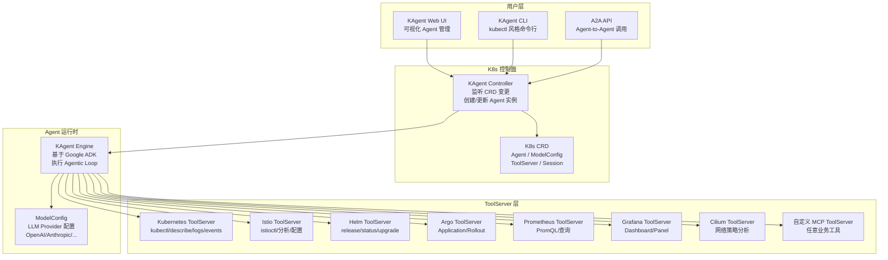
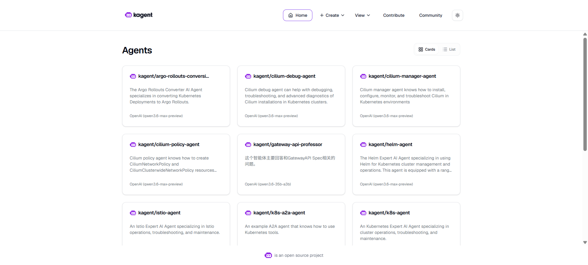
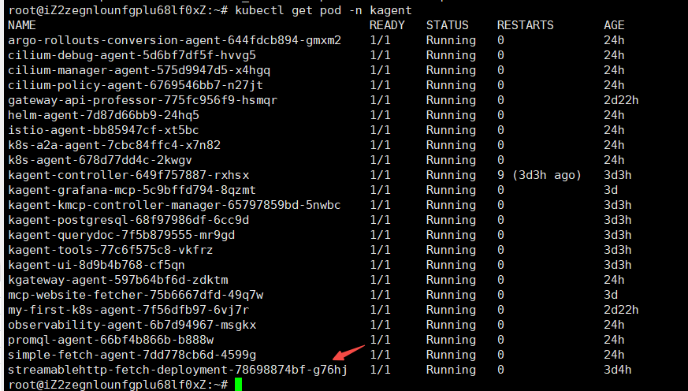
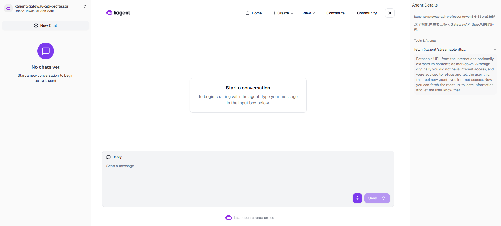

# KAgent — Kubernetes 原生 AI Agent 框架

**更新日期：** 2026年06月04日
**信息来源：** 官方文档、GitHub 仓库、CNCF 资料、社区实践
**参考地址：**

1. GitHub：[kagent-dev/kagent](https://github.com/kagent-dev/kagent)（~2.9k stars）
2. 官方文档：[kagent.dev](https://kagent.dev/)
3. 快速开始：[Quickstart](https://kagent.dev/docs/kagent/getting-started/quickstart)
4. MCP 工具集：[Built-in Tools](https://kagent.dev/docs/kagent/tools/builtin)
5. Helm 安装：[Installation](https://kagent.dev/docs/kagent/introduction/installation)
6. 可观测性：[Tracing](https://kagent.dev/docs/kagent/getting-started/tracing)

> Star 数会持续变化。正式对外汇报前建议以 GitHub 实时数据复核。

---

## 1. 结论摘要

KAgent 是 CNCF 项目，定位是 **Kubernetes 原生的 AI Agent 编排框架**。它不是一个现成的故障诊断工具，而是一个用来**构建和部署自定义 AI Agent 的平台**：用 K8s CRD 声明 Agent 定义（系统提示 + 工具列表 + LLM 配置），用 Operator 管理 Agent 生命周期，用内置 MCP ToolServer 提供对 K8s/Istio/Helm/Prometheus/Grafana/Cilium 等工具的调用能力。

与 HolmesGPT / K8sGPT 不同，KAgent 本身不包含诊断逻辑——它提供的是构建 Agent 的基础设施。用户可以在 KAgent 上实现"运维 AI 助手"、"安全巡检 Agent"、"成本优化 Agent"等各种垂直场景的 Agent，且每个 Agent 都以 K8s CRD 形式声明，与现有 GitOps / Helm / ArgoCD 流程完全兼容。

KAgent 底层使用 Google ADK（Agent Development Kit）作为 Agent 推理引擎，支持 OpenTelemetry 追踪，具备完整的生产级可观测性。

| 关键信息 | 值 |
| --- | --- |
| CNCF 状态 | CNCF 项目 |
| 开源协议 | Apache 2.0 |
| 实现语言 | Go + TypeScript + Python |
| 核心机制 | K8s CRD 声明 Agent（Agent + ModelConfig + ToolServer）|
| 推理引擎 | Google ADK（Agent Development Kit）|
| 支持 LLM | OpenAI、Azure OpenAI、Anthropic、Google Vertex AI、Ollama、自定义 |
| 内置工具集 | Kubernetes、Istio、Helm、Argo、Prometheus、Grafana、Cilium 等 |
| 可观测性 | OpenTelemetry 追踪 + Grafana/Jaeger 集成 |
| 部署方式 | Helm Chart / kubectl |

---

## 2. 产品概况

| 项目 | 内容 |
| --- | --- |
| 产品名称 | KAgent（kagent）|
| 产品定位 | Kubernetes 原生 AI Agent 编排框架 |
| 开发者 | kagent-dev 社区（147 贡献者，CNCF 项目）|
| CNCF 状态 | ✅ CNCF 项目（CNCF #kagent slack 频道）|
| 开源协议 | Apache 2.0 |
| 推理引擎 | Google ADK + 自研 Controller |
| 主要形态 | Controller + Engine + UI + CLI 四组件，Helm 部署 |
| 目标用户 | 平台工程师、需要在 K8s 内构建垂直领域 AI Agent 的团队 |
| 典型场景 | 运维智能助手、K8s 自愈 Agent、服务网格管理 Agent、GitOps Agent |
| 竞争定位 | AI Agent 基础设施层，比 HolmesGPT 更通用，需要团队自建上层逻辑 |

---

## 3. 产品定位与典型场景

| 场景 | KAgent 解决的问题 | 价值 |
| --- | --- | --- |
| 构建运维 AI 助手 | 需要一个能查询 K8s 状态、读 Grafana 面板、执行 kubectl 的对话式助手 | 声明一个 Agent CRD，组合 K8s + Grafana + Prometheus ToolServer，即可通过 UI 对话使用 |
| K8s 自愈 Agent | 检测到 Pod 频繁重启后自动触发调查并修复 | Agent 订阅告警事件，调用 K8s ToolServer 诊断，通过 Remediation 工具执行修复动作 |
| Istio 服务网格管理 | Istio 配置复杂，VirtualService / DestinationRule 出错难以排查 | Istio ToolServer 提供 istioctl 和 Pilot 分析能力，Agent 可自然语言解释配置问题 |
| 多 Agent 协作 | 复杂问题需要多个专家协同（网络专家 + 存储专家 + 安全专家）| KAgent 支持 Agent-to-Agent（A2A）调用，可编排多 Agent 工作流 |
| GitOps Agent | 希望 AI 介入 GitOps 审批流程，自动检查 Argo Application 状态 | 接入 Argo ToolServer + GitHub MCP，Agent 自动验证部署健康并回复 PR |
| 自定义扩展 | 内部有私有工具（CMDB、发布系统）希望 AI 能使用 | 实现自定义 ToolServer（任意 MCP 兼容服务），无需修改 KAgent 核心代码 |

---

## 4. 技术架构



| 组件 | 说明 |
| --- | --- |
| **Controller** | K8s Operator，监听 Agent / ToolServer / ModelConfig CRD，负责 Agent 实例生命周期管理 |
| **Engine** | 基于 Google ADK 的 Agent 推理引擎，执行 Agentic Loop，调用工具并与 LLM 交互 |
| **UI** | Web 管理界面，可视化创建 Agent、查看对话历史、管理 ToolServer |
| **CLI** | kubectl 风格的命令行工具，支持所有 KAgent CRD 操作 |
| **ToolServer** | MCP 兼容服务，每个 ToolServer 暴露一组工具（kubectl、istioctl、helm 等），多 Agent 共享 |

---

## 5. 部署

### 5.1 脚本安装

```bash
curl https://raw.githubusercontent.com/kagent-dev/kagent/refs/heads/main/scripts/get-kagent | bash


# 1. 临时将百炼的 API Key 伪装注入进全局变量（必须配置，否则 CLI 拒绝启动）
export OPENAI_API_KEY="xxxxx"
# 2. 强行将 OpenAI 的请求路径重定向到阿里云百炼官方端点
export OPENAI_BASE_URL="https://dashscope.aliyuncs.com/compatible-mode/v1"
# 3. 执行官方一键 Demo 部署（它会在 K8s 中自动创建核心组件、控制器和 UI 界面）
kagent install --profile demo
```

实际是helm安装的
```bash
root@iZ2zegnlounfgplu68lf0xZ:~# helm list -n kagent
NAME       	NAMESPACE	REVISION	UPDATED                                	STATUS  	CHART            	APP VERSION  	           
kagent-crds	kagent   	2       	2026-06-01 10:52:27.343489974 +0800 CST	deployed	kagent-crds-0.9.4	           
```

### 安装之后获取

```bash
root@iZ2zegnlounfgplu68lf0xZ:~# kubectl get all -n kagent
NAME                                                   READY   STATUS    RESTARTS       AGE
pod/argo-rollouts-conversion-agent-644fdcb894-gmxm2    1/1     Running   0              24h
pod/cilium-debug-agent-5d6bf7df5f-hvvg5                1/1     Running   0              24h
pod/cilium-manager-agent-575d9947d5-x4hgq              1/1     Running   0              24h
pod/cilium-policy-agent-6769546bb7-n27jt               1/1     Running   0              24h
pod/gateway-api-professor-775fc956f9-hsmqr             1/1     Running   0              2d22h
pod/helm-agent-7d87d66bb9-24hq5                        1/1     Running   0              24h
pod/istio-agent-bb85947cf-xt5bc                        1/1     Running   0              24h
pod/k8s-a2a-agent-7cbc84ffc4-x7n82                     1/1     Running   0              24h
pod/k8s-agent-678d77dd4c-2kwgv                         1/1     Running   0              24h
pod/kagent-controller-649f757887-rxhsx                 1/1     Running   9 (3d3h ago)   3d3h
pod/kagent-grafana-mcp-5c9bffd794-8qzmt                1/1     Running   0              3d
pod/kagent-kmcp-controller-manager-65797859bd-5nwbc    1/1     Running   0              3d3h
pod/kagent-postgresql-68f97986df-6cc9d                 1/1     Running   0              3d3h
pod/kagent-querydoc-7f5b879555-mr9gd                   1/1     Running   0              3d3h
pod/kagent-tools-77c6f575c8-vkfrz                      1/1     Running   0              3d3h
pod/kagent-ui-8d9b4b768-cf5qn                          1/1     Running   0              3d3h
pod/kgateway-agent-597b64bf6d-zdktm                    1/1     Running   0              24h
pod/mcp-website-fetcher-75b6667dfd-49q7w               1/1     Running   0              3d
pod/my-first-k8s-agent-7f56dfb97-6vj7r                 1/1     Running   0              2d22h
pod/observability-agent-6b7d94967-msgkx                1/1     Running   0              24h
pod/promql-agent-66bf4b866b-b888w                      1/1     Running   0              24h
pod/simple-fetch-agent-7dd778cb6d-4599g                1/1     Running   0              24h
pod/streamablehttp-fetch-deployment-78698874bf-g76hj   1/1     Running   0              3d3h

NAME                                                     TYPE        CLUSTER-IP     EXTERNAL-IP   PORT(S)          AGE
service/argo-rollouts-conversion-agent                   ClusterIP   10.1.29.97     <none>        8080/TCP         3d3h
service/cilium-debug-agent                               ClusterIP   10.1.226.54    <none>        8080/TCP         3d3h
service/cilium-manager-agent                             ClusterIP   10.1.158.71    <none>        8080/TCP         3d3h
service/cilium-policy-agent                              ClusterIP   10.1.194.35    <none>        8080/TCP         3d3h
service/gateway-api-professor                            ClusterIP   10.1.200.245   <none>        8080/TCP         3d3h
service/helm-agent                                       ClusterIP   10.1.158.103   <none>        8080/TCP         3d3h
service/istio-agent                                      ClusterIP   10.1.228.247   <none>        8080/TCP         3d3h
service/k8s-a2a-agent                                    ClusterIP   10.1.199.8     <none>        8080/TCP         3d
service/k8s-agent                                        ClusterIP   10.1.230.21    <none>        8080/TCP         3d3h
service/kagent-controller                                ClusterIP   10.1.160.250   <none>        8083/TCP         3d3h
service/kagent-grafana-mcp                               ClusterIP   10.1.189.24    <none>        8000/TCP         3d3h
service/kagent-kmcp-controller-manager-metrics-service   ClusterIP   10.1.143.146   <none>        8443/TCP         3d3h
service/kagent-postgresql                                ClusterIP   10.1.116.5     <none>        5432/TCP         3d3h
service/kagent-querydoc                                  ClusterIP   10.1.69.183    <none>        8080/TCP         3d3h
service/kagent-tools                                     ClusterIP   10.1.30.45     <none>        8084/TCP         3d3h
service/kagent-tools-metrics                             ClusterIP   10.1.91.197    <none>        8085/TCP         3d3h
service/kagent-ui                                        NodePort    10.1.148.232   <none>        8080:32637/TCP   3d3h
service/kgateway-agent                                   ClusterIP   10.1.198.226   <none>        8080/TCP         3d3h
service/mcp-website-fetcher                              ClusterIP   10.1.3.104     <none>        3000/TCP         3d
service/my-first-k8s-agent                               ClusterIP   10.1.9.182     <none>        8080/TCP         3d2h
service/observability-agent                              ClusterIP   10.1.153.231   <none>        8080/TCP         3d3h
service/promql-agent                                     ClusterIP   10.1.241.72    <none>        8080/TCP         3d3h
service/simple-fetch-agent                               ClusterIP   10.1.98.144    <none>        8080/TCP         3d
service/streamablehttp-fetch-service                     ClusterIP   10.1.173.46    <none>        3000/TCP         3d3h

NAME                                              READY   UP-TO-DATE   AVAILABLE   AGE
deployment.apps/argo-rollouts-conversion-agent    1/1     1            1           3d3h
deployment.apps/cilium-debug-agent                1/1     1            1           3d3h
deployment.apps/cilium-manager-agent              1/1     1            1           3d3h
deployment.apps/cilium-policy-agent               1/1     1            1           3d3h
deployment.apps/gateway-api-professor             1/1     1            1           3d3h
deployment.apps/helm-agent                        1/1     1            1           3d3h
deployment.apps/istio-agent                       1/1     1            1           3d3h
deployment.apps/k8s-a2a-agent                     1/1     1            1           3d
deployment.apps/k8s-agent                         1/1     1            1           3d3h
deployment.apps/kagent-controller                 1/1     1            1           3d3h
deployment.apps/kagent-grafana-mcp                1/1     1            1           3d3h
deployment.apps/kagent-kmcp-controller-manager    1/1     1            1           3d3h
deployment.apps/kagent-postgresql                 1/1     1            1           3d3h
deployment.apps/kagent-querydoc                   1/1     1            1           3d3h
deployment.apps/kagent-tools                      1/1     1            1           3d3h
deployment.apps/kagent-ui                         1/1     1            1           3d3h
deployment.apps/kgateway-agent                    1/1     1            1           3d3h
deployment.apps/mcp-website-fetcher               1/1     1            1           3d
deployment.apps/my-first-k8s-agent                1/1     1            1           3d2h
deployment.apps/observability-agent               1/1     1            1           3d3h
deployment.apps/promql-agent                      1/1     1            1           3d3h
deployment.apps/simple-fetch-agent                1/1     1            1           3d
deployment.apps/streamablehttp-fetch-deployment   1/1     1            1           3d3h
```

### 主页访问

```bash
kubectl -n kagent port-forward svc/kagent-ui 8080:8080
```


### 5.2 配置 LLM Provider（ModelConfig CRD）
参考阿里云这篇：
https://help.aliyun.com/zh/ack/ack-managed-and-ack-dedicated/use-cases/quickly-build-a-question-and-answer-agent-using-kagent?spm=a2c4g.11186623.help-menu-85222.d_3_2_0.73992af98gQtUf&scm=20140722.H_2997737._.OR_help-T_cn~zh-V_1

创建secret
```bash
export PROVIDER_API_KEY=${你的百炼APIKey}
kubectl create secret generic bailian-apikey -n kagent --from-literal credential="$PROVIDER_API_KEY"
```
创建modelconfig
```bash
kubectl -n kagent apply -f - <<EOF
apiVersion: kagent.dev/v1alpha2
kind: ModelConfig
metadata:
  name: bailian-provider-config
spec:
  model: qwen3-coder-plus
  apiKeySecret: bailian-apikey
  apiKeySecretKey: credential
  openAI:
    baseUrl: https://dashscope.aliyuncs.com/compatible-mode/v1
  provider: OpenAI
EOF
```
创建之后的yaml如下：
```yaml
apiVersion: kagent.dev/v1alpha2
kind: ModelConfig
metadata:
  annotations:
    kubectl.kubernetes.io/last-applied-configuration: |
      {"apiVersion":"kagent.dev/v1alpha2","kind":"ModelConfig","metadata":{"annotations":{},"name":"bailian-provider-config","namespace":"kagent"},"spec":{"apiKeySecret":"bailian-apikey","apiKeySecretKey":"credential","model":"qwen3.6-max-preview","openAI":{"baseUrl":"https://dashscope.aliyuncs.com/compatible-mode/v1"},"provider":"OpenAI"}}
  creationTimestamp: "2026-06-01T02:39:25Z"
  generation: 3
  name: bailian-provider-config
  namespace: kagent
  resourceVersion: "3631671"
  uid: 1feb1a33-8514-42db-8d50-fbd769ef818a
spec:
  apiKeySecret: bailian-apikey
  apiKeySecretKey: credential
  model: qwen3.6-35b-a3b
  openAI:
    baseUrl: https://dashscope.aliyuncs.com/compatible-mode/v1
  provider: OpenAI
status:
  conditions:
  - lastTransitionTime: "2026-06-01T03:29:30Z"
    message: Model configuration accepted
    reason: ModelConfigReconciled
    status: "True"
    type: Accepted
  observedGeneration: 3
  secretHash: 88da83115cc31d2aaef019b1f75a6dc95df10e4ceaf49b08e121fc95e3bea26b
```

### 部署mcp-server
这里以fetch-website示例为例，部署一个简单的 MCP ToolServer，提供一个 fetch-website 工具：

```bash
kubectl -n kagent apply -f - <<EOF
apiVersion: apps/v1
kind: Deployment
metadata:
  name: streamablehttp-fetch-deployment
spec:
  replicas: 1
  selector:
    matchLabels:
      app: streamablehttp-fetch
  template:
    metadata:
      labels:
        app: streamablehttp-fetch
    spec:
      containers:
      - name: streamablehttp-fetch-container
        image: registry-cn-hangzhou.ack.aliyuncs.com/dev/streamablehttp-fetch:latest
---
apiVersion: v1
kind: Service
metadata:
  name: streamablehttp-fetch-service
spec:
  selector:
    app: streamablehttp-fetch
  ports:
    - protocol: TCP
      port: 3000
      targetPort: 3000
  type: ClusterIP
EOF
```

### 注册mcp-server为RemoteMCPServer

```bash
kubectl -n kagent apply -f - <<EOF
apiVersion: kagent.dev/v1alpha2
kind: RemoteMCPServer
metadata:
  name: streamablehttp-fetch
spec:
  description: A Model Context Protocol server that provides web content fetching capabilities. This server enables LLMs to retrieve and process content from web pages, converting HTML to markdown for easier consumption.
  protocol: STREAMABLE_HTTP
  sseReadTimeout: 5m0s
  terminateOnClose: true
  timeout: 30s
  url: http://streamablehttp-fetch-service:3000/
EOF
```
确定RemoteMCPServer状态为 Ready 后，即可在 Agent 中使用这个 RemoteMCPServer 提供的工具了。
```bash
root@iZ2zegnlounfgplu68lf0xZ:~# kubectl get RemoteMCPServer -n kagent
NAME                   PROTOCOL          URL                                         ACCEPTED
kagent-grafana-mcp     STREAMABLE_HTTP   http://kagent-grafana-mcp.kagent:8000/mcp   True
kagent-tool-server     STREAMABLE_HTTP   http://kagent-tools.kagent:8084/mcp         True
streamablehttp-fetch   STREAMABLE_HTTP   http://streamablehttp-fetch-service:3000/   True
```


### 5.3 声明一个 Agent

#### 问答 Agent 示例

```bash
kubectl -n kagent apply -f - <<EOF
apiVersion: kagent.dev/v1alpha2
kind: Agent
metadata:
  name: gateway-api-professor
  namespace: kagent
spec:
  declarative:
    modelConfig: bailian-provider-config
    stream: true
    systemMessage: |-
      你是一个友好且乐于助人的代理，使用 streamablehttp-fetch 工具从以下地址获取GatewayAPI 信息来回答用户关于GatewayAPI的问题。
      # 链接
      - intro: https://gateway-api.sigs.k8s.io/
      - api-overview: https://gateway-api.sigs.k8s.io/concepts/api-overview/
      - use-case: https://gateway-api.sigs.k8s.io/concepts/use-cases/
      - servicemesh: https://gateway-api.sigs.k8s.io/mesh/
      - implementations: https://gateway-api.sigs.k8s.io/implementations/
      - 1.4版本支持概况：https://gateway-api.sigs.k8s.io/implementations/v1.4/
      - 完整spec，页面比较大：https://gateway-api.sigs.k8s.io/reference/spec/
      # Instructions
      - 如果用户问题不清楚，在运行任何工具之前先请求澄清
      - 对用户回答要友好，热情
      - 如果你不知道如何回答问题，不要编造答案
        回答 "抱歉，我不知道如何回答这个问题" 并请用户进一步澄清问题
      - 如果用户的问题是总结、概述类型的，请确保通读全文后再回答。
      # Response format
      - 总是以Markdown格式进行回复。
      - 你的回复需要包含你所执行的操作的总结以及对于结果的解释。
    tools:
    - type: McpServer
      mcpServer:
        apiGroup: kagent.dev
        kind: RemoteMCPServer
        name: streamablehttp-fetch
        toolNames:
        - fetch
  description: 这个智能体主要回答和GatewayAPI Spec相关的问题。
  type: Declarative
EOF
```

获取pod状态，running即可


然后把kagent-ui的service暴露出来，访问UI界面与Agent对话：

```bash
kagent-ui                                        NodePort    10.1.148.232   <none>        8080:32637/TCP   3d3h
# 访问 http://localhost:32637
```



#### 运维Agent 示例(未测试)

参考阿里云这篇文档：https://help.aliyun.com/zh/ack/ack-managed-and-ack-dedicated/use-cases/building-a-kubernetes-operations-agent-quickly-with-kagent?spm=a2c4g.11186623.help-menu-85222.d_3_2_1.6e537b6cw8cmJT&scm=20140722.H_2997740._.OR_help-T_cn~zh-V_1

> ⚠️ 注意：KAgent 内置 ToolServer 包括：`kubernetes`、`istio`、`helm`、`argo`、`prometheus`、`grafana`、`cilium`，**没有 loki**。日志查询可通过 `kubernetes` ToolServer 的 `kubectl logs` 工具覆盖，或自行部署 Loki MCP Server 后注册为 `RemoteMCPServer`。

```bash
kubectl apply -f - <<EOF
apiVersion: kagent.dev/v1alpha2
kind: Agent
metadata:
  name: my-ack-ops-agent
  namespace: kagent
spec:
  declarative:
    deployment:
      env:
        - name: OPENAI_API_KEY
          value: placeholder
      replicas: 1
    modelConfig: my-provider-config
    stream: true
    systemMessage: |-
      # 角色
      你是一个专业的 ACK (Alibaba Cloud Container Service for Kubernetes) 智能助手。你的任务是准确理解用户关于集群的请求，并选择最合适的工具来执行查询、诊断或分析。
      # 核心指令 (Core Instructions)
      1.  **确认目标，首要原则**:
          *   在执行任何操作前，必须先确认用户要操作的 cluster_id。
          *   如果用户的提问中没有提供，**必须**首先调用 list_clusters 工具，并询问用户希望在哪个集群上操作。
      2.  **工具选择策略 (按优先级)**:
          *   **复杂故障诊断**: 当遇到 Pod 异常、网络不通、节点 NotReady 等复杂问题时，**优先使用 diagnose_resource**。
          *   **性能指标查询**: 当问题涉及“CPU/内存高低”、“快慢”、“用量多少”时，**优先使用 query_prometheus**。
          *   **安全与变更审计**: 当问题是关于“谁在什么时间做了什么”时，**优先使用 query_audit_log**。
          *   **集群整体健康**: 当用户想了解“集群是否健康”或要“体检报告”时，**使用 query_inspect_report**。
          *   **控制面问题**: 当怀疑是 API Server、Scheduler 等 Kubernetes 系统组件的问题时，**使用 query_controlplane_logs**。
          *   **通用查询**: 对于其他所有标准的、明确的 Kubernetes 资源查询（如 get pods, describe service, logs <pod>），**使用 ack_kubectl 作为默认工具**。
      3.  **安全红线**:
          *   你的主要职责是查询和诊断。任何通过 ack_kubectl 执行的、**可能修改集群状态**的操作（如 apply, delete，或创建诊断用的临时 Pod），你**必须**先向用户说明你将执行的命令及其目的，并在获得**用户明确授权**后才能执行。
      4.  **行为准则**:
          *   如果用户问题不清楚，先请求澄清再行动。
          *   回答友好、热情。
          *   如果使用工具后仍无法找到答案，**绝不能编造**。诚实地回答：“抱歉，通过现有工具我暂时无法定位问题”，并可以提供你已有的发现。
      # 回复格式 (Response Format)
      *   **始终使用 Markdown 格式**。
      *   回复需包含你的**操作总结**以及对结果的**分析和建议**。
      ---
      ### 总结
      *(用一句话总结你做了什么，以及核心发现。)*
    tools:
      - mcpServer:
          apiGroup: kagent.dev
          kind: RemoteMCPServer
          name: ack-mcp-tool-server
          toolNames:
            - list_clusters
            - ack_kubectl
            - query_prometheus
            - query_prometheus_metric_guidance
            - diagnose_resource
            - query_inspect_report
            - query_audit_log
            - get_current_time
            - query_controlplane_logs
        type: McpServer
  description: 这个智能体可以和ACK MCP Tools进行交互，以获取集群的信息并操作集群。
  type: Declarative
EOF
```

---

## 6. 核心概念与 CRD 详解

### 6.1 三大 CRD

| CRD | 作用 | 类比 |
| --- | --- | --- |
| `Agent` | 定义 AI Agent：系统提示 + 工具列表 + LLM 配置 | 一个"具备特定职责的 AI 员工"的岗位描述 |
| `ModelConfig` | 定义 LLM Provider 和模型参数 | LLM 连接配置，可被多个 Agent 复用 |
| `ToolServer` | 定义 MCP 工具服务，暴露一组工具给 Agent 使用 | 工具箱，Agent 从中选用所需工具 |

### 6.2 内置 ToolServer 能力

| ToolServer | 主要工具 |
| --- | --- |
| `kubernetes` | 获取 Pod/Deployment/Service 状态，查看 logs/events，执行 kubectl describe |
| `istio` | istioctl analyze，VirtualService/DestinationRule 检查，Pilot xDS 诊断 |
| `helm` | 查看 release 状态、chart 版本、values，执行 upgrade/rollback |
| `argo` | ArgoCD Application 状态，Argo Rollouts 金丝雀进度 |
| `prometheus` | 执行 PromQL 查询，查看告警规则，获取指标数据 |
| `grafana` | 查询 Dashboard 面板数据，查看告警状态 |
| `cilium` | 网络策略检查，Pod 连通性分析，Hubble 流量查看 |

### 6.3 Agent-to-Agent（A2A）调用

KAgent 支持 Agent 之间互相调用，实现多 Agent 协作：

```bash
kubectl apply -f - <<EOF
apiVersion: kagent.dev/v1alpha2
kind: Agent
metadata:
  name: k8s-a2a-agent
  namespace: kagent
spec:
  description: An example A2A agent that knows how to use Kubernetes tools.
  type: Declarative
  declarative:
    modelConfig: default-model-config
    systemMessage: |-
        You are an expert Kubernetes agent that uses tools to help users.
    tools:
      - type: McpServer
        mcpServer:
          name: kagent-tool-server
          kind: RemoteMCPServer
          toolNames:
          - k8s_get_resources
          - k8s_get_available_api_resources
    a2aConfig:
      skills:
      - id: get-resources-skill
        name: Get Resources
        description: Get resources in the Kubernetes cluster
        inputModes:
        - text
        outputModes:
        - text
        tags:
        - k8s
        - resources
        examples:
        - "Get all resources in the Kubernetes cluster"
        - "Get the pods in the default namespace"
        - "Get the services in the istio-system namespace"
        - "Get the deployments in the istio-system namespace"
        - "Get the jobs in the istio-system namespace"
        - "Get the cronjobs in the istio-system namespace"
        - "Get the statefulsets in the istio-system namespace"
EOF
```

---

## 7. 可观测性接入

KAgent 原生支持 OpenTelemetry 追踪，可将 Agent 的每次工具调用、LLM 请求、推理过程都作为 Trace 上报：

helm安装
```bash
helm repo add open-telemetry https://open-telemetry.github.io/opentelemetry-helm-charts
helm repo update
```

集成loki
```bash
helm upgrade --install loki loki \
--repo https://grafana.github.io/helm-charts \
--version {VERSIONS.loki} \
--namespace telemetry \
--create-namespace \
--values - <<EOF
loki:
  commonConfig:
    replication_factor: 1
  schemaConfig:
    configs:
      - from: 2024-04-01
        store: tsdb
        object_store: s3
        schema: v13
        index:
          prefix: loki_index_
          period: 24h
  auth_enabled: false
singleBinary:
  replicas: 1
minio:
  enabled: true
gateway:
  enabled: false
test:
  enabled: false
monitoring:
  selfMonitoring:
    enabled: false
    grafanaAgent:
      installOperator: false
lokiCanary:
  enabled: false
limits_config:
  allow_structured_metadata: true
memberlist:
  service:
    publishNotReadyAddresses: true
deploymentMode: SingleBinary
backend:
  replicas: 0
read:
  replicas: 0
write:
  replicas: 0
ingester:
  replicas: 0
querier:
  replicas: 0
queryFrontend:
  replicas: 0
queryScheduler:
  replicas: 0
distributor:
  replicas: 0
compactor:
  replicas: 0
indexGateway:
  replicas: 0
bloomCompactor:
  replicas: 0
bloomGateway:
  replicas: 0
EOF
```

集成Tempo
```bash
helm upgrade --install tempo tempo \
--repo https://grafana.github.io/helm-charts \
--version {VERSIONS.tempo} \
--namespace telemetry \
--create-namespace \
--values - <<EOF
persistence:
  enabled: false
tempo:
  receivers:
    otlp:
      protocols:
        grpc:
          endpoint: 0.0.0.0:4317
EOF
```

在 Grafana Tempo 中可以看到完整的 Agent 推理链路：哪次 LLM 调用耗时多少、调用了哪些工具、每个工具返回什么。

---

## 8. 与同类工具对比

| 维度 | KAgent | HolmesGPT | K8sGPT |
| --- | --- | --- | --- |
| 定位 | AI Agent 框架（构建平台）| 现成 SRE Agent（开箱即用）| K8s 诊断工具（扫描器）|
| 入门门槛 | 中（需要自定义 Agent + ToolServer）| 低（安装即用）| 最低（单命令扫描）|
| 灵活性 | 最高（完全自定义）| 中（靠扩展 Toolset）| 低（固定分析器）|
| 团队协作 | ✅ UI + CLI + API | ⚠️（需 Robusta）| ❌ |
| 多 Agent 协作 | ✅ A2A 原生支持 | ❌ | ❌ |
| 生产级 Agent 管理 | ✅ CRD + GitOps 友好 | ⚠️（Operator 模式）| ⚠️（Operator 模式）|
| 上手时间 | 数小时~数天（需设计 Agent）| 数分钟（配置 LLM 即用）| 数分钟（安装即用）|
| CNCF | ✅ | ✅ Sandbox | ✅ Incubating |

**结论：** KAgent 适合有能力自建 Agent 逻辑、希望在 K8s 内统一管理多个 AI Agent 的平台团队；HolmesGPT 适合想快速获得"告警根因分析"能力的 SRE 团队；K8sGPT 适合希望快速诊断集群健康状况的场景。三者定位不冲突，可以同时使用。

---

## 9. 常见问题

### KAgent 和 Robusta 的 HolmesGPT 有什么本质区别？

**HolmesGPT** 是一个"具体产品"：内置 SRE 领域知识，有固定的调查流程，接入观测系统后可直接用于告警根因分析。

**KAgent** 是一个"框架"：它提供构建 Agent 的基础设施（CRD、Controller、Engine、ToolServer），但不包含任何预设的诊断逻辑。你需要自己定义 Agent 的职责和工具组合。两者可以结合使用，甚至可以在 KAgent 框架上实现类似 HolmesGPT 的 SRE Agent。

---

### KAgent 支持哪些 IM 渠道，可以接飞书吗？

**官方文档中有示例的渠道：**

| 渠道 | 支持方式 | 文档 |
| --- | --- | --- |
| **Slack** | 官方示例（双向：Slack 调 Agent + Agent 发消息到 Slack）| [Slack and A2A](https://kagent.dev/docs/kagent/examples/slack-a2a) |
| **Discord** | 官方示例（Bot 通过 A2A 调 Agent）| [Discord and A2A](https://kagent.dev/docs/kagent/examples/discord-a2a) |
| **Telegram** | 官方示例（Bot + HITL 审批 + 会话持久化）| [Telegram Bot](https://kagent.dev/docs/kagent/examples/telegram-bot) |
| **飞书（Lark）** | ❌ 无官方示例，**但可以自己实现** | — |

**飞书没有官方支持，但从架构角度完全可以接**。KAgent 的渠道接入方式是统一的：

```
IM 渠道（飞书/Slack/Telegram）
    ↓ 用户发消息
渠道 Bot（独立 Python/Go 服务）
    ↓ 调用 A2A HTTP API（JSON-RPC）
KAgent Controller（http://kagent-controller:8083/api/a2a/...）
    ↓
Agent 推理 + 工具调用
    ↓ 返回结果
渠道 Bot 把结果发回 IM 渠道
```

**接飞书的实现路径：**

1. 在飞书开放平台创建企业自建应用，开通"接收消息"和"发送消息"权限
2. 写一个飞书 Bot 服务（Python 用 `lark-oapi` SDK），监听飞书 webhook 消息事件
3. 收到消息后，通过 A2A HTTP API 调用 KAgent Agent（与 Telegram Bot 的 `send_a2a_task` 函数逻辑完全相同）
4. 把 Agent 返回结果通过飞书消息 API 发回给用户

核心代码和 Telegram Bot 示例几乎一致，只是把 `python-telegram-bot` 换成 `lark-oapi`。本项目已有飞书告警通知的集成经验（`kagent配置飞书告警.md`），可以复用该思路。

> 注意：渠道 Bot 服务需要能访问飞书 webhook（需要公网地址或内网穿透），以及能访问集群内的 `kagent-controller` Service。

使用 OpenAI 兼容协议，在 `ModelConfig` 中指定 `baseUrl`：

```yaml
spec:
  provider: OpenAI
  baseUrl: "http://vllm-service.ai-infra.svc.cluster.local:8000/v1"
  model: "Qwen2.5-72B-Instruct"
```

---

### Agent 的 ToolServer 里的工具有权限限制吗？

`kubernetes` ToolServer 的权限由其 ServiceAccount 的 RBAC 配置决定。默认安装时是最小权限（只读），如果需要 Agent 执行修复动作（如 scale / restart），需要显式授予对应 RBAC 权限，并在 Agent 的 `systemPrompt` 中说明允许的操作范围。

---

### KAgent 内置 ToolServer 里没有 loki，日志怎么查？

**内置 ToolServer 列表**（截至 v1alpha2）：`kubernetes`、`istio`、`helm`、`argo`、`prometheus`、`grafana`、`cilium`，**没有 loki**。

日志查询有两种方案：

1. **用 `kubernetes` ToolServer 的 `k8s_get_pod_logs` 工具**：直接调 `kubectl logs`，适合查单个 Pod 的最近日志。
2. **自建 Loki MCP Server 并注册为 `RemoteMCPServer`**：封装 Loki HTTP API（`/loki/api/v1/query_range`），用 mcp-golang 等 Go MCP SDK 暴露 `loki_query` 工具，然后在 Agent 的 `tools` 中引用这个 `RemoteMCPServer`。

---

### `a2aConfig.skills` 是什么，它和普通 Agent 有什么区别？

`a2aConfig.skills` 来自 **Google A2A（Agent-to-Agent）协议**，是 Agent 对外发布的**机器可读能力名片（AgentCard）**。

加了 `a2aConfig` 的 Agent 和没加的 Agent 内部推理逻辑完全相同，区别只在于：

| | 普通 Agent（如问答 Agent）| A2A Agent |
| --- | --- | --- |
| 调用者 | **人** → 通过 UI 对话框输入 | **另一个 Agent** → 通过 A2A 协议程序调用 |
| 对外暴露 | 聊天界面 | `GET /.well-known/agent.json`（AgentCard 发现端点）|
| `a2aConfig` | 无 | 有，声明 skills / tags / examples |

`skills` 中的字段（`id`、`tags`、`examples`）是给**上游编排 Agent** 看的：编排 Agent 通过 tags 找到合适的子 Agent，通过 examples 判断路由是否匹配，然后委托子任务。**`skills` 是"声明自己能被谁调用"，不是"调用谁"。**

---

### A2A Agent 的 `skills` 里的工具（如 `k8s_get_resources`）和 skills 本身是什么关系？

两层概念，不要混淆：

```
skills（A2A 协议层）       ← 声明给上游 Agent 看的能力描述（只是文字元数据）
    ↓ 编排 Agent 根据 skills 决定"委托这个 Agent 处理 K8s 类任务"
tools（MCP ToolServer 层）  ← Agent 内部 LLM 实际可以调用的工具（真正执行操作）
    ↓ LLM 根据任务内容决定"调用 k8s_get_resources 工具"
```

`skills` 不直接触发任何工具调用，只是一段静态描述。Agent 收到上游委托的任务后，由 LLM 自主决定调用 `tools` 里的哪个工具来完成任务。

---

### KAgent 的 Container-based Skills 是什么，和 `a2aConfig.skills` 有什么区别？

KAgent 有**两个完全不同的东西都叫 "skills"**，非常容易混淆：

| | `spec.skills.refs`（容器技能）| `spec.declarative.a2aConfig.skills`（A2A 元数据）|
| --- | --- | --- |
| 是什么 | Docker 镜像，含 SKILL.md + 可执行脚本 | YAML 里的一段静态文字描述 |
| 给谁看 | **LLM**（读 SKILL.md 学会"何时用、怎么调"）| **上游 Agent**（发现和路由决策用）|
| 能执行吗 | ✅ 镜像里有真实脚本可以运行 | ❌ 纯元数据，不执行任何操作 |

**Container-based Skills 工作机制：**

```
构建技能镜像（SKILL.md + scripts/ + Dockerfile FROM scratch）
    ↓ docker push 到 Harbor 或其他 registry
在 Agent YAML 中声明引用：
  spec:
    skills:
      refs:
        - harbor.example.com/kagent-skills/k8s-deploy-skill:latest
    ↓
Agent Pod 启动时，KAgent 用 init container 拉取技能镜像
将文件解压挂载到 Agent 容器的 /skills/ 目录
    ↓
/skills/k8s-deploy-skill/SKILL.md    ← LLM 启动时读取，内化为系统提示
/skills/k8s-deploy-skill/scripts/    ← 脚本文件，LLM 通过 bash 工具调用
    ↓
用户：部署一个名为 httpbin 的应用
LLM：读 SKILL.md → 决定调用 scripts/deploy-app.py httpbin nginx:latest
     → 脚本生成 manifest → Agent 用 k8s_apply_manifest 工具 apply
```

**技能 SKILL.md 结构：**

```markdown
---
name: k8s-deploy-skill
description: Deploy simple applications to Kubernetes
---
# Kubernetes 部署技能

## Instructions
- 当用户要部署应用时触发此技能
- 调用 scripts/deploy-app.py <name> <image> [replicas] [port]
- 脚本生成 temp-manifest.yaml，再用工具 apply 到集群

## Example
用户：部署 nginx，镜像 nginx:latest，2 副本，端口 80
Agent：执行 scripts/deploy-app.py nginx nginx:latest 2 80
```

Container-based Skills 的核心价值是**技能可复用**：打包成镜像后，任意 Agent 都可以通过 `spec.skills.refs` 引用，无需重复在每个 Agent 的 systemMessage 里写操作指南。

---

### 为什么要把 Skill 打成容器镜像？这样有什么好处？

技能镜像**不是一个运行中的服务**，它的 Dockerfile 是：

```dockerfile
FROM scratch
COPY . /
```

就是一个只装文件的空镜像，不运行任何进程。KAgent 用 init container 把它"解压"到 Agent Pod 的 `/skills/` 目录，之后镜像就没用了。

**本质上是把容器镜像当作"有版本号的 tar 包"来用**，和为什么要把应用打成 Docker 镜像而不是直接 scp 二进制文件是同一个道理——标准化打包 + 版本化分发。

| 好处 | 说明 |
| --- | --- |
| **复用** | 10 个 Agent 都要会"部署 K8s 应用"，只需写一次技能镜像，各自 `refs` 引用，不用在每个 systemMessage 里重复写操作手册 |
| **版本管理** | `k8s-deploy-skill:v1.2.0`，技能升级打新 tag，Agent YAML 里改版本号即可，回滚也方便 |
| **分工分离** | 写技能脚本的人（懂 K8s 操作）和配置 Agent 的人（懂业务场景）可以独立工作，互不阻塞 |
| **现有基础设施复用** | 推到已有的 Harbor，不需要额外的技能存储系统 |
| **GitOps 友好** | 技能版本 pin 在 Agent YAML 里，变更 = PR，有审计记录 |

对比直接把操作指南写在 `systemMessage` 里的方案：

```
直接写 systemMessage：
  - 10 个 Agent 各自维护一份，改一处要改 10 处
  - 无版本号，不知道哪个 Agent 用的是新逻辑还是旧逻辑
  - systemMessage 越来越长，难以维护
```

---

### KAgent 有自动巡检模式吗，能定时执行任务吗？

**KAgent 本身没有内置定时调度（Cron）机制**，`Agent` CRD 的 API 没有 `schedule` 字段。但可以用 Kubernetes 原生的 **CronJob** 来触发定时巡检，这也是社区的标准做法。

**实现原理**：

```
Kubernetes CronJob（按 Cron 表达式触发）
    ↓ 每次运行一个 Pod，执行 curl / Python 脚本
    ↓ POST JSON-RPC 请求到 A2A 端点
KAgent Agent（sre-agent 等）
    ↓ 自动调用工具（检查 Pod 状态、节点资源、告警...）
    ↓ 把巡检结果发送到飞书 / Slack
```

**示例：每天早 9 点巡检集群健康状态**

```yaml
apiVersion: batch/v1
kind: CronJob
metadata:
  name: k8s-daily-inspection
  namespace: kagent
spec:
  schedule: "0 9 * * 1-5"        # 工作日早 9 点
  jobTemplate:
    spec:
      template:
        spec:
          restartPolicy: Never
          containers:
          - name: trigger
            image: curlimages/curl:latest
            command:
            - sh
            - -c
            - |
              curl -s -X POST \
                http://kagent-controller.kagent.svc.cluster.local:8083/api/a2a/kagent/sre-agent/ \
                -H "Content-Type: application/json" \
                -d '{
                  "jsonrpc": "2.0",
                  "id": 1,
                  "method": "tasks/send",
                  "params": {
                    "id": "daily-inspection",
                    "message": {
                      "role": "user",
                      "parts": [{
                        "type": "text",
                        "text": "请执行每日巡检：1) 检查所有命名空间中 NotReady 的 Pod；2) 检查节点资源使用率是否超过 80%；3) 检查是否有 Pending 超过 10 分钟的 Pod；4) 汇总并报告结果。"
                      }]
                    }
                  }
                }'
```

> **注意**：巡检结果默认只保存在 Agent 的会话历史中。如果需要把结果推送到飞书/Slack，需要在 `sre-agent` 的 systemMessage 里明确指示——"巡检结束后，将结果以 Markdown 格式发送到飞书 webhook"，并为该 Agent 配置飞书通知工具（MCP Server）。

**巡检 Agent 的推荐设计：**

| 巡检类型 | 触发频率 | 建议工具 | 输出目标 |
| --- | --- | --- | --- |
| 集群每日健康巡检 | 每天 1 次 | k8s_get_resources, k8s_describe_resource | 飞书消息 |
| 告警静默期检查 | 每小时 1 次 | query_prometheus | 飞书告警 |
| CronJob 执行状态检查 | 每 30 分钟 1 次 | k8s_get_resources (CronJob/Job) | 日志/飞书 |
| 证书过期预警 | 每天 1 次 | k8s_get_resources (Secrets) | 飞书消息 |

---

### OpenClaw、Hermes 等第三方 Agent 能接入 kagent 体系吗？

可以，但方式和普通 `Agent` CRD 不同——kagent 提供了两种机制来纳管这类外部 Agent：

**方式一：`AgentHarness`（推荐——用于 OpenClaw / NemoClaw / Hermes）**

`AgentHarness` 是专门为这个场景设计的 CRD。它不运行 kagent 自己的 ADK 运行时，而是通过 **OpenShell 网关**（gRPC）去创建和管理一个外部沙箱，并把它暴露在 kagent 的 API 和 UI 里。

```yaml
apiVersion: kagent.dev/v1alpha2
kind: AgentHarness
metadata:
  name: openclaw-shell
  namespace: kagent
spec:
  backend: openclaw          # 可选：openclaw / nemoclaw / hermes
  description: "OpenClaw 平台运维沙箱"
  modelConfigRef: default-model-config
  network:
    allowedDomains:
      - api.openai.com
      - slack.com
  channels:                  # 可选：直接绑定 Slack / Telegram 渠道
    - name: platform
      type: slack
      slack:
        botToken:
          valueFrom:
            type: Secret
            name: slack-tokens
            key: bot-token
        appToken:
          valueFrom:
            type: Secret
            name: slack-tokens
            key: app-token
        openclaw:
          channelAccess: allowlist
          allowlistChannels:
            - C0123456789
```

前提条件：需要额外安装 **OpenShell 网关**，并配置 kagent controller 的 `OPENSHELL_GATEWAY_URL` 环境变量指向网关地址。没有这个网关，`AgentHarness` 后端不会注册。

**方式二：BYO（Bring Your Own Agent）——用于任意自定义 Agent**

对于不属于 OpenClaw/Hermes 生态、但已经实现了 A2A 协议的 Agent（如自己用 CrewAI、LangGraph、OpenAI Swarm 写的 Agent），可以用 BYO 模式纳入 kagent：

```yaml
apiVersion: kagent.dev/v1alpha2
kind: Agent
metadata:
  name: my-crewai-agent
  namespace: kagent
spec:
  type: BYO
  byo:
    deployment:
      image: myregistry/my-crewai-agent:latest
      replicas: 1
```

kagent 会把这个容器当作一个标准 Deployment 管理，并通过 A2A 端点与它通信。

**三种方式对比：**

| 方式 | 适用对象 | 额外依赖 | Agent 运行时 |
| --- | --- | --- | --- |
| `Agent` (Declarative) | 用 kagent 从零写的 Agent | 无 | kagent ADK（Python/Go） |
| `Agent` (BYO) | 自己实现了 A2A 协议的容器 | 无 | 自带运行时 |
| `AgentHarness` | OpenClaw / NemoClaw / Hermes 沙箱 | 需要 OpenShell 网关 | 外部沙箱运行时 |

> **对本项目的建议**：当前阶段直接使用 Declarative `Agent` 即可满足需求。`AgentHarness` 属于企业级高级功能，在引入 OpenClaw/Hermes 体系之前不需要关注。

---

### 接入第三方 Agent（BYO / AgentHarness）有什么实际价值？

核心价值在三个场景：

**1. 复用已有 Agent，不重写**

如果团队已经用 LangGraph / CrewAI / OpenAI Swarm 写了一个能用的 Agent（比如专门做 SQL 慢查询诊断），BYO 模式可以直接把它"挂"进 kagent，让它出现在 kagent UI 里、被其他 Agent 当工具调用，不用推倒重来。

**2. 多 Agent 编排——让各自擅长的 Agent 协同工作**

这是最重要的价值。kagent 可以把任意 Agent 注册为工具，由一个总调度 Agent 按需调用：

```
oncall-agent（总调度，kagent Declarative）
    ├─ 调 promql-agent（kagent 原生）    → 生成 PromQL、查 Prometheus
    ├─ 调 sql-agent（BYO，原 LangGraph）  → 诊断 DB 慢查询
    └─ 调 security-agent（BYO，CrewAI）  → 扫描安全风险
```

所有 Agent 统一在 kagent 里管理生命周期，通过 A2A 协议通信，有完整的 Tempo 链路追踪。

**3. OpenClaw / Hermes 的企业沙箱场景**

这两类沙箱比 kagent 的 SandboxAgent 提供更强的代码执行隔离能力，适合需要在沙箱里执行高风险操作的场景（如直接 `kubectl exec`、运行任意 shell 脚本）。通过 `AgentHarness` 接入后，kagent 统一管理沙箱的生命周期，不需要单独维护一套沙箱运维体系，也可以直接绑定 Slack 渠道让用户与沙箱对话。

> **对本项目的判断**：短期用 Declarative `Agent` 足够。BYO 的价值体现在多团队、多框架 Agent 需要统一纳管的时候；`AgentHarness` 的价值体现在需要高隔离代码执行沙箱的时候。

---

### KAgent 支持多 Agent 编排吗？

支持，这是 kagent 的核心设计之一。**把另一个 Agent 直接注册为工具**，上层 Agent 可以像调用普通 MCP 工具一样调用它。

```yaml
spec:
  type: Declarative
  declarative:
    modelConfig: default-model-config
    systemMessage: "你是一个 OnCall 总调度 Agent。"
    tools:
    - type: McpServer
      mcpServer:
        name: kagent-tool-server
        kind: RemoteMCPServer
        toolNames:
          - k8s_get_resources
    # 把另一个 Agent 注册为工具
    - type: Agent
      agent:
        name: promql-agent           # 同命名空间
    - type: Agent
      agent:
        name: security-agent
        namespace: security-team     # 跨命名空间也支持
```

**MCP 工具 vs Agent 工具的区别：**

| | MCP 工具 | Agent 作为工具 |
| --- | --- | --- |
| 执行者 | 函数/脚本 | 另一个完整的 LLM 推理链 |
| 适合做什么 | 单一确定性操作（list pods） | 复杂多步推理（"分析这个报错的根因"） |
| 返回值 | 结构化数据 | 自然语言推理结果 |

**本项目的多 Agent 编排示意（OnCall 场景）：**

```
oncall-agent（总调度）
  ├─ 收到告警："payment-service CrashLoopBackOff"
  ├─ 调 k8s_get_resources 拿 Pod 状态          ← MCP 工具（确定性）
  ├─ 调 promql-agent："查过去1小时错误率"       ← 子 Agent（多步推理）
  ├─ 调 log-analysis-agent："分析日志根因"      ← 子 Agent（多步推理）
  └─ 综合三方结果，生成处置建议发飞书
```

每个子 Agent 专注单一职责，总调度 Agent 负责编排和汇总。由于所有 Agent 间通信都走 A2A 协议，每次调用都会产生完整的 Tempo 追踪链路，方便定位哪个子 Agent 耗时过长或推理出错。

> BYO Agent（CrewAI / LangGraph 实现）同样可以作为工具注册进来，只要它暴露了 A2A 端点。

---

### KAgent 与其他多 Agent 编排框架有什么区别？

**一句话定位差异**：KAgent 不是通用 AI 编排平台，它是**为 Kubernetes 运维团队设计的 AI Ops 基础设施**，编排只是其中一个特性，而不是核心卖点。

**与主流框架对比：**

| 维度 | KAgent | LangGraph | CrewAI | Dify / Coze | AutoGen |
| --- | --- | --- | --- | --- | --- |
| **定位** | K8s AI Ops 基础设施 | 通用工作流编排 SDK | 角色协作 Agent SDK | 无代码/低代码 AI 平台 | 对话式多 Agent SDK |
| **配置方式** | YAML CRD（声明式） | Python 代码（图定义） | Python 代码（角色定义） | 可视化界面 / YAML | Python 代码 |
| **K8s 原生** | ✅ 一等公民 | ❌ 需自己部署 | ❌ 需自己部署 | ❌ 需自己部署 | ❌ 需自己部署 |
| **GitOps 兼容** | ✅ CRD 直接进 Git | ⚠️ 代码进 Git | ⚠️ 代码进 Git | ❌ 界面配置难版本化 | ⚠️ 代码进 Git |
| **工作流控制** | LLM 驱动（非确定性） | 确定性图（条件/循环） | 角色轮转（半确定性） | 可视化流程图 | 对话轮次 |
| **内置运维工具** | ✅ 丰富（K8s/Prom/Loki）| ❌ 无 | ❌ 无 | ⚠️ 少量 | ❌ 无 |
| **可观测性** | ✅ Tempo 链路追踪 | ⚠️ 需自己集成 LangSmith | ⚠️ 需自己集成 | ⚠️ 平台内部日志 | ⚠️ 需自己集成 |
| **HITL 审批** | ✅ 原生支持 | ⚠️ 需手动实现 | ⚠️ 需手动实现 | ✅ 支持 | ✅ 支持 |
| **私有化部署** | ✅ 天然支持 | ✅ 支持 | ✅ 支持 | ⚠️ 社区版有限制 | ✅ 支持 |
| **成熟度** | CNCF Sandbox（较新） | 生产级，广泛使用 | 生产级，广泛使用 | 成熟商业产品 | 微软出品，成熟 |

**KAgent 的核心优势：**

1. **零代码定义 Agent**：纯 YAML CRD，运维人员无需写 Python 就能创建和修改 Agent，直接 `kubectl apply` 生效
2. **完整 K8s 生命周期**：Agent 的扩缩容、重启、滚动升级和普通 Deployment 完全一致，Helm/ArgoCD 直接管理
3. **内置运维工具生态**：开箱即用的 kubectl、Prometheus、Helm、Istio 等工具，不需要自己封装 MCP Server
4. **原生可观测**：每次推理链路自动上报到 Tempo，不需要额外接入 LangSmith 或自建追踪
5. **协议标准化**：A2A + MCP 都是开放标准，不绑定特定框架或云厂商

**KAgent 的主要局限：**

1. **工作流控制能力弱**：没有 LangGraph 那种条件分支、循环、状态机——所有编排逻辑都依赖 LLM 推理，执行路径是非确定性的。对于需要严格控制执行顺序的场景（如金融审批流），LangGraph 更合适
2. **依赖 Kubernetes**：不适合非 K8s 环境（本地脚本、边缘设备等）
3. **项目较新**：CNCF Sandbox 阶段，API 可能变化，生态工具和社区案例比 LangGraph/CrewAI 少
4. **无可视化界面**：Dify/Coze 有拖拽式流程设计器，KAgent 只有 CLI + 基础 UI，复杂拓扑难以直观理解
5. **调试难度较高**：LLM 驱动的编排出错时，定位"是 prompt 写错了还是工具调用失败"比确定性代码更难

**选型建议：**

| 场景 | 推荐 |
| --- | --- |
| K8s 运维 AI 助手、OnCall 自动化 | **KAgent** |
| 需要严格控制流程的复杂业务工作流 | **LangGraph** |
| 非技术人员配置 AI 流程 | **Dify** |
| 快速搭建角色协作 Agent 原型 | **CrewAI** |
| 多框架 Agent 混用、需要灵活对话编排 | **AutoGen** |

> 本项目（K8s AI Ops）是 KAgent 的最典型适用场景，不需要与其他框架做太多取舍。

---

## 10. 参考文档

1. [KAgent GitHub 仓库](https://github.com/kagent-dev/kagent)
2. [KAgent 官方文档](https://kagent.dev/)
3. [快速开始指南](https://kagent.dev/docs/kagent/getting-started/quickstart)
4. [内置工具集完整列表](https://kagent.dev/docs/kagent/tools/builtin)
5. [Helm 安装指南](https://kagent.dev/docs/kagent/introduction/installation)
6. [OpenTelemetry 追踪配置](https://kagent.dev/docs/kagent/getting-started/tracing)
7. [A2A 多 Agent 协作文档](https://kagent.dev/docs/kagent/concepts/agents)