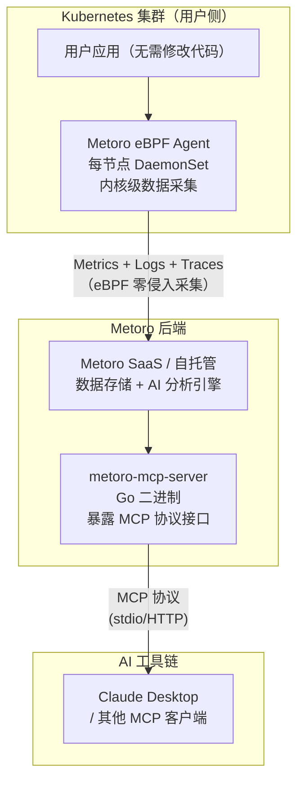

# Metoro — eBPF 驱动的 K8s 可观测平台（附 mcp-golang 调研）

**更新日期：** 2026年06月04日
**信息来源：** GitHub 仓库、官方网站、社区实测
**参考地址：**

1. Metoro 官网：[metoro.io](https://metoro.io/)
2. Metoro MCP Server：[metoro-io/metoro-mcp-server](https://github.com/metoro-io/metoro-mcp-server)
3. mcp-golang（开源 Go MCP SDK）：[metoro-io/mcp-golang](https://github.com/metoro-io/mcp-golang)（~1.2k stars）
4. MCP 协议：[modelcontextprotocol.io](https://modelcontextprotocol.io/)
5. mcp-golang 文档：[mcpgolang.com](https://mcpgolang.com/)

> Star 数会持续变化。正式对外汇报前建议以 GitHub 实时数据复核。

---

## 1. 结论摘要

Metoro 是一款**闭源商业 K8s 可观测平台**，核心特色是基于 **eBPF 零侵入自动插桩**：在 K8s 节点部署 eBPF Agent 后，无需修改任何应用代码即可自动采集服务间的指标、日志、链路追踪数据，并通过 Metoro 云端（或自托管）的 AI 层分析异常。

用户在本文档中引用的 GitHub 仓库 `metoro-io/mcp-golang`（~1.2k stars）并**不是 Metoro 平台本身**，而是 Metoro 团队开源的 **Go 语言 MCP（Model Context Protocol）SDK**，用于快速构建 MCP Server/Client。Metoro 平台本身是闭源 SaaS，其开源 MCP Server（`metoro-mcp-server`）是 Metoro 提供给用户的 AI 查询接口，通过 Claude Desktop 等 AI 应用查询自己集群的可观测数据。

对本项目的参考价值：
- **Metoro 平台**：商业工具，作为竞品或灵感参考；eBPF 零侵入思路对我们的私有化交付有借鉴意义
- **mcp-golang**：开源 Go MCP SDK，如果本项目需要为内部工具构建 MCP Server 对接 AI 工具链，可以直接使用这个库

| 关键信息 | 值 |
| --- | --- |
| Metoro 平台 | 闭源商业 SaaS（US East / 自托管可选）|
| 插桩方式 | eBPF，零代码修改，自动生成 Metrics + Logs + Traces |
| AI 查询入口 | MCP Server（`metoro-mcp-server`），对接 Claude Desktop |
| mcp-golang | 开源 Go MCP SDK，MIT 协议，~1.2k stars |
| mcp-golang 特性 | 类型安全、低样板代码、支持 stdio/HTTP/Gin transport |
| 与本项目关系 | 商业参考 + Go MCP SDK 可直接复用 |

---

## 2. 产品概况

### Metoro 平台

| 项目 | 内容 |
| --- | --- |
| 产品名称 | Metoro |
| 产品定位 | 面向 K8s 微服务的 AI 可观测平台 |
| 开发商 | Metoro（初创公司，Chris Battarbee / Ece Kayan 主导）|
| 开源情况 | ❌ 平台闭源；MCP Server 和 Go SDK 开源 |
| 插桩方式 | eBPF Agent（无代码侵入，节点级自动数据采集）|
| 部署方式 | SaaS（us-east.metoro.io）/ 自托管 |
| AI 集成 | MCP Server 协议，支持 Claude Desktop 等 AI 应用查询 |
| 竞争定位 | 对标 Datadog / Dynatrace 的轻量 eBPF 可观测方案 |

### mcp-golang（开源 Go MCP SDK）

| 项目 | 内容 |
| --- | --- |
| 项目名称 | mcp-golang |
| 定位 | Model Context Protocol 的 Go 语言 SDK 实现 |
| 开发者 | Metoro 团队（Chris Battarbee 主导）|
| 开源协议 | MIT |
| GitHub stars | ~1.2k（2026年6月）|
| 主要特性 | 类型安全 Go struct 参数、自动 JSON Schema 生成、stdio/HTTP/Gin transport |
| 文档 | [mcpgolang.com](https://mcpgolang.com/) |

---

## 3. 产品定位与典型场景

| 场景 | Metoro 解决的问题 | 价值 |
| --- | --- | --- |
| 服务性能问题排查 | 微服务间调用延迟高，不知道瓶颈在哪 | eBPF 自动追踪服务间所有 HTTP/gRPC 调用，生成完整服务拓扑和延迟分布 |
| 零侵入可观测 | 应用团队不配合接入 SDK，或无法修改第三方服务 | eBPF 在内核层采集数据，不需要应用改动，适合遗留系统和第三方服务 |
| AI 辅助查询集群状态 | 想用自然语言问"为什么 api-service 最近延迟增加了" | 通过 Metoro MCP Server + Claude Desktop，直接用自然语言查询集群的可观测数据 |
| 快速接入私有化环境 | 不想维护 Prometheus + Loki + Tempo 等多个组件 | Metoro Agent 一键部署，全栈可观测数据自动采集到 Metoro 后端 |

---

## 4. 技术架构



| 层级 | 说明 |
| --- | --- |
| eBPF Agent | 以 DaemonSet 部署在每个 K8s 节点，通过 Linux 内核 eBPF 钩子自动捕获服务间网络流量、系统调用，无需 sidecar 或代码修改 |
| Metoro 后端 | 接收 eBPF Agent 上报的遥测数据，存储、分析，提供 REST API |
| MCP Server | Go 二进制，通过 Metoro API 提供 MCP 工具接口，让 AI 应用可以查询集群的实时可观测数据 |
| Claude Desktop | 用户侧 AI 交互入口，通过 MCP 协议向 Metoro MCP Server 发起工具调用 |

---

## 5. 部署与接入

### 5.1 Metoro MCP Server（本地体验）

```bash
# 克隆并构建 MCP Server
git clone https://github.com/metoro-io/metoro-mcp-server.git
cd metoro-mcp-server
go build -o metoro-mcp-server

# 配置 Claude Desktop（~/Library/Application Support/Claude/claude_desktop_config.json）
```

```json
{
  "mcpServers": {
    "metoro-mcp-server": {
      "command": "/path/to/metoro-mcp-server",
      "args": [],
      "env": {
        "METORO_AUTH_TOKEN": "your-auth-token",
        "METORO_API_URL": "https://us-east.metoro.io"
      }
    }
  }
}
```

**Demo 环境体验（无需账号）：** 使用公开 Demo Token 对接 Demo 集群，验证 MCP Server 的查询能力：

```json
{
  "env": {
    "METORO_AUTH_TOKEN": "eyJhbGciOiJIUzI1NiIsInR5cCI6IkpXVCJ9...",
    "METORO_API_URL": "https://demo.us-east.metoro.io"
  }
}
```

---

## 6. mcp-golang SDK 深度调研

mcp-golang 是 Metoro 开源的 Go 语言 MCP 协议 SDK，适合在 Go 项目中快速构建 MCP Server/Client。

### 6.1 核心特性

| 特性 | 说明 |
| --- | --- |
| 类型安全 | 工具参数使用 Go struct 定义，自动生成 JSON Schema，运行时反序列化 |
| 低样板代码 | 注册工具只需一个函数调用，框架自动处理工具发现、调用、错误处理 |
| 多 Transport | 内置 stdio（全功能）、HTTP（无状态）、Gin 集成；自定义 Transport 扩展点 |
| 双向支持 | Server + Client 均支持，stdio transport 支持双向通信和通知 |

### 6.2 构建 MCP Server（10 分钟上手）

```go
package main

import (
    "fmt"
    mcp "github.com/metoro-io/mcp-golang"
    "github.com/metoro-io/mcp-golang/transport/stdio"
)

// 1. 定义工具参数（Go struct，自动生成 JSON Schema）
type ClusterStatusArgs struct {
    Namespace string `json:"namespace" jsonschema:"required,description=要查询的命名空间"`
    AppName   string `json:"app_name" jsonschema:"description=应用名称过滤，可选"`
}

func main() {
    server := mcp.NewServer(stdio.NewStdioServerTransport())

    // 2. 注册工具
    err := server.RegisterTool(
        "get_cluster_status",
        "查询指定命名空间的 Pod 状态",
        func(args ClusterStatusArgs) (*mcp.ToolResponse, error) {
            // 在这里调用 K8s API 或内部接口
            result := fmt.Sprintf("namespace=%s 的状态：所有 Pod 正常", args.Namespace)
            return mcp.NewToolResponse(mcp.NewTextContent(result)), nil
        },
    )
    if err != nil {
        panic(err)
    }

    // 3. 启动（stdio 模式）
    server.Serve()
}
```

### 6.3 HTTP Server 模式（适合 K8s 部署）

```go
import "github.com/metoro-io/mcp-golang/transport/http"

// 标准 HTTP
transport := http.NewHTTPTransport("/mcp")
transport.WithAddr(":8080")
server := mcp.NewServer(transport)

// 或使用 Gin 框架
import ginTransport "github.com/metoro-io/mcp-golang/transport/http"
transport := ginTransport.NewGinTransport()
router := gin.Default()
router.POST("/mcp", transport.Handler())
server := mcp.NewServer(transport)
```

### 6.4 在本项目中的应用设想

如果需要让 AI 工具（Claude / KAgent / HolmesGPT）查询本项目特有的内部数据，可以用 mcp-golang 快速构建 MCP Server：

| 场景 | 自定义 MCP Server 工具 |
| --- | --- |
| 查询服务元信息 | `get_service_info(service_name)` → 调用内部 CMDB |
| 查询发布历史 | `get_deployment_history(app, env)` → 调用 GitLab API |
| 查询告警订阅 | `get_alert_subscribers(service)` → 调用告警平台 API |
| 触发预检查 | `run_preflight(app, env)` → 调用 Ansible playbook API |

---

## 7. 与同类方案对比

| 维度 | Metoro（eBPF 商业）| 自建 Loki+Prometheus+Tempo | Datadog |
| --- | --- | --- | --- |
| 插桩方式 | eBPF 零侵入 | 需要 Alloy/Prometheus 等采集器 | Agent 或 SDK 注入 |
| 数据完整性 | ✅ 自动全量（含非 instrumented 服务）| ⚠️ 仅已接入服务 | ✅ |
| 私有化部署 | ✅ 自托管支持 | ✅ 完全私有 | ⚠️ 企业版支持 |
| 成本 | 商业付费 | 按自建资源成本 | 较高（按数据量计费）|
| AI 查询 | ✅ 原生 MCP Server 集成 | ⚠️ 需要 HolmesGPT 等中间层 | ⚠️ 有 AI 助手但不是 MCP |
| 社区生态 | ❌ 闭源，社区小 | ✅ CNCF 成熟生态 | ✅ 大型商业生态 |

**结论：** Metoro 适合希望快速获得零侵入 eBPF 可观测能力并通过 AI 查询的场景，但作为闭源商业产品，不适合成本敏感或需要完全数据控制的场景。本项目已有成熟的 Prometheus + Loki + Tempo 自建可观测栈，Metoro 的参考价值更多在于 **eBPF 零侵入思路**（适合私有化交付场景中无法改动应用的情况）和 **mcp-golang SDK**（用于构建内部工具的 MCP 接口）。

---

## 8. 常见问题

### mcp-golang 和官方 MCP Go SDK 有什么区别？

官方（Anthropic）发布了 `github.com/modelcontextprotocol/go-sdk`，mcp-golang 是早于官方 SDK 出现的社区实现。两者功能类似，但：
- **mcp-golang**：API 更简洁，以 Go 原生 struct 作为工具参数，自动 Schema 生成，适合快速上手；HTTP transport 稳定
- **官方 SDK**：与 MCP spec 更紧密同步，长期维护有官方保障

如果是新项目，建议评估官方 SDK；如果已经在用 mcp-golang 且功能满足需求，无需迁移。

---

### Metoro eBPF Agent 对内核版本有要求吗？

有。eBPF 需要较新的 Linux 内核版本（通常 5.8+），并且部分功能需要 BTF（BPF Type Format）支持。在内核较老的私有化环境中，可能无法完整使用 eBPF 采集能力，需要提前验证内核兼容性。

---

## 9. 参考文档

1. [Metoro 官网](https://metoro.io/)
2. [Metoro MCP Server GitHub](https://github.com/metoro-io/metoro-mcp-server)
3. [mcp-golang GitHub](https://github.com/metoro-io/mcp-golang)
4. [mcp-golang 官方文档](https://mcpgolang.com/)
5. [Model Context Protocol 官方规范](https://modelcontextprotocol.io/)
6. [MCP Go 官方 SDK（Anthropic）](https://github.com/modelcontextprotocol/go-sdk)