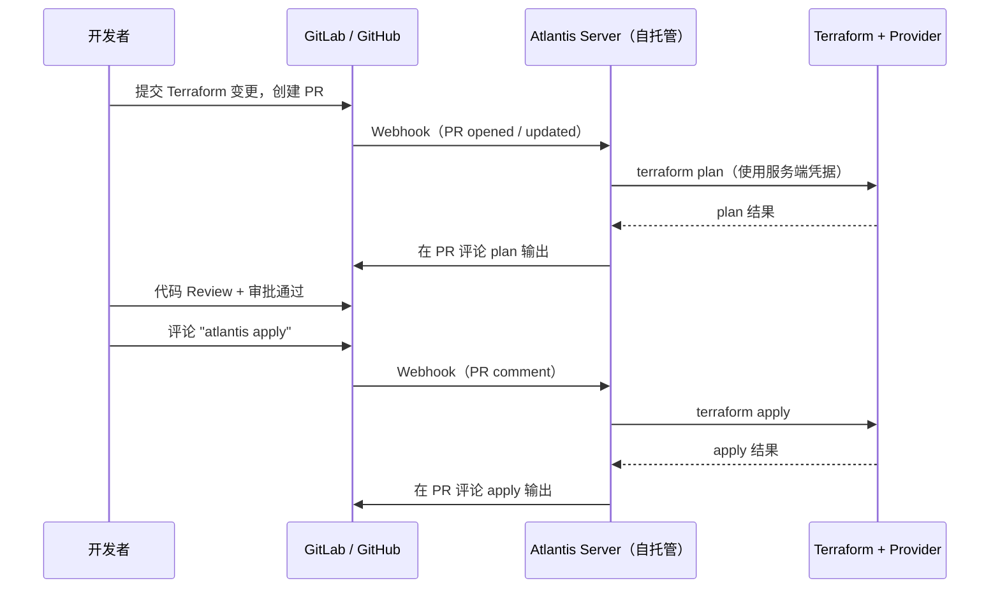

# Atlantis — Terraform Pull Request 自动化（GitOps IaC 审批流）

**更新日期：** 2026年06月04日
**信息来源：** GitHub 仓库、官方文档、官网
**参考地址：**

1. GitHub：[runatlantis/atlantis](https://github.com/runatlantis/atlantis)（~9.1k stars）
2. 官网：[runatlantis.io](https://www.runatlantis.io/)
3. 快速入门指南：[runatlantis.io/guide](https://www.runatlantis.io/guide)
4. 完整文档：[runatlantis.io/docs](https://www.runatlantis.io/docs)

> Star 数会持续变化。正式对外汇报前建议以 GitHub 实时数据复核。

---

## 1. 结论摘要

Atlantis 是 **Terraform Pull Request 自动化工具**：作为自托管 Go 服务监听 Git 仓库 webhook，当 PR 中涉及 Terraform 变更时自动执行 `terraform plan`，将 plan 结果以注释形式回写到 PR；审批通过后在 PR 中评论 `atlantis apply` 即可执行基础设施变更。核心价值是把基础设施变更的**审批、可见性、审计日志**都收拢在 PR 流程中，无需给开发者分发 Terraform 凭据。

Atlantis 是 CNCF 项目（LF Projects, LLC），Apache 2.0 协议，在生产环境中已运行近 10 年（自 2017 年），被顶级公司用于管理 600+ 仓库 / 300+ 开发者的 Terraform 工作流。

对本项目的参考价值：本项目的基础设施代码（K8s manifests、Ansible playbooks）目前由 GitLab CI 流水线驱动；如果未来引入 Terraform 管理云资源（GPU 节点、对象存储、网络等），Atlantis 是最成熟的 GitOps Terraform 审批流方案。

| 关键信息 | 值 |
| --- | --- |
| GitHub stars | ~9.1k（2026年6月）|
| 开源协议 | Apache 2.0 |
| 项目归属 | CNCF（LF Projects, LLC）|
| 实现语言 | Go（96.3%）|
| 支持 Git 平台 | GitHub、GitLab、Bitbucket、Azure DevOps |
| 最新版本 | v0.43.0（上个月，共 157 次发布）|
| 与本项目关系 | 未来引入 Terraform 管理云资源时的首选审批流方案 |

---

## 2. 产品概况

| 项目 | 内容 |
| --- | --- |
| 产品名称 | Atlantis |
| 产品定位 | Terraform PR 自动化 / GitOps IaC 审批流 |
| 核心功能 | 监听 PR webhook → 自动 `terraform plan` → 评论 plan 结果 → 审批后 `terraform apply` |
| 开发者 | Luke Kysow（创始人）等，484 贡献者 |
| 归属 | CNCF（一个 LF Projects, LLC 系列项目）|
| 项目状态 | ✅ 活跃维护（8 小时前有提交，v0.43.0 上月发布）|
| 部署方式 | Docker / Kubernetes / Fargate / VM（自托管）|
| 凭据模式 | 凭据保留在 Atlantis 服务端，开发者无需直接持有 Terraform Provider 密钥 |
| 生产案例 | 600+ 仓库、300+ 开发者，自 2017 年持续生产运行 |

---

## 3. 产品定位与典型场景

| 场景 | Atlantis 解决的问题 | 价值 |
| --- | --- | --- |
| Terraform 变更审批 | 开发者提交 IaC 变更，不知道 plan 影响范围，直接 apply 风险高 | PR 打开时自动 plan 并评论结果，全团队可见变更影响 |
| 凭据安全 | 给 100 名开发者分发 AWS/GCP 凭据，轮转困难，泄露风险高 | 凭据只存在 Atlantis 服务端，开发者通过 Git PR 间接触发操作 |
| 规范执行审查 | apply 必须在 plan 通过并获得审批后才执行 | 配置 `require_approval` 和 `require_mergeable`，强制审批流 |
| 审计合规 | 谁在什么时间对哪个资源做了什么变更，难以追溯 | 所有 plan/apply 操作记录在 PR 评论中，自动形成审计日志 |
| 多人协作 Terraform | 多个 PR 同时修改同一 Terraform state，产生冲突和锁竞争 | 自动 state locking，同一 workspace 串行执行 |

---

## 4. 工作流架构



| 组件 | 说明 |
| --- | --- |
| Atlantis Server | 自托管 Go 服务，监听 Git webhook，管理 terraform plan/apply 任务队列 |
| atlantis.yaml | 仓库级配置文件，定义 projects、workflows、autoplan 触发路径 |
| Server-Side Repo Config | 服务端全局策略（allowed_overrides、require_approval 等），由平台团队控制 |
| State Locking | 执行 plan/apply 时自动锁定 workspace，防止并发冲突 |

---

## 5. 安装与配置

### 5.1 Kubernetes 部署（Helm）

```bash
# 使用官方 kustomize 配置
kubectl apply -k github.com/runatlantis/atlantis/kustomize

# 或手动部署（以 GitLab 为例）
helm repo add atlantis https://runatlantis.github.io/atlantis
helm install atlantis atlantis/atlantis \
  --set orgAllowlist="gitlab.example.com/smartvision" \
  --set gitlab.user=atlantis-bot \
  --set gitlab.token=$GITLAB_TOKEN \
  --set gitlab.secret=$GITLAB_WEBHOOK_SECRET
```

### 5.2 仓库配置文件（atlantis.yaml）

```yaml
# 放在 Terraform 仓库根目录
version: 3
automerge: false
delete_source_branch_on_merge: false

projects:
  - name: dev-cluster
    dir: terraform/dev
    workspace: default
    autoplan:
      when_modified:
        - "*.tf"
        - "../modules/**/*.tf"
      enabled: true
    apply_requirements:
      - approved        # 需要 Code Review 批准
      - mergeable       # PR 必须处于可合并状态

  - name: prod-cluster
    dir: terraform/prod
    workspace: default
    autoplan:
      enabled: true
    apply_requirements:
      - approved
      - undiverged
```

### 5.3 常用 PR 评论命令

| 命令 | 作用 |
| --- | --- |
| `atlantis plan` | 手动触发（重新） plan |
| `atlantis apply` | 审批后触发 apply |
| `atlantis plan -d terraform/dev` | 仅对指定目录 plan |
| `atlantis import ADDR ID` | 将已有资源导入 state |
| `atlantis unlock` | 解锁当前 PR 的 workspace |
| `atlantis help` | 列出所有可用命令 |

---

## 6. 核心能力详解

### 6.1 自动 Plan 触发

在 `atlantis.yaml` 中配置 `autoplan.when_modified` 路径匹配规则，PR 中涉及这些路径的文件变更时，自动触发 `terraform plan` 并将结果评论到 PR，无需手动操作。

### 6.2 Apply Requirements 访问控制

通过 `apply_requirements` 字段强制多重门控：

```yaml
apply_requirements:
  - approved       # 必须获得至少 1 次 Code Review 批准
  - mergeable      # PR 必须无冲突，且所有 CI 检查通过
  - undiverged     # 基础分支上无新提交（避免 apply 时漏掉最新变更）
```

### 6.3 自定义 Workflow

可以在 `atlantis.yaml` 中完全覆盖默认的 init/plan/apply 步骤，插入额外验证（如 tflint、checkov 安全扫描）：

```yaml
workflows:
  custom:
    plan:
      steps:
        - init
        - run: tflint --chdir=$PLANFILE_DIR
        - run: checkov -d $PLANFILE_DIR --quiet
        - plan
    apply:
      steps:
        - apply
```

### 6.4 凭据隔离安全模型

Atlantis 以 Service Account 或 IAM Role 形式持有 Terraform Provider 凭据。开发者通过 Git 评论触发操作，不需要直接持有云凭据。访问日志全部记录在 PR 评论 + Atlantis Server 日志中。

---

## 7. 与同类工具对比

| 维度 | Atlantis（开源自托管）| Terraform Cloud（HashiCorp）| Spacelift / Env0 |
| --- | --- | --- | --- |
| 开源 | ✅ Apache 2.0 | ❌（有免费层）| ❌ 商业 |
| 自托管 | ✅ | ❌ SaaS 为主 | ✅（企业版）|
| GitLab 支持 | ✅ 原生 | ✅ | ✅ |
| PR 驱动审批流 | ✅ 核心特性 | ✅ | ✅ |
| 运维复杂度 | 中（需维护 Go 服务）| 低（SaaS）| 低（SaaS）|
| 成本 | 免费（自托管成本）| 免费层 + 付费版 | 按使用量付费 |
| 社区 | ✅ CNCF，484 贡献者 | ✅ 大型商业生态 | ❌ 较小 |
| 与 GitLab CI 集成 | ✅ Webhook 原生集成 | ⚠️ 需额外配置 | ✅ |

**结论：** 对于自托管 GitLab + Kubernetes 环境，Atlantis 是最成熟、最轻量的 Terraform GitOps 审批流选择。其无额外许可成本、CNCF 背书、与 GitLab 原生集成，与本项目技术栈高度匹配。

---

## 8. 常见问题

### Atlantis 与 GitLab CI 是否重复？

不重复。GitLab CI 负责应用代码的 lint/build/test/deploy 流水线；Atlantis 专门负责 **Terraform 基础设施变更**的 PR 自动化审批流。两者可以并存：基础设施 PR 同时触发 GitLab CI（语法检查、安全扫描）和 Atlantis（plan 预览）。

---

### 多人同时提 PR 修改同一 Terraform 模块会怎样？

Atlantis 会自动对同一 workspace 加锁。第一个 PR 触发 plan 后，同 workspace 的其他 PR plan/apply 请求会排队等待。锁释放后（apply 完成或手动 unlock），下一个 PR 才能执行。

---

### Atlantis 支持 Terragrunt 吗？

支持。可以在自定义 Workflow 中替换 plan/apply 步骤使用 `terragrunt plan` 和 `terragrunt apply`，或使用社区维护的 Terragrunt-specific 配置方式。

---

## 9. 参考文档

1. [Atlantis GitHub 仓库](https://github.com/runatlantis/atlantis)
2. [Atlantis 官网](https://www.runatlantis.io/)
3. [快速入门指南](https://www.runatlantis.io/guide)
4. [atlantis.yaml 配置参考](https://www.runatlantis.io/docs/repo-level-atlantis-yaml)
5. [服务端配置参考（Server-Side Repo Config）](https://www.runatlantis.io/docs/server-side-repo-config)
6. [安全最佳实践](https://www.runatlantis.io/docs/security)
7. [与 GitLab 集成](https://www.runatlantis.io/docs/gitlab-and-atlantis)