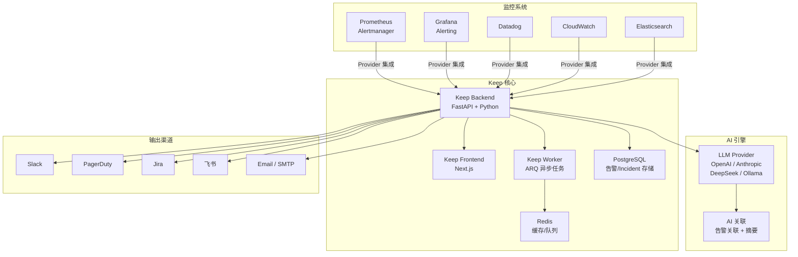
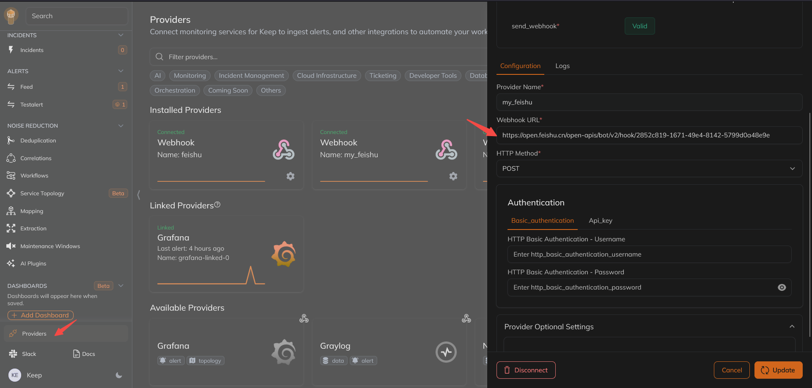
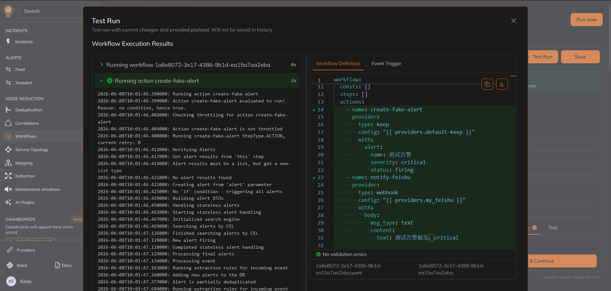
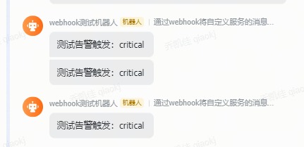
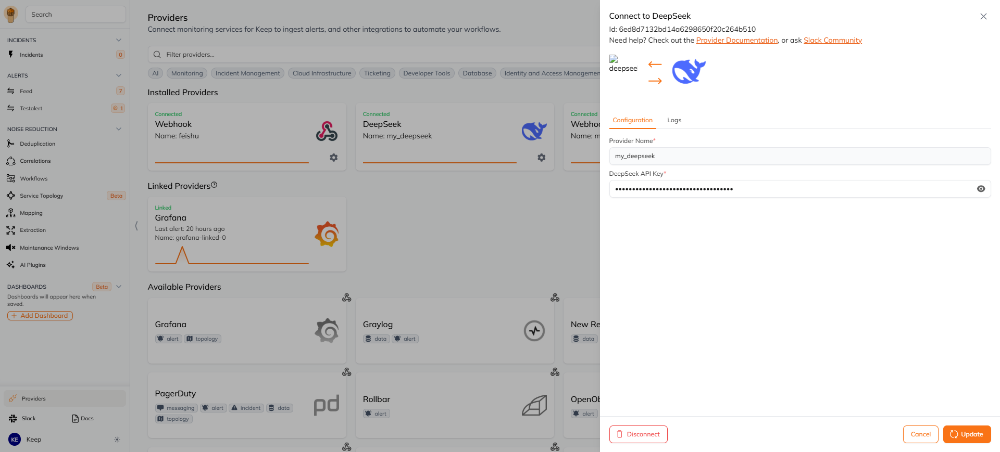
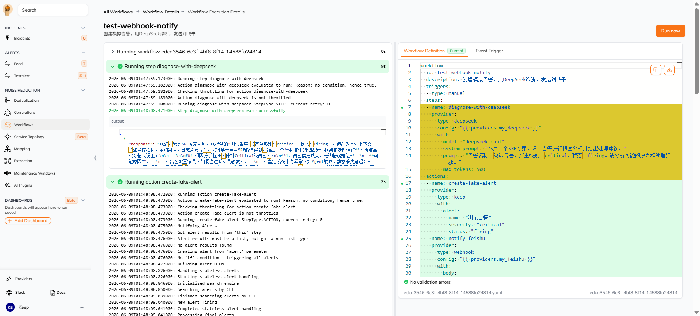
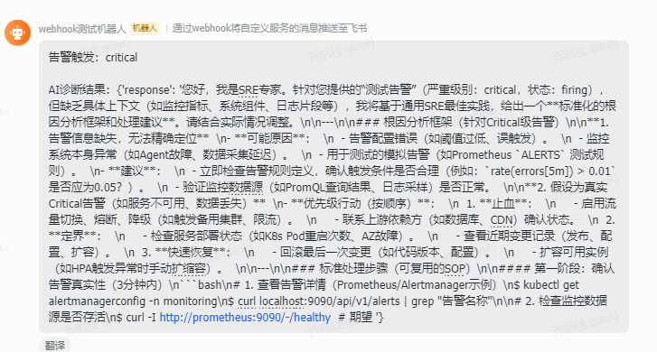

# Keep — 开源 AIOps 与告警管理平台

**更新日期：** 2026年06月08日
**信息来源：** 官方文档、GitHub 仓库、YC 资料、社区实践
**参考地址：**

1. GitHub：[keephq/keep](https://github.com/keephq/keep)（~11.9k stars）
2. 官方文档：[docs.keephq.dev](https://docs.keephq.dev)
3. YC 页面：[Keep on YC](https://www.ycombinator.com/companies/keep)
4. 官网：[keephq.dev](https://www.keephq.dev)
5. Playground：[playground.keephq.dev](https://playground.keephq.dev)
6. Provider 列表：[Providers](https://docs.keephq.dev/providers/overview)

> Star 数会持续变化。正式对外汇报前建议以 GitHub 实时数据复核。

---

## 1. 结论摘要

Keep 是开源 AIOps 和告警管理平台，定位是**所有监控工具的统一告警面板（Single Pane of Glass）**。它不是一个指标采集器或可视化工具，而是一个**告警聚合、降噪、富化、自动响应的编排层**：通过 110+ Provider 对接 Prometheus/Grafana/Datadog/CloudWatch 等监控系统的告警，用去重/关联/过滤/富化等手段将上千条告警压缩为几十条可操作事件，并通过 Workflow 引擎实现自动化响应。

与 Prometheus Alertmanager 的"告警路由+通知"不同，Keep 在告警之上增加了 **AI 关联（AIOps 2.0）**、**Workflow 自动化**、**Incident 管理** 等能力，是 Alertmanager 的上层补充而非替代。

Keep 于 2025 年 5 月被 **Elastic 收购**，Y Combinator W23 孵化，核心代码 AGPLv3 开源。

| 关键信息 | 值 |
| --- | --- |
| 开源协议 | AGPLv3（核心）/ 商业版（Enterprise）|
| 实现语言 | Python（后端 FastAPI）+ TypeScript（前端 Next.js）|
| 背后公司 | Elastic（2025年5月收购）|
| YC 批次 | W23（2023年冬季）|
| Provider 数量 | 110+（监控/通知/工单/CMDB 等）|
| AI 能力 | AI 关联 + AI 摘要（OpenAI / Anthropic / DeepSeek / Ollama）|
| 部署方式 | Docker Compose / Helm Chart |
| 核心机制 | Provider（双向集成）+ Workflow（YAML 自动化）+ AI 关联 |

---

## 2. 产品概况

| 项目 | 内容 |
| --- | --- |
| 产品名称 | Keep（keephq）|
| 产品定位 | 开源 AIOps 与告警管理平台 |
| 开发者 | Keep 团队（Elastic 旗下，YC W23）|
| 开源协议 | AGPLv3（核心功能）|
| 技术栈 | Python FastAPI + Next.js + PostgreSQL + Redis |
| 主要形态 | Backend API + Frontend UI + Worker，Docker Compose 部署 |
| 目标用户 | SRE / DevOps / NOC 团队，需要统一管理多监控系统告警的组织 |
| 典型场景 | 告警聚合降噪、告警自动响应、Incident 管理、多环境监控统一 |
| 竞争定位 | 开源替代 BigPanda / Splunk ITSI / ServiceNow ITOM |

---

## 3. 产品定位与典型场景

| 场景 | Keep 解决的问题 | 价值 |
| --- | --- | --- |
| 告警聚合（Single Pane of Glass） | Prometheus/Grafana/Datadog/CloudWatch 各有各的告警面板，SRE 需要切换多个系统查看告警 | 所有告警汇聚到一个面板，支持跨系统搜索和过滤 |
| 告警降噪 | 上千条告警中大部分是重复/低价值的，告警疲劳导致真正的问题被淹没 | 去重、关联、过滤、节流，将 1000+ 告警压缩到 10 条可操作事件 |
| 告警富化 | 原始告警缺少上下文（哪个服务、哪个版本、谁在值班） | Workflow 从 CMDB/数据库/Jira 自动补充上下文信息 |
| 自动响应 | 502 错误需要先确认是否影响低优先级客户再决定是否升级 | Workflow 自动执行验证步骤，符合条件自动升级或静默 |
| Incident 管理 | 多个相关告警分散在不同系统，难以判断是否属于同一事件 | AI 关联将相关告警自动归为一个 Incident |
| 值班管理 | 告警通知到错误的人或在非工作时间打扰 | 维护窗口管理、值班轮转、通知路由规则 |

---

## 4. 技术架构



| 组件 | 说明 |
| --- | --- |
| **Backend API** | FastAPI Python 服务，核心 API-first 设计，所有 UI 操作均可通过 API 完成 |
| **Frontend UI** | Next.js Web 界面，告警面板、Incident 视图、Workflow 编辑器、Dashboard |
| **Worker** | ARQ 异步任务队列，执行 Workflow 步骤、AI 关联、告警富化 |
| **Provider** | 双向集成模块（Python），从监控系统拉取/推送告警，向通知渠道发送消息 |
| **PostgreSQL** | 告警、Incident、Workflow、API Key 持久化存储 |
| **Redis** | 缓存、ARQ 任务队列、实时推送（WebSocket）|
| **LLM Provider** | AI 关联和摘要的后端，支持 OpenAI / Anthropic / DeepSeek / Ollama |

---

## 5. 部署

### 5.1 Docker Compose 部署

```bash
# 克隆仓库
git clone https://github.com/keephq/keep.git
cd keep

# 启动（默认无认证，开发/测试用）
docker compose up -d

# 带认证部署
docker compose -f docker-compose-with-auth.yml up -d

# 带 OTel 可观测性
docker compose -f docker-compose-with-otel.yaml up -d
```

### 5.2 Helm 部署（K8s）

```bash
helm repo add keep https://keephq.github.io/keep
helm repo update
helm install keep keep/keep -n monitoring --create-namespace
```

### 5.3 核心环境变量

| 变量 | 说明 | 默认值 |
| --- | --- | --- |
| `DATABASE_CONNECTION_STRING` | PostgreSQL 连接串 | — |
| `AUTH_TYPE` | 认证类型 | `NOAUTH`（支持 DB/Keycloak/Auth0/Okta）|
| `KEEP_JWT_SECRET` | JWT 密钥（DB 认证时必填）| — |
| `OPENAI_API_KEY` | OpenAI API Key（AI 功能）| — |
| `OPENAI_MODEL_NAME` | OpenAI 模型 | `gpt-4o-2024-08-06` |
| `SECRET_MANAGER_TYPE` | 密钥管理类型 | `FILE`（支持 Vault/K8S/GCP）|
| `OTEL_EXPORTER_OTLP_ENDPOINT` | OTel Collector 端点 | — |

### 5.4 配置数据源

Keep 通过 Provider 集成监控系统。在 UI 中配置 Provider 后，Keep 自动开始拉取/接收告警：



配置 Prometheus 数据源示例：
1. 进入 Keep UI → Settings → Providers
2. 搜索 `Prometheus`
3. 填写 Prometheus 地址和 API Key
4. 配置 Alertmanager Webhook 指向 Keep（Push 模式）
---

## 6. 核心概念

### 6.1 Provider（数据源/通知源）

Provider 是 Keep 与第三方系统交互的桥梁，分为两类角色：

| 角色 | 说明 | 示例 |
| --- | --- | --- |
| **告警源** | 从监控系统拉取告警，或接收监控系统推送的告警 | Prometheus、Datadog、CloudWatch、Grafana |
| **通知/操作目标** | Workflow 中向外部系统发送通知或执行操作 | Slack、PagerDuty、Jira、飞书、SMTP |

### 6.2 Workflow（自动化工作流）

类似 GitHub Actions 的 YAML 工作流引擎，可被告警触发、定时触发或手动触发：

```yaml
workflow:
  id: auto-enrich-alert
  name: 告警自动富化
  description: 收到告警后自动查询 CMDB 补充服务信息，并发送 Slack 通知
  on:
    alert:
      - source: prometheus
      - severity: critical
  steps:
    - id: query_cmdb
      provider:
        type: http
        config:
          url: "https://cmdb.internal/api/service/{{ alert.service }}"
      # 富化告警
    - id: notify_slack
      provider:
        type: slack
        config:
          channel: "#ops-alerts"
          message: "🚨 {{ alert.name }} - 服务: {{ alert.service }}, 环境: {{ alert.environment }}"
```

### 6.3 Incident（事件）

一组相关告警自动或手动归为一个 Incident，提供事件级视角：

| 能力 | 说明 |
| --- | --- |
| AI 自动关联 | 基于告警相似性、时间窗口、服务拓扑自动分组 |
| Incident 状态机 | fired → acknowledged → resolved |
| 时间线 | 完整的告警和操作时间线 |
| 手动合并 | 人工将相关告警合并到同一 Incident |

### 6.4 Common Express Language（CEL）

Keep 提供高级查询语言用于告警过滤和分析：

```cel
# 查询过去 1 小时内所有 critical 告警
source == "prometheus" && severity == "critical"

# 查询特定服务的告警
labels.service == "payment-service"

# 查询未确认的告警
status == "firing" && !acknowledged
```

### 6.5 Maintenance Window（维护窗口）

Keep 支持在指定时间段内对告警进行静默，用于计划性维护期间抑制不必要的通知。

| 能力 | 说明 |
| --- | --- |
| 时间范围 | 指定开始/结束时间，窗口内告警不触发通知 |
| 过滤条件 | 可按 Provider、severity、标签等精确匹配需要静默的告警 |
| Workflow 集成 | 维护窗口状态可作为 Workflow 条件判断依据 |
| API 管理 | 可通过 REST API 动态创建/删除维护窗口，便于 CI/CD 发布流程集成 |

典型用法：在发布流水线中调用 Keep API 创建维护窗口 → 部署 → 窗口结束，避免部署期间产生误报。


## 7 场景测试 

### 7.1 webhook（飞书机器人）告警

workflow
```yaml
workflow:
  id: test-webhook-notify
  description: 创建模拟告警并发送到飞书
  triggers:
    - type: manual
  actions:
    - name: create-fake-alert
      provider:
        type: keep
        with:
          alert:
            name: "测试告警"
            severity: "critical"
            status: "firing"
    - name: notify-feishu
      provider:
        type: webhook
        config: "{{ providers.my_feishu }}"
        with:
          body:
            msg_type: "text"
            content:
              text: "测试告警触发：critical"
```


模拟告警推送到飞书



飞书聊天就会出现：


或者是用http也可以
```yaml
workflow:
  id: test-webhook-notify
  description: 创建模拟告警并发送到飞书
  triggers:
    - type: manual
  actions:
    - name: create-fake-alert
      provider:
        type: keep
        with:
          alert:
            name: "测试告警"
            description: "这是一条测试告警"
            severity: "critical"
            status: "firing"
    - name: notify-feishu
      provider:
        type: http
        with:
          url: "https://open.feishu.cn/open-apis/bot/v2/hook/3eeade21-583d-4fa8-9f0c-6d0bf8a86278"
          method: POST
          headers:
            Content-Type: "application/json"
          body:
            msg_type: "text"
            content:
              text: "测试告警触发：critical - 这是一条测试告警"
```
### 7.2 模拟告警接入deepseek 诊断再发给飞书告警

DeepSeek 需要在 Providers 页面配置 API Key 并命名为 my_deepseek


配置工作流：
```yaml
workflow:
  id: test-webhook-notify
  description: 创建模拟告警，用DeepSeek诊断，发送到飞书
  triggers:
    - type: manual
  steps:
    - name: diagnose-with-deepseek
      provider:
        type: deepseek
        config: "{{ providers.my_deepseek }}"
        with:
          model: "deepseek-chat"
          system_prompt: "你是一个SRE专家，请对告警进行根因分析并给出处理建议。"
          prompt: "告警名称：测试告警，严重级别：critical，状态：firing。请分析可能的原因和处理步骤。"
          max_tokens: 500
  actions:
    - name: create-fake-alert
      provider:
        type: keep
        with:
          alert:
            name: "测试告警"
            severity: "critical"
            status: "firing"
    - name: notify-feishu
      provider:
        type: webhook
        config: "{{ providers.my_feishu }}"
        with:
          body:
            msg_type: "text"
            content:
              text: "告警触发：critical\n\nAI诊断结果：{{ steps.diagnose-with-deepseek.results }}"
```           



飞书接收到告警：



### 7.3 可以集成channel做交互式按钮

比如slack的交互式按钮，用户点击后会触发workflow中的某个步骤，进行自动化操作：

第一步：在 Keep UI 配置 Provider

my_slack：Slack provider（webhook URL 或 OAuth）
my_ssh：SSH provider（填入 Docker 服务器 host/user/password 或 pkey）


Workflow 1：发送带按钮的 Slack 消息
```yaml
workflow:
  id: docker-control-notify
  description: 发送 Docker 控制按钮到 Slack
  triggers:
    - type: manual
  actions:
    - name: send-slack-buttons
      provider:
        type: slack
        config: "{{ providers.my_slack }}"
        with:
          message: "Docker 容器控制"
          blocks:
            - type: section
              text:
                type: mrkdwn
                text: "请选择操作："
            - type: actions
              elements:
                - type: button
                  text:
                    type: plain_text
                    text: "启动容器"
                  action_id: start_container
                - type: button
                  text:
                    type: plain_text
                    text: "停止容器"
                  action_id: stop_container
```
Workflow 2：接收 Slack 回调执行 SSH 命令

```yaml
workflow:
  id: docker-ssh-control
  description: 通过 SSH 控制 Docker 容器
  triggers:
    - type: manual
  steps:
    - name: stop-container
      provider:
        type: ssh
        config: "{{ providers.my_ssh }}"
        with:
          command: "docker stop my_container_name"
    - name: start-container
      provider:
        type: ssh
        config: "{{ providers.my_ssh }}"
        with:
          command: "docker start my_container_name"
```

### 7.4 真实 Prometheus 告警自动触发飞书通知

前面 3 个场景都是手动触发，这是最接近生产的场景：Alertmanager 将告警 Webhook 推送到 Keep 后，Keep 自动触发 Workflow。

**前提：** 已在 Alertmanager 中配置 receiver 指向 Keep 的 Webhook 端点（`http://<keep-host>/alerts/event/prometheus`）。

```yaml
workflow:
  id: prometheus-critical-to-feishu
  description: Prometheus critical 告警自动发飞书
  triggers:
    - type: alert
      filters:
        - key: source
          value: prometheus
        - key: severity
          value: critical
  actions:
    - name: notify-feishu
      provider:
        type: http
        with:
          url: "https://open.feishu.cn/open-apis/bot/v2/hook/YOUR_WEBHOOK"
          method: POST
          headers:
            Content-Type: "application/json"
          body:
            msg_type: "text"
            content:
              text: "🚨 告警：{{ alert.name }}\n严重级别：{{ alert.severity }}\n来源：{{ alert.source }}\n描述：{{ alert.description }}\n标签：{{ alert.labels }}"
```

> 可在 `filters` 中继续叠加 `key: name` 等条件，实现细粒度路由（如只处理 vLLM 服务相关告警）。

---

### 7.5 K8s Pod 崩溃 → 自动拉日志 → AI 诊断 → 飞书

适合 K8s 平台的自动化排障场景：Prometheus 的 `KubePodCrashLooping` 告警触发后，自动拉取现场日志并调用 AI 给出根因分析。

**前提：** 配置 `my_deepseek` Provider；Keep 部署的节点需能执行 `kubectl`（或替换为 SSH 到跳板机执行）。

```yaml
workflow:
  id: k8s-pod-crash-diagnose
  description: K8s Pod CrashLoopBackOff 自动诊断
  triggers:
    - type: alert
      filters:
        - key: source
          value: prometheus
        - key: name
          value: KubePodCrashLooping
  steps:
    - name: get-pod-logs
      provider:
        type: bash
        with:
          command: >
            kubectl logs {{ alert.labels.pod }}
            -n {{ alert.labels.namespace }}
            --tail=60 2>&1 || echo "无法获取日志"
    - name: ai-diagnose
      provider:
        type: deepseek
        config: "{{ providers.my_deepseek }}"
        with:
          model: "deepseek-chat"
          system_prompt: "你是 SRE 专家，请根据 K8s Pod 日志给出根因分析和修复建议，控制在 300 字以内。"
          prompt: |
            Pod {{ alert.labels.pod }}（Namespace: {{ alert.labels.namespace }}）发生 CrashLoopBackOff。
            最新日志：
            {{ steps.get-pod-logs.results }}
          max_tokens: 600
  actions:
    - name: notify-feishu
      provider:
        type: http
        with:
          url: "https://open.feishu.cn/open-apis/bot/v2/hook/YOUR_WEBHOOK"
          method: POST
          headers:
            Content-Type: "application/json"
          body:
            msg_type: "text"
            content:
              text: |
                🔴 Pod 崩溃告警
                Pod: {{ alert.labels.pod }}
                Namespace: {{ alert.labels.namespace }}

                AI 诊断：
                {{ steps.ai-diagnose.results }}
```

---

### 7.6 定时汇总每日 Critical 告警（Cron）

每天定时发一条"今日告警摘要"到飞书群，适合晨会前或下班前的状态播报。

```yaml
workflow:
  id: daily-alert-summary
  description: 每日 9:00 汇总当前 critical 告警发飞书
  triggers:
    - type: interval
      hours: 24
  steps:
    - name: ai-summary
      provider:
        type: deepseek
        config: "{{ providers.my_deepseek }}"
        with:
          model: "deepseek-chat"
          system_prompt: "你是 SRE 助手，请对当前告警按严重程度分类汇总，并给出今日运营状态结论，控制在 200 字以内。"
          prompt: "当前 firing 状态告警列表：{{ alerts }}"
          max_tokens: 400
  actions:
    - name: notify-feishu
      provider:
        type: http
        with:
          url: "https://open.feishu.cn/open-apis/bot/v2/hook/YOUR_WEBHOOK"
          method: POST
          headers:
            Content-Type: "application/json"
          body:
            msg_type: "text"
            content:
              text: "📊 每日告警摘要\n\n{{ steps.ai-summary.results }}"
```

> `type: interval` 以服务启动时间为基准滚动计时。如需精确到时刻，可结合外部 Cron 触发 Keep 的手动触发 API。

---

### 7.7 告警超时未处理自动升级（Escalation）

每 10 分钟巡检一次，发现有 critical 告警仍处于 `firing` 且未被 Acknowledge，则发送升级通知提醒值班负责人。

```yaml
workflow:
  id: alert-escalation
  description: 每 10 分钟检查未处理 critical 告警并升级通知
  triggers:
    - type: interval
      minutes: 10
  steps:
    - name: check-unacked
      provider:
        type: keep
        with:
          filters:
            - key: severity
              value: critical
            - key: status
              value: firing
            - key: acknowledged
              value: "false"
  actions:
    - name: escalate-notify
      condition:
        - type: threshold
          value: "{{ steps.check-unacked.results | length }}"
          compare_to: "0"
          compare_type: gt
      provider:
        type: http
        with:
          url: "https://open.feishu.cn/open-apis/bot/v2/hook/YOUR_WEBHOOK"
          method: POST
          headers:
            Content-Type: "application/json"
          body:
            msg_type: "text"
            content:
              text: "⚠️ 升级提醒：以下 Critical 告警超过 10 分钟仍未处理，请值班负责人介入！\n{{ steps.check-unacked.results }}"
```

### 7.8 接入自有 vLLM 服务进行告警诊断

适用于本项目内部部署了 vLLM 推理服务的场景，避免告警数据流出到外部 LLM。Keep 原生支持 vLLM Provider，兼容 OpenAI API 协议。

**前提：** 在 Providers 页面配置 vLLM Provider（填写内网 `api_url`，如 `http://vllm-service.ai-infra.svc:8000/v1`）并命名为 `my_vllm`。

```yaml
workflow:
  id: k8s-alert-vllm-diagnose
  description: Prometheus 告警接入内部 vLLM 诊断
  triggers:
    - type: alert
      filters:
        - key: source
          value: prometheus
        - key: severity
          value: critical
  steps:
    - name: ai-diagnose
      provider:
        type: vllm
        config: "{{ providers.my_vllm }}"
        with:
          model: "Qwen2.5-7B-Instruct"   # 替换为实际部署的模型名
          system_prompt: "你是 SRE 专家，请对告警进行根因分析并给出简洁的处理建议，控制在 200 字以内。"
          prompt: |
            告警名称：{{ alert.name }}
            严重级别：{{ alert.severity }}
            来源：{{ alert.source }}
            标签：{{ alert.labels }}
            描述：{{ alert.description }}
          max_tokens: 500
  actions:
    - name: notify-feishu
      provider:
        type: http
        with:
          url: "https://open.feishu.cn/open-apis/bot/v2/hook/YOUR_WEBHOOK"
          method: POST
          headers:
            Content-Type: "application/json"
          body:
            msg_type: "text"
            content:
              text: "🚨 告警：{{ alert.name }}\n严重级别：{{ alert.severity }}\n\nAI 诊断（内部 vLLM）：\n{{ steps.ai-diagnose.results }}"
```

> vLLM Provider 兼容 OpenAI API 协议，`model` 字段填写 vLLM 部署时使用的模型 ID。数据全程在内网流转，适合对数据安全有要求的生产环境。

---

## 8. Provider 集成列表（与本项目相关的）

### 8.1 监控系统（告警源）

| Provider | 集成方式 | 说明 |
| --- | --- | --- |
| **Prometheus** | Push（Alertmanager Webhook）/ Pull | 本项目核心告警源 |
| **Grafana** | Push / Pull | Grafana Alerting 集成 |
| **Datadog** | Pull（API） | — |
| **CloudWatch** | Pull（API） | — |
| **Elasticsearch** | Pull（API） | — |
| **VictoriaMetrics** | Pull（API） | 兼容 Prometheus 协议 |
| **Netdata** | Pull（API） | — |
| **New Relic** | Pull（API） | — |
| **Dynatrace** | Pull（API） | — |

### 8.2 通知/操作目标

| Provider | 类型 | 说明 |
| --- | --- | --- |
| **Slack** | 通知 | 消息发送 |
| **PagerDuty** | 通知+Incident | 事件升级 |
| **Jira** | 工单 | 创建/更新 Issue |
| **ServiceNow** | ITSM | CMDB + 工单 |
| **飞书** | 通知 | 需通过 Webhook 自定义 |
| **SMTP** | 通知 | 邮件发送 |
| **Webhook** | 通用 | HTTP 调用任意端点 |

### 8.3 AI 后端

| Provider | 能力 | 备注 |
| --- | --- | --- |
| **OpenAI** | 告警关联 + 摘要 | 需外网 |
| **Anthropic** | 告警关联 + 摘要 | 需外网 |
| **DeepSeek** | 告警关联 + 摘要 | 需外网 |
| **Ollama** | 本地 LLM 推理 | 纯内网 |
| **vLLM** | 本地/内网 LLM 推理 | 兼容 OpenAI API，适合本项目 |
| **LiteLLM** | 统一代理多种 LLM | 可做内部 LLM 网关 |
| **Gemini** | 告警关联 + 摘要 | 需外网 |
| **Grok** | 告警关联 + 摘要 | 需外网 |

---

## 9. 与本项目可观测栈的关系

### 8.1 当前告警链路（Keep 之前）

```
Prometheus（触发告警）
    → Alertmanager（路由/分组/静默）
        → PrometheusAlert（渲染飞书卡片）
            → 飞书（通知 OnCall）
```

### 8.2 引入 Keep 后的告警链路

```
Prometheus（触发告警）
    → Alertmanager（路由/分组/静默）
        → Keep（聚合/富化/关联/AI 分析）
            → Incident 管理
            → Workflow 自动响应
            → 飞书 / Slack / Jira（多渠道通知）
```

### 8.3 Keep vs Alertmanager 对比

| 维度 | Alertmanager | Keep |
| --- | --- | --- |
| 定位 | 告警路由与通知 | 告警全生命周期管理 |
| 告警来源 | 仅 Prometheus | 110+ 监控系统 |
| 去重/分组 | ✅ 静态规则 | ✅ AI 动态关联 |
| 告警富化 | ❌ | ✅ Workflow 从外部系统补充 |
| Incident 管理 | ❌ | ✅ AI 关联 + 状态机 |
| 自动响应 | ❌ | ✅ Workflow 引擎 |
| AI 能力 | ❌ | ✅ 关联 + 摘要 |
| 多渠道通知 | ✅ | ✅ |
| 可视化 | ❌ | ✅ Dashboard + 面板 |
| 部署复杂度 | 低 | 中 |

> **建议**：Alertmanager 和 Keep 不冲突，可以共存。Alertmanager 做基础路由和静默，Keep 做上层聚合和 AI 分析。

---

## 10. 部署架构建议

### 方案一：Keep 替代 PrometheusAlert（推荐评估）

```
Prometheus → Alertmanager → Keep → 飞书/Slack/Jira
```

- 优点：Keep 同时承担告警聚合 + 通知 + Incident 管理
- 缺点：引入新的有状态组件（PostgreSQL + Redis）

### 方案二：Keep 与 PrometheusAlert 共存

```
Prometheus → Alertmanager → PrometheusAlert → 飞书（现有链路不变）
                ↓
              Keep（聚合 + AI 分析 + Incident 管理）
```

- 优点：现有链路不受影响，Keep 作为补充层
- 缺点：维护两套通知系统

### 方案三：仅评估 Keep AI 能力

```
Prometheus → Alertmanager → PrometheusAlert → 飞书
                        ↓
                  Keep（仅用于 AI 关联分析和 Incident Dashboard）
```

- 优点：最小化风险，仅使用 AI 功能
- 缺点：未充分发挥 Keep 的 Workflow 能力

---

## 11. 常见问题

### Keep 和 Prometheus Alertmanager 有什么区别？

**Alertmanager** 是一个"告警路由器"：接收 Prometheus 的告警，执行分组/抑制/静默，然后路由到通知渠道（Slack/飞书/PagerDuty）。它不存储告警，不做关联分析，不做自动化响应。

**Keep** 是一个"告警管理平台"：聚合来自多个监控系统的告警，提供去重/关联/富化/过滤能力，通过 Workflow 引擎实现自动化响应，并提供 Incident 管理和 AI 分析。两者可以共存。

### Keep 支持飞书通知吗？

**官方没有飞书 Provider**，但可以通过两种方式实现：
1. **Webhook Provider**：在 Keep Workflow 中调用飞书 Webhook 发送消息
2. **自定义 Provider**：用 Python 写一个飞书 Provider（参考 Slack Provider 代码结构）

### Keep 支持配置的 Provider 列表有哪些？

以下是 Keep 支持的所有 Provider：

**监控/告警**
Cloudwatch, Datadog, Dynatrace, Grafana, Prometheus, New Relic, Zabbix, Nagios(Icinga2), AppDynamics, SignalFx, Pingdom, Checkly, Netdata, Site24x7, Wazuh, Coralogix, Elastic, Kibana, Splunk, Graylog, Sumologic 等

**事件管理**
PagerDuty, OpsGenie, Squadcast, iLert, FlashDuty, Zenduty, Grafana OnCall, Incident.io, Grafana Incident 等

**AI/LLM**
DeepSeek, OpenAI, Anthropic, Gemini, Ollama, LiteLLM, LlamaCpp, vLLM

**通知**
Slack, Teams, Discord, Telegram, Feishu(Webhook), Mattermost, Zoom, Zoom Chat, Google Chat, SMTP, Mailgun, Sendgrid, Twilio, Pushover, NTFY, Resend, SIGNL4

**工单/项目管理**
Jira, ServiceNow, Linear, Trello, Asana, Monday, Redmine, GitHub, GitLab, YouTrack, Microsoft Planner

**数据库**
PostgreSQL, MySQL, BigQuery, MongoDB, Snowflake, ClickHouse, Databend

**Kubernetes/云**
Kubernetes, GKE, EKS, AKS, OpenShift, ArgoCD, FluxCD, Airflow

**其他**
HTTP, Webhook, SSH, Bash, Python, S3, Kafka 等

完整文档见 `https://docs.keephq.dev/providers/overview`。

### Keep 的 AI 功能需要什么？

Keep 的 AI 功能（关联 + 摘要）需要配置 LLM Provider：
- OpenAI：设置 `OPENAI_API_KEY` 环境变量
- Anthropic：在 UI 中配置 API Key
- DeepSeek：设置 API Key 和 Base URL
- Ollama：本地部署 Ollama，配置 Keep 指向 Ollama 端点

### Keep 开源版能集成 AI 功能吗？

可以，但不同 AI 功能的可用级别不一样（基于官方文档，2026-06）：

- 可用（`Keep Open Source: ✅`）：AI in Workflows，即在 Workflow 中把 OpenAI/Anthropic/DeepSeek/Ollama 等作为步骤或动作调用。
- 实验态（`Keep Open Source: experimental`）：AI Incident Assistant、AI Workflow Assistant、AI Semi Automatic Correlation。
- 不可用（`Keep Open Source: ⛔️`）：AI Correlation（全自动 AI 关联引擎）。

建议：若你要在开源版落地 AI，优先从 Workflow 里的 AI 富化、摘要、路由判定开始，这部分最稳定、可控性也最好。

### Keep 的数据存储在哪里？

Keep 使用 PostgreSQL 存储告警、Incident、Workflow 配置、API Key 等数据。Redis 用于缓存和 ARQ 任务队列。生产环境建议使用独立的 PostgreSQL 实例（非 Docker 内置）。

### Keep 和 KAgent 可以结合使用吗？

可以，且互补性很强：
- **KAgent**：AI Agent 编排框架，用于构建和部署自定义 AI Agent（K8s 诊断、运维助手等）
- **Keep**：告警管理平台，用于告警聚合、降噪、自动响应

组合方式：KAgent Agent 可以通过 Keep Provider 读取告警数据，或通过 Keep Workflow API 触发自动化操作。


### Keep 主要特性是什么？

除了在 Slack 上通过按钮一键重启容器、实现故障自愈（ChatOps）之外，Keep 作为云原生时代新一代的 AIOps 告警编排与可观测性控制台，核心理念是：把所有监控工具产生的噪声信息，变成可执行的自动化运维剧本。

在企业生产环境中，它的关键能力可以归纳为以下 5 类：

#### 1. 告警多源合一与降噪（Alert Deduplication & Unified Dashboard）

在没有 Keep 之前，团队常见痛点是：Prometheus 报 Docker 内存高、Sentry 报 Python 代码异常、云厂商报带宽告警、Jira 还有用户工单，信息分散且重复。

- Keep 的能力：提供 100+ 内置连接器（Providers），将 Prometheus、Datadog、Sentry、K8s Events、AWS/阿里云监控等告警统一汇聚到一个控制台。
- 业务效果：无需在多个监控系统之间来回切换；同一故障可自动聚合与降噪，显著降低告警风暴。

#### 2. 自动化排障数据富化（Alert Enrichment）

当 Prometheus 报“vLLM 容器 CPU 过高”时，传统通知往往只有一行文本，缺少可行动上下文。

- Keep 的能力：告警触发瞬间自动执行 Workflow，拉取现场诊断信息并附加到通知消息中。
- 场景示例：
  1. 收到 `vllm-server` 告警。
  2. Keep 自动执行 `nvidia-smi` 抓取显存状态，并执行 `docker stats --no-stream` 获取容器资源快照。
  3. 飞书告警消息中直接携带“具体哪块显卡、哪个容器资源异常”的上下文，值班人员可快速定位问题。

#### 3. 多级告警升级流（Escalation Policies）

中大型团队通常有值班机制；若核心告警无人认领，容易演变为严重事故。

- Keep 的能力：支持类似 PagerDuty 的超时升级策略（Escalation）。
- 编排示例：
  1. `0` 分钟：容器异常，Keep 通知飞书群并 @ 当班人员。
  2. `10` 分钟内：若无人在 Keep 中点击 Acknowledge（领单处理）。
  3. 第 `11` 分钟：Keep 自动升级告警级别（`Warning -> Critical`），并通知上级值班人，必要时触发电话告警。

#### 4. 定时备份与例行运维（替代部分 Crontab）

Keep 内置触发器与工作流能力，可承载部分日常运维调度任务。

- Keep 的能力：触发器除监听告警外，还支持 `interval`/`cron` 定时触发。
- 场景示例：每周日凌晨 `2:00` 自动执行 `pg_dump` 备份数据库，备份成功后通过 Webhook 上传至对象存储（如 OSS/COS）。

#### 5. 跨系统联动编排（比单机脚本更可控）

当业务涉及多系统协同时，单机 Shell 脚本通常难以维护、难以审计。

- Keep 的能力：支持跨节点、跨系统的流水线式编排。
- 场景示例：
  1. 监控发现 MySQL 从库同步延迟过高。
  2. Keep 自动调用云厂商 API，临时将从库磁盘 I/O 吞吐（IOPS）提升 `50%`。
  3. 延迟回落到 `1` 秒以内后，自动恢复原配额，实现“自动止损 + 自动回收成本”。

#### 总结： Keep 的价值？

落地 Keep 后，可用三句话总结其业务价值：

1. 它是“减噪器”：将分散告警统一收敛并过滤低价值噪声。
2. 它是“指挥官”：提供统一领单与处理视图，协同状态全程可见。
3. 它是“运维机器人”：把手工 SSH 操作（重启、抓日志、扩容）沉淀为自动化工作流。

