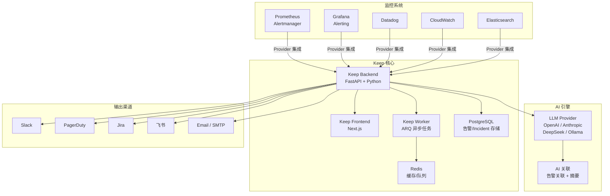
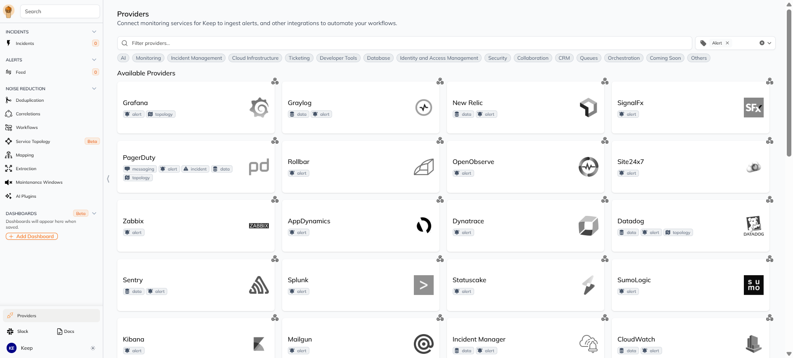

# Keep — 开源 AIOps 与告警管理平台

**更新日期：** 2026年06月08日
**信息来源：** 官方文档、GitHub 仓库、YC 资料、社区实践
**参考地址：**

1. GitHub：[keephq/keep](https://github.com/keephq/keep)（~11.9k stars）
2. 官方文档：[docs.keephq.dev](https://docs.keephq.dev)
3. YC 页面：[Keep on YC](https://www.ycombinator.com/companies/keep)
4. 官网：[keephq.dev](https://www.keephq.dev)
5. Playground：[playground.keephq.dev](https://playground.keephq.dev)
6. Provider 列表：[Providers](https://docs.keephq.dev/providers/overview)

> Star 数会持续变化。正式对外汇报前建议以 GitHub 实时数据复核。

---

## 1. 结论摘要

Keep 是开源 AIOps 和告警管理平台，定位是**所有监控工具的统一告警面板（Single Pane of Glass）**。它不是一个指标采集器或可视化工具，而是一个**告警聚合、降噪、富化、自动响应的编排层**：通过 110+ Provider 对接 Prometheus/Grafana/Datadog/CloudWatch 等监控系统的告警，用去重/关联/过滤/富化等手段将上千条告警压缩为几十条可操作事件，并通过 Workflow 引擎实现自动化响应。

与 Prometheus Alertmanager 的"告警路由+通知"不同，Keep 在告警之上增加了 **AI 关联（AIOps 2.0）**、**Workflow 自动化**、**Incident 管理** 等能力，是 Alertmanager 的上层补充而非替代。

Keep 于 2025 年 5 月被 **Elastic 收购**，Y Combinator W23 孵化，核心代码 AGPLv3 开源。

| 关键信息 | 值 |
| --- | --- |
| 开源协议 | AGPLv3（核心）/ 商业版（Enterprise）|
| 实现语言 | Python（后端 FastAPI）+ TypeScript（前端 Next.js）|
| 背后公司 | Elastic（2025年5月收购）|
| YC 批次 | W23（2023年冬季）|
| Provider 数量 | 110+（监控/通知/工单/CMDB 等）|
| AI 能力 | AI 关联 + AI 摘要（OpenAI / Anthropic / DeepSeek / Ollama）|
| 部署方式 | Docker Compose / Helm Chart |
| 核心机制 | Provider（双向集成）+ Workflow（YAML 自动化）+ AI 关联 |

---

## 2. 产品概况

| 项目 | 内容 |
| --- | --- |
| 产品名称 | Keep（keephq）|
| 产品定位 | 开源 AIOps 与告警管理平台 |
| 开发者 | Keep 团队（Elastic 旗下，YC W23）|
| 开源协议 | AGPLv3（核心功能）|
| 技术栈 | Python FastAPI + Next.js + PostgreSQL + Redis |
| 主要形态 | Backend API + Frontend UI + Worker，Docker Compose 部署 |
| 目标用户 | SRE / DevOps / NOC 团队，需要统一管理多监控系统告警的组织 |
| 典型场景 | 告警聚合降噪、告警自动响应、Incident 管理、多环境监控统一 |
| 竞争定位 | 开源替代 BigPanda / Splunk ITSI / ServiceNow ITOM |

---

## 3. 产品定位与典型场景

| 场景 | Keep 解决的问题 | 价值 |
| --- | --- | --- |
| 告警聚合（Single Pane of Glass） | Prometheus/Grafana/Datadog/CloudWatch 各有各的告警面板，SRE 需要切换多个系统查看告警 | 所有告警汇聚到一个面板，支持跨系统搜索和过滤 |
| 告警降噪 | 上千条告警中大部分是重复/低价值的，告警疲劳导致真正的问题被淹没 | 去重、关联、过滤、节流，将 1000+ 告警压缩到 10 条可操作事件 |
| 告警富化 | 原始告警缺少上下文（哪个服务、哪个版本、谁在值班） | Workflow 从 CMDB/数据库/Jira 自动补充上下文信息 |
| 自动响应 | 502 错误需要先确认是否影响低优先级客户再决定是否升级 | Workflow 自动执行验证步骤，符合条件自动升级或静默 |
| Incident 管理 | 多个相关告警分散在不同系统，难以判断是否属于同一事件 | AI 关联将相关告警自动归为一个 Incident |
| 值班管理 | 告警通知到错误的人或在非工作时间打扰 | 维护窗口管理、值班轮转、通知路由规则 |

---

## 4. 技术架构



| 组件 | 说明 |
| --- | --- |
| **Backend API** | FastAPI Python 服务，核心 API-first 设计，所有 UI 操作均可通过 API 完成 |
| **Frontend UI** | Next.js Web 界面，告警面板、Incident 视图、Workflow 编辑器、Dashboard |
| **Worker** | ARQ 异步任务队列，执行 Workflow 步骤、AI 关联、告警富化 |
| **Provider** | 双向集成模块（Python），从监控系统拉取/推送告警，向通知渠道发送消息 |
| **PostgreSQL** | 告警、Incident、Workflow、API Key 持久化存储 |
| **Redis** | 缓存、ARQ 任务队列、实时推送（WebSocket）|
| **LLM Provider** | AI 关联和摘要的后端，支持 OpenAI / Anthropic / DeepSeek / Ollama |

---

## 5. 部署

### 5.1 Docker Compose 部署

```bash
# 克隆仓库
git clone https://github.com/keephq/keep.git
cd keep

# 启动（默认无认证，开发/测试用）
docker compose up -d

# 带认证部署
docker compose -f docker-compose-with-auth.yml up -d

# 带 OTel 可观测性
docker compose -f docker-compose-with-otel.yaml up -d
```

### 5.2 Helm 部署（K8s）

```bash
helm repo add keep https://keephq.github.io/keep
helm repo update
helm install keep keep/keep -n monitoring --create-namespace
```

### 5.3 核心环境变量

| 变量 | 说明 | 默认值 |
| --- | --- | --- |
| `DATABASE_CONNECTION_STRING` | PostgreSQL 连接串 | — |
| `AUTH_TYPE` | 认证类型 | `NOAUTH`（支持 DB/Keycloak/Auth0/Okta）|
| `KEEP_JWT_SECRET` | JWT 密钥（DB 认证时必填）| — |
| `OPENAI_API_KEY` | OpenAI API Key（AI 功能）| — |
| `OPENAI_MODEL_NAME` | OpenAI 模型 | `gpt-4o-2024-08-06` |
| `SECRET_MANAGER_TYPE` | 密钥管理类型 | `FILE`（支持 Vault/K8S/GCP）|
| `OTEL_EXPORTER_OTLP_ENDPOINT` | OTel Collector 端点 | — |

### 5.4 配置数据源

Keep 通过 Provider 集成监控系统。在 UI 中配置 Provider 后，Keep 自动开始拉取/接收告警：



配置 Prometheus 数据源示例：
1. 进入 Keep UI → Settings → Providers
2. 搜索 `Prometheus`
3. 填写 Prometheus 地址和 API Key
4. 配置 Alertmanager Webhook 指向 Keep（Push 模式）

---

## 6. 核心概念

### 6.1 Provider（数据源/通知源）

Provider 是 Keep 与第三方系统交互的桥梁，分为两类角色：

| 角色 | 说明 | 示例 |
| --- | --- | --- |
| **告警源** | 从监控系统拉取告警，或接收监控系统推送的告警 | Prometheus、Datadog、CloudWatch、Grafana |
| **通知/操作目标** | Workflow 中向外部系统发送通知或执行操作 | Slack、PagerDuty、Jira、飞书、SMTP |

### 6.2 Workflow（自动化工作流）

类似 GitHub Actions 的 YAML 工作流引擎，可被告警触发、定时触发或手动触发：

```yaml
workflow:
  id: auto-enrich-alert
  name: 告警自动富化
  description: 收到告警后自动查询 CMDB 补充服务信息，并发送 Slack 通知
  on:
    alert:
      - source: prometheus
      - severity: critical
  steps:
    - id: query_cmdb
      provider:
        type: http
        config:
          url: "https://cmdb.internal/api/service/{{ alert.service }}"
      # 富化告警
    - id: notify_slack
      provider:
        type: slack
        config:
          channel: "#ops-alerts"
          message: "🚨 {{ alert.name }} - 服务: {{ alert.service }}, 环境: {{ alert.environment }}"
```

### 6.3 Incident（事件）

一组相关告警自动或手动归为一个 Incident，提供事件级视角：

| 能力 | 说明 |
| --- | --- |
| AI 自动关联 | 基于告警相似性、时间窗口、服务拓扑自动分组 |
| Incident 状态机 | fired → acknowledged → resolved |
| 时间线 | 完整的告警和操作时间线 |
| 手动合并 | 人工将相关告警合并到同一 Incident |

### 6.4 Common Express Language（CEL）

Keep 提供高级查询语言用于告警过滤和分析：

```cel
# 查询过去 1 小时内所有 critical 告警
source == "prometheus" && severity == "critical"

# 查询特定服务的告警
labels.service == "payment-service"

# 查询未确认的告警
status == "firing" && !acknowledged
```

---

## 7. Provider 集成列表（与本项目相关的）

### 7.1 监控系统（告警源）

| Provider | 集成方式 | 说明 |
| --- | --- | --- |
| **Prometheus** | Push（Alertmanager Webhook）/ Pull | 本项目核心告警源 |
| **Grafana** | Push / Pull | Grafana Alerting 集成 |
| **Datadog** | Pull（API） | — |
| **CloudWatch** | Pull（API） | — |
| **Elasticsearch** | Pull（API） | — |
| **VictoriaMetrics** | Pull（API） | 兼容 Prometheus 协议 |
| **Netdata** | Pull（API） | — |
| **New Relic** | Pull（API） | — |
| **Dynatrace** | Pull（API） | — |

### 7.2 通知/操作目标

| Provider | 类型 | 说明 |
| --- | --- | --- |
| **Slack** | 通知 | 消息发送 |
| **PagerDuty** | 通知+Incident | 事件升级 |
| **Jira** | 工单 | 创建/更新 Issue |
| **ServiceNow** | ITSM | CMDB + 工单 |
| **飞书** | 通知 | 需通过 Webhook 自定义 |
| **SMTP** | 通知 | 邮件发送 |
| **Webhook** | 通用 | HTTP 调用任意端点 |

### 7.3 AI 后端

| Provider | 能力 |
| --- | --- |
| **OpenAI** | 告警关联 + 摘要 |
| **Anthropic** | 告警关联 + 摘要 |
| **DeepSeek** | 告警关联 + 摘要 |
| **Ollama** | 本地 LLM 推理 |

---

## 8. 与本项目可观测栈的关系

### 8.1 当前告警链路（Keep 之前）

```
Prometheus（触发告警）
    → Alertmanager（路由/分组/静默）
        → PrometheusAlert（渲染飞书卡片）
            → 飞书（通知 OnCall）
```

### 8.2 引入 Keep 后的告警链路

```
Prometheus（触发告警）
    → Alertmanager（路由/分组/静默）
        → Keep（聚合/富化/关联/AI 分析）
            → Incident 管理
            → Workflow 自动响应
            → 飞书 / Slack / Jira（多渠道通知）
```

### 8.3 Keep vs Alertmanager 对比

| 维度 | Alertmanager | Keep |
| --- | --- | --- |
| 定位 | 告警路由与通知 | 告警全生命周期管理 |
| 告警来源 | 仅 Prometheus | 110+ 监控系统 |
| 去重/分组 | ✅ 静态规则 | ✅ AI 动态关联 |
| 告警富化 | ❌ | ✅ Workflow 从外部系统补充 |
| Incident 管理 | ❌ | ✅ AI 关联 + 状态机 |
| 自动响应 | ❌ | ✅ Workflow 引擎 |
| AI 能力 | ❌ | ✅ 关联 + 摘要 |
| 多渠道通知 | ✅ | ✅ |
| 可视化 | ❌ | ✅ Dashboard + 面板 |
| 部署复杂度 | 低 | 中 |

> **建议**：Alertmanager 和 Keep 不冲突，可以共存。Alertmanager 做基础路由和静默，Keep 做上层聚合和 AI 分析。

---

## 9. 部署架构建议

### 方案一：Keep 替代 PrometheusAlert（推荐评估）

```
Prometheus → Alertmanager → Keep → 飞书/Slack/Jira
```

- 优点：Keep 同时承担告警聚合 + 通知 + Incident 管理
- 缺点：引入新的有状态组件（PostgreSQL + Redis）

### 方案二：Keep 与 PrometheusAlert 共存

```
Prometheus → Alertmanager → PrometheusAlert → 飞书（现有链路不变）
                ↓
              Keep（聚合 + AI 分析 + Incident 管理）
```

- 优点：现有链路不受影响，Keep 作为补充层
- 缺点：维护两套通知系统

### 方案三：仅评估 Keep AI 能力

```
Prometheus → Alertmanager → PrometheusAlert → 飞书
                        ↓
                  Keep（仅用于 AI 关联分析和 Incident Dashboard）
```

- 优点：最小化风险，仅使用 AI 功能
- 缺点：未充分发挥 Keep 的 Workflow 能力

---

## 10. 常见问题

### Keep 和 Prometheus Alertmanager 有什么区别？

**Alertmanager** 是一个"告警路由器"：接收 Prometheus 的告警，执行分组/抑制/静默，然后路由到通知渠道（Slack/飞书/PagerDuty）。它不存储告警，不做关联分析，不做自动化响应。

**Keep** 是一个"告警管理平台"：聚合来自多个监控系统的告警，提供去重/关联/富化/过滤能力，通过 Workflow 引擎实现自动化响应，并提供 Incident 管理和 AI 分析。两者可以共存。

### Keep 支持飞书通知吗？

**官方没有飞书 Provider**，但可以通过两种方式实现：
1. **Webhook Provider**：在 Keep Workflow 中调用飞书 Webhook 发送消息
2. **自定义 Provider**：用 Python 写一个飞书 Provider（参考 Slack Provider 代码结构）

### Keep 的 AI 功能需要什么？

Keep 的 AI 功能（关联 + 摘要）需要配置 LLM Provider：
- OpenAI：设置 `OPENAI_API_KEY` 环境变量
- Anthropic：在 UI 中配置 API Key
- DeepSeek：设置 API Key 和 Base URL
- Ollama：本地部署 Ollama，配置 Keep 指向 Ollama 端点

### Keep 的数据存储在哪里？

Keep 使用 PostgreSQL 存储告警、Incident、Workflow 配置、API Key 等数据。Redis 用于缓存和 ARQ 任务队列。生产环境建议使用独立的 PostgreSQL 实例（非 Docker 内置）。

### Keep 和 KAgent 可以结合使用吗？

可以，且互补性很强：
- **KAgent**：AI Agent 编排框架，用于构建和部署自定义 AI Agent（K8s 诊断、运维助手等）
- **Keep**：告警管理平台，用于告警聚合、降噪、自动响应

组合方式：KAgent Agent 可以通过 Keep Provider 读取告警数据，或通过 Keep Workflow API 触发自动化操作。
