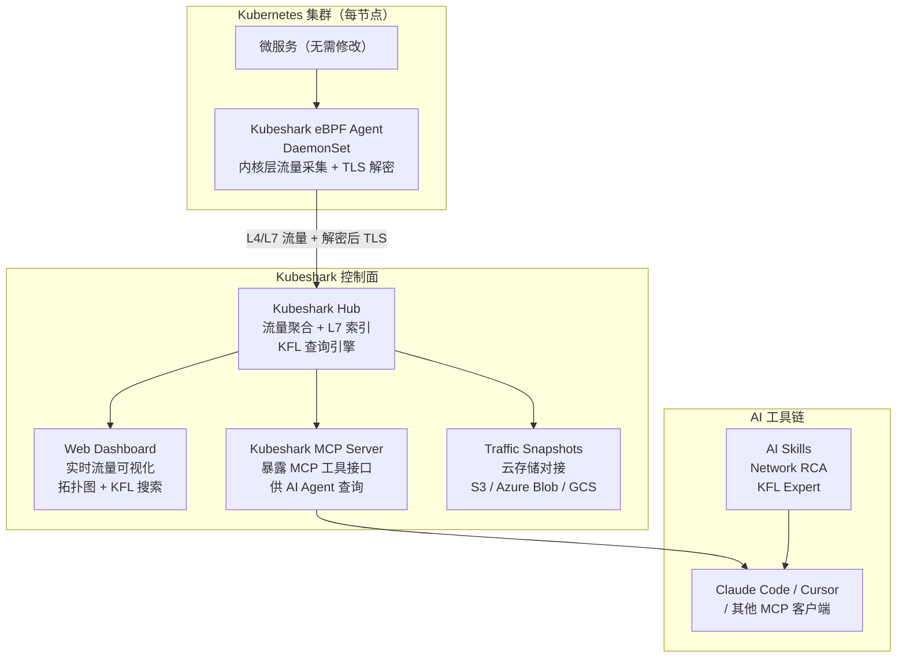

# Kubeshark — K8s eBPF 网络可观测 + MCP AI 流量查询

**更新日期：** 2026年06月04日
**信息来源：** GitHub 仓库、官方文档、官网
**参考地址：**

1. GitHub：[kubeshark/kubeshark](https://github.com/kubeshark/kubeshark)（~11.9k stars）
2. 官网：[kubeshark.com](https://kubeshark.com/)
3. 官方文档：[docs.kubeshark.com](https://docs.kubeshark.com/)
4. MCP 接入指南：[docs.kubeshark.com/en/mcp](https://docs.kubeshark.com/en/mcp)
5. KFL 查询语言参考：[docs.kubeshark.com/en/v2/kfl2](https://docs.kubeshark.com/en/v2/kfl2)

> Star 数会持续变化。正式对外汇报前建议以 GitHub 实时数据复核。

---

## 1. 结论摘要

Kubeshark 是面向 Kubernetes 的 **eBPF 网络可观测工具**：在每个节点部署 eBPF Agent，在内核层捕获全集群的 L4/L7 流量，自动解密 TLS/mTLS，无需任何代码修改或 sidecar。它提供 KFL（Kubeshark Filter Language，CEL 语法）统一查询 K8s 身份 + API 内容 + 网络属性，并通过内置 MCP Server 让 AI Agent（Claude、Cursor 等）直接用自然语言查询流量数据。

与本项目已有的 Prometheus + Loki + Tempo 可观测栈形成**互补**：Kubeshark 专注网络层（覆盖 Prometheus/Loki 无法看到的非 instrumented 服务间流量），而 Loki + Prometheus 侧重应用层日志与指标。

| 关键信息 | 值 |
| --- | --- |
| GitHub stars | ~11.9k（2026年6月）|
| 开源协议 | Apache 2.0 |
| 实现语言 | Go（91.9%）|
| 插桩方式 | eBPF，无代码修改，无 sidecar |
| 核心特性 | L7 流量索引 + TLS 解密 + KFL 查询 + MCP AI 接入 |
| 部署方式 | Helm / Homebrew / Binary |
| 最新版本 | v53.3.0（2 周前，共 466 次发布）|
| 与本项目关系 | 补充网络层可观测盲区，MCP 模式可与 HolmesGPT/KAgent 协作 |

---

## 2. 产品概况

| 项目 | 内容 |
| --- | --- |
| 产品名称 | Kubeshark |
| 产品定位 | K8s 网络可观测平台（"Kubernetes 的 Wireshark"）|
| 开发者 | Kubeshark 团队（Alon Girmonsky 等，47 贡献者）|
| 开源协议 | Apache 2.0 |
| 项目状态 | ✅ 活跃维护（2 周前 v53.3.0，466 次发布）|
| 工作原理 | eBPF 在内核层采集全集群 L4/L7 流量，自动 TLS 解密，实时索引 |
| 协议支持 | HTTP、gRPC、GraphQL、Redis、Kafka、DNS 等 |
| AI 集成 | 内置 MCP Server，支持自然语言查询流量数据 |
| 存储 | PCAP 导出 + 云存储（S3 / Azure Blob / GCS）长期留存 |

---

## 3. 产品定位与典型场景

| 场景 | Kubeshark 解决的问题 | 价值 |
| --- | --- | --- |
| 微服务间调用排查 | 服务 A 调用服务 B 失败，但两侧日志都不完整 | eBPF 捕获所有请求/响应 payload，包括未插桩服务 |
| TLS 流量调试 | 服务间 mTLS 加密，Wireshark 抓包后无法解密 | eBPF 在握手后自动提取密钥并解密，无需证书/Key 配置 |
| 服务依赖发现 | 新接手系统，不知道服务间依赖关系 | Workload Dependency Map 自动绘制拓扑图，展示流量方向和协议 |
| AI 辅助事件根因 | 告警触发，想问"checkout 服务 2 点 15 分为什么失败" | 通过 MCP Server + Claude，自然语言查询 KFL 过滤流量 |
| 合规流量审计 | 需要长期保留特定服务间的 API 调用记录 | 配置 S3/GCS 云存储 Snapshots，保留并可下载 PCAP 文件 |
| 私有化环境 | 完全离线，不能有外部依赖 | 100% on-premises，支持 air-gapped 部署 |

---

## 4. 技术架构



| 组件 | 说明 |
| --- | --- |
| eBPF Agent（DaemonSet）| 部署在每个节点，内核层捕获进出节点的所有 TCP/UDP 流量，自动 TLS 握手 key 提取和解密 |
| Kubeshark Hub | 汇聚全集群流量数据，按 L7 协议解析（HTTP request/response matching），KFL 查询引擎 |
| Web Dashboard | 实时流量展示，KFL 过滤，服务拓扑依赖图，支持 port-forward 本地访问或 Ingress 接入 |
| MCP Server | Go 二进制，暴露 MCP 协议工具接口；AI Agent 可以查询流量、分析错误、追踪请求链路 |
| AI Skills | 开源的领域专属提示词包（Network RCA、KFL Expert），安装到 Claude Code 后自动感知上下文触发 |
| Traffic Snapshots | 按时间/节点/工作负载/IP 过滤的 PCAP 快照，可上传 S3/Azure Blob/GCS 长期保存 |

---

## 5. 安装与部署

### 5.1 Helm 部署（推荐生产使用）

```bash
# 添加 Helm 仓库并安装
helm repo add kubeshark https://helm.kubeshark.com
helm install kubeshark kubeshark/kubeshark

# 本地访问（开发/测试）
kubectl port-forward svc/kubeshark-front 8899:80
# 打开 http://localhost:8899
```

> 生产环境建议配置 Ingress Controller，参考 [docs.kubeshark.com/en/ingress](https://docs.kubeshark.com/en/ingress)

### 5.2 Homebrew + CLI（macOS/Linux）

```bash
brew install kubeshark
kubeshark tap
# 自动在当前 kubeconfig 集群中部署并打开 Web 界面
```

### 5.3 接入 AI Agent（MCP 模式）

```bash
# 1. 安装 CLI
brew install kubeshark

# 2. 注册 MCP Server 到 Claude
claude mcp add kubeshark -- kubeshark mcp

# 3. （可选）安装 AI Skills 插件
/plugin marketplace add kubeshark/kubeshark
/plugin install kubeshark
```

### 5.4 私有化离线部署

Kubeshark 支持完全离线（air-gapped）部署，无外部网络依赖。在私有化交付中，可预先拉取镜像推入内部 Harbor，Helm values 配置 `image.registry` 指向内网 Harbor 地址。

---

## 6. 核心能力详解

### 6.1 KFL 查询语言（Kubeshark Filter Language）

KFL 基于 CEL（Common Expression Language），可以组合三类语义维度：

```
# K8s 语义：按工作负载名称过滤
src.name == "frontend"

# API 语义：按 HTTP 状态码过滤
response.status == 500

# 网络语义：按 IP 范围过滤
dst.ip == "10.0.1.0/24"

# 组合查询：frontend 调用 checkout 时出现的 5xx 错误
src.name == "frontend" and dst.name == "checkout" and response.status >= 500
```

### 6.2 AI 自然语言查询示例

通过 MCP Server，AI 可以回答：

| 自然语言问题 | Kubeshark 内部操作 |
| --- | --- |
| "checkout 服务最近 15 分钟有哪些错误请求？" | 构造 KFL 过滤 + 返回 response.status ≥ 400 的请求列表 |
| "哪些服务的错误率超过 1%？" | 聚合各服务请求量和错误量，计算错误率 |
| "追踪请求 abc123 经过了哪些服务？" | 按 trace/request ID 关联跨服务调用链 |
| "展示所有节点间的 TCP 重传率" | 网络层指标聚合 |

### 6.3 TLS 解密

eBPF 在 TLS 握手完成后、加密前在内存中提取 session key，无需配置证书文件或 key 文件。被解密的流量也会包含在 PCAP Snapshots 中，便于离线分析。

---

## 7. 与本项目集成方式

| 集成方向 | 方案 |
| --- | --- |
| 网络层可观测补盲 | Kubeshark eBPF Agent 部署到 dev/pre 集群，覆盖未接 SDK 的服务间流量 |
| AI 事件根因协作 | HolmesGPT 触发调查时，Kubeshark MCP Server 提供网络层证据（错误请求 payload、调用链）|
| 私有化交付 | 离线镜像预置到 Harbor，Helm values 配置内网 registry；无需互联网访问 |
| 安全审计 | 配置 S3/MinIO Snapshots，长期保留 API 调用记录，满足合规要求 |

### 与同类工具对比

| 维度 | Kubeshark | Metoro（eBPF）| 自建 Loki + Tempo |
| --- | --- | --- | --- |
| 开源 | ✅ Apache 2.0 | ❌ 闭源 SaaS | ✅ |
| 网络层可见性 | ✅ L4/L7 全量 | ✅ 全量 | ❌（仅应用层 span/log）|
| TLS 解密 | ✅ 无需密钥 | ✅ | ❌ |
| AI 查询（MCP）| ✅ 内置 MCP Server | ✅ MCP Server | ⚠️ 需额外集成 |
| PCAP 导出 | ✅ | ❌ | ❌ |
| 私有化离线部署 | ✅ air-gapped | ⚠️（自托管可选）| ✅ |

---

## 8. 常见问题

### Kubeshark 对 K8s 节点内核版本有要求吗？

有。eBPF 依赖 Linux 内核 5.8+ 和 BTF 支持。私有化交付时需提前确认客户环境内核版本（`uname -r`）。如内核版本较低，Kubeshark 的部分 eBPF 功能（尤其是 TLS 解密）可能不可用，但基础 L7 流量捕获通常支持更低版本（4.x）。

---

### Kubeshark 会对生产流量有性能影响吗？

eBPF 在内核态执行，相比 sidecar 代理（如 Envoy）开销极低。官方测试显示在正常流量下 CPU 影响 < 1-2%。高流量场景建议通过 KFL 过滤只采集感兴趣的流量，减少 Hub 处理压力。

---

### Kubeshark 和 Wireshark 有什么区别？

Wireshark 是本地抓包分析工具，需要手动指定网卡，不具备 K8s 上下文语义。Kubeshark 相当于"集群级 Wireshark"：自动覆盖全集群所有节点，流量自动关联 K8s Pod/Deployment/Namespace 信息，支持 KFL 用 K8s 语义过滤，并且捕获的 PCAP 可以导入 Wireshark 进一步分析。

---

## 9. 参考文档

1. [Kubeshark GitHub 仓库](https://github.com/kubeshark/kubeshark)
2. [Kubeshark 官方文档](https://docs.kubeshark.com/)
3. [MCP 接入指南](https://docs.kubeshark.com/en/mcp)
4. [AI Skills 文档](https://docs.kubeshark.com/en/mcp/skills)
5. [KFL 查询语言参考](https://docs.kubeshark.com/en/v2/kfl2)
6. [Traffic Snapshots 指南](https://docs.kubeshark.com/en/v2/traffic_snapshots)
7. [云存储配置（S3/GCS/Azure）](https://docs.kubeshark.com/en/snapshots_cloud_storage)