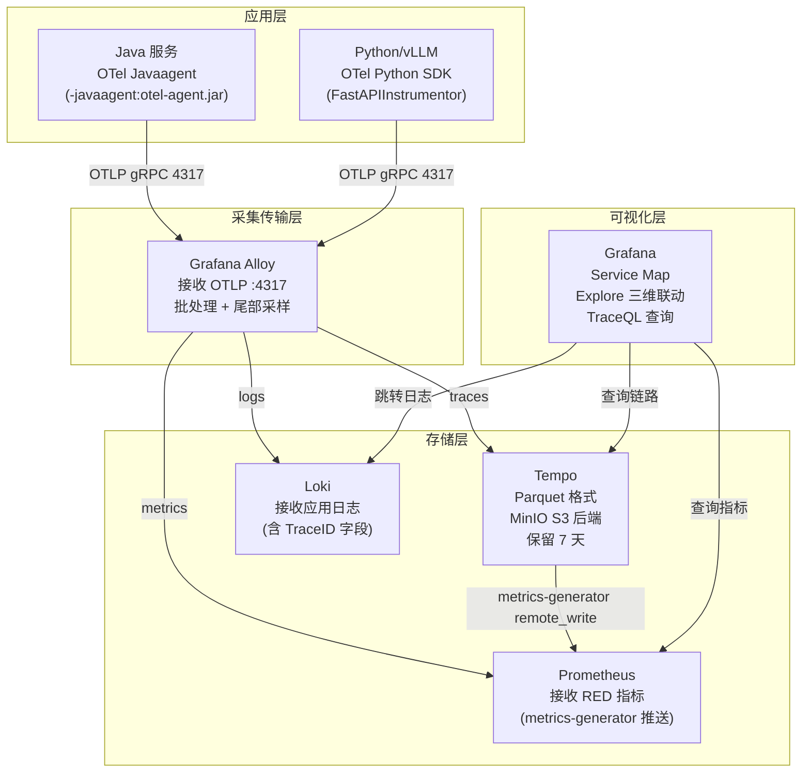

# 链路追踪 — 体系总览

> 一次请求穿越多个服务的完整路径——跨服务问题排查不需靠猜。

---

## 1. 核心价值

链路追踪解决的核心问题："这次请求慢/报错，是哪个服务的哪段代码导致的？"

| 痛点 | 没有链路追踪 | 有链路追踪 |
| --- | --- | --- |
| 接口响应慢 | 逐个服务看日志，30 分钟找根因 | 打开 Tempo，看瀑布图，2 分钟定位 |
| 服务 A 调用服务 B 失败 | 两边日志比对时间戳，费时费力 | 同一 TraceID 关联两边日志 |
| AI 推理延迟高 | 不知道是业务逻辑还是 GPU 排队 | Span 清晰区分各阶段耗时 |
| 上游调了什么接口 | 代码里找调用关系 | Service Graph 自动绘制拓扑 |

---

## 2. 当前能力状态

| 能力 | 状态 | 说明 |
| --- | --- | --- |
| 分布式追踪存储（Tempo）| 🟡 待部署 | MinIO 已就绪，待配置 Helm |
| 采集层（Grafana Alloy）| 🟡 待配置 | OTLP 接收规则需添加 |
| Java 服务埋点 | 🔴 未覆盖 | 待注入 OTel Java Agent |
| Python/vLLM 服务埋点 | 🔴 未覆盖 | 待接入 OTel Python SDK |
| 追踪 ↔ 日志关联（Loki）| 🔴 未覆盖 | 待配置 Grafana tracesToLogs |
| 追踪 ↔ 指标关联（Exemplar）| 🔴 未覆盖 | 待在 Prometheus 开启 exemplar |
| 采样策略配置 | 🔴 未配置 | — |
| Service Graph 拓扑图 | 🔴 未覆盖 | 待启用 Tempo metrics-generator |

---

## 3. 工具全景

### 3.1 本项目已选用的工具

| 工具 | 层级 | 职责 | 文档 |
| --- | --- | --- | --- |
| **OpenTelemetry** | 采集层 | SDK/Agent 生成 Span；OTel Collector/Alloy 路由数据 | [OpenTelemetry.md](./OpenTelemetry.md) |
| **Grafana Alloy** | 传输层 | 接收 OTLP 数据，分发到 Tempo/Prometheus/Loki | 见 OpenTelemetry.md §7 |
| **Tempo** | 存储层 | 链路数据存储，S3 后端，TraceQL 查询，metrics-generator | [Tempo.md](./Tempo.md) |
| **Grafana** | 可视化层 | Explore 链路查询，Service Map，三维联动 | 见 04-可视化与告警 |

### 3.2 对比参考工具（未采用）

| 工具 | 定位 | 关键差异 | 文档 |
| --- | --- | --- | --- |
| **Jaeger** | 分布式追踪（CNCF 毕业）| 需要 ES/Cassandra；UI 功能丰富（Critical Path/Trace Diff）| [Jaeger.md](./Jaeger.md) |
| **SkyWalking** | All-in-One APM（Apache）| Java 生态强；Python/AI 弱；需 OAP + ES；独立 UI | [SkyWalking.md](./SkyWalking.md) |
| **Zipkin** | 轻量链路追踪 | 功能简单，生态较小，已被 Jaeger/OTel 取代 | — |

---

## 4. 工具对比

| 对比项 | Tempo | Jaeger | SkyWalking | Zipkin |
| --- | --- | --- | --- | --- |
| CNCF/ASF 状态 | CNCF 毕业 | CNCF 毕业 | Apache TLP | — |
| 存储后端 | 对象存储 (S3) | ES / Cassandra | ES / H2 | ES / MySQL |
| 存储成本 | ★★★★★（最低）| ★★★ | ★★★ | ★★★ |
| Grafana 集成 | ★★★★★（原生）| ★★★（插件）| ★★（有限）| ★★ |
| Loki 日志联动 | ★★★★★（原生）| ★★ | ✗ | ✗ |
| RED 指标自动生成 | ✅ metrics-generator | ✗ | ✅ 内置 | ✗ |
| 服务拓扑图 | ✅ Service Graph | ✅ | ✅ 最强 | ✅ |
| 查询语言 | TraceQL（强）| Jaeger UI | SkyWalking QL | — |
| Java 支持 | ★★★★（OTel）| ★★★★（OTel）| ★★★★★（自有 Agent）| ★★★ |
| Python/AI 支持 | ★★★★（OTel）| ★★★★（OTel）| ★★（弱）| ★★ |
| 运维复杂度 | ★★（极低）| ★★★★（ES）| ★★★★（OAP+ES）| ★★★ |
| 采样策略 | Alloy 尾部采样 | 原生自适应采样 | 内置 | 基础采样 |
| **本项目选用** | **✅** | — | — | — |

---

## 5. 架构设计

### 5.1 完整链路追踪管道



### 5.2 三维联动排查路径

```
Prometheus 告警触发（P99 > 2s）
    ↓ 点击 Exemplar
Tempo 链路（找到该时间点的具体 TraceID）
    ↓ 查看瀑布图，定位慢 Span（如 DB 查询 1.8s）
    ↓ 点击 Logs
Loki 日志（同一 TraceID 的所有服务日志，定位具体错误行）
```

---

## 6. 引入路线图

### 第一阶段：基础链路（2 周）

1. **部署 Tempo**：`helm upgrade --install tempo grafana/tempo --values tempo-values.yaml`
   - 存储：MinIO bucket `tempo-traces`，保留 7 天
   - 开启 metrics-generator，推 RED 指标到 Prometheus
2. **配置 Grafana Alloy OTLP 接收器**：在 Alloy 配置中添加 `otelcol.receiver.otlp` 规则，转发 traces 到 Tempo
3. **Java 服务接入**：在 Deployment 添加 `-javaagent` 参数（ai-backend 服务优先）
4. **Grafana 配置 Tempo 数据源**：配置 `tracesToLogsV2` 关联 Loki

### 第二阶段：全服务覆盖（1 个月）

5. **Python/vLLM 接入**：引入 OTel Python SDK，FastAPI 自动插桩
6. **OTel Operator 部署**：用 `Instrumentation` CRD 自动注入 Java Agent（减少手动配置）
7. **尾部采样配置**：错误/慢请求 100% 保留，正常请求 10% 采样
8. **Prometheus Exemplar 开启**：在 kube-prometheus-stack 中启用 exemplar 存储

### 第三阶段：深度集成（可选）

9. **Trace Profiling**：对 P99 慢链路开启方法级 Profiling（Grafana Pyroscope 接收）
10. **告警规则**：基于 metrics-generator 生成的 RED 指标创建 SLO 告警

---

## 7. 生产采样策略建议

| 场景 | 采样率 | 原因 |
| --- | --- | --- |
| 健康检查（/healthz, /ready）| 0% | 大量且无价值 |
| AI 推理接口（/api/infer）| 20% | 高价值，适当保留 |
| 任何包含 error 的链路 | 100% | 错误必须全量保留 |
| 延迟 > 1s 的请求 | 100% | 慢请求必须全量保留 |
| 其他正常请求 | 5-10% | 控制存储成本 |

---

> 详细工具文档：[Tempo.md](./Tempo.md) / [OpenTelemetry.md](./OpenTelemetry.md) / [Jaeger.md](./Jaeger.md) / [SkyWalking.md](./SkyWalking.md)

