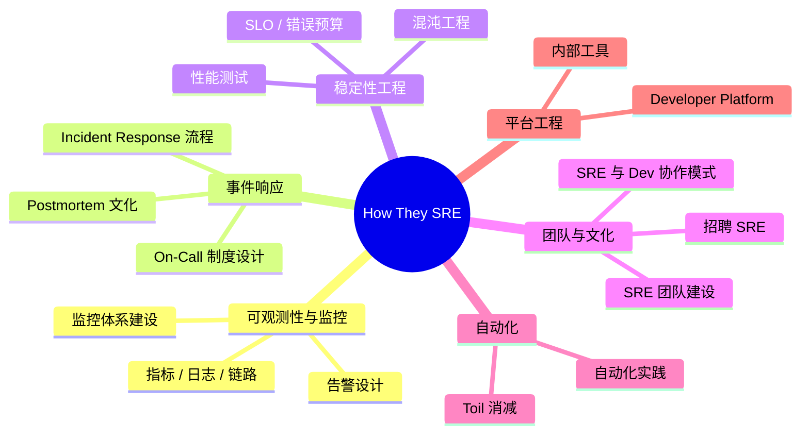

# How They SRE — 顶级公司 SRE 实践知识库（策展型资源集合）

**更新日期：** 2026年06月04日
**信息来源：** GitHub 仓库、内容调研
**参考地址：**

1. GitHub：[upgundecha/howtheysre](https://github.com/upgundecha/howtheysre)（~9.7k stars）
2. 作者主页：[@upgundecha（Unmesh Gundecha）](https://github.com/upgundecha)
3. 同系列：[howtheytest](https://github.com/abhivaikar/howtheytest) / [howtheydevops](https://github.com/bregman-arie/howtheydevops) / [howtheyaws](https://github.com/upgundecha/howtheyaws)

> ⚠️ 这不是一个可部署的工具，而是一个**策展型知识资源集合（Curated Knowledge Repository）**。调研目的是评估其对本团队 SRE 能力建设的学习参考价值。

> Star 数会持续变化。正式对外汇报前建议以 GitHub 实时数据复核。

---

## 1. 结论摘要

How They SRE 是由 Unmesh Gundecha 维护的开源知识策展仓库，汇集了 80+ 家顶级科技公司（Google、Netflix、Spotify、GitHub、Slack、LinkedIn、Stripe、Uber 等）公开分享的 SRE 实践文章、演讲视频、博客。内容覆盖可观测性、告警、事件响应、On-Call 制度、混沌工程、自动化等核心 SRE 主题。

其核心价值是**把分散在各个公司工程博客和 SRECon 演讲中的一手经验，整理成可快速检索的知识地图**，是 SRE 团队建设、文化输入和学习参考的高效起点。CC0 协议，完全公共领域，可自由使用。

| 关键信息 | 值 |
| --- | --- |
| 仓库性质 | 策展型知识集合（非可部署工具）|
| GitHub stars | ~9.7k（2026年6月）|
| 开源协议 | CC0（公共领域，无任何限制）|
| 收录组织数 | 80+（Google、Netflix、Spotify、GitHub、Meta 等）|
| 内容形式 | 工程博客文章、SRECon 演讲视频、书籍、Awesome 列表 |
| 维护者 | Unmesh Gundecha（40 贡献者）|
| 最近更新 | 9 个月前（持续更新但非高频）|
| 对本项目价值 | 提供同类公司 SRE 建设的一手参考，辅助制定本团队 SRE 规范 |

---

## 2. 内容概况

| 维度 | 说明 |
| --- | --- |
| 收录形式 | 按公司分节，每家公司下列出其发布的 SRE 相关文章/演讲链接 |
| 覆盖主题 | 可观测性、告警、事件响应、On-Call 制度、混沌工程、自动化、平台工程、性能、SRE 团队文化、招聘 |
| SRECon 视频 | 汇集 30+ 家公司在 SRECon（USENIX）上的演讲视频链接 |
| 书单 | 20+ 本 SRE 经典书籍（Google SRE Book、The SRE Workbook、Chaos Engineering 等）|
| Awesome 列表 | 聚合 Awesome SRE、Awesome Chaos Engineering 等周边资源列表 |
| 其他资源 | SRECon/SLOConf 活动、SRE Weekly 等 Newsletter |

---

## 3. 收录组织一览

How They SRE 收录了以下类型的组织（部分举例）：

| 类别 | 代表组织 |
| --- | --- |
| 科技巨头 | Google、Meta、Microsoft、Amazon、Alibaba Cloud |
| 互联网平台 | Netflix、Spotify、GitHub、GitLab、LinkedIn、Slack、Twitter（X）|
| 金融科技 | Stripe、Goldman Sachs、Capital One、PayPal、Coinbase |
| 电商 / 零售 | eBay、Booking.com、Target、Shopify |
| 亚洲科技 | Grab、Gojek、Meituan（美团）、Tokopedia、Zerodha |
| 中小创业公司 | Monzo、Gusto、Honeycomb、Datadog |

---

## 4. 主题内容分布



---

## 5. 对本项目的学习参考价值

以下列出与本项目各领域直接相关的学习方向，以及从 How They SRE 中能获取到的参考内容：

| 本项目领域 | 可从 How They SRE 学习的内容 |
| --- | --- |
| **10-SRE 稳定性工程** | Netflix / Google 的 SLO 与错误预算实践；Monzo 的 On-Call 制度设计 |
| **07-可观测性建设** | Honeycomb / Datadog / Grafana Labs 的可观测性工程分享 |
| **04-告警体系** | GitHub / Stripe 的告警降噪与 PagerDuty 使用经验 |
| **06-混沌工程** | Netflix Chaos Monkey、Gremlin 的实战案例 |
| **03-CICD 建设** | LinkedIn / Shopify 的 CI/CD 发布流程经验 |
| **私有化交付稳定性** | Grab / Gojek 的多区域 K8s 运维经验（亚洲市场，与私有化场景接近）|
| **SRE 团队文化建设** | Twitter 的 SRE 招聘经验；Atlassian 的 SRE 文化建设 |

---

## 6. 使用方法与学习路径

How They SRE 是静态知识集合，没有部署步骤。以下是推荐的使用方法：

### 6.1 快速参考

直接在 GitHub 仓库 README 中按公司名或关键词（Ctrl+F）搜索。每家公司的条目格式为：

```
### Spotify
* [Backstage: What began at Spotify is now becoming the standard developer portal platform](https://engineering.atspotify.com/...)
* [How we improved developer experience by moving to trunk-based development](https://engineering.atspotify.com/...)
```

### 6.2 主题深度学习

按 README 中的主题分类导航，聚焦某一领域（如 On-Call、混沌工程）集中学习多家公司的实践异同。

### 6.3 SRECon 视频跟进

仓库中的 SRECon Mix Playlist 收录了 30+ 场演讲（USENIX），适合在制定团队 SRE 规范前系统了解业界标准做法。

### 6.4 书单选读

仓库中的书单按类别分组，建议优先阅读：

| 优先级 | 书名 | 说明 |
| --- | --- | --- |
| ⭐⭐⭐ | [Site Reliability Engineering](https://sre.google/sre-book/table-of-contents/)（免费在线）| Google SRE 圣经，SRE 体系基础 |
| ⭐⭐⭐ | [The Site Reliability Workbook](https://sre.google/workbook/table-of-contents/)（免费在线）| Google SRE 实战工作手册，配套上书 |
| ⭐⭐ | [Implementing Service Level Objectives](https://amzn.to/40Ow2nc) | SLO 落地实施 |
| ⭐⭐ | [Observability Engineering](https://amzn.to/4hSrVNP) | 可观测性工程 |
| ⭐⭐ | [Chaos Engineering](https://amzn.to/40OSVa8) | 混沌工程系统实践 |

---

## 7. 与同类资源对比

| 维度 | How They SRE | Google SRE Book | Awesome SRE（dastergon）|
| --- | --- | --- | --- |
| 内容形式 | 真实公司一手实践 + 演讲视频 | Google 理论框架 + 内部最佳实践 | 工具 / 书籍 / 文章综合列表 |
| 覆盖广度 | 80+ 家公司，多元化实践 | 单一视角（Google）| 广泛但偏工具列表 |
| 实用性 | ✅ 含具体实施经验和故障复盘 | ✅ 经典理论框架 | ⚠️ 以链接为主，缺上下文 |
| 更新频率 | ⚠️ 社区贡献，不稳定 | ⚠️ 书籍版本，较少更新 | ✅ 较活跃 |
| 许可 | CC0（完全公共领域）| CC BY-NC-SA | CC BY-SA |
| 适用场景 | 了解业界实践多样性，找真实案例 | 建立 SRE 理论基础 | 工具选型参考 |

---

## 8. 常见问题

### 这个仓库还在维护吗？

保持更新但更新频率不高（最近一次实质内容更新是 11 个月前）。社区贡献为主，欢迎 PR。对于快速更新的前沿内容（AI for SRE 等），建议同时关注各公司工程博客原文。

---

### How They SRE 和 Awesome SRE 有什么区别？

[Awesome SRE](https://github.com/dastergon/awesome-sre) 更偏工具和资源清单（按类型分：工具链接、书、课程）；How They SRE 更偏**真实公司的工程博客文章和演讲**，强调"这家公司是怎么做的"，有更多具体故事和决策上下文，更适合学习他人的实践经验。

---

## 9. 参考文档

1. [How They SRE GitHub 仓库](https://github.com/upgundecha/howtheysre)
2. [Google SRE Book（免费在线版）](https://sre.google/sre-book/table-of-contents/)
3. [Google SRE Workbook（免费在线版）](https://sre.google/workbook/table-of-contents/)
4. [SRECon 历届演讲（USENIX）](https://www.usenix.org/srecon#past)
5. [Awesome SRE（dastergon）](https://github.com/dastergon/awesome-sre)
6. [SRE Weekly Newsletter](https://sreweekly.com/)
7. [作者同系列：How They DevOps](https://github.com/bregman-arie/howtheydevops)