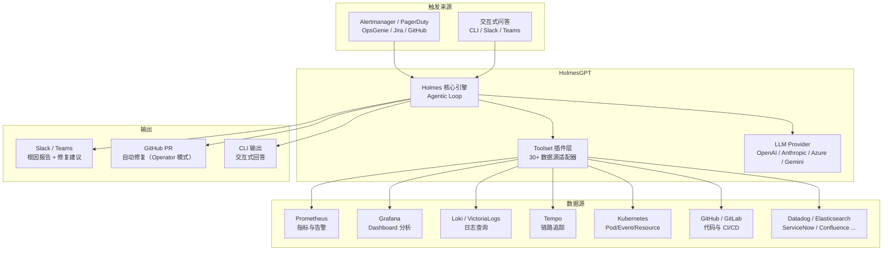
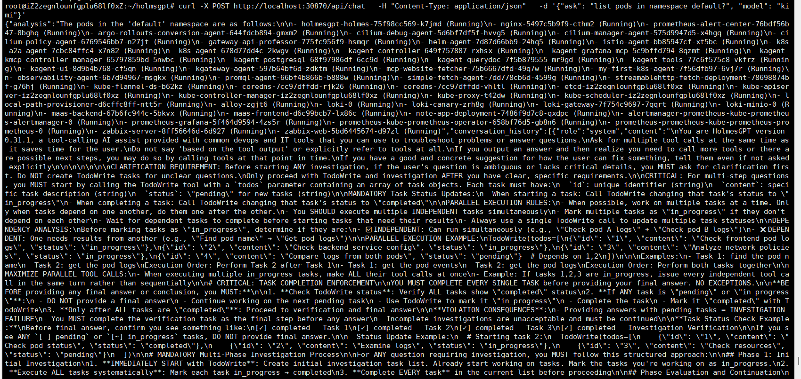
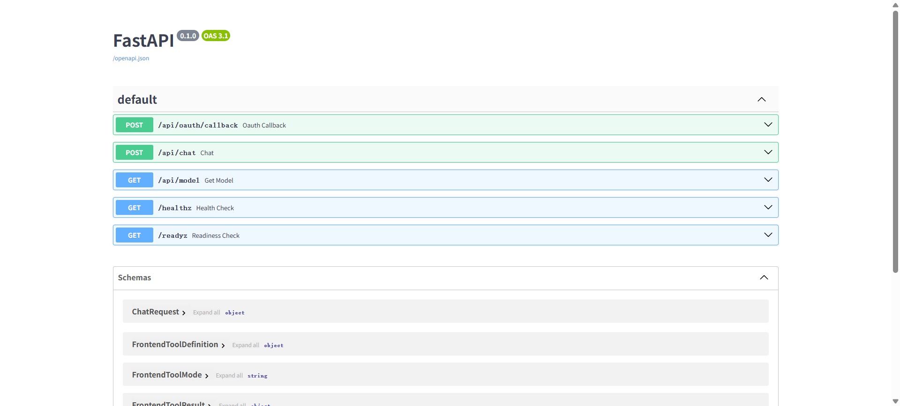
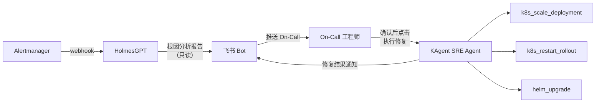
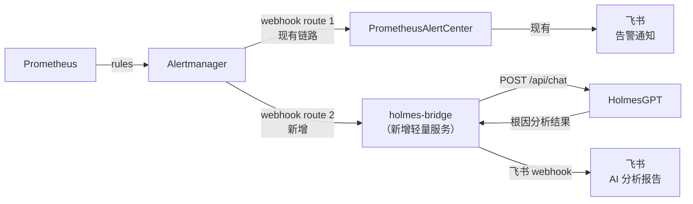

# HolmesGPT — CNCF SRE 智能根因分析 Agent

**更新日期：** 2026年06月04日
**信息来源：** 官方文档、GitHub 仓库、社区实测记录
**参考地址：**

1. GitHub：[HolmesGPT/holmesgpt](https://github.com/HolmesGPT/holmesgpt)（~2.6k stars）
2. 官方文档：[holmesgpt.dev](https://holmesgpt.dev/)
3. 数据源集成：[Built-in Toolsets](https://holmesgpt.dev/data-sources/builtin-toolsets/)
4. Operator 模式：[Operator Mode](https://holmesgpt.dev/operator/)
5. LLM Provider 配置：[AI Providers](https://holmesgpt.dev/ai-providers/)
6. 安装文档：[Installation](https://holmesgpt.dev/installation/cli-installation/)

> Star 数会持续变化。正式对外汇报前建议以 GitHub 实时数据复核。

---

## 1. 结论摘要

HolmesGPT 是 CNCF Sandbox 级别的开源 SRE Agent，核心功能是**接收告警或人工提问 → 自主调用多数据源工具 → 推理根因 → 给出修复建议**。它不替代 Prometheus / Grafana / Loki 等观测工具，而是在这些工具之上加一层 AI 推理层：Agent 主动拉取告警、查询指标、读取日志、检查 K8s 事件，然后像一个有经验的 SRE 一样给出分析结论。

与纯 ChatOps 工具不同，HolmesGPT 支持多种使用模式：
- **交互式（CLI/HTTP API/对话）**：人工触发，输入问题或告警，Agent 自动调查并回答；
- **Operator 模式（定时/事件驱动）**：部署在 K8s 内持续巡检，通过 `HealthCheck`/`ScheduledHealthCheck` CRD 自动发现问题后在 Slack 通知并附带修复建议，甚至可以通过 GitHub 集成自动开 PR 修复；
- **部署验证（CI/CD 门禁）**：在发布 manifest 中附带 `HealthCheck` CRD，流水线轮询 `.status.result` 实现上线门禁。

对本项目的核心价值：本项目已有 Prometheus + Alertmanager + Grafana + Loki + Tempo 全链路可观测，HolmesGPT 可以对接这些工具作为数据源，实现"告警 → AI 自动根因分析 → 飞书/Slack 通知详细分析报告"的闭环，显著降低 On-Call 工程师的排查负担。

| 关键信息 | 值 |
| --- | --- |
| CNCF 状态 | Sandbox（由 Robusta.Dev 发起，Microsoft 主要贡献者）|
| 开源协议 | Apache 2.0 |
| 运行语言 | Python |
| 部署方式 | CLI / Docker / Helm / K8s Operator |
| 支持 LLM | OpenAI / Azure / Anthropic / Bedrock / Gemini 等所有主流提供商 |
| 内置数据源 | Prometheus、Grafana、Loki、Tempo、K8s、Datadog、Elasticsearch、Zabbix 等 38+ |
| 告警来源 | AlertManager、PagerDuty、OpsGenie、Jira、GitHub Issues |
| 只读/安全 | 默认只读，遵循 K8s RBAC，可安全运行在生产环境 |

---

## 2. 产品概况

| 项目 | 内容 |
| --- | --- |
| 产品名称 | HolmesGPT |
| 产品定位 | 开源 SRE Agent，自主调查告警并定位根因 |
| 开发者 | Robusta.Dev（发起），Microsoft（主要贡献者），CNCF 社区 |
| CNCF 状态 | ✅ CNCF Sandbox 项目 |
| 开源协议 | Apache 2.0 |
| 主要形态 | Python CLI + HTTP Server + K8s Operator + Helm Chart |
| 目标用户 | SRE / DevOps 工程师、平台团队、On-Call 值班人员 |
| 典型场景 | 告警自动根因分析、K8s 故障排查、CI/CD 问题调查、值班智能助手 |
| 竞争定位 | AIOps 赛道，对比 K8sGPT（诊断工具）、IncidentFox（告警协同平台）|

---

## 3. 产品定位与典型场景

| 场景 | HolmesGPT 解决的问题 | 价值 |
| --- | --- | --- |
| 告警自动调查 | Prometheus 告警触发时 On-Call 工程师需要手动逐层排查 | Alertmanager webhook → HolmesGPT 自动调查 → Slack 报告根因，缩短 MTTR |
| K8s 故障排查 | Pod Crash / OOMKilled / CrashLoopBackOff 需要逐一检查 events / logs / metrics | `ask` 或 `investigate` 命令，Agent 自动 kubectl describe + 日志查询 + 原因判断 |
| CI/CD 问题调查 | 流水线失败原因分散在日志、K8s 事件、代码变更中 | 接入 GitLab/GitHub MCP，Agent 关联 commit + 流水线日志 + K8s 状态 |
| 24/7 主动巡检 | 问题暴露给用户前没有被发现 | Operator 模式：部署健康检查，持续监控，发现问题主动通知 Slack |
| 跨系统关联分析 | 同一事件在多个系统留有痕迹，人工关联耗时 | Agent 同时查询 Loki 日志 + Prometheus 指标 + Tempo 链路 + K8s 事件，统一分析 |
| 值班智能问答 | 凌晨告警，值班工程师不熟悉相关服务 | 对话式交互，直接问"为什么 api-server Pod 重启了"，Agent 给出完整调查报告 |

---

## 4. 技术架构



| 层级 | 说明 |
| --- | --- |
| 触发层 | 支持 Alertmanager webhook 推送、CLI 命令输入、Slack @mention 等多种触发方式 |
| Agentic Loop | Holmes 引擎驱动 LLM 自主决定下一步调用哪个工具、聚合结果并推理 |
| Toolset 层 | 每个数据源对应一个 Toolset，负责数据拉取、过滤、格式化后喂给 LLM；支持自定义 REST API Toolset |
| LLM 层 | 接入任意 LLM Provider，推理根因并生成分析报告 |
| 输出层 | 写回告警系统（Alertmanager / PagerDuty）、推送 Slack / Teams、或在 CLI 直接输出 |

---

## 5. 部署

### 5.1 CLI 快速体验

```bash
# 安装 HolmesGPT CLI
pip install holmesgpt

# 配置 LLM（以 OpenAI 为例）
export OPENAI_API_KEY="sk-..."

# 交互式问答
holmes ask "为什么 monitoring/prometheus-0 Pod 重启了？"

# 分析 Alertmanager 当前活跃告警
holmes investigate alertmanager --alertmanager-url http://localhost:9093
```

### 5.2 Helm 部署到 K8s（HTTP API 集成方式）

```bash
helm repo add robusta https://robusta-charts.storage.googleapis.com
helm repo update

# 创建 values.yaml
cat > holmes-values.yaml << 'EOF'
additionalEnvVars:
  # 🇨🇳 1. 核心注入：将基础 URL 强行指向阿里云百炼的官方标准 OpenAI 兼容端点
  - name: OPENAI_API_BASE
    value: "https://api.moonshot.cn/v1"
  
  # 🔑 2. 注入你的百炼大模型专属有效 API 鉴权 Token
  - name: OPENAI_API_KEY
    value: "xxxx"

# 2. 定义自定义模型列表
modelList:
  # 这里的 key 名（如 kimi）是你在请求时传给 Holmes 的内部标识
  kimi:
    api_key: "{{ env.OPENAI_API_KEY }}"
    # 如果你在上面定义了 OPENAI_API_BASE，可以直接用模板语法读取
    api_base: "{{ env.OPENAI_API_BASE }}"
    # 格式必须为: openai/你的官方模型注册名 (告诉 LiteLLM 走 OpenAI 协议流)
    model: openai/moonshot-v1-32k
    temperature: 0

# 3. 指定系统默认模型（至关重要！不配它默认就会去盲目找它出厂的 gpt-5/gpt-4.1）
config:
  model: "kimi" # 必须与上面 modelList 里的自定义 key 保持一致
EOF

helm install holmes robusta/holmes -f holmes-values.yaml -n monitoring
```

> ⚠️ **官方定位说明**：Helm Chart 适合"自定义 HTTP API 集成"场景。官方原文："Most users should use the CLI or UI/TUI instead. Using the Helm chart is **only recommended** if you're building a custom integration over an HTTP API." 用 Helm 部署后得到的是一个纯 HTTP API 服务器，**不包含 Web UI 和 Operator**，两者需要单独配置（见 5.3/5.4 章节）。

### 部署之后
```bash
root@iZ2zegnlounfgplu68lf0xZ:~/holmsgpt# kubectl get all
NAME                                           READY   STATUS    RESTARTS   AGE
pod/holmesgpt-holmes-75f98cc569-k7jmd          1/1     Running   0          30h

NAME                              TYPE        CLUSTER-IP    EXTERNAL-IP   PORT(S)          AGE
service/holmesgpt-holmes          NodePort    10.1.51.95    <none>        80:30870/TCP     46h
service/kubernetes                ClusterIP   10.1.0.1      <none>        443/TCP          35d

NAME                                      READY   UP-TO-DATE   AVAILABLE   AGE
deployment.apps/holmesgpt-holmes          1/1     1            1           46h
```

### 测试
```bash
curl -X POST http://localhost:30870/api/chat   -H "Content-Type: application/json"   -d '{"ask": "list pods in namespace default?", "model": "kimi"}'
```
回答的所有名称空间的pod都列出来了，没过滤默认命名空间的。


发现个bug：LLM 确实正确传了 "namespace": "default" 参数，但底层 kubernetes_tabular_query 工具的 shell 脚本模板硬编码了 --all-namespaces，完全忽略了传入的 namespace 参数。

这是 HolmesGPT 的工具实现 bug——namespace 字段出现在 params 里，但生成的实际命令没有用它，而是始终用 --all-namespaces。所以你看到的 49 个 Pod 来自集群所有命名空间（kube-system、monitoring 等都混在里面了），不是只有 default。

可以去 GitHub 提 Issue，或者临时绕过方法是在问题里加更多约束，比如问 "default 命名空间里名字不含 kube / loki / alloy 的 pod"，让 LLM 在结果里过滤——但这治标不治本，根本原因是 kubernetes_tabular_query 这个工具的 shell 脚本没有正确处理 namespace 参数。

把metadata截出来发现很费token：
输入token：15233
输出token：939
```bash
"metadata": {
    "usage": {
        "prompt_tokens": 15233,
        "completion_tokens": 939,
        "total_tokens": 16172
    },
    "tokens": {
        "total_tokens": 15455,
        "tools_tokens": 1054,
        "system_tokens": 9724,
        "user_tokens": 104,
        "tools_to_call_tokens": 3643,
        "assistant_tokens": 942,
        "other_tokens": 0
    },
    "max_tokens": 200000,
    "max_output_tokens": 40000,
    "costs": {
        "total_cost": 0.0,
        "total_tokens": 30279,
        "prompt_tokens": 29282,
        "completion_tokens": 997,
        "cached_tokens": null,
        "reasoning_tokens": 0,
        "max_completion_tokens_per_call": 939,
        "max_prompt_tokens_per_call": 15233,
        "num_compactions": 0
    },
    "finish_reason": "stop",
    "request_id": "71fa22d1-dbbc-433b-93f4-9beece17073c"
}
```

### api文档
```bash
curl -X GET http://localhost:30870/docs
```



### 5.3 Operator 模式（持续 24/7 巡检）

> ⚠️ **Operator 当前是 alpha 状态**，可能有 breaking changes，建议先在非生产环境测试。

**Operator 不是自动部署的**，需要在 `values.yaml` 中显式开启，然后升级 Helm release：

```yaml
# 在 holmes-values.yaml 中追加以下内容
operator:
  enabled: true       # 开启 Operator controller
  holmesApiTimeout: 300  # LLM 调查超时（秒）
  maxHistoryItems: 10    # 每个 ScheduledHealthCheck 保留的历史执行条数
```

```bash
# 如果已有 Helm 部署，升级时开启 Operator
helm repo update
helm upgrade holmesgpt robusta/holmes -f holmes-values.yaml -n monitoring

# 验证 Operator 是否已启动
kubectl get deployment -l app.kubernetes.io/name=holmes-operator -n monitoring
kubectl get crd | grep holmesgpt.dev
# 应出现：
# healthchecks.holmesgpt.dev
# scheduledhealthchecks.holmesgpt.dev
```

**架构说明**：Operator 是与主服务（`holmesgpt-holmes`）**分开的 Deployment**，通过 HTTP 调用主服务的 `/api/chat` 接口来执行巡检任务。调度由 Operator 内的 APScheduler 管理（不是 K8s CronJob），更高效、启动延迟更低。

Operator 支持两种 CRD：
- **`HealthCheck`**（`hc`）：一次性执行，类似 K8s `Job`；立即运行并将结果写入 `.status.result`（`pass` / `fail` / `error`）和 `.status.message`
- **`ScheduledHealthCheck`**（`shc`）：定时执行，类似 K8s `CronJob`；每次按 cron 触发时创建一个子 `HealthCheck` 记录作为历史，历史条数由 `maxHistoryItems` 控制

**最简巡检示例：**

```yaml
apiVersion: holmesgpt.dev/v1alpha1
kind: ScheduledHealthCheck
metadata:
  name: hourly-cluster-check
  namespace: monitoring
spec:
  schedule: "0 * * * *"   # 每小时执行一次
  query: "检查 monitoring 命名空间是否健康？包括 Pod 状态、最近重启次数、资源压力和 Warning 事件。"
```

**配置失败告警推送 Slack：**

```yaml
apiVersion: holmesgpt.dev/v1alpha1
kind: ScheduledHealthCheck
metadata:
  name: production-monitor
  namespace: production
spec:
  schedule: "*/15 * * * *"   # 每 15 分钟检查一次
  query: "检查 production 命名空间所有关键 Pod 是否正常？包括 Pod 状态、资源压力、错误率和日志异常。"
  timeout: 60
  mode: alert        # monitor（仅记录）或 alert（失败时通知）
  destinations:
    - type: slack
      config:
        channel: "#production-alerts"
```

```bash
# 查看所有巡检任务状态（短名 shc）
kubectl get shc -n monitoring

# 查看最近执行历史
kubectl describe shc hourly-cluster-check

# 临时禁用（不删除）
kubectl patch shc hourly-cluster-check --type='merge' -p '{"spec":{"enabled":false}}'
```

> ⚠️ **费用提醒**：每次定时执行至少触发一次 LLM 调用，使用高端模型（如 Claude Opus）复杂检查可能花费 $1+。建议从低频（每小时/每天）开始，确认效果后再提高频率。

---

### 5.4 UI 与接入方式全景

**HolmesGPT 开源版本没有内置 Web UI。** 官方列出的 Web UI 是第三方商业平台（Robusta SaaS），Open Source 版只提供 CLI + HTTP API + Operator 三种使用方式。

| 接入方式 | 是否免费开源 | 说明 |
| --- | --- | --- |
| **CLI 交互**（`holmes ask`）| ✅ 免费 | 本地安装 Python 包，支持交互式对话和 Slash 命令 |
| **HTTP API**（`/api/chat`）| ✅ 免费 | Helm 部署后暴露，curl/SDK 集成；**流式响应 coming soon** |
| **Operator 模式**（CRD）| ✅ 免费（alpha）| 同 Helm chart 开启，定时/一次性巡检 |
| **K9s 插件** | ✅ 免费 | 在 K9s 终端内直接调用 Holmes 调查集群资源 |
| **Docker Compose HTTP Server** | ✅ 免费 | `ghcr.io/robusta-dev/holmes` 单机快速启动，API 与 Helm 模式相同 |
| **Python SDK** | ✅ 免费 | 程序化集成，适合自定义自动化工具 |
| **Web UI** | ❌ 商业平台 | Robusta SaaS（platform.robusta.dev）或自托管，需注册 |
| **Slack Bot** | ❌ 商业平台 | @mention Holmes in Slack，需 Robusta 平台连接 |
| **Teams Bot** | ❌ 商业平台 | Microsoft Teams 集成，需 Robusta 平台连接 |
| **Backstage 集成** | ⚠️ 社区插件 | 第三方 Backstage 插件 |

**本项目当前部署（Helm）能做什么：**

| 能力 | 是否支持 | 说明 |
| --- | --- | --- |
| `POST /api/chat` 问答 | ✅ 支持 | 唯一的功能入口，curl/SDK 调用 |
| `GET /api/model` 查询模型 | ✅ 支持 | 返回 modelList 中配置的模型名 |
| Alertmanager webhook 触发 | ❌ **不支持** | **无 `/api/alerts` 接口**；`investigate alertmanager` 是 CLI 命令，不是 HTTP endpoint；Helm 部署不具备此能力 |
| CLI 交互式对话 | ❌ 不支持 | CLI 模式需要本地安装 `pip install holmesgpt`，直连集群 |
| Web UI | ❌ 不支持 | 需要 Robusta 商业平台 |
| 流式响应（`stream: true`）| ✅ 支持 | API 字段已存在，需测试确认 |

---

### 5.5 使用场景操作示例

#### 场景一：CLI 交互式调查（需本地安装）

```bash
# 前提：本地有 Python 3.8+，kubeconfig 配置好，有目标集群访问权限
pip install holmesgpt
export OPENAI_API_KEY="your-key"  # 或配置 ~/.holmes/config.yaml

# 启动交互式问答
holmes ask "为什么 monitoring 命名空间下 prometheus-server Pod 不断重启？"
```

Holmes 会实时展示每次工具调用：
```
🔎 Fetching pod details for prometheus-server...
🔎 Checking pod events...
🔎 Analyzing recent logs (last 100 lines)...
🔎 Checking resource limits and node pressure...

Root cause: OOMKilled — 内存限制设置过低（256Mi），建议调高到 1Gi
  证据：
  - events: OOMKilled × 3 in last 30min
  - limits.memory: 256Mi（当前使用峰值 890Mi）
```

**Slash 命令**（交互中随时使用）：

| 命令 | 说明 |
| --- | --- |
| `/run <shell命令>` | 在本地执行命令并将输出注入 AI 上下文（Human-in-the-Loop）|
| `/show <n>` | 展示第 n 个工具调用的完整输出（默认截断）|
| `/clear` | 清空对话历史，重新开始 |
| `/context` | 查看当前对话消耗的 token 数量 |

**Human-in-the-Loop 示例**（用 `/run` 注入外部信息）：
```
你: 分析为什么 payment 服务响应超慢

Holmes: [开始分析...查看了 Pod 状态、日志、Prometheus 指标]
       我发现 DB 查询延迟偏高，但我没有权限查看数据库慢查询日志
       你能帮我检查一下 MySQL 慢查询？

你: /run mysql -h prod-db -e "SHOW FULL PROCESSLIST;"
  ↑ 本地执行 MySQL 命令，结果自动注入对话

Holmes: [基于你提供的 PROCESSLIST 继续分析]
       发现 3 个长耗时查询，均在 payments 表的全表扫描...
```

#### 场景二：调查 Prometheus/Alertmanager 活跃告警（CLI 方式）

```bash
# 前提：本地安装了 holmesgpt CLI

# 1. 转发 AlertManager 到本地
kubectl port-forward svc/kube-prometheus-stack-alertmanager 9093:9093 -n monitoring

# 2. 调查所有活跃告警（每个告警生成一份根因分析报告）
holmes investigate alertmanager --alertmanager-url http://localhost:9093

# 3. 只调查特定告警名
holmes investigate alertmanager \
  --alertmanager-url http://localhost:9093 \
  --alertmanager-alertname "KubePodCrashLooping"

# 4. 按 label 过滤（只看 critical 或特定命名空间）
holmes investigate alertmanager \
  --alertmanager-url http://localhost:9093 \
  --alertmanager-label "severity=critical"

holmes investigate alertmanager \
  --alertmanager-url http://localhost:9093 \
  --alertmanager-label "namespace=production"
```

**模拟测试（用 curl 手动触发一条告警后调查）**：
```bash
# 向 Alertmanager 推送一条测试告警
curl -X POST http://localhost:9093/api/v1/alerts \
  -H "Content-Type: application/json" \
  -d '[{
    "labels": {
      "alertname": "TestHighCPU",
      "severity": "critical",
      "namespace": "production",
      "pod": "payment-api-7d9f8b-xk2p9"
    },
    "annotations": {
      "summary": "CPU usage exceeds 90%"
    },
    "endsAt": "2024-12-31T23:59:00Z"
  }]'

# 然后让 Holmes 调查这条告警
holmes investigate alertmanager \
  --alertmanager-url http://localhost:9093 \
  --alertmanager-alertname "TestHighCPU"
```

**用本项目 HTTP API 调查告警**（当前部署方式，不需要端口转发）：
```bash
# 直接描述问题让 Holmes 调查
curl -X POST http://localhost:30870/api/chat \
  -H "Content-Type: application/json" \
  -d '{"ask": "monitoring 命名空间下有哪些 Pod 处于非正常状态？分析其 events 和最近日志，判断根因。", "model": "kimi"}'
```

#### 场景三：CI/CD 部署失败自动调查（GitLab CI + 飞书通知）

在 `.gitlab-ci.yml` 中，当 `kubectl rollout status` 超时时自动触发 Holmes 分析并推送到飞书。

Holmes CLI 没有内置飞书 destination，方案是将 `holmes ask` 的输出捕获后通过 curl 推送飞书机器人 webhook：

```yaml
# .gitlab-ci.yml
deploy_to_production:
  stage: deploy
  image: python:3.11-slim
  script:
    - apt-get update -qq && apt-get install -y -qq curl
    - pip install holmesgpt --quiet
    - kubectl apply -f k8s/ -n ${NAMESPACE}
    - |
      if ! kubectl rollout status deployment/${APP_NAME} -n ${NAMESPACE} --timeout=300s; then
        echo "❌ 部署失败，启动 HolmesGPT 根因分析..."

        # 调用 HolmesGPT HTTP API（已部署在集群内，无需本地 kubeconfig）
        ANALYSIS=$(curl -s -X POST "${HOLMES_API_URL}/api/chat" \
          -H "Content-Type: application/json" \
          -d "{
            \"ask\": \"GitLab CI 部署失败：${CI_PROJECT_NAME}（${CI_COMMIT_SHORT_SHA}）\\n命名空间：${NAMESPACE}，部署：${APP_NAME}\\n流水线：${CI_PIPELINE_URL}\\n请分析部署失败根因，重点关注：镜像拉取、资源不足、探针失败、ConfigMap/Secret 缺失\",
            \"model\": \"kimi\"
          }" | python3 -c "import sys,json; print(json.load(sys.stdin).get('answer','分析失败'))")

        # 推送飞书机器人
        curl -s -X POST "${FEISHU_WEBHOOK_URL}" \
          -H "Content-Type: application/json" \
          -d "{
            \"msg_type\": \"text\",
            \"content\": {
              \"text\": \"🚨 CI/CD 部署失败 | ${CI_PROJECT_NAME} ${CI_COMMIT_SHORT_SHA}\n流水线：${CI_PIPELINE_URL}\n\n${ANALYSIS}\"
            }
          }"

        exit 1
      fi
  only:
    - main
```

**GitLab CI Variables 配置（Settings → CI/CD → Variables）：**

| 变量名 | 示例值 | 说明 |
| --- | --- | --- |
| `HOLMES_API_URL` | `http://holmesgpt-holmes.monitoring:80` | HolmesGPT 集群内地址 |
| `FEISHU_WEBHOOK_URL` | `https://open.feishu.cn/open-apis/bot/v2/hook/xxx` | 飞书机器人 webhook |

推送到飞书的分析报告示例：
```
🚨 CI/CD 部署失败 | payment-api a3f92c1
流水线：https://gitlab.internal/payment-api/-/pipelines/1234

根因：镜像拉取失败
证据：
  • pod/payment-api-7d9f8b events: ErrImagePull × 5
  • image: registry.internal/payment:v2.3.1（不存在）
  • 上一个正常版本：payment:v2.3.0

建议修复：
  1. 确认 CI/CD 流水线中镜像构建和推送步骤是否成功
  2. 检查 registry.internal 的认证 Secret 是否有效
  3. 回滚：kubectl rollout undo deployment/payment-api -n production
```

#### 场景四：Operator 模式——部署后自动验证健康状态（HealthCheck CRD）

这是 Operator 模式最重要的 CI/CD 集成场景：在同一份 manifest 中声明应用 Deployment + `HealthCheck` CRD，`kubectl apply` 之后 Holmes 立即执行健康检查，CI/CD 流水线通过轮询 `.status.result` 实现上线门禁。

**manifest 示例（app + healthcheck 合并在同一个文件）：**

```yaml
# app-deployment.yaml
apiVersion: apps/v1
kind: Deployment
metadata:
  name: checkout-api
  namespace: production
spec:
  replicas: 3
  selector:
    matchLabels:
      app: checkout-api
  template:
    metadata:
      labels:
        app: checkout-api
    spec:
      containers:
        - name: checkout-api
          image: myregistry/checkout-api:v2.4.1
---
apiVersion: holmesgpt.dev/v1alpha1
kind: HealthCheck
metadata:
  # 版本号写入名字 → 每次发布创建独立资源，保留审计记录
  name: checkout-api-deploy-v2-4-1
  namespace: production
  labels:
    app: checkout-api
    deploy-version: v2.4.1
spec:
  query: "We just rolled out checkout-api v2.4.1 to production. Is the deployment healthy? Check logs, error rates, latency, and resource usage before vs after the deploy and flag any regressions."
  timeout: 120        # 给 rollout 留够时间再判断
  mode: alert
  destinations:
    - type: slack
      config:
        channel: "#deploy-alerts"
```

**一键部署（同时创建 Deployment 和 HealthCheck）：**

```bash
kubectl apply -f app-deployment.yaml
```

**CI/CD 流水线门禁（轮询 `.status.result`，通过才放行）：**

```bash
for i in $(seq 1 30); do
  RESULT=$(kubectl get hc checkout-api-deploy-v2-4-1 -n production \
           -o jsonpath='{.status.result}' 2>/dev/null)
  if [ "$RESULT" = "pass" ]; then
    echo "Deploy verified healthy ✅"
    exit 0
  elif [ "$RESULT" = "fail" ] || [ "$RESULT" = "error" ]; then
    echo "Deploy check failed ❌:"
    kubectl get hc checkout-api-deploy-v2-4-1 -n production \
             -o jsonpath='{.status.message}'
    exit 1
  fi
  sleep 10
done
echo "Timed out waiting for health check"; exit 1
```

**.status.result 枚举值：**

| 值 | 含义 |
| --- | --- |
| `pass` | Holmes 判断部署健康，流水线可继续 |
| `fail` | 发现问题（如错误率升高、Pod 不断重启），应回滚 |
| `error` | HealthCheck 执行本身出错（LLM/工具调用失败）|
| `（空）` | 尚未执行完毕，继续等待 |

**注意事项**：
- 名字建议带版本号（如 `checkout-api-deploy-v2-4-1`），每次发布生成独立资源，方便回溯；`ScheduledHealthCheck` 不需要（固定名字，自动管理子记录）
- 可用 label 查询某次发布的所有健康检查：`kubectl get hc -l deploy-version=v2.4.1`
- 接入 ArgoCD 时，query 中可引用 ArgoCD sync 状态："Is the ArgoCD application 'checkout-api' synced and healthy with no degraded resources?"

#### 场景五：On-Call 值班手动快速调查（HTTP API）

凌晨收到飞书告警，值班工程师不熟悉该服务，无需登录跳板机、无需翻 Grafana，直接调用 HolmesGPT HTTP API 获取根因报告。

**方式一：curl 直接调用（最快）**

```bash
# 替换 NAMESPACE / POD_NAME / ALERTNAME 为实际值
curl -s -X POST http://<node-ip>:30870/api/chat \
  -H "Content-Type: application/json" \
  -d '{
    "ask": "production 命名空间下 payment-api Pod 不断重启，请分析根因并给出修复建议，重点检查 events、最近日志和资源限制",
    "model": "kimi"
  }' | python3 -m json.tool | grep -A 999 '"answer"'
```

**方式二：封装为值班 runbook 脚本**

将常见告警类型封装成参数化脚本，值班工程师只需传入告警信息：

```bash
#!/bin/bash
# oncall-analyze.sh — On-Call 快速根因分析
# 用法: ./oncall-analyze.sh <namespace> <alertname> [pod名]

NAMESPACE=${1:?"用法: $0 <namespace> <alertname> [pod]"}
ALERTNAME=${2:?"用法: $0 <namespace> <alertname> [pod]"}
POD=${3:-""}
HOLMES_URL=${HOLMES_URL:-"http://localhost:30870"}

QUESTION="告警：${ALERTNAME}，命名空间：${NAMESPACE}"
[ -n "$POD" ] && QUESTION="${QUESTION}，Pod：${POD}"
QUESTION="${QUESTION}。请分析根因，重点检查 K8s events、最近 50 行日志、资源用量，并给出具体修复命令。"

echo "🔍 正在分析，请稍候（通常 30-60 秒）..."
curl -s -X POST "${HOLMES_URL}/api/chat" \
  -H "Content-Type: application/json" \
  -d "{\"ask\": \"${QUESTION}\", \"model\": \"kimi\"}" \
  | python3 -c "import sys,json; d=json.load(sys.stdin); print(d.get('answer','分析失败'))"
```

```bash
# 使用示例
./oncall-analyze.sh production KubePodCrashLooping payment-api-7d9f8b
./oncall-analyze.sh monitoring PrometheusTargetMissing
```

**典型输出示例：**

```
根因：OOMKilled — 内存限制设置过低

证据：
  • events: OOMKilled × 4（最近 1 小时）
  • resources.limits.memory: 512Mi
  • 实际内存峰值（Prometheus）: 1.2Gi

建议修复：
  1. 临时解决：kubectl set resources deployment/payment-api \
       -n production --limits=memory=2Gi
  2. 根本解决：排查内存泄漏，检查 payment-api 近期代码变更
  3. 验证：kubectl rollout status deployment/payment-api -n production
```

> 💡 值班 runbook 可以存放在团队知识库（Confluence / GitLab Wiki），On-Call 工程师复制命令即可使用，无需了解 HolmesGPT 内部原理。

---

## 6. 核心能力详解

### 6.1 Toolset 数据源接入

HolmesGPT 的调查能力完全取决于接入的 Toolset 数量和质量。以下为官方分类列表（[完整文档](https://holmesgpt.dev/latest/data-sources/builtin-toolsets/)，共 38+ 个内置 Toolset）：

| 类别 | 主要工具 |
| --- | --- |
| **K8s & 容器** | `Kubernetes`（kubectl，只读，默认）/ `Kubernetes MCP`（OIDC 认证，只读）/ **`Kubernetes Remediation MCP`（写操作：重启/扩缩/驱逐，需显式开启）**、Docker、Helm、ArgoCD、OpenShift、Cilium、Crossplane、KubeVela、AKS（含 Node Health）|
| **云平台** | AWS（MCP）、Azure（MCP）、GCP（MCP）|
| **指标** | Prometheus、VictoriaMetrics、Datadog、New Relic、Zabbix |
| **日志** | Loki、Elasticsearch/OpenSearch、VictoriaLogs、Coralogix、Splunk（MCP）|
| **链路追踪** | Grafana Tempo |
| **可视化** | Grafana Dashboards、Grafana（MCP）|
| **告警 & 事件** | Sentry（MCP）、Robusta |
| **数据库** | PostgreSQL、MySQL、MongoDB（含 Atlas）、ClickHouse、SQL Server、MariaDB（含 MCP）、SQLite、Azure SQL |
| **消息队列** | Kafka、RabbitMQ |
| **ITSM & 工单** | ServiceNow |
| **知识库 & 代码** | Confluence（含 MCP）、GitHub（MCP）、GitLab（MCP）、Notion、Slab |
| **CI/CD & 工作流** | Jenkins（MCP）、Prefect（MCP）|
| **其他** | Bash（自定义命令）、Internet（互联网公开文档检索）、Connectivity Check（网络连通性）|

> ⚠️ **Kubernetes 三种模式的区别**：
> - `Kubernetes`（默认）：通过 `kubectl` 读取集群，完全只读；是大多数场景下的选择
> - `Kubernetes MCP`：同样只读，但支持 OIDC/OAuth 认证，适合多集群权限管理
> - `Kubernetes Remediation MCP`：**唯一支持写操作的内置 Toolset**（restart / scale / drain），默认不开启，使用前需明确授权并了解潜在风险

> ⚠️ **PagerDuty / OpsGenie / Alertmanager 不是 Toolset**：它们是告警触发来源（通过 `holmes investigate pagerduty`、`investigate alertmanager` 等命令调用），也可作为通知输出目标，但不是"数据查询型 Toolset"——Holmes 不会在调查推理过程中主动调用它们查询指标/日志。

### 6.2 自定义 REST API Toolset

对于未内置的系统（如公司内部 CMDB、服务注册中心），可以通过 YAML 声明 REST API 让 Holmes 调用：

```yaml
# custom-toolset.yaml
tools:
  - name: get_service_owner
    description: "查询某个服务的负责人和 oncall 信息"
    method: GET
    url: "https://cmdb.internal/api/services/{service_name}/owner"
    params:
      - name: service_name
        description: "服务名称"
```

### 6.3 告警触发源与通知目标

HolmesGPT 支持从多种告警源读取并分析，分析完成后可以推送到通知渠道：

**告警触发来源（Holmes 读取并分析）：**

| 命令/方式 | 说明 |
| --- | --- |
| `holmes investigate alertmanager` | 读取 Alertmanager 活跃告警，逐条分析根因；**单向只读**，不会往 Alertmanager 写回任何注释 |
| `holmes investigate pagerduty` | 读取 PagerDuty 未解决 Incident，分析根因并可将结论写回 Incident notes |
| `holmes investigate opsgenie` | 读取 OpsGenie 活跃告警并分析 |
| HTTP webhook（仅 Robusta 平台）| Robusta 商业平台才有 `/api/alerts` 接口；**开源 Helm 部署无此端点**（实测 Swagger 无 `/api/alerts`）|

**通知输出目标（ScheduledHealthCheck / HealthCheck）：**

| Destination | 说明 |
| --- | --- |
| `slack` | 巡检失败时推送 Slack 频道（开源版内置）|
| `pagerduty` | 分析结论写回 PagerDuty Incident notes |

> 💡 Robusta 商业平台额外提供：Slack @mention 触发分析、Teams Bot、Jira 联动等更丰富的双向集成。

### 6.4 自定义扩展：MCP Server 与 REST API

除了内置 Toolset，Holmes 支持三种扩展方式：

**方式一：Remote MCP Server（推荐扩展方式）**

Holmes 可以连接任意符合 MCP（Model Context Protocol）协议的外部服务作为数据源，无需修改 Holmes 本体：

```yaml
# Helm values.yaml 中配置 MCP Server
mcpServers:
  my-cmdb:
    type: remote
    url: "https://cmdb.internal/mcp"
    # 支持 OAuth MCP：在 url 上配置 OAuth 2.0 认证
```

**方式二：HTTP Connectors（自定义 REST API）**

对于内部 REST API（CMDB、服务注册中心等），通过 YAML 声明即可让 Holmes 调用：

```yaml
# custom-toolset.yaml
tools:
  - name: get_service_owner
    description: "查询某个服务的负责人和 oncall 信息，传入服务名返回负责人邮件"
    method: GET
    url: "https://cmdb.internal/api/services/{service_name}/owner"
    params:
      - name: service_name
        description: "服务名称"
```

**方式三：Database Connectors（自定义 SQL 查询）**

支持对自定义数据库执行 SQL 查询：[官方文档](https://holmesgpt.dev/latest/data-sources/database-connectors/)

### 6.5 Skills（自定义排查步骤指南）

Skills 是 Holmes 0.26.0+ 引入的**内置知识库机制**：在 `SKILL.md` 文件中定义分步排查 SOP，Holmes 收到相关告警时自动匹配并按步骤执行。

**典型用途**：为特定服务/告警定制专属排查 checklist，确保 Holmes 每次都按照团队规范检查。

**Helm 配置示例**：

```yaml
# Helm values.yaml
customSkills:
  dns-troubleshooting:
    content: |
      ---
      description: Troubleshoot DNS resolution failures in Kubernetes clusters
      ---

      ## Goal
      Diagnose and resolve DNS resolution issues.

      ## Workflow
      1. Check CoreDNS pods in kube-system are running
      2. Test DNS resolution from an affected pod
      3. Check NetworkPolicies for blocked DNS egress to kube-system

      ## Recommended Remediation
      - CoreDNS down: check resource limits and node capacity
      - NetworkPolicy blocking: add UDP 53 egress rule
```

Holmes 收到 DNS 相关告警时会自动匹配该 Skill 并按 Workflow 执行；`description` 字段由 LLM 做语义匹配。内置 Skills（`holmes/plugins/skills/builtin/`）开箱即用，自定义 Skills 同名时会覆盖内置。

> 📖 [Skills 官方文档](https://holmesgpt.dev/latest/reference/skills/)

### 6.6 Tool Execution Safety（内存防护）

Holmes 的每个工具调用（`kubectl`、`bash`、`grep`、`jq` 等）都通过 `ulimit -v` 限制虚拟内存上限，防止单个命令耗尽 Pod 内存。

| 参数 | 默认值 | 说明 |
| --- | --- | --- |
| `TOOL_MEMORY_LIMIT_MB` | 800（x86）/ 1500（ARM）| 每个子进程的虚拟内存上限 |
| Pod `resources.limits.memory` | 1024Mi（Helm 默认）| Pod 级别内存上限，两者需协调 |

当命令超限时，Holmes 给 LLM 打 `[OOM]` 标记并提示缩小查询范围（加 namespace/label 过滤、缩短时间窗口）；若缩小查询仍触发可适当调高 `TOOL_MEMORY_LIMIT_MB`，同时等比提升 Pod `resources.limits.memory`。

> ⚠️ macOS 不执行 `ulimit -v`，本地测试不会复现线上 OOM 行为。

---

## 7. 与同类工具对比

| 维度 | HolmesGPT | KAgent | K8sGPT | IncidentFox |
| --- | --- | --- | --- | --- |
| 定位 | SRE Agent，告警根因分析 | AI Agent 编排框架 | K8s 集群诊断工具 | AI 告警协同平台 |
| 开箱即用 | ✅ 部署即可用 | ❌ 需自建 Agent 逻辑 | ✅ 部署即可用 | ✅ 部署即可用 |
| 触发方式 | 告警 webhook + 交互式 | 交互式 + CronJob 定时 | CLI 主动扫描 | 告警 + Slack @mention |
| 数据源广度 | ★★★★★（38+ Toolset）| ★★★★（K8s/Prom/Grafana/Istio）| ★★★（K8s 为主）| ★★★★（45+ 集成）|
| 根因推理能力 | ★★★★★（Agentic Loop）| ★★★★（取决于 Agent 设计）| ★★★（LLM 解释诊断结果）| ★★★★（多 Agent 协作）|
| 持续巡检 | ✅ ScheduledHealthCheck CRD | ✅ CronJob 触发 | ✅ Operator 模式 | ✅ 自动响应所有告警 |
| 多 Agent 编排 | ❌ 单 Agent | ✅ 核心能力 | ❌ | ⚠️ 平台内部 |
| 自定义扩展 | ⚠️ REST API Toolset | ✅ 任意 MCP ToolServer | ⚠️ 有限 | ⚠️ 有限 |
| HITL 审批 | ❌ | ✅ 原生支持 | ❌ | ✅ |
| 渠道集成 | ⚠️ Slack（ScheduledHealthCheck 原生）/ @mention 需 Robusta | ✅ Slack/Discord/Telegram/飞书（自建）| ❌ | ✅ Slack/Teams |
| GitOps 友好 | ⚠️ Helm 部署 | ✅ CRD 声明式，ArgoCD 兼容 | ⚠️ | ⚠️ |
| 部署复杂度 | 低（Helm 单次安装）| 中（Controller + Engine + UI）| 最低（单二进制）| 中（多服务）|
| CNCF | ✅ Sandbox | ✅ 项目 | ✅ Incubating | ❌ |
| 当前状态 | ✅ 活跃（v0.31.1）| ✅ 活跃（v0.x）| ✅ 活跃 | ⚠️ 2026-05-31 归档 |

---

## 8. HolmesGPT vs KAgent：如何选择，能否搭配？

### 8.1 核心定位差异

这两个工具在 AIOps 领域解决的是**不同层次的问题**，不是竞争关系：

```
HolmesGPT："我有一个告警/问题，帮我查清楚原因"
    → 内置 SRE 领域知识，开箱即用，专注于"调查-推理-报告"闭环
    → 是一个具体的、垂直的 SRE 产品

KAgent："我想构建一套 AI 运维体系，定义各种 Agent 角色"
    → 提供 Agent 基础设施（CRD/Controller/ToolServer），无预设逻辑
    → 是一个通用的 AI Agent 编排平台
```

| 关键问题 | 选 HolmesGPT | 选 KAgent |
| --- | --- | --- |
| 我需要多快能用起来？ | 1 天内可用 | 需要 1~2 周设计和调试 Agent |
| 我需要 Alertmanager 自动分析吗？ | ✅ 原生支持 webhook | ❌ 需自己实现触发逻辑 |
| 我需要多个 Agent 协同分工吗？ | ❌ 单 Agent | ✅ A2A 协议多 Agent 编排 |
| 我需要自定义 Agent 角色和行为？ | ❌ 固定的 SRE 调查流程 | ✅ 完全可定制 |
| 我有复杂的 HITL 审批需求？ | ❌ | ✅ 工具级别审批控制 |
| 我希望接入飞书对话？ | ❌ 无飞书支持 | ✅ 可自建飞书 Bot 接入 |
| 我需要 30+ 数据源开箱接入？ | ✅ 内置工具丰富 | ⚠️ 需逐个配置 ToolServer |

### 8.2 搭配使用方案

两者**完全可以共存**，互补各自的短板。以下是本项目推荐的三种搭配模式：

**模式一：HolmesGPT 负责告警根因分析，KAgent 负责执行修复（推荐）**



**为什么这样分工**：HolmesGPT 的 kubernetes-remediation 工具虽然存在，但 KAgent 有更完善的 HITL（Human-in-the-Loop）审批流程，可以在执行高危操作前强制人工确认，风险更可控。

**模式二：用 KAgent 调用 HolmesGPT 的 HTTP API（作为子 Agent 工具）**

HolmesGPT 部署后暴露 HTTP API（`POST /api/chat`），可以封装为 KAgent 的 `RemoteMCPServer` 工具，让 KAgent 的编排 Agent 在需要深度调查时委托 HolmesGPT：

```yaml
# 1. 封装 HolmesGPT API 为 MCP Server（需要写一个薄的 MCP 适配层）
apiVersion: kagent.dev/v1alpha2
kind: RemoteMCPServer
metadata:
  name: holmesgpt-server
  namespace: kagent
spec:
  url: "http://holmesgpt-holmes.monitoring.svc.cluster.local:80/mcp"
  description: "HolmesGPT 根因分析工具"
```

```yaml
# 2. 编排 Agent 引用 HolmesGPT 作为工具
spec:
  declarative:
    tools:
    - type: McpServer
      mcpServer:
        name: holmesgpt-server
        kind: RemoteMCPServer
        toolNames:
          - investigate_alert  # HolmesGPT 分析接口
    - type: McpServer
      mcpServer:
        name: kagent-tool-server
        kind: RemoteMCPServer
        toolNames:
          - k8s_apply_manifest  # KAgent 执行工具
```

> 注意：HolmesGPT 目前暴露的是 REST API（`/api/chat`），是否有标准 MCP 端点需确认。如果没有，需要自己写一个薄的 MCP 适配层把 `/api/chat` 包装成 MCP 工具。

**模式三：HolmesGPT ScheduledHealthCheck + KAgent 定时巡检互补**

| 巡检类型 | 工具 | 原因 |
| --- | --- | --- |
| K8s/Prom/Loki 跨系统根因分析 | HolmesGPT ScheduledHealthCheck | 内置所有 Toolset，无需额外配置 |
| 需要 HITL 审批的修复操作 | KAgent CronJob 触发 sre-agent | 有原生的工具审批流程 |
| 飞书通知巡检结果 | KAgent（飞书 Bot 接入更成熟）| HolmesGPT 无飞书支持 |

### 8.3 已知的兼容问题与注意事项（实测）

**Bug：`kubernetes_tabular_query` 工具忽略 `namespace` 参数**

实测发现 HolmesGPT `kubernetes_tabular_query` 工具的 shell 脚本模板存在 bug：LLM 传入了正确的 `"namespace": "default"` 参数，但实际执行的命令是：

```bash
kubectl get pods --all-namespaces  # 硬编码，忽略了传入的 namespace 参数
```

导致问 "list pods in namespace default" 时返回了所有命名空间的 Pod（49 个），而非仅 default。已在 `homesgpt_response.json` 中保留了完整的调用链路用于复现。

临时绕过方案：在问题中加额外约束（如 "default 命名空间中，排除名字含 kube/loki/alloy 的 Pod"），让 LLM 在结果里过滤。根本解决需等官方修复或提 Issue。

**Token 消耗与调用成本**

一次简单的 `list pods` 查询消耗（实测，moonshot-v1-32k 模型）：

| 消耗类型 | Token 数量 | 说明 |
| --- | --- | --- |
| System prompt | 9,724 | 固定开销，含内置工具定义 |
| Tools 定义 | 3,643 | 38+ Toolset 的 JSON schema |
| 用户输入 | 104 | 问题本身 |
| 工具输出 | 1,054 | kubectl 返回结果 |
| **总输入** | **15,233** | |
| 输出 | 939 | 分析报告 |
| **合计** | **16,172** | |

对于使用付费 API 的场景，高频触发成本值得关注。**接入私有 vLLM 可以完全规避这一问题**，本项目已通过 `modelList` 配置接入 moonshot 兼容接口验证可用。

**HolmesGPT 不做变更，只做分析**

HolmesGPT 对 K8s 默认是只读的。需要 KAgent 或人工来执行修复操作。如果同时使用两者，建议将"分析"和"执行"的权限边界在文档和告警流程中明确标注，避免团队混淆。

---

## 9. 常见问题

### Holmes 支持私有化 LLM 吗（如本项目的 vLLM）？

**支持。** 只要是 OpenAI 兼容接口均可接入。当前推荐的配置格式是 `modelList` + `additionalEnvVars`（旧版文档中可能见到 `llm: openai` 写法，已过时）：

```yaml
# holmes-values.yaml（以本项目接入私有 vLLM 为例）
additionalEnvVars:
  - name: OPENAI_API_BASE
    value: "http://vllm-service.ai-infra.svc.cluster.local:8000/v1"
  - name: OPENAI_API_KEY
    value: "dummy-key"  # 私有 vLLM 通常不校验 key，填任意非空字符串即可

modelList:
  qwen:
    api_key: "{{ env.OPENAI_API_KEY }}"
    api_base: "{{ env.OPENAI_API_BASE }}"
    model: openai/Qwen2.5-72B-Instruct  # 格式：openai/<模型注册名>，告诉 LiteLLM 走 OpenAI 协议
    temperature: 0

config:
  model: "qwen"  # 必须与 modelList 中的 key 一致，否则默认会尝试 gpt-5/gpt-4.1
```

本项目已验证接入 moonshot（kimi）接口，vLLM 配置方式完全相同，只需替换 `api_base` 和 `model` 字段即可。

---

### 如何控制 Holmes 的调查深度，避免 LLM 调用次数过多？

在 `config.yaml` 中配置 `max_steps`（每次调查最多执行多少步工具调用）：

```yaml
max_steps: 10      # 默认值，每次调查最多 10 次工具调用
request_timeout: 120  # 单次调查超时时间（秒）
```

---

### Holmes 只读，但 Operator 模式说"可以开 PR 修复"，不矛盾吗？

不矛盾。**Holmes 本身对 K8s 是只读的**（不会执行 kubectl apply / rollout restart 等变更操作）。"开 PR 修复"是通过 GitHub MCP 在 Git 仓库侧创建 Pull Request，不是直接在 K8s 上执行变更。如果需要允许 Holmes 执行 K8s 变更，需要单独安装 `kubernetes-remediation` Toolset，并明确授权。

---

### 与 Robusta 是什么关系？

HolmesGPT 是独立开源项目，可单独使用。Robusta 是 Robusta.Dev 的商业平台，HolmesGPT 是其核心组件之一。通过 Robusta 平台可以获得更完整的多集群管理、历史变更追踪、Slack 集成等企业功能；但这些功能不是 HolmesGPT 开源版本的一部分。

---

### HolmesGPT 支持飞书通知吗？有没有通用 webhook 输出？

**简短回答：不支持飞书，也没有通用 webhook 输出目标。**

HolmesGPT 的通知目标（destinations）是插件式的，截至 v0.31.1 源码（`holmes/plugins/destinations/`），**只有两个插件**：

| Destination | 场景 | 说明 |
| --- | --- | --- |
| `slack` | ScheduledHealthCheck 失败推送 Slack | 开源版内置，配置 `SLACK_TOKEN` + `SLACK_CHANNEL` 即可 |
| `pagerduty` | 写回 PagerDuty Incident 分析结果 | CLI 模式使用 |

**没有以下类型**：`feishu`、`lark`、`webhook`、`dingtalk`、`teams`（Teams 需要 Robusta 商业版）。

**Slack 两种用法的区别：**
- **ScheduledHealthCheck `destinations: type: slack`**：开源版支持，HolmesGPT Helm 部署后配置 `SLACK_TOKEN`/`SLACK_CHANNEL` 即可，巡检失败时自动推送到 Slack 频道
- **Slack @mention 双向对话**（@Holmes in Slack）：需要 Robusta 商业平台，开源版不支持

**接飞书的三种绕过方案：**

**方案一（推荐）：KAgent 做中间层**

HolmesGPT 通过 `/api/chat` 返回分析结果 → 在 KAgent 的 SRE Agent 里调用 HolmesGPT API → 把结果通过 KAgent 内置的飞书 Bot 发出去。KAgent 的飞书接入可参考 `KAgent.md` FAQ 章节。

**方案二：外部 CronJob 轮询 + 推飞书**

HolmesGPT Operator 会把 `HealthCheck` 结果写入 K8s 状态字段，可以用 CronJob 轮询：

```bash
# 查询最近 HealthCheck 执行状态（状态写在 .status 字段）
kubectl get healthcheck -n monitoring -o json | jq '.items[] | {name: .metadata.name, status: .status.phase, summary: .status.summary}'
```

```yaml
# 简易轮询 + 推飞书 CronJob 示例
apiVersion: batch/v1
kind: CronJob
metadata:
  name: holmes-to-feishu
  namespace: monitoring
spec:
  schedule: "*/15 * * * *"
  jobTemplate:
    spec:
      template:
        spec:
          restartPolicy: Never
          serviceAccountName: holmes-reader  # 只读 HealthCheck RBAC
          containers:
          - name: notifier
            image: python:3.11-slim
            env:
            - name: FEISHU_WEBHOOK
              valueFrom:
                secretKeyRef:
                  name: feishu-secrets
                  key: webhook-url
            command:
            - python
            - -c
            - |
              import subprocess, json, urllib.request, os, sys
              result = subprocess.run(
                ["kubectl", "get", "healthcheck", "-n", "monitoring", "-o", "json"],
                capture_output=True, text=True
              )
              items = json.loads(result.stdout).get("items", [])
              failed = [i for i in items if i.get("status", {}).get("phase") == "Failed"]
              if not failed:
                sys.exit(0)
              msg = {"msg_type": "text", "content": {"text": f"HolmesGPT 告警：{len(failed)} 个健康检查失败\n" + "\n".join(i["metadata"]["name"] for i in failed)}}
              req = urllib.request.Request(os.environ["FEISHU_WEBHOOK"], json.dumps(msg).encode(), {"Content-Type": "application/json"})
              urllib.request.urlopen(req)
```

**方案三：Alertmanager 路由飞书（与 HolmesGPT 分开）**

本项目已有 Alertmanager → 飞书 webhook 的集成（`kagent配置飞书告警.md`）。这条链路可以独立工作：
- HolmesGPT 处理告警 webhook → 根因分析 → 结果写回 Alertmanager annotations
- Alertmanager 再通过飞书路由推送（含 HolmesGPT 写回的分析摘要）

这是目前与现有基础设施结合最顺滑的方案，无需额外开发。

---

### HolmesGPT 有 Web UI 吗？

**开源版本没有 Web UI。** 官方文档中的 "Web UI (3rd party)" 是指 Robusta 商业平台（SaaS 地址：platform.robusta.dev，或自托管部署）。这是一个需要单独注册/购买的商业产品，不是 HolmesGPT 开源项目的组成部分。

开源版本只有以下接入方式：
- **CLI**（`holmes ask` 交互式命令行）
- **HTTP API**（Helm 部署后暴露的 `/api/chat`）
- **Operator CRD**（`HealthCheck` / `ScheduledHealthCheck`）
- **K9s 插件**（在 K9s 终端内调用）
- **Python SDK**（程序化集成）

---

### 我现在的 Helm 部署方式只能 curl 吗？还能做什么？

Helm 部署方式（`robusta/holmes`）**适合"自定义 HTTP API 集成"场景**——官方文档原话："Most users should use the CLI or UI/TUI instead. Using the Helm chart is only recommended if you're building a custom integration over an HTTP API."

**当前部署支持的能力：**

| 能力 | 接入方式 |
| --- | --- |
| 任意 K8s 问题调查 | `POST /api/chat` + `ask` 字段 |
| 查询可用模型 | `GET /api/model` |
| 查看 HTTP API 文档 | `GET /docs`（Swagger UI）|
| Operator 定时巡检 | 需在 values.yaml 加 `operator.enabled: true` 后升级 |
| 流式响应 | `POST /api/chat` + `"stream": true`（SSE 格式）|

**当前部署不支持：**
- `holmes investigate alertmanager` 作为 webhook receiver — **`/api/alerts` 不存在**，该命令是 CLI only，需本地/Job 环境运行
- Web UI（需要 Robusta 商业平台）
- 飞书/Feishu 通知输出（无内置飞书 destination）

如果只是想在本机临时做 CLI 调查，可以不动 Helm 部署，直接在本地装 CLI 并配置好 kubeconfig + LLM API Key，两套方式是完全独立的。

---

### Operator 主动巡检和告警驱动分析，哪种更费 token？

**Operator 主动巡检更费 token，差距可能很大。**

核心原因是**触发信息密度不同**：

| | Operator 主动巡检 | 告警驱动分析（CLI investigate）|
| --- | --- | --- |
| 触发前提 | 定时触发，Holmes 不知道有没有问题，要自己找 | Prometheus 规则已判断"有问题"才触发 |
| 调查范围 | 未知 → 先全局扫描，再判断是否异常 | 已知目标（某 Pod/某指标异常）→ 聚焦验证根因 |
| 工具调用次数 | 多（8-10 步，先探索再分析）| 少（3-5 步，目标明确）|
| 无问题时的消耗 | **照常跑完整轮，token 全部浪费** | 不触发 LLM，零消耗 |

告警驱动的天然优势在于：Prometheus 已做了"第一层过滤"，只有真正异常时才触发 Holmes。Holmes 拿到告警上下文（alertname、pod、namespace、severity）相当于已被告知"去查 X，X 出问题了"，调查极其聚焦。

**Operator 的隐性成本**：每次定时触发无论集群健康与否都要跑完整推理。若集群 95% 时间是健康的，则 95% 的 LLM 调用在验证"没问题"——大量 token 空耗：

```
每天 96 次（每 15 分钟）× ~30,000 tokens/次 = 约 280 万 tokens/天
其中 95% 结论是"健康" → 约 266 万 tokens 是无效消耗
```

**结论**：如果已有 Prometheus + Alertmanager，优先用告警驱动方式（只在真正告警时让 Holmes 分析），成本低得多。Operator 巡检适合"没有 Alertmanager、纯靠 AI 兜底"的场景，或低频（每天一次）全局健康报告。

> 💡 **本项目补充**：由于接入了私有 vLLM，token 消耗不计费，两种模式成本均为零。此时优先考虑架构合理性而非成本——告警驱动仍是推荐方案，因为它只在有价值时才触发分析，噪音更少。

---

### 如何实现"Alertmanager 告警 → HolmesGPT 分析 → 飞书推送"的完整链路？

这个链路完全可行，核心思路是在 Alertmanager 中增加一条并行 webhook 路由，不改动现有 PrometheusAlertCenter → 飞书的链路。

**整体架构：**



飞书会收到**两条消息**：先收到告警通知（立即），稍后收到 HolmesGPT 分析报告（约 30-60s 后），两条路由完全独立，互不影响。

**第一步：配置 Alertmanager 并行路由**

在现有 `alertmanager.yaml` 中追加一个 receiver，使用 `continue: true` 确保不抢占现有路由：

```yaml
route:
  routes:
    - receiver: prometheus-alert-center   # 现有，不改动
      continue: true                       # 继续匹配下一条路由
    - receiver: holmesgpt-bridge           # 新增
      matchers:
        - severity =~ "warning|critical"   # 只分析重要告警，避免噪音

receivers:
  - name: holmesgpt-bridge
    webhook_configs:
      - url: "http://holmes-bridge.monitoring.svc.cluster.local:8080/webhook"
        send_resolved: false   # 只分析 firing，resolved 不需要分析
        http_config:
          timeout: 10s         # webhook 接收超时，bridge 异步处理，短超时即可
```

**第二步：部署 holmes-bridge 服务**

Bridge 是一个轻量 Python 服务，接收 Alertmanager webhook → 调用 HolmesGPT → 推送飞书：

```python
# bridge.py
from fastapi import FastAPI, BackgroundTasks
import httpx, os

app = FastAPI()

HOLMES_URL = os.getenv("HOLMES_URL", "http://holmesgpt-holmes.monitoring/api/chat")
HOLMES_MODEL = os.getenv("HOLMES_MODEL", "kimi")
FEISHU_WEBHOOK = os.getenv("FEISHU_WEBHOOK")  # 飞书机器人 webhook URL


async def analyze_and_notify(alert: dict):
    alertname = alert["labels"].get("alertname", "Unknown")
    namespace = alert["labels"].get("namespace", "")
    pod = alert["labels"].get("pod", "")
    severity = alert["labels"].get("severity", "")
    summary = alert["annotations"].get("summary", "")
    description = alert["annotations"].get("description", "")

    question = (
        f"告警触发：{alertname}（{severity}）\n"
        f"命名空间：{namespace}，Pod：{pod}\n"
        f"摘要：{summary}\n描述：{description}\n"
        f"请分析根因并给出修复建议，重点关注 K8s 事件、近期日志和资源指标。"
    )

    async with httpx.AsyncClient(timeout=120) as client:
        resp = await client.post(HOLMES_URL, json={"ask": question, "model": HOLMES_MODEL})
        analysis = resp.json().get("answer", "分析请求失败，请检查 HolmesGPT 服务状态")

        feishu_msg = {
            "msg_type": "interactive",
            "card": {
                "header": {"title": {"tag": "plain_text", "content": f"🔍 HolmesGPT 根因分析 | {alertname}"}},
                "elements": [
                    {"tag": "div", "text": {"tag": "lark_md", "content": f"**命名空间**: {namespace}　**严重度**: {severity}"}},
                    {"tag": "div", "text": {"tag": "lark_md", "content": f"**告警摘要**: {summary}"}},
                    {"tag": "hr"},
                    {"tag": "div", "text": {"tag": "lark_md", "content": analysis}},
                ]
            }
        }
        await client.post(FEISHU_WEBHOOK, json=feishu_msg)


@app.post("/webhook")
async def handle_alertmanager(payload: dict, background_tasks: BackgroundTasks):
    for alert in payload.get("alerts", []):
        if alert.get("status") == "firing":
            background_tasks.add_task(analyze_and_notify, alert)
    return {"status": "accepted"}
```

**K8s 部署 manifest：**

```yaml
apiVersion: apps/v1
kind: Deployment
metadata:
  name: holmes-bridge
  namespace: monitoring
spec:
  replicas: 1
  selector:
    matchLabels:
      app: holmes-bridge
  template:
    metadata:
      labels:
        app: holmes-bridge
    spec:
      containers:
      - name: bridge
        image: python:3.11-slim
        command: ["sh", "-c", "pip install fastapi uvicorn httpx -q && uvicorn bridge:app --host 0.0.0.0 --port 8080"]
        env:
        - name: HOLMES_URL
          value: "http://holmesgpt-holmes.monitoring.svc.cluster.local/api/chat"
        - name: HOLMES_MODEL
          value: "kimi"
        - name: FEISHU_WEBHOOK
          valueFrom:
            secretKeyRef:
              name: feishu-secrets
              key: webhook-url
        ports:
        - containerPort: 8080
        resources:
          requests:
            cpu: 50m
            memory: 128Mi
          limits:
            cpu: 200m
            memory: 256Mi
---
apiVersion: v1
kind: Service
metadata:
  name: holmes-bridge
  namespace: monitoring
spec:
  selector:
    app: holmes-bridge
  ports:
  - port: 8080
    targetPort: 8080
```

**注意事项：**

- Bridge 使用 `BackgroundTasks` 异步处理，webhook 立即返回 200，Alertmanager 不会超时等待 HolmesGPT 的分析结果（通常需 30-60s）
- 建议在 Alertmanager 路由里加 `severity =~ "warning|critical"` 过滤，避免 watchdog 等噪音告警触发无意义分析
- 同一告警在 resolve 前可能会被 Alertmanager 重复推送（每 `repeat_interval` 一次），可在 bridge 里加简单的去重逻辑（记录已分析的 alert fingerprint，5 分钟内不重复触发）

---

### HolmesGPT 开源版对于已有 Prometheus + Alertmanager 的团队，还有哪些实际价值？

"告警自动分析推飞书"需要自己写 Bridge 服务，但开源版还有几个开箱即用的场景：

**1. CI/CD 部署门禁（`HealthCheck` CRD）**

开源版最独特的能力。`kubectl apply` 部署后 Holmes 立即分析服务是否真正健康（不只是 Pod Running），流水线轮询 `.status.result` 决定是否放行。`kubectl rollout status` 只检查 Pod 状态，检查不到错误率上升、延迟劣化、依赖配置错误等业务层问题，`HealthCheck` 可以覆盖这个盲区。

**2. CI/CD 部署失败自动调查**

流水线 rollout 超时时，在 `.gitlab-ci.yml` 中调用 `/api/chat` 获取根因分析，通过 curl 推送飞书，无需额外部署。见场景三示例。

**3. On-Call 手动快速调查**

凌晨收到告警，不需要登录跳板机翻 Grafana + Loki + K8s events，直接一条 curl 命令让 Holmes 跨系统关联分析，30-60 秒出根因报告。你们有 Loki + Prometheus + Tempo + K8s 全链路，Holmes 可以同时查所有这些系统，这是手动排查最耗时的部分。见场景五示例。

**4. 脚本化调查 Alertmanager 告警（`holmes investigate alertmanager`）**

虽然不是实时 webhook，可以在定时 Job、值班 runbook 或任意脚本里调用 CLI 拉取当前 firing 告警逐条分析，比 Bridge 方案简单，适合对实时性要求不高的场景。

---

### HealthCheck CRD 是怎么验证部署健康状态的？验证逻辑是什么？

**本质是让 LLM 去看，然后给出主观判断**，不是像 Prometheus alertrule 那样有明确的阈值规则。

执行流程：

```
HealthCheck CRD 创建
    ↓
Operator 读取 spec.query（你写的自然语言问题）
    ↓
调用 /api/chat，把问题交给 Holmes Agentic Loop
    ↓
Holmes 自主决定调用哪些工具：
  → kubectl describe deployment/checkout-api（查 Pod 状态）
  → kubectl get events -n production（查 Warning 事件）
  → Prometheus：查部署前后错误率、延迟对比
  → Loki：查最近日志有无 ERROR/PANIC/Exception
  → kubectl top pods（查资源用量变化）
    ↓
LLM 综合所有数据，判断"健康"还是"有问题"
    ↓
结果写入 .status.result = "pass" / "fail" / "error"
```

所以 `spec.query` 决定了 Holmes 的检查重点，比如场景四里写的是：

```
"We just rolled out checkout-api v2.4.1 to production. Is the deployment healthy?
Check logs, error rates, latency, and resource usage before vs after the deploy
and flag any regressions."
```

Holmes 会真的去查部署前后的指标对比、日志异常、资源变化，然后**由 LLM 综合判断** pass 还是 fail。

**这既是优点也是缺点：**

| | 说明 |
| --- | --- |
| 优点 | 不需要预先定义阈值，LLM 能理解"错误率从 0.1% 涨到 15% 是回归"这类语义判断 |
| 缺点 | 结果不是 100% 确定的，LLM 偶尔会误判；不适合作为唯一上线门禁 |

**与现有手段的对比：**

| 检查手段 | 能感知的问题 | 感知不到的问题 |
| --- | --- | --- |
| `kubectl rollout status` | Pod 是否 Running | 业务错误率、延迟、日志异常 |
| Prometheus alertrule | 超过阈值的指标 | 需提前定义规则，无规则则无感知 |
| `HealthCheck` CRD | 跨系统综合判断，无需预定义规则 | LLM 判断有不确定性，偶有误判 |

**推荐用法**：将 `HealthCheck` 作为 `kubectl rollout status` 之后的**补充检查层**，两道门禁都通过才放行，而不是替代现有检查。

---

### On-Call 场景 KAgent 也能做，两者有什么区别？该如何选择？

能做，但实现方式和体验不同：

| | HolmesGPT（HTTP API）| KAgent（飞书 Bot）|
| --- | --- | --- |
| 触发方式 | 工程师调 `/api/chat`，单次 HTTP 请求 | 在飞书对话里 @机器人发消息 |
| 交互体验 | 单次问答，无上下文 | 多轮对话，可追问细节 |
| 数据源 | 38+ Toolset 开箱即用 | 需逐个配置 ToolServer，配好后更灵活 |
| 输出位置 | 返回 JSON，需自己格式化展示 | 直接在飞书对话里回复，体验自然 |
| 上手成本 | 零配置，现在就能用 | 需先搭建 KAgent + 飞书 Bot |

**本质差异**：HolmesGPT 是"工程师主动去问"，KAgent 可以做到"在飞书里直接对话问"，后者体验更好但前期成本更高。

**推荐分工**：
- **现阶段**：直接用 HolmesGPT HTTP API，零成本起步
- **KAgent 搭起来后**：将 HolmesGPT `/api/chat` 封装成 KAgent 的一个工具，On-Call 工程师在飞书 @机器人就能触发 Holmes 分析，两者形成互补而非替代关系（参见 8.2 节模式二）

---

## 10. 参考文档

1. [HolmesGPT GitHub 仓库](https://github.com/HolmesGPT/holmesgpt)
2. [HolmesGPT 官方文档](https://holmesgpt.dev/latest/)
3. [内置 Toolset 完整列表](https://holmesgpt.dev/latest/data-sources/builtin-toolsets/)
4. [Operator 模式文档](https://holmesgpt.dev/latest/operator/)
5. [部署验证（HealthCheck CRD）](https://holmesgpt.dev/latest/operator/deployment-verification/)
6. [支持的 LLM Provider](https://holmesgpt.dev/latest/ai-providers/)
7. [自定义 HTTP Connectors](https://holmesgpt.dev/latest/data-sources/api-toolsets/)
8. [MCP Server 接入](https://holmesgpt.dev/latest/data-sources/remote-mcp-servers/)
9. [Skills 自定义排查指南](https://holmesgpt.dev/latest/reference/skills/)
10. [Tool Execution Safety（内存防护）](https://holmesgpt.dev/latest/data-sources/tool-execution-safety/)
11. [交互式模式使用指南](https://holmesgpt.dev/latest/walkthrough/interactive-mode/)
12. [CI/CD 故障排除 Walkthrough](https://holmesgpt.dev/latest/walkthrough/cicd-troubleshooting/)
13. [Prometheus 告警调查 Walkthrough](https://holmesgpt.dev/latest/walkthrough/investigating-prometheus-alerts/)
14. [Helm Chart 安装指南](https://holmesgpt.dev/latest/installation/kubernetes-installation/)
15. [LLM Benchmark（150+ 测试场景）](https://holmesgpt.dev/latest/development/evaluations/)