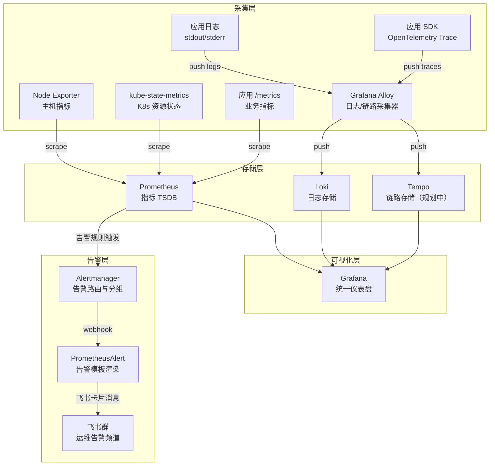
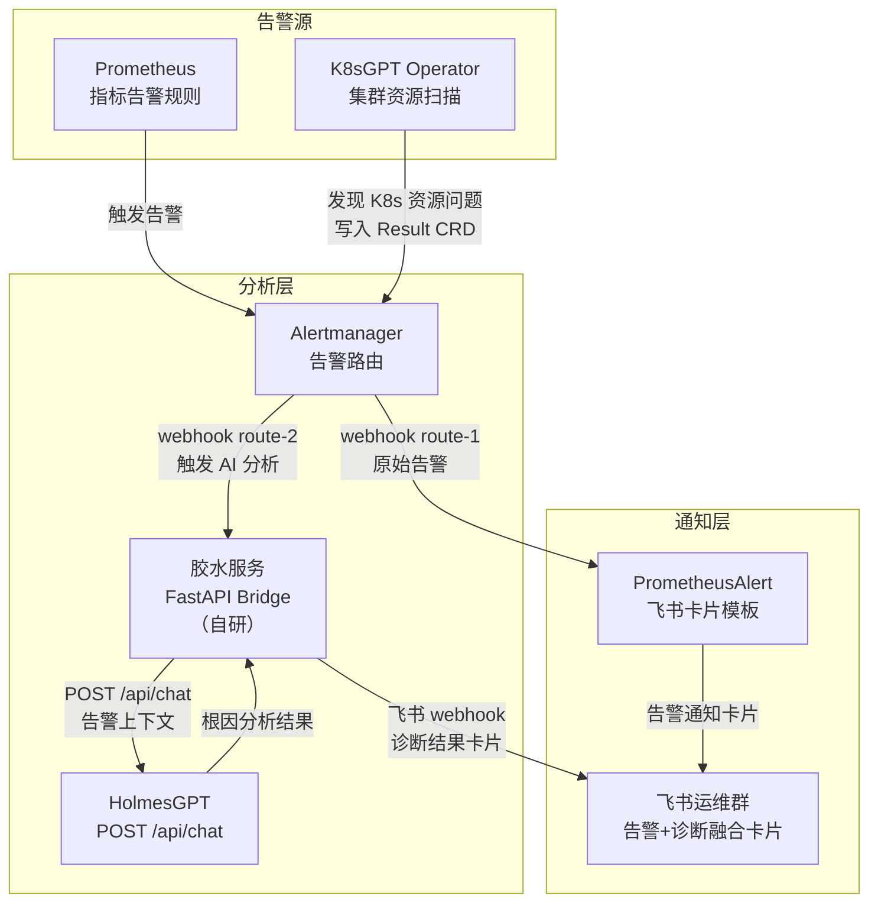
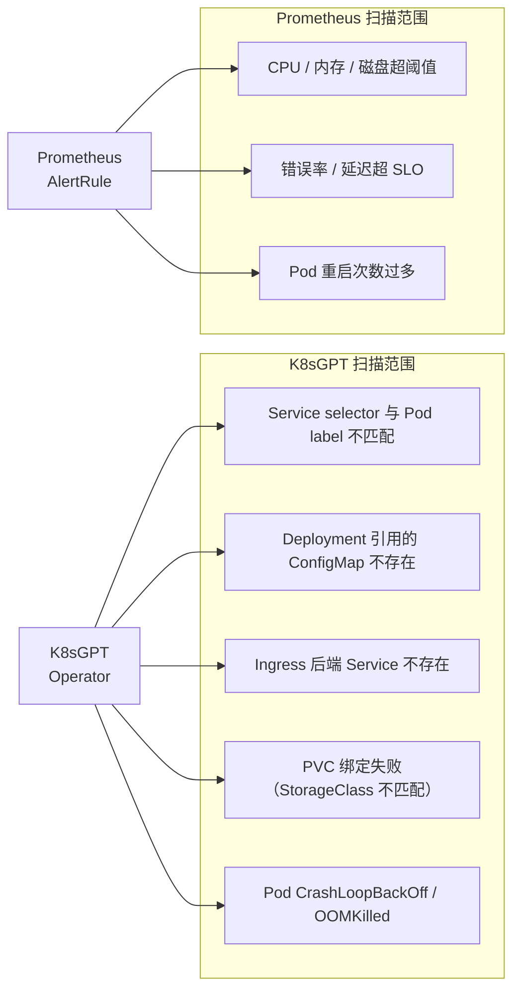
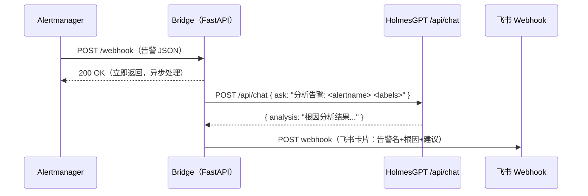
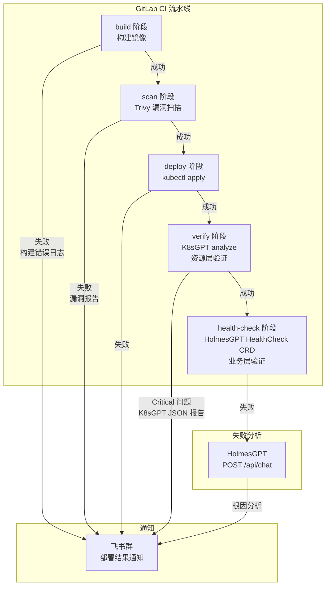
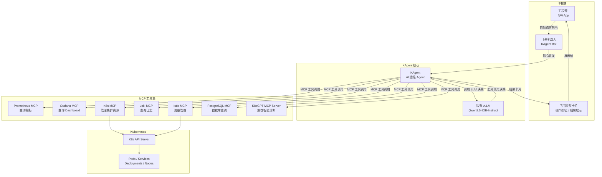
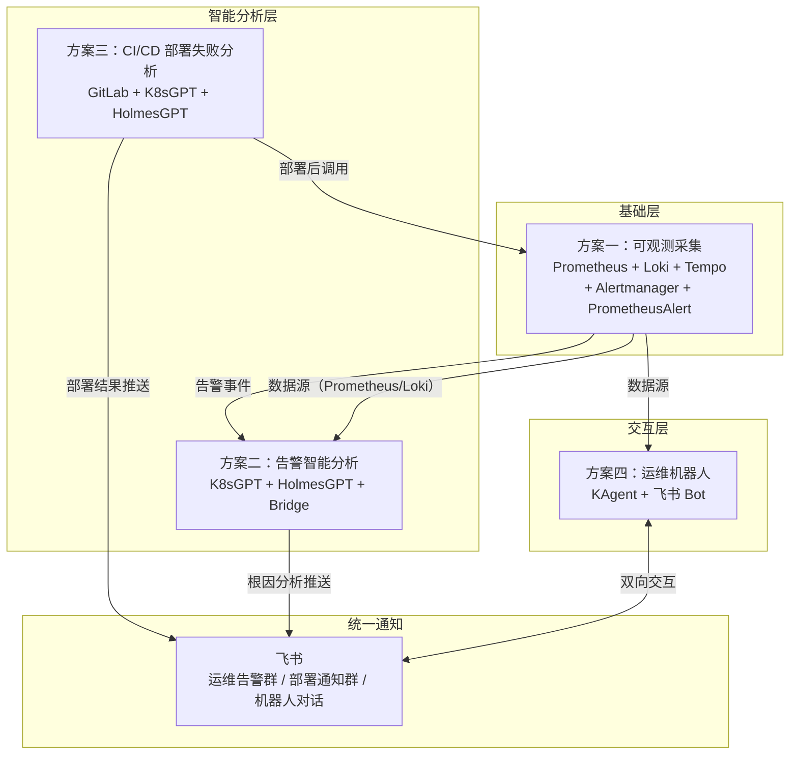

# SmartVision 可观测与 AIOps 方案总结

**更新日期：** 2026年06月04日  
**文档定位：** 四大子方案的架构设计、选型理由、预期效果与优化路径

> **⚠️ 文档范围说明**
>
> 本文档是**基于当前已调研工具**提取的阶段性方案，技术栈以 Prometheus 生态为主线（Prometheus + Loki + Tempo + Alertmanager + PrometheusAlert + K8sGPT + HolmesGPT + KAgent）。
>
> 以下类型的工具**尚未纳入调研**，后续补充调研后方案可能调整：
>
> | 待调研方向 | 典型工具 | 可能影响的方案 |
> | --- | --- | --- |
> | 商业一体化可观测平台 | Datadog、New Relic、Dynatrace | 方案一、二全部 |
> | 开源一体化可观测平台 | SigNoz、VictoriaMetrics、Coroot | 方案一 |
> | AIOps / 告警根因分析 | IncidentFox、Metoro、Robusta（商业版）| 方案二 |
> | 日志采集器对比 | Vector vs Grafana Alloy | 方案一采集层 |
> | 运维机器人 / ChatOps | Opsgenie Bot、PagerDuty、自研 | 方案四 |
>
> **当前方案的选型前提**：私有化部署优先、数据不出集群、已有 Prometheus + Loki 基础、需接入私有 vLLM。如果云托管或成本模型有变化，Datadog 等商业方案可能更合适。

---

## 目录

1. [可观测采集与告警方案](#1-可观测采集与告警方案)
2. [告警智能分析方案](#2-告警智能分析方案)
3. [CI/CD 部署失败推送方案](#3-cicd-部署失败推送方案)
4. [运维机器人集成方案](#4-运维机器人集成方案)
5. [四大方案整体关系](#5-四大方案整体关系)

---

## 1. 可观测采集与告警方案

### 1.1 方案架构



### 1.2 各组件职责

| 组件 | 职责 | 备注 |
| --- | --- | --- |
| Node Exporter | 采集主机 CPU/内存/磁盘/网络指标 | DaemonSet 部署 |
| kube-state-metrics | 采集 K8s 资源状态（Pod/Deployment/Node 等）| 补充 Prometheus 对 K8s 层的感知 |
| Grafana Alloy | 统一日志+链路采集，替代 Promtail | 支持 OTLP、loki.source.kubernetes 等 |
| Prometheus | 指标存储与告警规则引擎 | 核心，AlertRule 定义问题阈值 |
| Loki | 结构化日志存储，支持 LogQL 查询 | 与 Prometheus 标签体系对齐 |
| Tempo | 分布式链路追踪存储（规划接入）| 与 Loki 日志可通过 TraceID 关联 |
| Alertmanager | 告警分组、抑制、路由 | 避免告警风暴，原生不支持飞书，通过 webhook 转发给 PrometheusAlert |
| PrometheusAlert | 多渠道告警模板渲染与推送 | 适配飞书卡片消息格式，Alertmanager 原生无飞书支持，PrometheusAlert 做协议转换 |
| 飞书群 | 最终告警通知渠道 | 按业务线/严重等级分频道路由 |

### 1.3 为什么这样做

**为什么选 Prometheus + Loki 而不是全托管方案？**
- 私有化部署要求，数据不出集群
- Prometheus 是 CNCF 毕业项目，K8s 生态事实标准，kube-state-metrics、ServiceMonitor 等原生兼容
- Loki 轻量，日志不索引内容只索引标签，存储成本低，与 Prometheus 标签体系天然对齐

**为什么选 Grafana Alloy 替代 Promtail？**
- Alloy 是 Grafana Agent 的继任者，统一处理日志+链路+指标采集，减少 DaemonSet 数量
- 原生支持 OpenTelemetry，便于接入 Tempo

**为什么用 PrometheusAlert 而不是 Alertmanager 直接推飞书？**
- Alertmanager **原生不支持飞书**，它只内置了 Slack、Email、PagerDuty、微信等渠道
- 飞书的 Incoming Webhook 接收格式与 Alertmanager 发出的 JSON 格式不兼容，需要适配层
- PrometheusAlert 专门解决这个问题：接收 Alertmanager 的 webhook → 渲染为飞书卡片格式 → 推送
- 相比自己写适配服务，PrometheusAlert 内置大量模板，配置成本更低

### 1.4 预期效果

- **全链路可观测**：指标（Prometheus）→ 日志（Loki）→ 链路（Tempo）三位一体，Grafana 统一入口
- **告警飞书通知**：规则触发 → Alertmanager 分组 → PrometheusAlert 渲染 → 飞书卡片，延迟 < 1min
- **告警收敛**：Alertmanager 分组+抑制，避免告警风暴

### 1.5 优化方向

- **Tempo 接入**：补全链路追踪，实现 Loki 日志与 Tempo TraceID 关联，Grafana 一键跳转
- **Recording Rules**：提前聚合高频查询的 Prometheus 指标，降低 Grafana 查询延迟
- **多租户隔离**：Loki + Grafana 按命名空间/业务线做租户隔离，避免越权查询
- **告警分级路由**：Alertmanager 按 severity 路由到不同飞书群（P0 → 单独值班群，P1/P2 → 通用运维群）

---

## 2. 告警智能分析方案

### 2.1 方案架构



### 2.2 K8sGPT 在方案中的位置

K8sGPT Operator 以独立角色持续扫描集群，补充 Prometheus 感知不到的"安静错误"（配置引用断裂类问题）：



### 2.3 胶水服务（Bridge）设计

Alertmanager 原生不能直接调用 HolmesGPT，需要一个轻量 FastAPI 服务做桥接：



关键设计：
- Bridge 立即返回 200，后台用 `BackgroundTasks` 异步调用 HolmesGPT（避免 Alertmanager 超时重试）
- 每条告警独立一张飞书卡片，包含：告警名、触发时间、根因分析、修复建议
- 调用 HolmesGPT 失败时降级推送原始告警（不阻塞告警通知主链路）

### 2.4 Alertmanager 路由配置

```yaml
# alertmanager.yml 关键路由配置
route:
  receiver: prometheusalert-feishu      # 默认：原始告警卡片推飞书
  routes:
    - match:
        severity: critical              # 仅 Critical 告警触发 AI 分析
      receiver: ai-bridge
      continue: true                    # continue=true：同时走默认路由（两张卡片）

receivers:
  - name: prometheusalert-feishu
    webhook_configs:
      - url: http://prometheusalert:8080/prometheusalert?type=fs&tpl=k8s-alert&fsurl=<webhook>

  - name: ai-bridge
    webhook_configs:
      - url: http://holmes-bridge.monitoring.svc.cluster.local:8000/webhook
        send_resolved: false
```

### 2.5 为什么这样做

**为什么用 K8sGPT + HolmesGPT 而不是只用一个？**
- K8sGPT 是**规则驱动的哨兵**：固化 SRE 经验，秒级发现 K8s 配置类问题，有 Prometheus 指标历史，可看趋势
- HolmesGPT 是**LLM 驱动的侦探**：拿到告警后跨系统（K8s + Loki + Prometheus）主动推理根因，给出具体日志行级别的解释
- 两者盲区互补，K8sGPT 发现的问题可以触发 Alertmanager → 再由 HolmesGPT 深挖

**为什么需要胶水服务（Bridge）？**
- HolmesGPT 开源版只暴露 `POST /api/chat`，不支持 Alertmanager webhook 格式
- Bridge 做协议适配 + 异步解耦 + 降级保底，是无法避免的胶水层

**为什么 `continue: true` 双发而不是替换？**
- HolmesGPT 分析需要 30-60s，告警通知不能等这么久
- 先发原始告警卡片（秒级），再发 AI 分析卡片（分钟级），两条消息清晰分离

### 2.6 预期效果

- **P0/P1 告警自动附带根因**：On-Call 工程师打开飞书就能看到"根因：UserService 内存泄漏，Loki 日志第 342 行：OOM"
- **减少 MTTR**：工程师不再需要手动 kubectl describe + 查 Loki，AI 已预先汇总
- **K8s 配置类问题主动发现**：Service selector 写错、ConfigMap 不存在等"安静错误"不再漏掉

### 2.7 优化方向

- **告警降噪**：Bridge 服务加去重逻辑，同一告警 5min 内只触发一次 HolmesGPT 分析
- **分析结果持久化**：Bridge 把分析结果写入 Loki（加 `app=holmes-analysis` 标签），便于事后复盘
- **结果质量提升**：HolmesGPT 接入私有 vLLM（Qwen2.5-72B），比云端模型更了解业务上下文
- **K8sGPT 结果直接触发**：K8sGPT Operator 写入 Result CRD 后，通过 Prometheus `k8sgpt_results_total` 指标变化触发告警，自动进入分析链路

---

## 3. CI/CD 部署失败推送方案

### 3.1 方案架构



### 3.2 各阶段说明

| 阶段 | 工具 | 失败时 | 推送内容 |
| --- | --- | --- | --- |
| build | GitLab CI | 直接推飞书 | CI 错误日志摘要（前 50 行）|
| scan | Trivy | 直接推飞书 | 漏洞数量 + High/Critical CVE 列表 |
| deploy | kubectl | 直接推飞书 | kubectl 报错信息 |
| verify | K8sGPT | 直接推飞书 | K8sGPT JSON 报告（Critical 问题列表 + LLM 解释）|
| health-check | HolmesGPT | 调用 HolmesGPT 分析后推飞书 | 根因分析结果（跨 K8s + Loki 推理）|

### 3.3 为什么 K8sGPT 和 HolmesGPT 在 CI/CD 里分工不同

```
deploy 阶段成功 ≠ 服务健康

K8sGPT verify（秒级）：
  检查 K8s 资源配置是否正确——Service selector 对不对？
  ConfigMap 存在吗？Pod 启动了吗？
  → 发现的是"资源层问题"，规则驱动，结果可预测

HolmesGPT health-check（分钟级）：
  HealthCheck CRD 定义"请问 payment-service 部署健康吗"
  → LLM 主动查 K8s 事件 + Loki 日志 + 接口响应
  → 发现的是"业务层问题"，比如"服务起来了但数据库连不上"
```

### 3.4 CI 流水线关键配置

```yaml
# .gitlab-ci.yml 关键片段

# 阶段4：K8sGPT 资源层验证
verify_k8s:
  stage: verify
  image: ghcr.io/k8sgpt-ai/k8sgpt:latest
  script:
    - |
      k8sgpt auth add --backend openai \
        --baseurl "${VLLM_API_URL}/v1" \
        --model "${VLLM_MODEL}" \
        --password dummy-key
      k8sgpt analyze \
        --explain \
        --filter=Deployment,Pod,Service,Ingress \
        --namespace=${NAMESPACE} \
        --output=json | tee k8sgpt-report.json

      CRITICAL=$(jq '[.[] | select(.severity=="critical")] | length' k8sgpt-report.json)
      if [ "$CRITICAL" -gt "0" ]; then
        # 推飞书（包含 K8sGPT 分析报告）
        curl -X POST "${FEISHU_WEBHOOK}" \
          -H "Content-Type: application/json" \
          -d "{\"msg_type\":\"text\",\"content\":{\"text\":\"[K8sGPT] 发现 ${CRITICAL} 个严重问题\n$(jq -r '.[].error[].text' k8sgpt-report.json)\"}}"
        exit 1
      fi
  artifacts:
    paths: [k8sgpt-report.json]
    expire_in: 7 days

# 阶段5：HolmesGPT 业务层健康门禁
health_check:
  stage: health-check
  script:
    - |
      # 触发 HolmesGPT HealthCheck CRD（已预先部署）
      RESULT=$(curl -s -X POST http://holmes.monitoring.svc.cluster.local:30870/api/chat \
        -H "Content-Type: application/json" \
        -d "{\"ask\": \"${NAMESPACE} 命名空间下 ${SERVICE_NAME} 的新版本 ${CI_COMMIT_SHORT_SHA} 部署健康吗？\"}")

      # 推飞书：部署结果 + AI 健康分析
      curl -X POST "${FEISHU_WEBHOOK}" \
        -H "Content-Type: application/json" \
        -d "{\"msg_type\":\"text\",\"content\":{\"text\":\"[HolmesGPT 健康检查]\n$(echo $RESULT | jq -r '.analysis')\"}}"
```

### 3.5 为什么这样做

**为什么 CI/CD 失败要推飞书而不是只看 GitLab UI？**
- 工程师不会一直盯着 GitLab 流水线，飞书 @ 相关人员能打断注意力
- 飞书卡片可以展示关键信息摘要，不需要点进 GitLab 查完整日志

**为什么 build 失败不用 HolmesGPT 分析？**
- build 失败发生在 K8s 之外（GitLab Runner），HolmesGPT 没有 GitLab CI 日志的访问能力
- 直接推 CI 日志摘要更直接、更快

**为什么部署后还要两层验证（K8sGPT + HolmesGPT）？**
- kubectl apply 成功只代表资源被接受，不代表服务健康
- K8sGPT 验证"K8s 资源配置是否正确"（秒级，规则驱动）
- HolmesGPT 验证"服务是否真的在正常工作"（分钟级，LLM 推理）
- 两层门禁，不同粒度，共同保障部署质量

### 3.6 预期效果

- **部署失败秒级通知**：从 GitLab pipeline 失败到飞书收到消息 < 30s
- **减少"部署后才发现问题"**：K8sGPT 验证能拦截配置类问题，HolmesGPT 能拦截业务层问题
- **On-Call 减压**：业务高峰期部署有 AI 双重验证，降低人工回滚风险

### 3.7 优化方向

- **失败时附带 GitLab Job URL**：飞书消息直接带跳转链接，工程师一键查完整日志
- **区分回滚建议**：HolmesGPT 分析失败时，自动在飞书卡片附上回滚命令（`kubectl rollout undo`）
- **并行验证**：K8sGPT 和 HolmesGPT 两个 job 并行执行，降低总验证时间
- **灰度部署集成**：接入 Argo Rollouts，HolmesGPT 分析结果作为金丝雀晋级的额外判断依据

---

## 4. 运维机器人集成方案

### 4.1 方案架构



### 4.2 典型交互场景

| 场景 | 用户输入 | KAgent 动作 |
| --- | --- | --- |
| 集群概况 | "生产环境现在有什么问题？" | 调用 K8sGPT MCP analyze → 返回当前活跃问题列表 |
| 日志查询 | "查一下 payment-service 最近 10 分钟的错误日志" | 调用 Loki MCP 执行 LogQL → 返回日志摘要 |
| 指标查询 | "prod 环境 CPU 使用率怎么样？" | 调用 Prometheus MCP 执行 PromQL → 返回指标数据 |
| 扩容操作 | "把 api-gateway 扩到 5 个副本" | 调用 K8s MCP scale → 执行后返回确认结果 |
| 流量切换 | "把 v2 版本的流量比例调到 20%" | 调用 Istio MCP 修改 VirtualService → 返回当前流量分配 |
| 故障排查 | "为什么 order-service 一直重启？" | 综合调用 K8s MCP + Loki MCP + Prometheus MCP → 汇总分析 |

### 4.3 KAgent 与 HolmesGPT 的分工

KAgent 和 HolmesGPT 都能做故障分析，但定位不同：

| 维度 | KAgent | HolmesGPT |
| --- | --- | --- |
| 交互入口 | 飞书对话（自然语言）| API 调用（程序触发 + On-Call 手动）|
| 触发方式 | 人主动问 | 告警自动触发 / 人工触发 |
| 工具范围 | 宽（K8s + Grafana + Prometheus + Loki + Istio + PG + K8sGPT MCP 等）| 聚焦（K8s + Prometheus + Loki + Tempo，偏诊断工具）|
| 执行能力 | ✅ 可以修改集群资源（扩容、重启、流量切换）| ❌ 只读，只分析不操作 |
| 上下文维持 | ✅ 多轮对话记忆 | ❌ 单次 HTTP 请求，无记忆 |
| 适合场景 | 日常运维操作 + 查询 + 多步任务 | 告警根因快速分析 |

**推荐分工：**
- 告警触发的自动根因分析 → **HolmesGPT**（无需人介入，自动推送飞书）
- 工程师主动排查、操作集群 → **KAgent**（飞书对话，多轮交互）
- KAgent 内嵌 K8sGPT MCP：当工程师问"集群有什么问题"，KAgent 通过 K8sGPT MCP 触发扫描

### 4.4 为什么这样做

**为什么用 KAgent 而不是自己开发运维机器人？**
- KAgent 已集成大量 MCP 工具（Prometheus、Grafana、K8s、Istio、PostgreSQL 等），开箱即用
- 基于 Kubernetes 原生部署，与现有技术栈天然兼容
- 支持对接私有 vLLM，数据不出集群

**为什么接入 K8sGPT MCP Server？**
- 工程师通过飞书问"集群有什么问题"时，KAgent 通过 K8sGPT MCP 触发扫描，得到结构化诊断结果
- K8sGPT 的分析结果（Result CRD）通过 MCP 工具透出，比直接 kubectl get 更有解释性

**为什么飞书是统一入口？**
- 团队已在飞书协作，减少工具切换成本
- 飞书交互卡片支持按钮操作（确认执行、取消等），适合运维操作的二次确认流程

### 4.5 预期效果

- **运维门槛降低**：初级工程师通过自然语言也能查日志、看指标、了解集群状态
- **操作效率提升**：常见运维操作（扩容、重启）无需 kubectl，飞书直接完成
- **值班体验改善**：夜间 On-Call 时，工程师不需要打开电脑，手机飞书即可完成初步排查

### 4.6 优化方向

- **操作审批流**：扩容/重启等变更操作接入飞书审批流，需要 TL 确认后才执行
- **操作记录**：KAgent 执行的每次变更写入审计日志（Loki），可追溯
- **预设 Runbook**：把常见故障处理 SOP 作为 KAgent 的 Prompt 模板，触发后自动按步骤执行
- **主动推送**：KAgent 订阅 Alertmanager 告警，在飞书主动发起对话"检测到 P0 告警，要我分析吗？"

---

## 5. 四大方案整体关系



### 各方案依赖关系

| 方案 | 依赖 | 说明 |
| --- | --- | --- |
| 方案一（可观测）| 无前置依赖 | 基础设施，其他方案的数据来源 |
| 方案二（告警分析）| 方案一必须先完成 | HolmesGPT 需要 Prometheus + Loki 作为数据源 |
| 方案三（CI/CD 推送）| 方案一可选 | K8sGPT verify 不依赖方案一，HolmesGPT health-check 依赖 Loki |
| 方案四（运维机器人）| 方案一建议完成 | KAgent 通过 MCP 调用 Prometheus/Loki，数据源依赖方案一 |

### 建设优先级建议

```
阶段一（P0，当前）：方案一 可观测基础 → 方案三 CI/CD 通知
    现有 Prometheus + Loki 已基本就绪，打通 GitLab → 飞书部署通知

阶段二（P1，近期）：方案二 告警智能分析
    部署 Bridge 服务，接通 Alertmanager → HolmesGPT → 飞书链路
    部署 K8sGPT Operator，补充 K8s 配置类问题扫描

阶段三（P2，中期）：方案四 运维机器人
    KAgent 接入飞书，配置 Prometheus/Loki/K8sGPT MCP
    接入 Tempo，完成链路追踪闭环
```

---

## 附录：关键选型说明

| 问题 | 结论 |
| --- | --- |
| K8sGPT vs HolmesGPT 选哪个？ | 两者互补，K8sGPT 做规则扫描哨兵，HolmesGPT 做 LLM 根因侦探 |
| HolmesGPT 能分析 CI build 失败吗？ | 不能，build 失败在 K8s 之外，直接推 CI 日志到飞书 |
| K8sGPT 能替代 Prometheus 吗？ | 不能，两者盲区互补：Prometheus 看指标阈值，K8sGPT 看 K8s 配置引用关系 |
| K8sGPT Result CRD 需要手动清理吗？ | 不需要，问题修复后 Operator 自动删除对应 CRD |
| HolmesGPT 有历史记录吗？ | 无，推送飞书/写 Loki 需调用方自行实现 |
| 飞书是唯一通知渠道吗？ | 是，PrometheusAlert 统一管理推送，如需其他渠道只改 PrometheusAlert 配置 |
