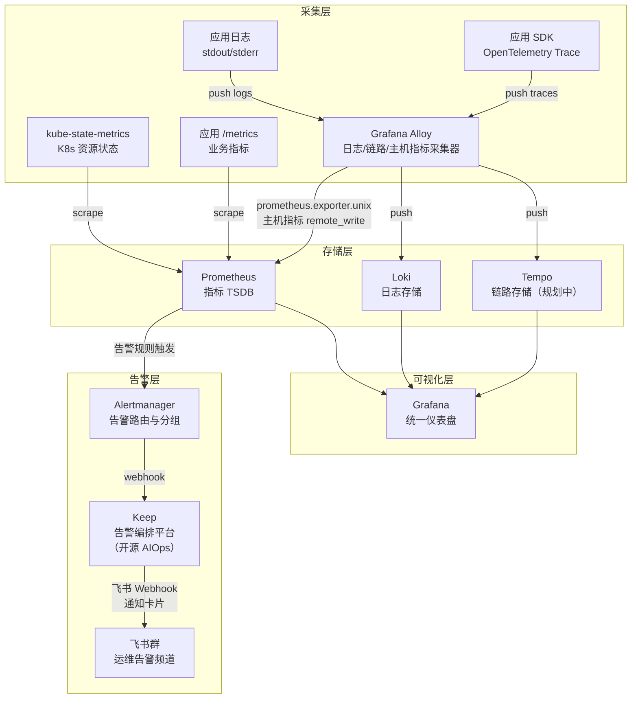
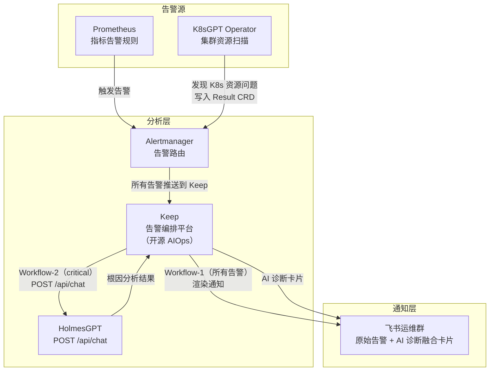
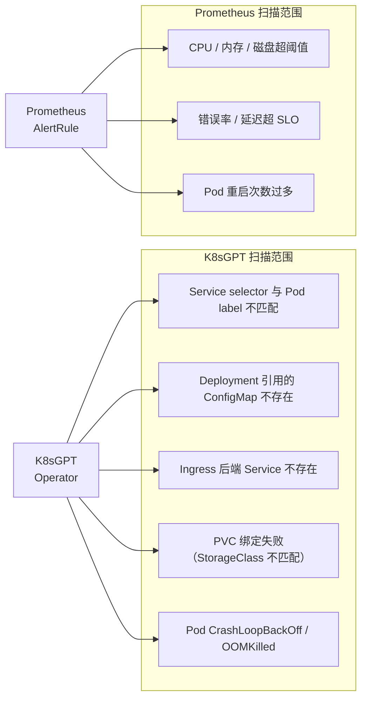
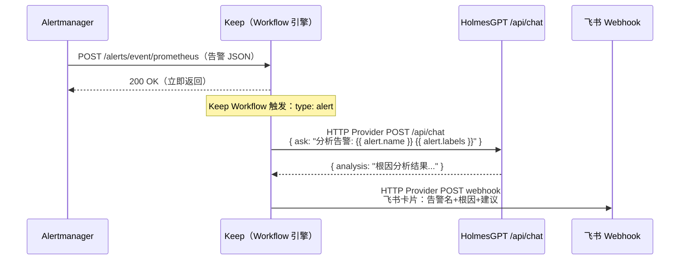
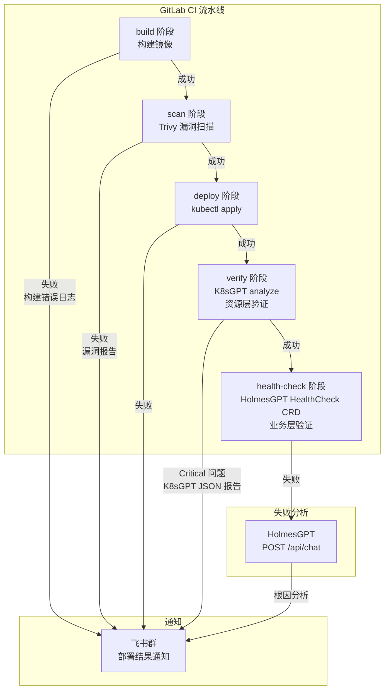
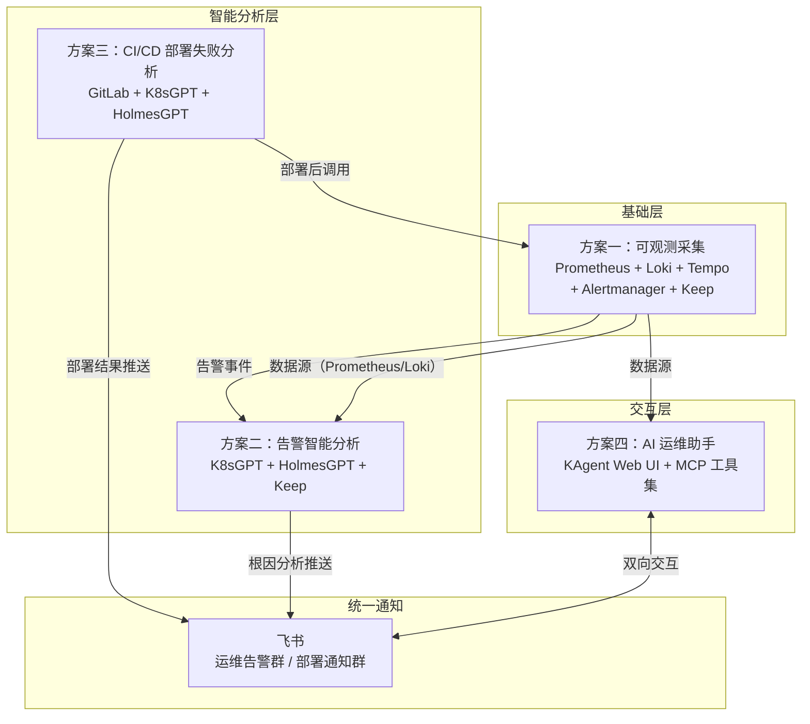

# 可观测与 AIOps 方案总结

**更新日期：** 2026年06月09日  
**文档定位：** 四大子方案的架构设计、选型理由、预期效果与优化路径

> **⚠️ 文档范围说明**
>
> 本文档是**基于当前已调研工具**提取的阶段性方案，技术栈以 Prometheus 生态为主线（Prometheus + Loki + Tempo + Alertmanager + PrometheusAlert + **Keep** + K8sGPT + HolmesGPT + KAgent）。
>
> 以下类型的工具**尚未纳入调研**，后续补充调研后方案可能调整：
>
> | 待调研方向 | 典型工具 | 可能影响的方案 |
> | --- | --- | --- |
> | 商业一体化可观测平台 | Datadog、New Relic、Dynatrace | 方案一、二全部 |
> | 开源一体化可观测平台 | SigNoz、VictoriaMetrics、Coroot | 方案一 |
> | AIOps / 告警根因分析 | ~~IncidentFox、Metoro、Robusta~~  **Keep（已完成调研，已纳入方案二）** | 方案二 |
> | 日志采集器对比 | Vector vs Grafana Alloy | 方案一采集层 |
> | 运维机器人 / ChatOps | Opsgenie Bot、PagerDuty、自研 | 方案四 |
>
> **当前方案的选型前提**：私有化部署优先、数据不出集群、已有 Prometheus + Loki 基础、需接入私有 vLLM。如果云托管或成本模型有变化，Datadog 等商业方案可能更合适。

---

## 目录

1. [可观测采集与告警方案](#1-可观测采集与告警方案)
2. [告警智能分析方案](#2-告警智能分析方案)
3. [CI/CD 部署失败推送方案](#3-cicd-部署失败推送方案)
4. [运维机器人集成方案](#4-运维机器人集成方案)
5. [四大方案整体关系](#5-四大方案整体关系)

---

## 1. 可观测采集与告警方案

### 1.1 方案架构



### 1.2 各组件职责

| 组件 | 职责 | 备注 |
| --- | --- | --- |
| kube-state-metrics | 采集 K8s 资源状态（Pod/Deployment/Node 等）| 补充 Prometheus 对 K8s 层的感知 |
| Grafana Alloy | 统一采集：日志（`loki.source.kubernetes`）+ 链路（OTLP）+ 主机指标（`prometheus.exporter.unix`）| 替代 Promtail + node-exporter，合并为一个 DaemonSet |
| Prometheus | 指标存储与告警规则引擎 | 核心，AlertRule 定义问题阈值 |
| Loki | 结构化日志存储，支持 LogQL 查询 | 与 Prometheus 标签体系对齐 |
| Tempo | 分布式链路追踪存储（规划接入）| 与 Loki 日志可通过 TraceID 关联 |
| Alertmanager | 告警分组、抑制、路由 | 避免告警风暴，所有告警统一 webhook 推送给 Keep |
| Keep | 告警编排平台，统一接收告警、渲染通知、编排 Workflow | 替代 PrometheusAlert，同时承载 AI 分析链路；支持 Prometheus Webhook 原生格式 |
| 飞书群 | 最终告警通知渠道 | 按业务线/严重等级分频道路由 |

### 1.3 为什么这样做

**为什么选 Prometheus + Loki 而不是全托管方案？**
- 私有化部署要求，数据不出集群
- Prometheus 是 CNCF 毕业项目，K8s 生态事实标准，kube-state-metrics、ServiceMonitor 等原生兼容
- Loki 轻量，日志不索引内容只索引标签，存储成本低，与 Prometheus 标签体系天然对齐

**为什么选 Grafana Alloy 替代 Promtail？**
- Alloy 是 Grafana Agent 的继任者，统一处理日志+链路+指标采集，减少 DaemonSet 数量
- 原生支持 OpenTelemetry，便于接入 Tempo

**为什么用 Keep 替代 PrometheusAlert 做告警通知？**
- Alertmanager **原生不支持飞书**，飞书 Incoming Webhook 格式与 Alertmanager 的 JSON 格式不兼容，适配层不可避免
- PrometheusAlert 只做"模板渲染 + 推送"，是单一职责工具；Keep 在覆盖同等通知能力的基础上，额外提供告警聚合降噪、Incident 管理、Workflow 自动化响应、AI 分析编排
- 统一使用 Keep 后，所有告警的通知逻辑、AI 分析逻辑都在同一平台管理，减少组件数量

### 1.4 预期效果

- **全链路可观测**：指标（Prometheus）→ 日志（Loki）→ 链路（Tempo）三位一体，Grafana 统一入口
- **告警飞书通知**：规则触发 → Alertmanager 分组 → Keep Workflow 渲染 → 飞书卡片，延迟 < 1min
- **告警收敛**：Alertmanager 分组+抑制，避免告警风暴

### 1.5 优化方向

- **Tempo 接入**：补全链路追踪，实现 Loki 日志与 Tempo TraceID 关联，Grafana 一键跳转
- **Recording Rules**：提前聚合高频查询的 Prometheus 指标，降低 Grafana 查询延迟
- **多租户隔离**：Loki + Grafana 按命名空间/业务线做租户隔离，避免越权查询
- **告警分级路由**：Alertmanager 按 severity 路由到不同飞书群（P0 → 单独值班群，P1/P2 → 通用运维群）

---

## 2. 告警智能分析方案

### 2.1 方案架构



### 2.2 K8sGPT 在方案中的位置

K8sGPT Operator 以独立角色持续扫描集群，补充 Prometheus 感知不到的"安静错误"（配置引用断裂类问题）：



### 2.3 Keep 替代胶水服务

Alertmanager 原生不能直接调用 HolmesGPT，之前需要自研 FastAPI Bridge 做协议适配。引入 Keep 后，Keep 原生接收 Alertmanager Webhook 并通过 Workflow 引擎完成全部编排，无需维护自研代码。



Keep Workflow 配置（核心片段）：
```yaml
workflow:
  id: holmes-diagnose-to-feishu
  description: Prometheus critical 告警 → HolmesGPT 诊断 → 飞书
  triggers:
    - type: alert
      filters:
        - key: source
          value: prometheus
        - key: severity
          value: critical
  steps:
    - name: holmes-diagnose
      provider:
        type: http
        with:
          url: "http://holmes.monitoring.svc.cluster.local:30870/api/chat"
          method: POST
          headers:
            Content-Type: "application/json"
          body:
            ask: "告警名称：{{ alert.name }}，标签：{{ alert.labels }}，描述：{{ alert.description }}。请分析根因并给出处理建议。"
  actions:
    - name: notify-feishu
      provider:
        type: http
        with:
          url: "https://open.feishu.cn/open-apis/bot/v2/hook/YOUR_WEBHOOK"
          method: POST
          headers:
            Content-Type: "application/json"
          body:
            msg_type: "text"
            content:
              text: "🚨 {{ alert.name }}（{{ alert.severity }}）\n\nAI 根因分析：\n{{ steps.holmes-diagnose.results.analysis }}"
```

与原 Bridge 方案对比：

| 对比项 | 自研 Bridge（FastAPI）| Keep Workflow |
| --- | --- | --- |
| 开发工作量 | 编写、测试、维护 Python 服务 | 无代码，YAML 配置 |
| 异步解耦 | 需自实现 BackgroundTasks | Keep Worker 原生异步 |
| 降级保底 | 需自写 try/except | Keep 内置 step 失败降级 |
| 告警去重 | 需自实现 | Keep 内置告警去重 |
| 可观测性 | 需自行加日志 | Keep UI 自带 Workflow 执行历史 |

### 2.4 Alertmanager 路由配置

Keep 统一接收所有告警后，路由逻辑由 Keep Workflow 内部的 `filters` 完成，Alertmanager 只需配置一个 receiver，不再需要双路分流：

```yaml
# alertmanager.yml 关键路由配置（简化版）
route:
  receiver: keep          # 所有告警统一推送到 Keep

receivers:
  - name: keep
    webhook_configs:
      - url: http://keep-backend.monitoring.svc.cluster.local:8080/alerts/event/prometheus
        send_resolved: true
```

Keep 内部通过两个 Workflow 处理：
- **Workflow-1**（所有告警触发）：渲染告警消息 → 推飞书
- **Workflow-2**（仅 critical 触发）：调用 HolmesGPT → 将 AI 诊断结果推飞书

两条飞书消息独立发送，Workflow-1 秒级推出原始通知，Workflow-2 分钟级推出 AI 诊断，时序清晰，互不阻塞。

### 2.5 为什么这样做

**为什么用 K8sGPT + HolmesGPT 而不是只用一个？**
- K8sGPT 是**规则驱动的哨兵**：固化 SRE 经验，秒级发现 K8s 配置类问题，有 Prometheus 指标历史，可看趋势
- HolmesGPT 是**LLM 驱动的侦探**：拿到告警后跨系统（K8s + Loki + Prometheus）主动推理根因，给出具体日志行级别的解释
- 两者盲区互补，K8sGPT 发现的问题可以触发 Alertmanager → 再由 HolmesGPT 深挖

**为什么用 Keep 替代自研 Bridge 和 PrometheusAlert？**
- HolmesGPT 开源版只暴露 `POST /api/chat`，不支持 Alertmanager webhook 格式，协议适配层不可避免
- PrometheusAlert 只做"模板渲染+推送"，是单一职责工具；Keep 同时覆盖通知渲染、AI 分析编排、告警聚合降噪三个职责
- 统一用 Keep 后，Alertmanager 只需一个 receiver，路由逻辑全部在 Keep Workflow 中管理，架构更简洁，组件更少

**为什么两个 Workflow 独立发送而不是合并？**
- Workflow-1（原始通知）秒级完成，值班工程师立即感知告警
- Workflow-2（HolmesGPT 分析）需要 30-60s，独立 Workflow 不阻塞原始通知
- 两条飞书消息各司其职：一条"你有告警"，一条"告警原因是 X"

### 2.6 预期效果

- **P0/P1 告警自动附带根因**：On-Call 工程师打开飞书就能看到"根因：UserService 内存泄漏，Loki 日志第 342 行：OOM"
- **减少 MTTR**：工程师不再需要手动 kubectl describe + 查 Loki，AI 已预先汇总
- **K8s 配置类问题主动发现**：Service selector 写错、ConfigMap 不存在等"安静错误"不再漏掉

### 2.7 优化方向

- **告警降噪**：Keep 内置告警去重和分组，同一告警在 Keep 面板中合并，减少重复触发 HolmesGPT
- **多级告警升级**：在 Keep Workflow 中配置 Escalation：critical 告警 10 分钟未 Acknowledge 时自动升级通知值班负责人
- **分析结果持久化**：Keep Workflow 在推飞书的同时，用 HTTP Provider 将诊断结果写入 Loki（`app=holmes-analysis`），便于事后复盘
- **结果质量提升**：HolmesGPT 接入私有 vLLM（Qwen2.5-72B），Keep Workflow 中的 HolmesGPT 调用同样可切换为 vLLM 端点
- **K8sGPT 结果直接触发**：K8sGPT Operator 写入 Result CRD 后，通过 Prometheus `k8sgpt_results_total` 指标变化触发 Alertmanager，自动进入 Keep → HolmesGPT 分析链路
- **Keep 告警面板**：利用 Keep 的 Incident 管理能力，将相关告警自动归组为一个 Incident，减少告警疲劳

---

## 3. CI/CD 部署失败推送方案

### 3.1 方案架构



### 3.2 各阶段说明

| 阶段 | 工具 | 失败时 | 推送内容 |
| --- | --- | --- | --- |
| build | GitLab CI | 直接推飞书 | CI 错误日志摘要（前 50 行）|
| scan | Trivy | 直接推飞书 | 漏洞数量 + High/Critical CVE 列表 |
| deploy | kubectl | 直接推飞书 | kubectl 报错信息 |
| verify | K8sGPT | 直接推飞书 | K8sGPT JSON 报告（Critical 问题列表 + LLM 解释）|
| health-check | HolmesGPT | 调用 HolmesGPT 分析后推飞书 | 根因分析结果（跨 K8s + Loki 推理）|

### 3.3 为什么 K8sGPT 和 HolmesGPT 在 CI/CD 里分工不同

```
deploy 阶段成功 ≠ 服务健康

K8sGPT verify（秒级）：
  检查 K8s 资源配置是否正确——Service selector 对不对？
  ConfigMap 存在吗？Pod 启动了吗？
  → 发现的是"资源层问题"，规则驱动，结果可预测

HolmesGPT health-check（分钟级）：
  HealthCheck CRD 定义"请问 payment-service 部署健康吗"
  → LLM 主动查 K8s 事件 + Loki 日志 + 接口响应
  → 发现的是"业务层问题"，比如"服务起来了但数据库连不上"
```

### 3.4 CI 流水线关键配置

```yaml
# .gitlab-ci.yml 关键片段

# 阶段4：K8sGPT 资源层验证
verify_k8s:
  stage: verify
  image: ghcr.io/k8sgpt-ai/k8sgpt:latest
  script:
    - |
      k8sgpt auth add --backend openai \
        --baseurl "${VLLM_API_URL}/v1" \
        --model "${VLLM_MODEL}" \
        --password dummy-key
      k8sgpt analyze \
        --explain \
        --filter=Deployment,Pod,Service,Ingress \
        --namespace=${NAMESPACE} \
        --output=json | tee k8sgpt-report.json

      CRITICAL=$(jq '[.[] | select(.severity=="critical")] | length' k8sgpt-report.json)
      if [ "$CRITICAL" -gt "0" ]; then
        # 推飞书（包含 K8sGPT 分析报告）
        curl -X POST "${FEISHU_WEBHOOK}" \
          -H "Content-Type: application/json" \
          -d "{\"msg_type\":\"text\",\"content\":{\"text\":\"[K8sGPT] 发现 ${CRITICAL} 个严重问题\n$(jq -r '.[].error[].text' k8sgpt-report.json)\"}}"
        exit 1
      fi
  artifacts:
    paths: [k8sgpt-report.json]
    expire_in: 7 days

# 阶段5：HolmesGPT 业务层健康门禁
health_check:
  stage: health-check
  script:
    - |
      # 触发 HolmesGPT HealthCheck CRD（已预先部署）
      RESULT=$(curl -s -X POST http://holmes.monitoring.svc.cluster.local:30870/api/chat \
        -H "Content-Type: application/json" \
        -d "{\"ask\": \"${NAMESPACE} 命名空间下 ${SERVICE_NAME} 的新版本 ${CI_COMMIT_SHORT_SHA} 部署健康吗？\"}")

      # 推飞书：部署结果 + AI 健康分析
      curl -X POST "${FEISHU_WEBHOOK}" \
        -H "Content-Type: application/json" \
        -d "{\"msg_type\":\"text\",\"content\":{\"text\":\"[HolmesGPT 健康检查]\n$(echo $RESULT | jq -r '.analysis')\"}}"
```

### 3.5 为什么这样做

**为什么 CI/CD 失败要推飞书而不是只看 GitLab UI？**
- 工程师不会一直盯着 GitLab 流水线，飞书 @ 相关人员能打断注意力
- 飞书卡片可以展示关键信息摘要，不需要点进 GitLab 查完整日志

**为什么 build 失败不用 HolmesGPT 分析？**
- build 失败发生在 K8s 之外（GitLab Runner），HolmesGPT 没有 GitLab CI 日志的访问能力
- 直接推 CI 日志摘要更直接、更快

**为什么部署后还要两层验证（K8sGPT + HolmesGPT）？**
- kubectl apply 成功只代表资源被接受，不代表服务健康
- K8sGPT 验证"K8s 资源配置是否正确"（秒级，规则驱动）
- HolmesGPT 验证"服务是否真的在正常工作"（分钟级，LLM 推理）
- 两层门禁，不同粒度，共同保障部署质量

### 3.6 预期效果

- **部署失败秒级通知**：从 GitLab pipeline 失败到飞书收到消息 < 30s
- **减少"部署后才发现问题"**：K8sGPT 验证能拦截配置类问题，HolmesGPT 能拦截业务层问题
- **On-Call 减压**：业务高峰期部署有 AI 双重验证，降低人工回滚风险

### 3.7 优化方向

- **失败时附带 GitLab Job URL**：飞书消息直接带跳转链接，工程师一键查完整日志
- **区分回滚建议**：HolmesGPT 分析失败时，自动在飞书卡片附上回滚命令（`kubectl rollout undo`）
- **并行验证**：K8sGPT 和 HolmesGPT 两个 job 并行执行，降低总验证时间
- **灰度部署集成**：接入 Argo Rollouts，HolmesGPT 分析结果作为金丝雀晋级的额外判断依据

---

## 4. AI 运维助手方案

### 4.1 方案定位

KAgent 作为**工程师主动操作集群的对话式界面**，通过 Web UI / CLI 以自然语言与私有 vLLM 交互，调用各类 MCP 工具完成查询、诊断、变更操作。告警通知由 Keep（方案二）负责推送飞书，KAgent 不做告警通知，只做"工程师主动发起"的运维操作。

```mermaid
flowchart TD
    subgraph 工程师端
        UI["KAgent Web UI\n浏览器对话界面"]
        CLI["KAgent CLI\nkubectl 风格命令行"]
    end

    subgraph KAgent 核心
        KAGENT["KAgent Controller + Engine\nAgentic Loop / A2A 编排"]
        LLM["私有 vLLM\nQwen2.5-72B-Instruct"]
    end

    subgraph 内置 ToolServer（已就绪）
        K8S["kubernetes\nPod/Deploy/Node 增删改查"]
        HELM["helm\nRelease 管理 / 回滚"]
        ISTIO["istio\n流量策略 / 熔断配置"]
        ARGO["argo-rollouts\n金丝雀 / 蓝绿进度控制"]
        PROM["prometheus\nPromQL 查询"]
        GRAFANA["grafana\nDashboard / Panel 查询"]
        CILIUM["cilium\n网络策略分析"]
    end

    subgraph RemoteMCPServer（扩展）
        FETCH["mcp-website-fetcher\n官方文档 / Runbook 抓取"]
        LOKI["Loki MCP\nLogQL 日志查询"]
        ARGOCD["ArgoCD MCP\nApplication 同步状态"]
        GITHUB["GitHub MCP\nPR / Issue / CI 状态"]
        TEMPO["Tempo MCP\nTrace 查询"]
        K8SGPT["K8sGPT MCP\n集群配置巡检"]
    end

    subgraph Kubernetes 集群
        API["K8s API Server"]
        OBS["Prometheus + Loki + Tempo"]
    end

    UI & CLI --> KAGENT
    KAGENT <--> LLM
    KAGENT --> K8S & HELM & ISTIO & ARGO & PROM & GRAFANA & CILIUM
    KAGENT --> FETCH & LOKI & ARGOCD & GITHUB & TEMPO & K8SGPT
    K8S & HELM & ISTIO & ARGO & CILIUM --> API
    PROM & GRAFANA & LOKI & TEMPO --> OBS
```

### 4.2 MCP 工具清单

#### 内置 ToolServer（安装即可用）

| ToolServer | 核心工具 | 典型用途 |
| --- | --- | --- |
| `kubernetes` | get/describe/logs/exec/scale/delete | Pod 状态查询、扩缩容、重启、日志捞取 |
| `helm` | list/status/upgrade/rollback/diff | Release 管理、回滚上一版本 |
| `istio` | analyze/describe VirtualService/DestinationRule | 流量策略配置、熔断排查 |
| `argo-rollouts` | get rollout/promote/abort/pause | 金丝雀进度控制、灰度回滚 |
| `prometheus` | query/query_range/alerts | PromQL 执行、告警规则查询 |
| `grafana` | get-dashboard/query-panel | Dashboard 面板读取 |
| `cilium` | get-policy/connectivity-check | 网络策略分析、Pod 连通性调试 |

#### RemoteMCPServer（需额外部署/注册）

| MCP Server | 来源 | 核心能力 | 状态 |
| --- | --- | --- | --- |
| `mcp-website-fetcher` | 已部署（集群内） | 抓取官方文档、Runbook、K8s changelog | ✅ 已就绪 |
| `Loki MCP` | `grafana/mcp-grafana`（含 Loki 工具） | LogQL 查询、日志流读取 | 🔧 待部署 |
| `ArgoCD MCP` | `coder/agentapi` / 社区实现 | Application 同步状态、健康检查 | 🔧 待调研 |
| `GitHub MCP` | `github/github-mcp-server`（官方） | PR/Issue 查询、CI workflow 状态、代码搜索 | 🔧 待部署 |
| `Tempo MCP` | 自定义封装 Tempo HTTP API | TraceQL 查询、Trace 详情读取 | 🔧 待开发 |
| `K8sGPT MCP` | K8sGPT 内置 MCP Server 模式 | 集群配置问题扫描、Result CRD 读取 | 🔧 待配置 |
| `PostgreSQL MCP` | `modelcontextprotocol/servers`（官方） | SQL 查询、表结构探索 | 🔧 待部署 |

### 4.3 典型交互场景

| 场景 | 工程师输入 | KAgent 调用工具 |
| --- | --- | --- |
| 集群巡检 | "生产环境现在有没有异常资源？" | K8sGPT MCP analyze → 返回问题列表 |
| 日志查询 | "查 payment-service 最近 10 分钟的 ERROR 日志" | Loki MCP LogQL → 返回日志摘要 |
| 指标查询 | "prod 各节点 CPU 用量怎么样？" | Prometheus PromQL → 返回指标数据 |
| 扩容 | "把 api-gateway 扩到 5 个副本" | kubernetes scale → 执行并返回确认 |
| 灰度控制 | "把 payment-service v2 流量比例提到 30%" | argo-rollouts promote + istio VirtualService → 返回当前分配 |
| 版本回滚 | "把 order-service Helm release 回滚到上一版本" | helm rollback → 执行并返回 diff |
| 故障排查 | "为什么 order-service 14:30 开始重启？" | kubernetes logs + Loki MCP + Prometheus → 汇总分析 |
| CI/CD 联动 | "最近一次 main 分支 pipeline 为什么失败？" | GitHub MCP → 返回 CI 日志摘要 |
| 文档查询 | "Argo Rollouts 金丝雀暂停的配置方式是什么？" | mcp-website-fetcher 抓取官方文档 → 返回摘要 |
| 多 Agent 协作 | "帮我做一次完整的发布健康检查" | A2A 编排：k8s-agent + promql-agent + observability-agent 协同 |

### 4.4 KAgent 与 HolmesGPT 的分工

| 维度 | KAgent | HolmesGPT |
| --- | --- | --- |
| 交互入口 | Web UI / CLI（工程师主动发起）| Keep Workflow 自动触发 |
| 触发方式 | 人主动问 | 告警自动触发 |
| 工具范围 | 宽（增删改查 + 查询 + 多系统）| 聚焦（K8s + Prometheus + Loki + Tempo，只读诊断）|
| 执行能力 | ✅ 可修改集群资源（扩容、回滚、流量切换）| ❌ 只读，只分析不操作 |
| 上下文维持 | ✅ 多轮对话 | ❌ 单次请求，无记忆 |
| 结果去向 | Web UI 展示 | Keep → 飞书推送 |
| 适合场景 | 日常运维操作、主动排查、多步任务 | 告警触发的快速自动根因分析 |

### 4.5 预期效果

- **运维门槛降低**：初级工程师通过自然语言完成日志查询、指标读取、集群状态了解，无需记忆 kubectl 命令
- **操作效率提升**：扩容、回滚、流量切换等操作通过对话完成，减少多系统切换
- **知识沉淀**：通过 Runbook Prompt 模板固化 SRE 经验，新人也能按步骤执行标准处置流程

### 4.6 优化方向

- **操作审批流**：扩容/重启等变更操作通过 Workflow 加二次确认（Agent 提示"即将执行，确认？"），避免误操作
- **审计日志**：KAgent 执行的每次变更通过 Loki MCP 写入审计日志，可追溯
- **预设 Runbook Agent**：针对常见故障（OOM、CrashLoop、磁盘满）预设专用 Agent，内嵌 SOP 作为 System Prompt
- **多 Agent A2A 编排**：复杂任务拆分为多个专家 Agent（网络专家 + 存储专家 + 安全专家）协同完成

---

## 5. 四大方案整体关系



### 各方案依赖关系

| 方案 | 依赖 | 说明 |
| --- | --- | --- |
| 方案一（可观测）| 无前置依赖 | 基础设施，其他方案的数据来源 |
| 方案二（告警分析）| 方案一必须先完成 | HolmesGPT 需要 Prometheus + Loki 作为数据源 |
| 方案三（CI/CD 推送）| 方案一可选 | K8sGPT verify 不依赖方案一，HolmesGPT health-check 依赖 Loki |
| 方案四（运维机器人）| 方案一建议完成 | KAgent 通过 MCP 调用 Prometheus/Loki，数据源依赖方案一 |

### 建设优先级建议

```
阶段一（P0，当前）：方案一 可观测基础 → 方案三 CI/CD 通知
    现有 Prometheus + Loki 已基本就绪，打通 GitLab → 飞书部署通知

阶段二（P1，近期）：方案二 告警智能分析
    部署 Keep（Helm 安装），接通 Alertmanager → Keep → HolmesGPT → 飞书链路
    部署 K8sGPT Operator，补充 K8s 配置类问题扫描

阶段三（P2，中期）：方案四 AI 运维助手
    部署 KAgent，配置私有 vLLM（Qwen2.5-72B）
    注册 Loki MCP / K8sGPT MCP / GitHub MCP 等 RemoteMCPServer
    接入 Tempo，完成链路追踪闭环
```

---

## 附录：关键选型说明

| 问题 | 结论 |
| --- | --- |
| K8sGPT vs HolmesGPT 选哪个？ | 两者互补，K8sGPT 做规则扫描哨兵，HolmesGPT 做 LLM 根因侦探 |
| HolmesGPT 能分析 CI build 失败吗？ | 不能，build 失败在 K8s 之外，直接推 CI 日志到飞书 |
| K8sGPT 能替代 Prometheus 吗？ | 不能，两者盲区互补：Prometheus 看指标阈值，K8sGPT 看 K8s 配置引用关系 |
| K8sGPT Result CRD 需要手动清理吗？ | 不需要，问题修复后 Operator 自动删除对应 CRD |
| HolmesGPT 有历史记录吗？ | 无，但 Keep Workflow 可在推飞书的同时将诊断结果写入 Loki 实现持久化 |
| 为什么不用自研 Bridge？ | Keep 原生支持 Alertmanager Webhook + Workflow 异步编排 + 内置去重，零自研代码 |
| 飞书是唯一通知渠道吗？ | 是，Keep 统一管理所有告警推送，如需其他渠道在 Keep Workflow 中添加 HTTP Provider 即可 |
