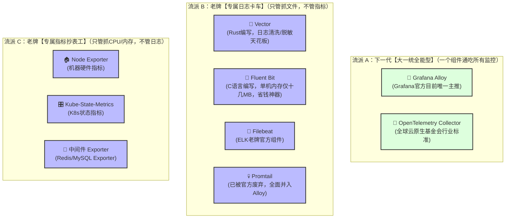
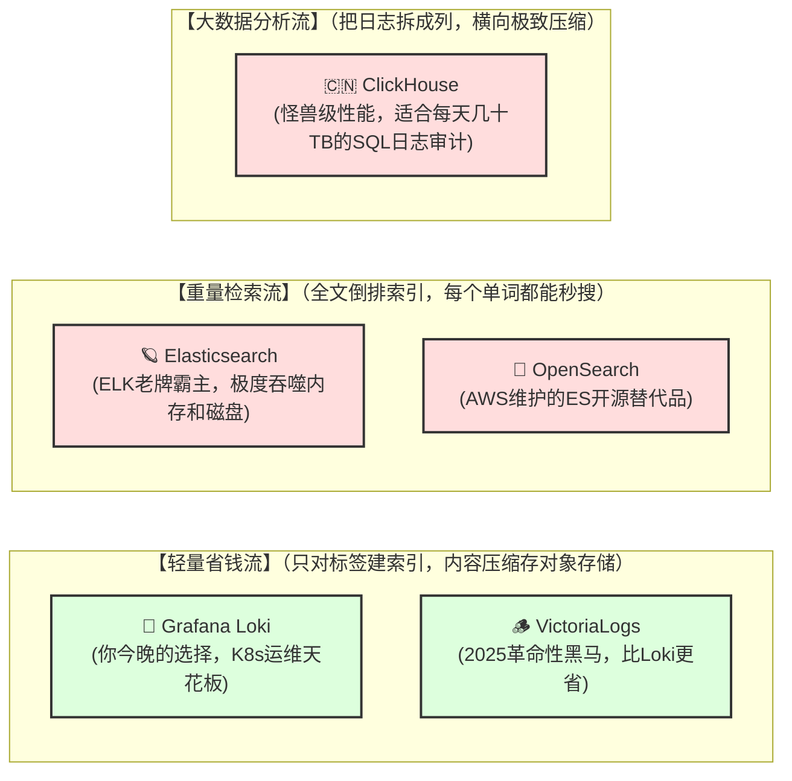
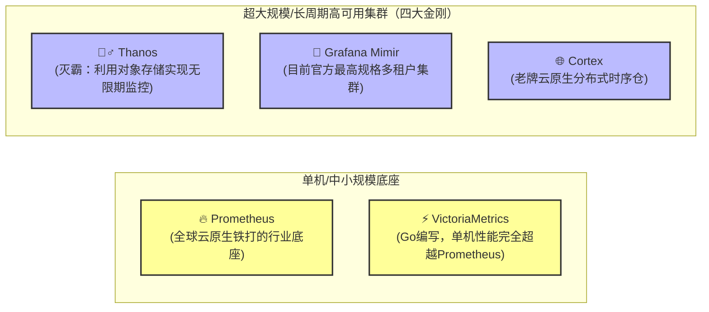
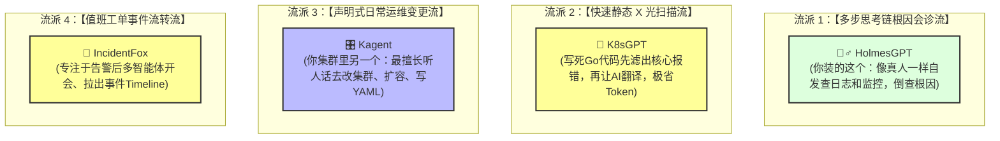
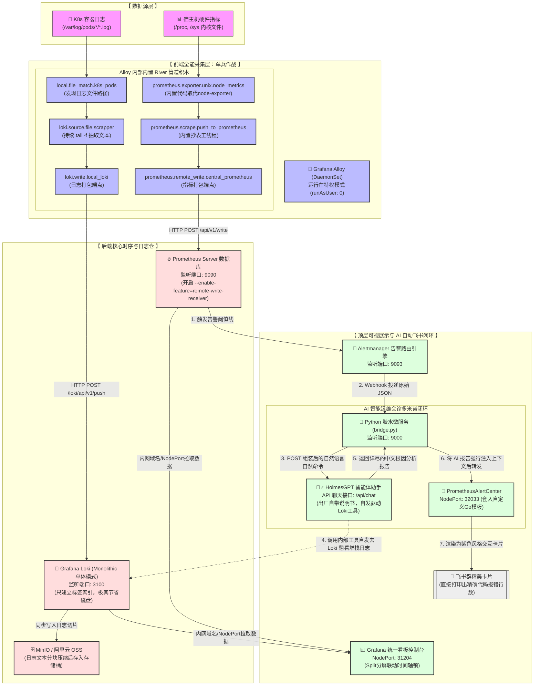
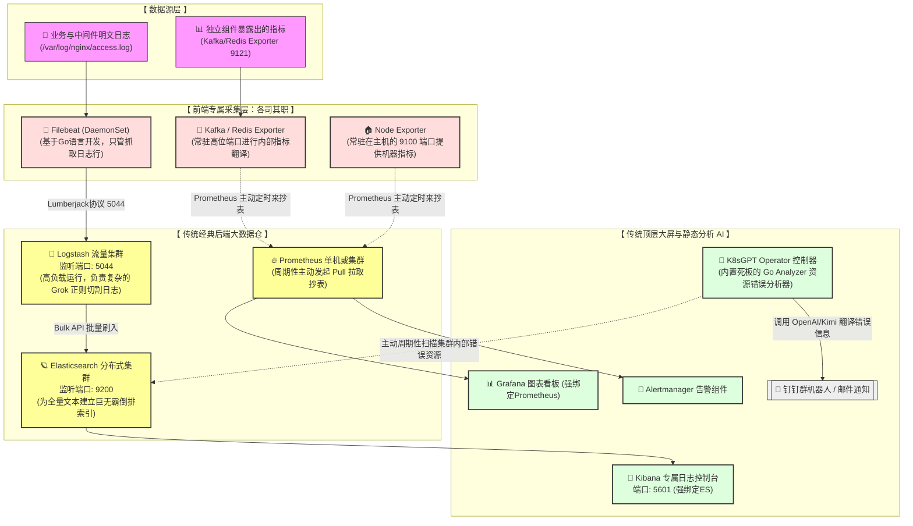
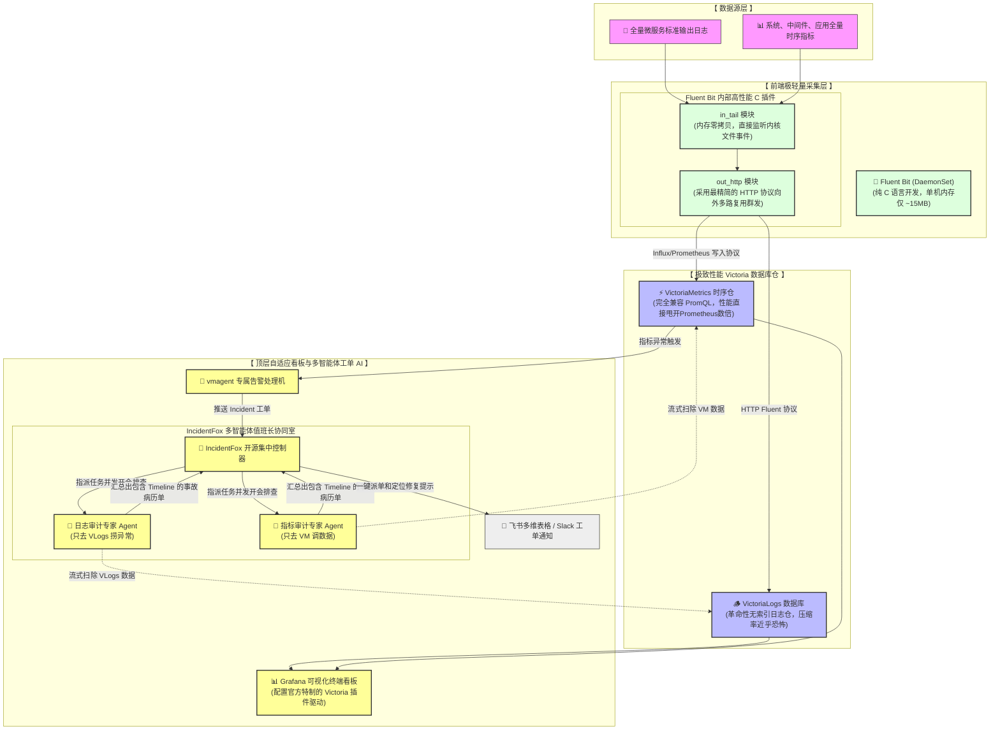
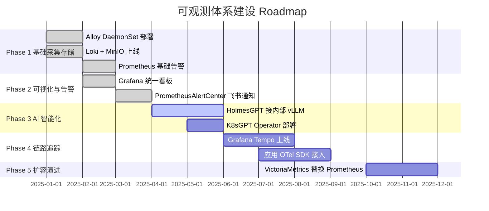

# 全局

```mermaid
graph TD
    %% 样式定义
    classDef source fill:#f9f,stroke:#333,stroke-width:2px;
    classDef agent fill:#bbf,stroke:#333,stroke-width:2px;
    classDef db fill:#fdd,stroke:#333,stroke-width:2px;
    classDef ai fill:#dfd,stroke:#333,stroke-width:2px;
    classDef error fill:#ff9,stroke:#333,stroke-width:2px;

    %% 0. 原始数据源层
    subgraph 0_Sources ["【 0. 原始数据源（遥测数据 Telemetry） 】"]
        A1["📄 日志 (Logs)<br/>Nginx/业务/系统日志"]
        A2["📊 指标 (Metrics)<br/>CPU/内存/中间件数据"]
        A3["🔗 链路 (Traces)<br/>微服务分布式调用链"]
    end
    class A1,A2,A3 source;

    %% 1. 前端全能/专属采集层
    subgraph 1_Agents ["【 1. 前端采集端（同维度竞品较量） 】"]
        subgraph Universal_Agents ["全能型大一统 Agent (通吃型)"]
            Alloy["💎 Grafana Alloy<br/>(Grafana官方主推)"]
            OTel_Col["🤖 OTel Collector<br/>(CNCF行业标准)"]
        end
        
        subgraph Log_Agents ["专属日志卡车 (只运日志)"]
            Vector["🚀 Vector (Rust性能王)"]
            FB["🛞 Fluent Bit (C语言极省内存)"]
            Filebeat["📄 Filebeat (ELK老牌标配)"]
            Promtail["💀 Promtail (已被Alloy合并废弃)"]
        end
        
        subgraph Metric_Agents ["专属指标抄表工"]
            Node_Exp["🏠 Node Exporter (机器指标)"]
            KSM["🎛️ Kube-State-Metrics (K8s状态)"]
            Redis_Exp["🍃 Redis/MySQL Exporter (中间件)"]
        end
    end
    class Alloy,OTel_Col,Vector,FB,Filebeat,Promtail,Node_Exp,KSM,Redis_Exp agent;

    %% 数据流向采集器
    A1 --> Log_Agents & Universal_Agents
    A2 --> Metric_Agents & Universal_Agents
    A3 --> Universal_Agents

    %% 2. 后端核心存储层
    subgraph 2_Databases ["【 2. 后端存储数据库（同维度竞品较量） 】"]
        subgraph Log_DBs ["📄 日志存储仓 (竞品)"]
            Loki["💎 Grafana Loki<br/>(轻量标签索引流)"]
            ES["🪐 Elasticsearch / CK<br/>(重量级全文检索流)"]
            CH["🇨🇳 ClickHouse<br/>(怪兽级列式大分析)"]
            VLogs["🪵 VictoriaLogs<br/>(极致无索引平替)"]
        end
        
        subgraph Metric_DBs ["📊 指标时序仓 (竞品)"]
            Prom["🔥 Prometheus (云原生底座)"]
            VM["⚡ VictoriaMetrics (超高性能平替)"]
            Mimir["🔱 Grafana Mimir (大规模多租户)"]
            Thanos["🦸‍♂️ Thanos (天神长周期高可用)"]
        end
        
        subgraph Trace_DBs ["🔗 链路追踪仓 (竞品)"]
            Tempo["💎 Grafana Tempo (轻量对象存储)"]
            Jaeger["🐯 Jaeger (CNCF老牌标配)"]
            SkyWalking["🦅 Apache SkyWalking (国内大厂极爱)"]
        end
    end
    class Loki,ES,CH,VLogs,Prom,VM,Mimir,Thanos,Tempo,Jaeger,SkyWalking db;

    %% 采集器将数据分类运送至数据库
    Log_Agents & Universal_Agents -->|Push| Log_DBs
    Universal_Agents -->|Push| Metric_DBs
    Metric_Agents -->|Expose 9100| Prom
    Prom -.->|Pull 拉取抄表| Metric_Agents
    Universal_Agents -->|Push| Trace_DBs

    %% 3. 顶层展示、告警与 AI 智能会诊层
    subgraph 3_Intelligence ["【 3. 顶层大屏、告警与 AI 智能层 】"]
        subgraph Visualization ["📊 统一看板展示 (看盘)"]
            Grafana["💎 Grafana (全球大一统看板)"]
            Kibana["🎨 Kibana (仅配ES使用)"]
        end
        
        subgraph Alert_Engine ["🚨 告警触发引擎"]
            AM["📢 Alertmanager (Prometheus原生)"]
        end
        
        subgraph AI_SRE ["🧠 AI 智能运维会诊 (Agent)"]
            Holmes["🕵️‍♂️ HolmesGPT (多步思考医生)"]
            K8sGPT["🤖 K8sGPT (快速静态X光机)"]
            Kagent["🎛️ Kagent (声明式变更管家)"]
            IFox["🦊 IncidentFox (值班流转长)"]
        end
        
        subgraph Notification ["🔔 国内精美通知中转站"]
            PAlert["🦊 PrometheusAlertCenter<br/>(飞羽老师开源组件)"]
        end
        
        Feishu[["🚀 飞书群卡片 / 钉钉 / 企微"]]
    end
    class Grafana,Kibana,AM,Holmes,K8sGPT,Kagent,IFox,PAlert ai;
    class Feishu error;

    %% 看板读取各数据库
    Log_DBs & Metric_DBs & Trace_DBs --> Grafana
    ES --> Kibana

    %% 告警到 AI 再到通知的完整多米诺骨牌闭环
    Metric_DBs -->|触发告警线| AM
    AM -->|1.发送原始告警| AI_SRE
    AI_SRE -->|2.调工具倒查日志与指标| Log_DBs & Metric_DBs
    AI_SRE -->|3.打包AI诊断结论| PAlert
    PAlert -->|4.套入精美模板渲染| Feishu
```



> **架构哲学**：现代可观测性遵循 **「三支柱 + 一智脑」** 模型。日志（Logs）、指标（Metrics）、链路（Traces）是遥测数据三支柱，AI 智能运维层是放大器，将人工 MTTD（平均故障发现时间）从小时级压缩至分钟级。整体形成「采集 → 存储 → 展示 → 告警 → AI 根因 → 通知」的完整闭环。

# 前端采集



## 前端采集 — 全能型 Agent 对比

| 工具 | 开发语言 | GitHub 地址 | ⭐ Stars（约） | CNCF 状态 | 支持数据类型 | 内存占用 | 核心优势 | 主要短板 |
|------|----------|-------------|---------------|-----------|--------------|----------|----------|----------|
| **Grafana Alloy** | Go | [grafana/alloy](https://github.com/grafana/alloy) | ~6k | 非 CNCF | Logs + Metrics + Traces | ~100 MB | Grafana 全家桶一站式；内置 node_exporter / Prometheus 抄表模块，可消除独立 DaemonSet | 非 CNCF 标准，存在 Grafana 厂商锁定风险 |
| **OTel Collector** | Go | [open-telemetry/opentelemetry-collector](https://github.com/open-telemetry/opentelemetry-collector) | ~5k（contrib ~3k） | 🎓 CNCF Graduated | Logs + Metrics + Traces | ~80 MB | CNCF 顶级项目，厂商绝对中立；Receiver / Processor / Exporter 插件生态最全 | 配置较复杂，需手动拼装 pipeline |


## 前端采集 — 专属日志 Agent 对比

| 工具 | 开发语言 | GitHub 地址 | ⭐ Stars（约） | CNCF 状态 | 内存占用 | 核心优势 | 主要短板 |
|------|----------|-------------|---------------|-----------|----------|----------|----------|
| **Vector** | Rust | [vectordotdev/vector](https://github.com/vectordotdev/vector) | ~18k | 非 CNCF | ~20 MB | Rust 性能天花板；内置 VRL 日志转换/脱敏语言；丢包率近乎为零 | 学习曲线略陡，生态不如 Fluent 系 |
| **Fluent Bit** | C | [fluent/fluent-bit](https://github.com/fluent/fluent-bit) | ~6k | 🎓 CNCF Graduated | **~15 MB** | 极省内存，资源受限节点首选；C 插件丰富，输出支持 Loki / ES / Kafka | 复杂正则解析能力弱于 Logstash |
| **Filebeat** | Go | [elastic/beats](https://github.com/elastic/beats) | ~12k | 非 CNCF | ~50 MB | ELK 官方组件，无缝对接 ES / Logstash；成熟稳定，大量企业生产运行 | 强依赖 ELK 生态，脱离 ES 意义不大 |
| Promtail | Go | [grafana/loki](https://github.com/grafana/loki) | — | 非 CNCF | ~60 MB | ⚠️ **官方已废弃**，请迁移至 Alloy | 已停止独立迭代，不建议新项目使用 |

# 后端日志存储



## 后端日志存储 — 技术对比

| 工具 | GitHub 地址 | ⭐ Stars（约） | CNCF 状态 | 索引方式 | 默认存储后端 | 适用日增量 | 核心优势 | 主要短板 |
|------|-------------|---------------|-----------|----------|--------------|------------|----------|----------|
| **Grafana Loki** | [grafana/loki](https://github.com/grafana/loki) | ~23k | 🎓 CNCF Graduated | 仅建标签索引 | 对象存储（S3 / MinIO） | < 1 TB/天 | K8s Pod 标签原生对齐；与 Grafana 无缝联动；存储成本比 ES 低 10x | 不支持全文搜索，复杂 LogQL 性能弱 |
| **VictoriaLogs** | [VictoriaMetrics/VictoriaMetrics](https://github.com/VictoriaMetrics/VictoriaMetrics) | ~13k | 非 CNCF | 无索引流式存储 | 本地磁盘 | < 5 TB/天 | 2024 新秀，压缩率比 Loki 高 30%+；查询延迟更低；单二进制极简部署 | 生态较新，Grafana 数据源插件完善度略低 |
| **Elasticsearch** | [elastic/elasticsearch](https://github.com/elastic/elasticsearch) | ~68k | 非 CNCF | 全文倒排索引 | 内置分片 | 无上限（集群水平扩展） | 全文搜索无敌；ELK 生态最成熟；大量企业长期生产运行 | 内存 / 磁盘占用是 Loki 的 5~10x；JVM 调优复杂 |
| **ClickHouse** | [ClickHouse/ClickHouse](https://github.com/ClickHouse/ClickHouse) | ~36k | 非 CNCF | 列式稀疏索引 | 本地 / 对象存储 | > 10 TB/天 | 列式压缩率极高；超大规模 SQL 日志审计首选；写入吞吐远超 ES | 实时查询延迟较高；运维复杂度高；不适合 K8s 小团队 |

# 后端指标时序



## 后端指标时序 — 技术对比

| 工具 | GitHub 地址 | ⭐ Stars（约） | CNCF 状态 | 拉 / 推模型 | PromQL 兼容 | 高可用方案 | 适用规模 | 核心优势 | 主要短板 |
|------|-------------|---------------|-----------|-------------|-------------|------------|----------|----------|----------|
| **Prometheus** | [prometheus/prometheus](https://github.com/prometheus/prometheus) | ~55k | 🎓 CNCF Graduated | **Pull** | ✅ 原生 | 联邦 / Thanos Sidecar | < 1000 节点 | 云原生铁打底座；Exporter 生态最完整；所有工具默认对接 | 单机存储无高可用；历史数据保留受限 |
| **VictoriaMetrics** | [VictoriaMetrics/VictoriaMetrics](https://github.com/VictoriaMetrics/VictoriaMetrics) | ~13k | 非 CNCF | Push / Pull | ✅ 完全兼容 | 内置 Cluster 模式 | 中大规模 | 性能是 Prometheus 3~7x；内存占用低 70%；单体模式极简部署 | 非 CNCF 标准；告警规则需适配 |
| **Thanos** | [thanos-io/thanos](https://github.com/thanos-io/thanos) | ~13k | 🎓 CNCF Graduated | 联邦 Pull | ✅ 兼容 | 对象存储无限期历史 | 超大规模多集群 | Sidecar 模式无侵入扩展 Prometheus；支持数年历史数据全局查询 | 组件多（Store / Compactor / Query 等），运维负担重 |
| **Grafana Mimir** | [grafana/mimir](https://github.com/grafana/mimir) | ~4k | 非 CNCF | Push | ✅ 兼容 | 原生多租户分布式 | 超大规模 SaaS | 官方宣称性能超 Cortex / Thanos；最适合 Grafana Cloud 全家桶架构 | Stars 较少，社区成熟度不及 Thanos |
| **Cortex** | [cortexproject/cortex](https://github.com/cortexproject/cortex) | ~5k | 🎓 CNCF Graduated | Push | ✅ 兼容 | 多租户分布式 | 大规模云服务商 | Thanos 和 Mimir 的前身，生产验证最充分 | 已被 Mimir 事实上取代，新项目不推荐 |

# 顶层AI智能运维



## 顶层 AI 智能运维 — 技术对比

| 工具 | GitHub 地址 | ⭐ Stars（约） | 工作模式 | LLM 依赖 | Token 消耗 | 集成方式 | 核心优势 | 主要短板 |
|------|-------------|---------------|----------|----------|------------|----------|----------|----------|
| **HolmesGPT** | [robusta-dev/holmesgpt](https://github.com/robusta-dev/holmesgpt) | ~2k | 多步 Tool-Use 推理链 | 任意 OpenAI 兼容 API（含本地 vLLM） | 高（自发多轮调用） | Webhook 接收 Alertmanager 告警 | 像真人 SRE 自发翻日志 / 指标，根因分析质量最高 | 每次告警消耗 Token 较多；需配置 Loki / Prometheus 工具权限 |
| **K8sGPT** | [k8sgpt-ai/k8sgpt](https://github.com/k8sgpt-ai/k8sgpt) | ~6k | 静态扫描 + AI 翻译 | 任意 LLM | 低（仅翻译阶段） | Operator CRD 或 CLI | 极省 Token；Go 代码内置分析器精准过滤 K8s 资源错误；上手最快 | 仅能分析 K8s 层资源错误，不会主动查应用日志 |
| **Kagent** | [kagent-dev/kagent](https://github.com/kagent-dev/kagent) | ~2k | 声明式变更执行 | 任意 OpenAI 兼容 API | 中 | K8s CRD 声明 | 最擅长「听人话改集群」，扩容 / 回滚 / 写 YAML 自然语言操作 | 偏向变更执行，根因分析能力弱于 HolmesGPT |
| **IncidentFox** | [IncidentFox/IncidentFox](https://github.com/IncidentFox/IncidentFox) | ~0.5k | 多智能体协作 | 任意 LLM | 中高 | Webhook + HTTP API | 多 Agent 并发开会生成 Timeline 事故病历；适合规范化工单流转 | 社区较新，生产案例少；稳定性待验证 |
| **PrometheusAlertCenter** | [feiyu563/PrometheusAlert](https://github.com/feiyu563/PrometheusAlert) | ~5k | 告警模板渲染 / 通知路由 | 无 | 无 | Alertmanager Webhook | 国内首选飞书 / 钉钉 / 企微告警组件；Go 模板自定义卡片样式丰富 | 仅做通知路由，无 AI 分析能力 |

# 方案一



# 方案二


# 方案三


---

# 🏆 优选方案

## 推荐：方案一（Grafana 全家桶 + HolmesGPT 根因 + K8sGPT 快扫 双引擎）

> **适用场景**：SmartVision K8s AI SaaS 平台，中等规模（< 50 节点），团队 < 20 人，需同时支持 SaaS 和私有化交付。

### 选型决策矩阵

| 层级 | 优选组件 | 淘汰原因（未选） | 核心决策依据 |
|------|----------|------------------|--------------|
| **前端采集 | Grafana Alloy（DaemonSet × 1） | Promtail 已废弃；OTel Collector 配置复杂 | 单组件替代 node_exporter + Promtail 双 DaemonSet，减少 50% 运维节点数 |
| **日志存储** | Grafana Loki + MinIO | ES 内存成本高 10x；ClickHouse 运维重 | 标签索引与 K8s Pod 标签天然对齐；对象存储无限扩容；与 Grafana 零配置联动 |
| **指标存储** | Prometheus（当前规模）→ VictoriaMetrics（扩展路径） | Thanos 组件链复杂；Mimir 社区过小 | 现阶段 Prometheus 生态最完整；节点数超过 200 后无缝迁移 VM，PromQL 完全兼容 |
| **链路追踪** | Grafana Tempo | Jaeger 独立 UI 割裂；SkyWalking 重量级 | 与 Grafana + Loki 时间轴联动（TraceID 打通日志）；对象存储后端极省成本 |
| **可视化** | Grafana（统一看板） | Kibana 强绑定 ES | 一屏同时展示 Loki 日志 / Prometheus 指标 / Tempo 链路；Split 分屏时间轴锁 |
| **AI 根因** | HolmesGPT（接内部 vLLM） | IncidentFox 社区过新 | 利用平台自有 vLLM GPU 算力，零增量 Token 成本；Tool-Use 自发查 Loki 堆栈日志 |
| **AI 快扫** | K8sGPT Operator | — | 极省 Token，周期性扫描 K8s 资源层错误，与 HolmesGPT 形成互补双保险 |
| **飞书通知** | PrometheusAlertCenter | 原生 AM 邮件 样式差 | 国内最成熟飞书卡片组件；Go 模板可直接打印代码报错行数 |

### 优选架构简图

```
[K8s 容器日志 / 宿主机指标]
        │
        ▼
  Grafana Alloy (DaemonSet)
   ├─ loki.write ──────────────► Loki ──► MinIO
   └─ prometheus.remote_write ─► Prometheus
                                    │
                               Grafana Tempo ◄── OTel SDK（应用侧）
                                    │
                               Grafana（统一看板）
                                    │
                          Prometheus AlertManager
                            │              │
                     HolmesGPT        K8sGPT Operator
                    （根因分析）       （资源快扫）
                            │
                   PrometheusAlertCenter
                            │
                       飞书群卡片
```

### 与其他方案对比总结

| 维度 | 方案一（✅ 推荐） | 方案二（ELK 传统） | 方案三（Victoria 全家桶） |
|------|------|------|------|
| **部署复杂度** | ⭐⭐⭐ 中等 | ⭐⭐ 复杂（Logstash + ES 集群） | ⭐⭐⭐⭐ 最简 |
| **存储成本** | ⭐⭐⭐⭐ 低（对象存储） | ⭐⭐ 高（ES 内存磁盘贵） | ⭐⭐⭐⭐⭐ 最低 |
| **K8s 原生适配** | ⭐⭐⭐⭐⭐ 最佳 | ⭐⭐⭐ 一般 | ⭐⭐⭐⭐ 好 |
| **AI 根因深度** | ⭐⭐⭐⭐⭐ HolmesGPT 多步推理 | ⭐⭐ K8sGPT 静态扫描 | ⭐⭐⭐ IncidentFox 多 Agent |
| **Grafana 生态** | ⭐⭐⭐⭐⭐ 全家桶无缝 | ⭐⭐ 需额外配置 | ⭐⭐⭐⭐ 好 |
| **社区成熟度** | ⭐⭐⭐⭐⭐ 全部 CNCF Graduated | ⭐⭐⭐⭐⭐ 最成熟 | ⭐⭐⭐ VM 系较新 |
| **私有化交付** | ⭐⭐⭐⭐ 组件少易打包 | ⭐⭐ 重组件难离线 | ⭐⭐⭐⭐⭐ 最易（VM 单二进制） |
| **vLLM GPU 复用** | ✅ HolmesGPT 直连内部 API | ❌ 无 | ⚠️ IncidentFox 支持但待验证 |

### 实施优先级（Roadmap）



> **最终结论**：SmartVision 当前阶段，方案一是性价比最高的选择。Grafana 全家桶将采集、存储、可视化、告警统一在一个生态内，运维认知负担最低；HolmesGPT 利用平台自有 vLLM 算力实现零增量成本的 AI 根因分析，是 K8s AI SaaS 场景下的差异化竞争力。等规模扩张至 200+ 节点后，平滑迁移至 VictoriaMetrics 即可。